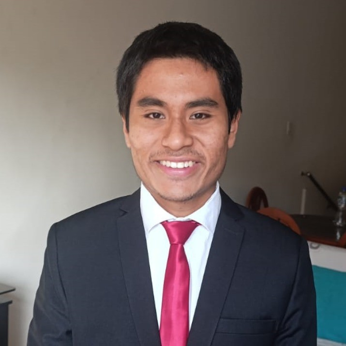

# Capitulo I: Introducción

## 1.1. Startup Profile

### 1.1.1. Descripción de la Startup

Somos WeTech, interesados en el desarrollo de soluciones de micromovilidad eléctrica compartida, integrando tecnología de vanguardia en transporte urbano. 

Buscamos transformar la movilidad urbana en Lima  ofreciendo un transporte rápido, económico, sostenible y adaptado a la realidad peruana.

  <table style="width:95%; max-width:900px; border-collapse:collapse; font-family:Arial, sans-serif; font-size:14px;">
    <caption style="caption-side:top; text-align:left; font-weight:bold; margin-bottom:8px;">Misión, Visión y Valores — WeTech</caption>
    <thead>
      <tr>
        <th style="background:#222; color:#fff; padding:12px; border:1px solid #ccc; text-align:left;">Misión</th>
        <th style="background:#222; color:#fff; padding:12px; border:1px solid #ccc; text-align:left;">Visión</th>
        <th style="background:#222; color:#fff; padding:12px; border:1px solid #ccc; text-align:left;">Valores</th>
      </tr>
    </thead>
    <tbody>
      <tr>
        <td style="padding:12px; border:1px solid #ddd; vertical-align:top;">
          <ul style="margin:0; padding-left:18px;">
            <li>Impulsar la transición hacia una movilidad urbana sostenible en el Perú.</li>
            <li>Ofrecer alternativas de transporte compartido que reduzcan el tráfico y las emisiones.</li>
            <li>Mejorar la calidad de vida de nuestros usuarios mediante servicios accesibles y seguros.</li>
          </ul>
        </td>
        <td style="padding:12px; border:1px solid #ddd; vertical-align:top;">
          <ul style="margin:0; padding-left:18px;">
            <li>Ser la opción principal en micromovilidad eléctrica en Lima y otras ciudades del Perú.</li>
            <li>Ser reconocidos por la innovación, el impacto social y por contribuir a ciudades más limpias y conectadas.</li>
          </ul>
        </td>
        <td style="padding:12px; border:1px solid #ddd; vertical-align:top;">
          <ul style="margin:0; padding-left:18px;">
            <li><strong>Confidencialidad:</strong> Protección de vehículos y datos de clientes.</li>
            <li><strong>Innovación:</strong> Mejora continua del servicio y la plataforma.</li>
            <li><strong>Sostenibilidad:</strong> Compromiso con soluciones que reduzcan el impacto ambiental.</li>
            <li><strong>Accesibilidad:</strong> Servicios diseñados para ser económicos y fáciles de usar.</li>
          </ul>
        </td>
      </tr>
    </tbody>
  </table>

# Perfiles de los miembros del equipo

<table style="width:100%; border-collapse: collapse; font-family: Arial, sans-serif; font-size: 12px; table-layout: fixed;">
  <thead>
    <tr>
      <th style="padding: 10px; border: 1px solid #aaa; background:#f2f2f2; width: 28%;">Integrantes</th>
      <th style="padding: 10px; border: 1px solid #aaa; background:#f2f2f2; width: 18%;">Foto</th>
      <th style="padding: 10px; border: 1px solid #aaa; background:#f2f2f2;">Descripción del perfil</th>
    </tr>
  </thead>

  <tbody>
    <tr>
      <td style="padding: 10px; border: 1px solid #aaa;">
        Castro Pariona, Jefferson Ernesto 
        (U201822823)
      </td>
      <td style="padding: 10px; border: 1px solid #aaa; text-align:center;">
        
      </td>
      <td style="padding: 10px; border: 1px solid #aaa; text-align: justify;">
        Estudiante de Ingeniería de Software. Se caracteriza por ser un motivador dentro de los equipos y demostrar una fuerte orientación al trabajo en conjunto. Posee interés en integrarse a grandes empresas y desarrollar en el futuro un emprendimiento propio relacionado a la tecnología.
      </td>
    </tr>
    <tr>
      <td style="padding: 10px; border: 1px solid #aaa;">
        Bonifacio Jaramillo, Samuel Jesus 
        (U202317269)
      </td>
      <td style="padding: 10px; border: 1px solid #aaa; text-align:center;">
        
      </td>
      <td style="padding: 10px; border: 1px solid #aaa; text-align: justify;">
        Estudiante de Ingeniería de Software (5to ciclo). Cuenta con experiencia práctica en Javascript, C++, Typescript y React. Es apasionado por la inteligencia artificial, el ajedrez, la música y el fútbol, combinando habilidades técnicas con una perspectiva creativa e interdisciplinaria.
      </td>
    </tr>
    <tr>
      <td style="padding: 10px; border: 1px solid #aaa;">
        Romero Meza, Jhimy Pool 
        (U202321510)
      </td>
      <td style="padding: 10px; border: 1px solid #aaa; text-align:center;">
        
      </td>
      <td style="padding: 10px; border: 1px solid #aaa; text-align: justify;">
        Estudiante de Ingeniería de Software (5to ciclo). Se destaca por su responsabilidad, compromiso y disposición constante para colaborar. Cuenta con conocimientos previos en tecnología y en el desarrollo de proyectos, demostrando iniciativa y capacidad de aprendizaje autónomo.
      </td>
    </tr>
    <tr>
      <td style="padding: 10px; border: 1px solid #aaa;">
        Seminario Castillo, Diego Vicente 
        (U202412591)
      </td>
      <td style="padding: 10px; border: 1px solid #aaa; text-align:center;">
        
      </td>
      <td style="padding: 10px; border: 1px solid #aaa; text-align: justify;">
        Estudiante de Ingeniería de Software. Se caracteriza por su responsabilidad y su enfoque orientado a resultados de calidad. Mantiene una actitud innovadora y práctica, participando activamente en el trabajo colaborativo y en la búsqueda de soluciones eficientes.
      </td>
    </tr>
    <tr>
      <td style="padding: 10px; border: 1px solid #aaa;">
        Morales Sosa, Arnold Gabriel 
        (U201822516)
      </td>
      <td style="padding: 10px; border: 1px solid #aaa; text-align:center;">
        
      </td>
      <td style="padding: 10px; border: 1px solid #aaa; text-align: justify;">
        Estudiante de Ingeniería de Software. Posee experiencia en ensamblaje, mantenimiento, conectividad y desarrollo de software. Maneja tecnologías como C++, Python, Javascript, SQL, NoSQL, Vue.js, Jenkins y metodologías ágiles. Se distingue por su responsabilidad, proactividad, creatividad y facilidad para el trabajo en equipo.
      </td>
    </tr>
  </tbody>
</table>

## 1.2. Solution Profile
### 1.2.1 Antecedentes y problemática
# Antecedentes

En los últimos años, la ciudad de Lima ha experimentado un incremento significativo en el tráfico vehicular, la congestión urbana y los niveles de contaminación ambiental. Paralelamente, la tendencia global hacia la micromovilidad eléctrica ha demostrado ser una alternativa eficiente, sostenible y económica para los desplazamientos de corta distancia en entornos urbanos densos.

En este contexto surge **WeTech**, una startup enfocada en desarrollar soluciones de **micromovilidad eléctrica compartida** mediante bicicletas y scooters inteligentes equipados con tecnología **IoT**. Esta tecnología permite el monitoreo en tiempo real, la geolocalización, la detección de incidentes, el control operativo y la seguridad del sistema.

La propuesta combina **hardware IoT**, una **plataforma backend escalable** y **aplicaciones web/móviles**, con el objetivo de ofrecer un servicio accesible, confiable y sostenible que contribuya a **reducir el tráfico y mejorar la calidad de vida en Lima**.

---

# Problemática — Análisis 5W2H

## Who — ¿Quiénes están involucrados?
- Usuarios urbanos que buscan movilizarse rápida y económicamente.
- Estudiantes, trabajadores y turistas que realizan trayectos cortos diarios.
- La ciudad de Lima, afectada por congestión, contaminación y falta de alternativas eficientes.
- **WeTech**, responsable de la operación, mantenimiento y gestión IoT de la flota.

---

## What — ¿Qué problema se busca resolver?

Lima carece de un sistema de micromovilidad eléctrica compartida que integre accesibilidad, sostenibilidad, seguridad y monitoreo en tiempo real. Esto genera:

- Escasez de opciones eficientes para distancias cortas.
- Tiempos de viaje elevados y congestión persistente.
- Baja adopción de soluciones de transporte basadas en IoT.
- Gestión ineficiente de flotas por falta de datos actualizados.

---

## Where — ¿Dónde ocurre?

El problema se presenta en **Lima Metropolitana**, especialmente en zonas con:

- Congestión vehicular recurrente.
- Alta afluencia peatonal.
- Necesidad de alternativas de movilidad de “última milla”.

---

## When — ¿Cuándo ocurre?

- Actualmente, debido al crecimiento poblacional y la dependencia del vehículo particular.
- Se intensifica en **horas punta**, donde existe mayor demanda de alternativas sostenibles.

---

## Why — ¿Por qué ocurre?

- Infraestructura insuficiente para transporte urbano sostenible.
- Alta dependencia de autos particulares y taxis.
- Ausencia de soluciones IoT que optimicen monitoreo y gestión operativa.
- Brecha tecnológica en el sistema de transporte peruano.

---

## How — ¿Cómo se manifiesta el problema?

- Mayor tiempo de desplazamiento y pérdida de productividad.
- Incremento de emisiones contaminantes.
- Dificultad para localizar vehículos, prevenir robos o detectar fallas sin IoT.
- Operaciones manuales costosas y lentas para gestionar la flota.

---

## How Much — ¿Cuánto impacta?

- Pérdidas económicas significativas por horas-hombre perdidas en tráfico.
- El transporte genera **más del 30% de las emisiones urbanas**.
- Los usuarios pagan entre **30% y 40% más** por trayectos cortos al no existir alternativas.
- La falta de monitoreo IoT incrementa los costos operativos entre **25% y 50%**.

---

La ausencia de un sistema de micromovilidad eléctrica inteligente afecta directamente la eficiencia del transporte urbano en Lima, generando impactos económicos, ambientales y sociales. **WeTech** plantea una solución integral basada en vehículos eléctricos compartidos, tecnología IoT y una plataforma robusta que responde a una necesidad **urgente y creciente** en la ciudad.

# 1.2.2 Lean UX Process

En esta sección aplicamos el **Lean UX Process** (Gothelf & Seiden, 3rd Edition).  
Se presenta: **Problem Statement**, **Assumptions**, **Hypothesis Statements** y el **Lean UX Canvas**, adaptados al proyecto **WeTech** (micromovilidad eléctrica compartida + IoT).

---

## 1.2.2.1 Lean UX — Problem Statement

**Context (Contexto)**  
En Lima existe alta congestión urbana, emisiones elevadas y carencia de alternativas de transporte económico y sostenible para recorridos de corta distancia. La operación de flotas (bicicletas y scooters eléctricos) requiere herramientas de monitoreo en tiempo real y gestión eficiente para reducir pérdidas, mejorar disponibilidad y aumentar seguridad.

**Problem (Problema)**  
No hay una solución integrada que combine micromovilidad compartida + IoT + plataforma digital que ofrezca: geolocalización fiable, estado de batería y vehículo en tiempo real, reservas y desbloqueo sencillos, y métricas operativas que permitan una operación escalable y segura en Lima.

**Impact (Impacto esperado)**  
Sin una solución integrada: pérdidas operativas por robos/fallas, baja tasa de uso por falta de confianza/visibilidad, y altos costos de mantenimiento. Con la solución (WeTech) se espera aumentar la utilización de la flota, reducir tiempos de búsqueda/disponibilidad y disminuir costos operativos.

**Measure of success (Criterios de éxito)**  
- Disponibilidad media de la flota ≥ 85% en zonas objetivo.  
- Incremento de la utilización por vehículo ≥ 20% en 12 semanas.  
- Reducción de incidentes operativos (robos/fallas) ≥ 30% tras despliegue de IoT y procesos.  
- Satisfacción de usuarios (NPS o encuesta) ≥ 60.

---

## 1.2.2.2 Lean UX — Assumptions

> Las assumptions se agrupan en: Business, User, Value, Feature.

**a) Business Assumptions**  
- Existe demanda suficiente en Lima para un servicio de micromovilidad eléctrica compartida rentable.  
- Un modelo de ingreso mixto (tarifa por uso + suscripción para usuarios frecuentes + acuerdos B2B con empresas/municipalidades) es viable.  
- Reducción de costos operativos mediante telemetría IoT permitirá escalabilidad del negocio.

**b) User Assumptions**  
- Usuarios urbanos (estudiantes, trabajadores, turistas) adoptarán el servicio si es más rápido y económico que sus opciones actuales.  
- Los usuarios valoran la visibilidad en tiempo real (ubicación y estado del vehículo) y procesos de desbloqueo sencillos.  
- La percepción de seguridad influye decisivamente en la intención de uso.

**c) Value Assumptions**  
- Proveer datos en tiempo real (batería, ubicación, disponibilidad) aumentará la confianza del usuario y la retención.  
- La optimización de rutas y redistribución basada en datos reducirá costos operativos y mejorará la experiencia.  
- Integración de IoT permitirá diagnósticos preventivos y reducción de fallas.

**d) Feature Assumptions**  
- Un mapa con disponibilidad en tiempo real y reserva rápida aumentará conversiones de uso.  
- Alertas de batería y mantenimiento automático reducirán tiempos de inactividad.  
- Simulación de backend (JSON Server) es suficiente en fases tempranas para validar flujos UX del frontend.

---

## 1.2.2.3 Lean UX — Hypothesis Statements

> Cada hipótesis sigue el patrón: *We believe... / We will know this is true when...*

**a) Business Hypothesis**  
We believe that WeTech will achieve a sustainable unit economics if IoT-driven operations reduce downtime and maintenance costs by ≥25%.  
**We will know this is true when:** acuerdos piloto con al menos 1 operador/empresa, costo operativo por vehículo disminuye ≥25% en 3 meses y el ingreso promedio por vehículo aumenta ≥15%.

**b) User Hypothesis**  
We believe that urban users (initial segment: commuters 18–45 años) will choose WeTech if they can reliably find and unlock vehicles in <60s and see battery/estado en tiempo real.  
**We will know this is true when:** tasa de conversión de vista→reserva ≥10%, tiempo medio de desbloqueo <60s y retención semanal positiva tras 4 semanas.

**c) Value Hypothesis**  
We believe that combinar IoT con notificaciones y un UX simple disminuirá la fricción de uso y aumentará la utilización por vehículo.  
**We will know this is true when:** utilización por vehículo aumenta ≥20% en 8–12 semanas y encuestas de satisfacción muestran mejora significativa.

**d) Feature Hypothesis**  
We believe that implementar: (1) mapa en tiempo real, (2) reservas rápidas y (3) alertas de estado, incrementará logs de uso y reducirá incidencias operativas.  
**We will know this is true when:** número de sesiones activas aumenta semanalmente, tickets/averías por vehículo disminuyen ≥30% y el uso del mapa/reserva representa ≥50% de sesiones.

---

## 1.2.2.4 Lean UX Canvas

**Resumen:**  
El Lean UX Canvas integra la visión de negocio, las necesidades del usuario, las hipótesis clave y los experimentos necesarios para validar el modelo de micromovilidad inteligente de **WeTech**. Este enfoque prioriza aprendizaje rápido con usuarios reales, minimiza riesgos y utiliza IoT y datos operativos para diferenciarse frente a competidores tradicionales en el contexto urbano de Lima.

---

## 1. Business Problem
Lima enfrenta congestión vehicular, largos tiempos de traslado y aumento de la contaminación. Las operaciones de micromovilidad existentes son ineficientes por falta de telemetría, baja disponibilidad de flota y escasa adaptación a la realidad local. No existe una solución de micromovilidad eléctrica, económica y confiable, optimizada con IoT para las necesidades de la ciudad.

---

## 2. Users / Customers (Initial Segment)
- **Usuarios finales (B2C):** Personas de 18–45 años (estudiantes, profesionales, trabajadores) que realizan desplazamientos cortos diarios en Lima.  
- **Clientes institucionales (B2B/B2G):** Universidades, empresas, parques industriales y municipalidades que requieren movilidad interna o gestión de flota.  
- Ambos segmentos priorizan disponibilidad, seguridad y costos accesibles.

---

## 3. User Needs / Pain Points
- Dificultad para encontrar vehículos cercanos y operativos.  
- Incertidumbre sobre nivel de batería y estado técnico.  
- Procesos de desbloqueo lentos o poco fiables.  
- Falta de transparencia en costos y tiempos de viaje.  
- Riesgo de robos y vandalismo en zonas inseguras.  
- Escasez de opciones ecológicas y económicas para trayectos cortos.

---

## 4. Value Proposition / Solution Ideas
- **Flota inteligente con IoT** (GPS, telemetría, bloqueo remoto, alertas).  
- **Aplicación móvil**: registro ágil, mapa en tiempo real, reserva y desbloqueo.  
- **Backend de operaciones** con algoritmos para optimización de rutas y mantenimiento predictivo.  
- **Dashboard administrativo** para monitoreo, gestión de zonas y KPIs.  
- Modelos de tarifa: pago por uso, suscripciones y alianzas corporativas.

---

## 5. Assumptions (Negocio, Usuario, Tecnología)
- Los usuarios adoptarán micromovilidad si la experiencia es simple, económica y confiable.  
- Existe demanda suficiente en distritos con alta congestión.  
- Telemetría IoT reducirá costos operativos (downtime, pérdidas, mantenimiento).  
- Clientes B2B valorarán soporte local y personalización.  
- La infraestructura urbana permite operar rutas de última milla.

---

## 6. Hypothesis Statements
- **Usuario:** Si ofrecemos vehículos visibles en un mapa y reservas rápidas, los usuarios usarán la app para viajes cortos.  
- **Valor:** Si implementamos telemetría IoT, la disponibilidad aumentará y las fallas disminuirán, mejorando la confiabilidad percibida.  
- **Negocio:** Si validamos demanda en zonas piloto, el modelo freemium/suscripción será sostenible.  
- **Feature:** Si mostramos batería y estado del vehículo, reduciremos cancelaciones y fricción.

---

## 7. Experiments / MVP Plan
- Construir un **MVP**: Landing page + App mínima (mapa básico, registro, reserva, simulación IoT) + Dashboard inicial.  
- Simular IoT con **JSON Server / MQTT mock / simuladores** para validar flujos sin hardware físico.  
- Ejecutar un **piloto cerrado** (campus, empresa o zona acotada) para recopilar datos reales.  
- Medir con analytics propio y métricas clave; realizar entrevistas y tests de usabilidad.  
- Iterar priorizando features que reduzcan fricción y mejoren conversión.

---

## 8. Success Metrics (Métricas de Éxito)
- **Disponibilidad de flota ≥ 85%**.  
- **Tasa de utilización (trips/vehículo/día) +20%** durante semanas iniciales.  
- **Reducción de incidentes/fallas ≥ 30%** por uso de IoT.  
- **Retención semanal** y usuarios activos recurrentes.  
- **Tiempo de desbloqueo ≤ 5 segundos**.  
- **NPS ≥ 40** en fase piloto.

---

## 9. Risks & Mitigations
- **Riesgo:** Vandalismo o robos.  
  **Mitigación:** Geofencing, alarmas, bloqueo remoto, sensores de movimiento y zonas seguras.  
- **Riesgo:** Baja adopción inicial.  
  **Mitigación:** Promociones, acuerdos B2B, hubs en hotspots y UX simplificada.  
- **Riesgo:** Fallas técnicas de IoT.  
  **Mitigación:** Tests progresivos, redundancia de datos y actualizaciones de firmware seguras.  
- **Riesgo:** Fricciones regulatorias.  
  **Mitigación:** Coordinación con municipalidades, cumplimiento normativo y pilotos conjuntos.

---

<table style="border-collapse:collapse; width:100%; max-width:1200px; margin:24px auto; font-family:Arial, Helvetica, sans-serif; font-size:13px;">
  <thead>
    <tr>
      <th style="border:1px solid #ddd; padding:12px; background:#f6f6f6; text-align:center; width:28%;">Bloque del Lean UX Canvas</th>
      <th style="border:1px solid #ddd; padding:12px; background:#f6f6f6; text-align:center; width:72%;">Contenido Mejorado (WeTech)</th>
    </tr>
  </thead>
  <tbody>
    <tr>
      <td style="border:1px solid #ddd; padding:12px; vertical-align:top;"><strong>1. Business Problem</strong></td>
      <td style="border:1px solid #ddd; padding:12px; vertical-align:top;">
        Lima enfrenta congestión, altos tiempos de traslado y mayor contaminación. Las empresas actuales de micromovilidad operan sin telemetría, con baja disponibilidad y adaptación local. No existe una solución eléctrica, accesible y optimizada por IoT para la realidad peruana.
      </td>
    </tr>
    <tr>
      <td style="border:1px solid #ddd; padding:12px; vertical-align:top;"><strong>2. Users / Customers (Initial Segment)</strong></td>
      <td style="border:1px solid #ddd; padding:12px; vertical-align:top;">
        <ul style="margin:0; padding-left:16px;">
          <li><strong>B2C:</strong> Personas 18–45 años (estudiantes, profesionales) con trayectos cortos.</li>
          <li><strong>B2B/B2G:</strong> Universidades, empresas y municipalidades que requieren movilidad y gestión de flota.</li>
        </ul>
      </td>
    </tr>
    <tr>
      <td style="border:1px solid #ddd; padding:12px; vertical-align:top;"><strong>3. User Needs / Pain Points</strong></td>
      <td style="border:1px solid #ddd; padding:12px; vertical-align:top;">
        Dificultad para ubicar vehículos, incertidumbre sobre batería/estado, desbloqueos lentos, falta de transparencia en costos, inseguridad y escasez de alternativas ecológicas.
      </td>
    </tr>
    <tr>
      <td style="border:1px solid #ddd; padding:12px; vertical-align:top;"><strong>4. Value Proposition / Solution Ideas</strong></td>
      <td style="border:1px solid #ddd; padding:12px; vertical-align:top;">
        Flota IoT (GPS, telemetría, bloqueo remoto), app móvil con mapa y reserva, backend con optimización y mantenimiento predictivo, dashboard administrativo y modelos de tarifa flexibles.
      </td>
    </tr>
    <tr>
      <td style="border:1px solid #ddd; padding:12px; vertical-align:top;"><strong>5. Assumptions</strong></td>
      <td style="border:1px solid #ddd; padding:12px; vertical-align:top;">
        Adopción si la experiencia es simple y económica; demanda en distritos congestionados; IoT reduce costos; B2B valora soporte local; infraestructura permite rutas de última milla.
      </td>
    </tr>
    <tr>
      <td style="border:1px solid #ddd; padding:12px; vertical-align:top;"><strong>6. Hypothesis Statements</strong></td>
      <td style="border:1px solid #ddd; padding:12px; vertical-align:top;">
        Hipótesis sobre uso si hay visibilidad en mapa y reservas rápidas; telemetría mejora disponibilidad; pilotos validan modelo freemium; mostrar batería reduce cancelaciones.
      </td>
    </tr>
    <tr>
      <td style="border:1px solid #ddd; padding:12px; vertical-align:top;"><strong>7. Experiments / MVP Plan</strong></td>
      <td style="border:1px solid #ddd; padding:12px; vertical-align:top;">
        MVP (landing, app mínima, dashboard). Simulación IoT (JSON Server / MQTT mock). Piloto cerrado en zona controlada. Analytics y tests de usabilidad para iterar.
      </td>
    </tr>
    <tr>
      <td style="border:1px solid #ddd; padding:12px; vertical-align:top;"><strong>8. Success Metrics</strong></td>
      <td style="border:1px solid #ddd; padding:12px; vertical-align:top;">
        Disponibilidad ≥85%, utilización +20%, reducción de fallas ≥30%, retención semanal, desbloqueo ≤5s, NPS ≥40 en piloto.
      </td>
    </tr>
    <tr>
      <td style="border:1px solid #ddd; padding:12px; vertical-align:top;"><strong>9. Risks & Mitigations</strong></td>
      <td style="border:1px solid #ddd; padding:12px; vertical-align:top;">
        <strong>Vandalismo:</strong> geofencing, alarmas y bloqueo remoto. 
        <strong>Baja adopción:</strong> promociones, alianzas B2B y hubs en hotspots. 
        <strong>Fallos IoT:</strong> pruebas progresivas y redundancia. 
        <strong>Regulación:</strong> coordinación con autoridades y pilotos conjuntos.
      </td>
    </tr>
  </tbody>
</table>

## 1.3. Segmentos objetivo.

### Segmentación de Usuarios — WeTech 

El sistema integral de micromovilidad eléctrica compartida propuesto por **WeTech** se enfocará inicialmente en dos segmentos estratégicos, seleccionados según criterios demográficos, comportamentales, tecnológicos y de adopción potencial. Estos segmentos representan los grupos con mayor probabilidad de uso recurrente y sostenible del servicio, permitiendo validar el modelo operativo y escalar posteriormente hacia otros mercados.

---

### 1. Jóvenes Universitarios

Este segmento está conformado por estudiantes de educación superior —universidades, institutos y centros tecnológicos— cuyas edades oscilan entre **17 y 27 años**. Se concentran principalmente en zonas urbanas con alta congestión vehicular, como **Lima Metropolitana, Arequipa, Trujillo y Cusco**, ciudades donde los tiempos de traslado representan un problema creciente.

### **Características demográficas y tecnológicas**
- Edad: **17–27 años**, con predominancia de jóvenes que combinan transporte público con tramos cortos.
- Alta familiaridad con **aplicaciones móviles**, pagos digitales y soluciones bajo demanda.
- Acceso constante a **smartphones y conectividad móvil**.
- Alta **sensibilidad al costo** y al tiempo de transporte.

### **Necesidades y comportamientos**
- Necesitan cubrir trayectos cortos y medios (1–5 km) entre vivienda, campus, paraderos y centros de recreación.
- Buscan alternativas más económicas que taxis y más rápidas que transporte público saturado.
- Valoran opciones sostenibles, accesibles y con disponibilidad inmediata.
- Su adopción tecnológica es alta: pagos rápidos (Yape / Plin), geolocalización y desbloqueo simple.

### **Sustento**
- Más del **45% de los viajes diarios en Lima** corresponden a distancias cortas, ideales para micromovilidad.  
- Los jóvenes entre **18 y 29 años** son el grupo con mayor adopción de apps de movilidad y pagos digitales.  
- La congestión en horas punta eleva los tiempos de viaje hasta **70–90 minutos**, incentivando alternativas eficientes.

Este segmento representa la base ideal para validar el producto por su uso intensivo, su capacidad de viralización y su apertura natural a nuevas tecnologías.

---

### 2. Empresas y Organizaciones (Segmento B2B)

El segundo segmento está compuesto por **empresas privadas, instituciones educativas, entidades administrativas y parques empresariales** que buscan soluciones de movilidad sostenible para optimizar el desplazamiento interno de sus trabajadores, estudiantes o colaboradores.

### **Características institucionales**
- Organizaciones medianas y grandes con más de **200 trabajadores** o comunidades estudiantiles extensas.
- Entornos con trayectos internos frecuentes (campus, parques industriales, oficinas corporativas).
- Interés creciente en iniciativas **ESG y sostenibilidad**.

### **Necesidades y comportamientos**
- Requieren alternativas rápidas para movimientos internos o cercanos (campus y sedes conectadas).
- Necesitan **seguridad, trazabilidad y control** de flota.
- Buscan reducir costos de transporte interno y tiempos muertos.
- Demandan **planes de suscripción**, panel administrativo, métricas de uso y vehículos con telemetría IoT.

### **Sustento**
- El **35% de empresas peruanas** reporta proyectos activos relacionados con sostenibilidad.  
- Las instituciones educativas gestionan campus con **10,000–30,000 usuarios diarios**, generando alta demanda de movilidad interna.  
- Los modelos corporativos de suscripción brindan **ingresos recurrentes** y menor rotación estacional.

Este segmento es clave para establecer relaciones comerciales estables, mejorar la predictibilidad financiera y posicionar a WeTech como un aliado estratégico en movilidad sostenible.

---
