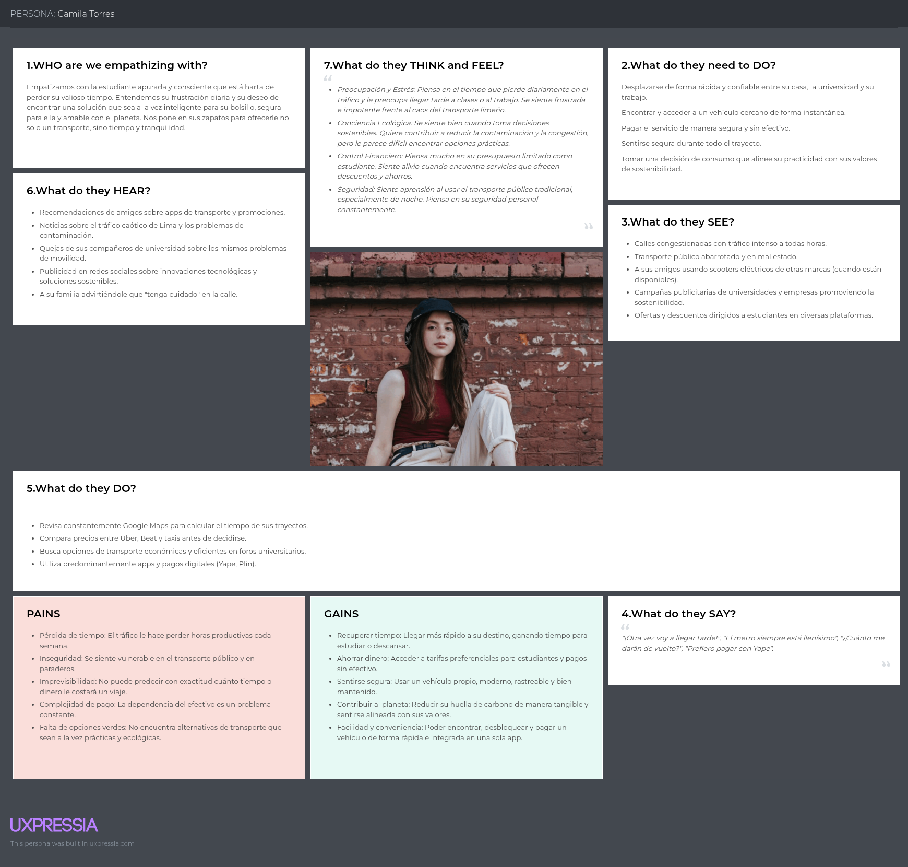
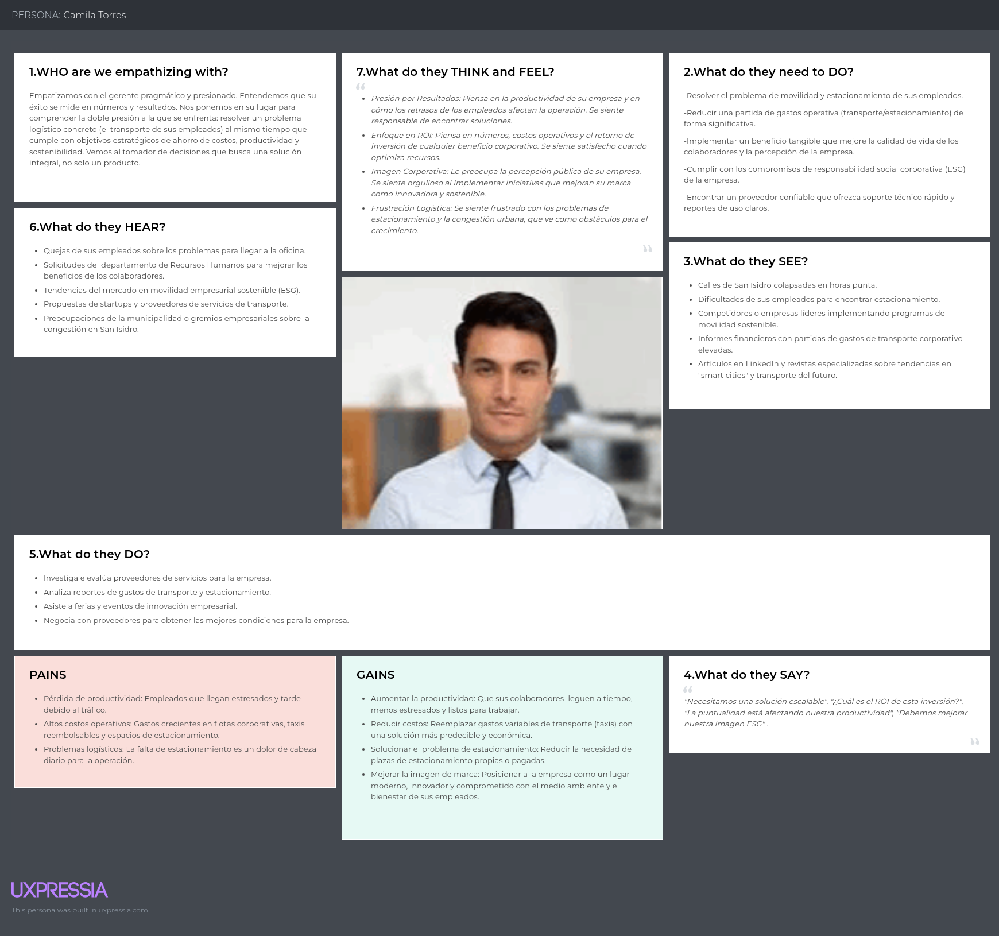

 # Capítulo II: Requirements Elicitation & Analysis
## 2.1. Competidores

### 2.1.1 Análisis Competitivo

<table>
  <tr>
    <th colspan="22">Competitive Analysis Landscape</th>
  </tr>
  <tr>
    <td colspan="1">¿Por qué llevar a cabo el análisis?</td>
    <td colspan="17">El análisis competitivo es esencial para entender el mercado, identificar oportunidades que nos diferencien y anticipar amenazas. Permite ajustar la estrategia para ganar ventaja sobre la competencia y asegurar el éxito del producto.</td>
  </tr>
  <tr>
    <td colspan="2"></td>
    <td>WeRide </td>
    <td>Lime </td>
    <td>CityBikeLima </td>
    <td>Whoosh </td>
</tr>
  <tr>
    <td rowspan="2">Perfil</td>
    <td>Overview</td>
    <td>Plataforma diseñada para optimizar la  micromovilidad eléctrica enfocada en motos, scooters y bicis inteligentes con IoT, mejorando la experiencia de usuarios y solucionando problemas como la alta tasa de tránsito vehícular.</td>
    <td>Multinacional líder en scooters y bicicletas eléctricas compartidas, presente en múltiples ciudades globales.</td>
    <td>Programa público de bicicletas compartidas en Lima, operado con soporte municipa</td>
    <td>Plataforma internacional de scooters eléctricos compartidos con foco en Europa y Latinoamérica</td>
</tr>
  <tr>
  <td>Ventaja competitiva ¿Qué valor ofrece a los clientes?</td>
    <td>Enfoque local: integra pagos peruanos (Yape/Plin), tarifas accesibles y flotas adaptadas al contexto nacional.</td>
    <td>Amplia cobertura internacional, marca reconocida y gran inversión en tecnología.</td>
    <td>Accesibilidad y precios bajos, integración con transporte público.</td>
    <td>Experiencia de usuario optimizada, flota moderna y rápida expansión.</td>
    </tr>
<tr>
    <td rowspan="2">Perfil de Marketing</td>
    <td>Mercado Objetivo</td>
    <td>Jóvenes, estudiantes, profesionales urbanos, turistas en Lima y otras ciudades peruanas.</td>
    <td>Usuarios urbanos globales que buscan movilidad rápida y sostenible.</td>
    <td>Ciudadanos limeños que necesitan transporte económico y ecológico en zonas céntricas.</td>
    <td>Usuarios de centros urbanos en expansión que buscan transporte práctico.</td>
  </tr>
  <tr>
  <td>Estrategias de Marketing</td>
    <td>Campañas digitales locales, alianzas con universidades y municipalidades, enfoque en sostenibilidad.</td>
    <td>Publicidad global, branding fuerte, promociones en apps y eventos verdes.</td>
    <td>Marketing institucional con apoyo municipal, señalética en estaciones.</td>
    <td>Marketing digital, descuentos por uso recurrente, gamificación en la app.</td>
    </tr>
<tr>
    <td rowspan="3">Perfil de Producto</td>
    <td>Productos y Servicios</td>
    <td>Scooters, motos eléctricas y bicicletas compartidas con IoT, app para reserva y pago.</td>
    <td>Scooters y bicicletas eléctricas compartidas con geolocalización.</td>
    <td>Bicicletas mecánicas y eléctricas en estaciones físicas.</td>
    <td>Scooters eléctricos con desbloqueo vía app.</td>
  </tr>
  <tr>
  <td>Precios y Costos</td>
    <td>Planes de suscripción escalonados según el número de usuarios y servicios adicionales.</td>
    <td>Tarifas más altas, variables según ciudad; paquetes promocionales.</td>
    <td>Bajos costos de alquiler por tiempo (subvencionados)</td>
    <td>Planes semanales con opciones de servicios premium.</td>
    </tr>
<td>Canales de distribución (Web y/o Móvil)</td>
    <td>Sitio Web</td>
    <td>Sitio Web</td>
    <td>Sitio Web</td>
    <td>Sitio Web y móvil.</td>
<tr>
    <td rowspan="4">Análisis SWOT</td>
    <td>Fortalezas</td>
    <td>Conocimiento local, integración con pagos peruanos, tarifas accesibles.</td>
    <td>Escala internacional, financiamiento robusto, marca reconocida.</td>
    <td>Respaldo municipal, precios muy bajos, simpleza.</td>
    <td>Flota moderna, app fácil de usar, expansión ágil.</td>
  </tr>
  <tr>
  <td>Debilidades</td>
    <td>Escala inicial limitada, menor financiamiento comparado a multinacionales.</td>
    <td>Altos precios en algunos mercados, críticas por sostenibilidad real.</td>
    <td>Limitada cobertura, infraestructura básica, tecnología rezagada.</td>
    <td>Menor reconocimiento global que Lime, cobertura desigual.</td>
    </tr>
  <tr>
<td>Oportunidades</td>
    <td>Expandir a más ciudades peruanas, integrar con transporte público y turismo.</td>
    <td>Crecer en mercados emergentes, integrar más tipos de vehículos.</td>
    <td>Modernizar flota con bicicletas eléctricas, mejorar app.</td>
    <td>Expandirse en LATAM con asociaciones estratégicas.</td>
</tr>
  <tr>
<td>Amenazas</td>
    <td>Competencia internacional (Lime, Whoosh), trabas regulatorias locales.</td>
    <td>Regulaciones urbanas, vandalismo y saturación de mercado.
</td>
    <td>Dependencia de apoyo municipal y presupuesto público.</td>
    <td>Competencia fuerte (Lime, WeRide), regulaciones urbanas.</td>
</tr>
</table>

---

### 2.1.2. Estrategias y tácticas frente a competidores.

Para fortalecer nuestra posición en el mercado, WeRide se centrará en aprovechar sus principales fortalezas: la integración de pagos locales como Yape y Plin, tarifas accesibles para los usuarios y la oferta de un sistema integral de micromovilidad (motos, scooters y bicicletas inteligentes con IoT). Este enfoque nos permitirá diferenciarnos de competidores globales como Lime y Whoosh, que carecen de un entendimiento profundo del contexto nacional. Al brindar una experiencia local, inclusiva y alineada a las necesidades de movilidad de los usuarios urbanos peruanos, WeRide se posicionará como una alternativa sostenible y cercana.

En cuanto a nuestras debilidades, como el público y recursos iniciales limitados, adoptaremos una estrategia progresiva de expansión. Iniciaremos con pilotos en zonas estratégicas de Lima cercanas a universidades y  centros empresariales para validar el modelo, recopilar datos de uso y generar confianza con nuestros primeros usuarios. Esto nos permitirá construir una base sólida para dar el primer gran paso.

Del mismo modo, abordaremos las amenazas del mercado como la competencia nacional y las posibles trabas regulatorias mediante alianzas con municipalidades.

---

## 2.2.Entrevistas.  

### 2.2.1.Diseño de entrevistas.  

### 2.2.2. Registro de entrevistas  

**Segmento Joven Universitario**  

<table>
  <tr>
    <th colspan="2">Entrevistado N° 1</th>
  </tr>
  <tr>
    <td colspan="2" style="text-align: center;">
      
    </td>
  </tr>
  <tr>
    <td><b>Nombre y Apellido:</b> Bedith Lozano Isuiza</td>
    <td><b>Edad:</b> 24</td>
  </tr>
  <tr>
    <td><b>Profesión:</b> Ing. Sistemas</td>
    <td><b>Sexo:</b> Femenino</td>
  </tr>
  <tr>
    <td><b>Instante de inicio:</b> 10:00 am</td>
    <td><b>Duración:</b> 25 min</td>
  </tr>
  <tr>
    <td><b>Link de entrevista:</b> ""</td>
  </tr>
  <tr>
    <td colspan="2">
      <b>Resumen de entrevista:</b> 
      El entrevistado es un estudiante universitario que invierte entre 1.5 a 2 horas diarias en transporte, utilizando principalmente buses y taxis por aplicación.  
      Sus principales frustraciones son el tráfico, los altos costos de taxis y la inseguridad en transporte público.  
      En cuanto a hábitos tecnológicos, está familiarizado con Uber, InDriver, Google Maps y realiza la mayoría de pagos mediante Yape y Plin, lo cual encaja perfectamente con el modelo de negocio propuesto.  
      Además, mostró interés en una alternativa rápida, segura y económica como scooters, bicicletas y motos eléctricas, sobre todo si se ofrecen planes con descuentos estudiantiles.
    </td>
  </tr>
</table>  

<table>
  <tr>
    <th colspan="2">Entrevistado N° 2</th>
  </tr>
  <tr>
    <td colspan="2" style="text-align: center;">
      
    </td>
  </tr>
  <tr>
    <td><b>Nombre y Apellido:</b>Patrick Correa</td>
    <td><b>Edad:</b> 18</td>
  </tr>
  <tr>
    <td><b>Profesión:</b> Ing. Mecatrónica</td>
    <td><b>Sexo:</b> Masculino</td>
  </tr>
  <tr>
    <td><b>Instante de inicio:</b> 08:00 pm</td>
    <td><b>Duración:</b> 13:25 min</td>
  </tr>
  <tr>
    <td><b>Link de entrevista:</b> "https://goo.su/PM0wN"</td>
  </tr>
  <tr>
    <td colspan="2">
      <b>Resumen de entrevista:</b> 
      El entrevistado es un estudiante universitario que reside cerca de su centro de estudios, pero que aún así se le hace dificil ir por el tráfico aún en un tramo no tan largo.
      Sus principales frustraciones son el tráfico, la poca accesibilidad a buses que vayan a su destino y la inseguridad ciudadana.
      En cuanto a hábitos tecnológicos, está familiarizado con las apps de taxis como Uber, InDrive, pero los usa a veces en otras situaciones. Nunca ha usado apps de alquiler de scooters o bicicletas y prefiere siempre pagar por efectivo.  
      Además, mostró interés en una alternativa rápida, segura y económica como scooters, bicicletas y motos eléctricas. Dice que sería una experiencia interesante y que podría aprender a usarlos rápidamente para poder solventar este problema que tiene en su día a día.
    </td>
  </tr>
</table>  

### 2.2.3.Análisis de entrevistas.  

**Segmento Jovenes Universitarios**

La entrevista revela un alto nivel de insatisfacción con el transporte actual en Lima Metropolitana, caracterizado por demoras e inseguridad. El usuario objetivo (universitario) demuestra disposición a cambiar de medio de transporte si se le ofrece una solución más rápida, confiable y accesible.  

**El factor diferenciador clave será:**  

- Precio competitivo (más barato que taxi y accesible frente a bus).  

- Pagos digitales simples (Yape/Plin).  

- Beneficios estudiantiles (descuentos o planes especiales).  

Esto confirma que el modelo de micromovilidad eléctrica compartida tiene alto potencial de adopción entre jóvenes universitarios, siempre que se garantice conveniencia, ahorro y seguridad.  

---

## 2.3.Needfinding.

### 2.3.1.User Personas.

**1er segmento: Jóvenes universitarios**

**2do segmento:  Empresas**

---

### 2.3.2.User Task Matrix.

**Camila Torres (Joven universitaria)**

| **Tareas / Tasks**                             | **Frecuencia** | **Importancia** |
|-------------------------------------------------|---------------|----------------|
| Buscar información para trabajos                | Alta          | Alta           |
| Coordinar con compañeros de grupo               | Alta          | Alta           |
| Acceder a material de estudio (libros, PDFs, videos) | Alta      | Alta           |
| Planificar tiempo para estudiar                 | Alta          | Alta           |
| Asistir a clases / capacitaciones               | Alta          | Alta           |
| Comunicar avances de proyecto                   | Media         | Alta           |
| Resolver dudas con expertos                     | Media         | Alta           |
| Evaluar proveedores de herramientas/servicios   | Baja          | Media          |
| Preparar reportes de resultados                 | Baja          | Media          |

---

**Luis Salazar (Gerente de Operaciones)**

| **Tareas / Tasks**                              | **Frecuencia** | **Importancia** |
|-------------------------------------------------|---------------|----------------|
| Buscar información para proyectos               | Media         | Media          |
| Planificar tiempo de trabajo                    | Media         | Alta           |
| Asistir a reuniones/capacitaciones              | Media         | Alta           |
| Comunicar avances de proyecto                   | Alta          | Alta           |
| Resolver dudas con expertos                     | Alta          | Alta           |
| Evaluar proveedores de herramientas/servicios   | Alta          | Alta           |
| Supervisar cumplimiento de estándares o KPIs    | Alta          | Alta           |
| Preparar reportes de resultados                 | Alta          | Alta           |  

### 2.3.3.User Journey Mapping. 

### 2.3.4.Empathy Mapping.  

- Camila Torres:  

  

- Luis Salazar:  

  

## 2.4.Big Picture Event Storming.
El **Event Storming** modela de forma secuencial el ciclo completo de uso de la plataforma de micromovilidad eléctrica. Se identifican las interacciones entre usuarios, administradores, sistemas externos ***(IoT, GPS, pasarela de pagos)*** y el sistema de negocio.
Se muestra cómo la plataforma conecta en un mismo flujo las necesidades de movilidad del usuario, los procesos de pago y seguridad, asegurando un ecosistema completo de micromovilidad urbana.

## 2.5.Ubiquitous Language.

| Término                 | Tipo               | Definición                                                                 |
|--------------------------|--------------------|-----------------------------------------------------------------------------|
| Usuario                 | Actor              | Persona registrada que utiliza la app para alquilar scooters.              |
| Administrador           | Actor              | Responsable de gestionar flota, usuarios y soporte desde el sistema.       |
| Scooter                 | Entidad            | Vehículo eléctrico disponible para alquiler dentro de la plataforma.       |
| Estación Virtual        | Entidad            | Punto geográfico donde los scooters pueden ser recogidos o dejados.        |
| Reserva                 | Evento/Entidad     | Acción de apartar un scooter disponible antes de iniciar el alquiler.      |
| Alquiler                | Evento/Entidad     | Proceso activo en el que el usuario usa un scooter y se mide en tiempo/distancia. |
| Pago                    | Evento             | Transacción realizada por el usuario para completar un alquiler.           |
| Tarifa                  | Entidad            | Costo asociado al alquiler, calculado según tiempo y distancia.            |
| Desbloqueo              | Comando/Evento     | Acción de habilitar el scooter tras confirmar la reserva y el pago inicial. |
| Devolución              | Evento             | Acción de finalizar el uso y dejar el scooter en una estación virtual.     |
| Mantenimiento           | Proceso            | Revisión y reparación de scooters por parte del personal técnico.          |
| Penalización            | Evento/Entidad     | Cargo adicional aplicado por mal uso, retraso o devolución fuera de zona.  |
| Historial de Viajes     | Vista              | Registro de reservas, alquileres y pagos asociados a cada usuario.         |
| Soporte                 | Servicio           | Canal de ayuda en la app para resolver incidencias de los usuarios.        |
| Flota                   | Entidad/Conjunto   | Conjunto de scooters activos disponibles en la ciudad.                     |
| Ubicación en Tiempo Real| Información        | Datos GPS que muestran dónde se encuentra cada scooter.                     |
| Sesión de Usuario       | Entidad            | Periodo en que el usuario está logueado y utilizando la app.               |

