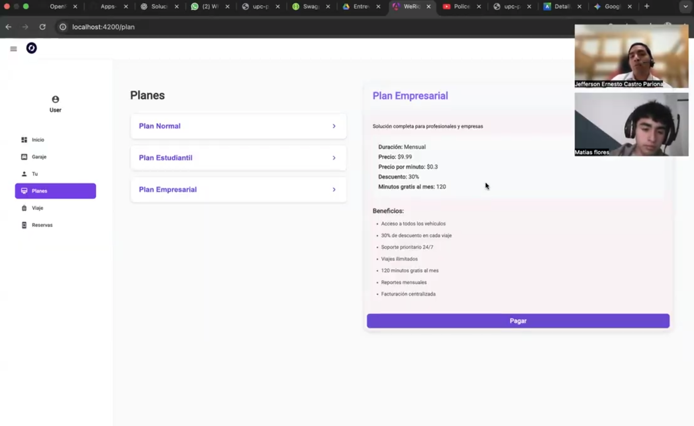
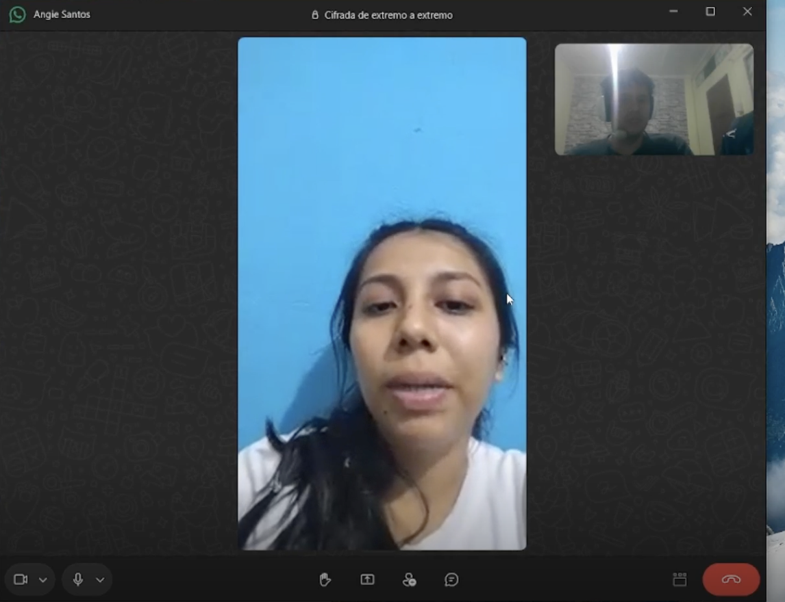
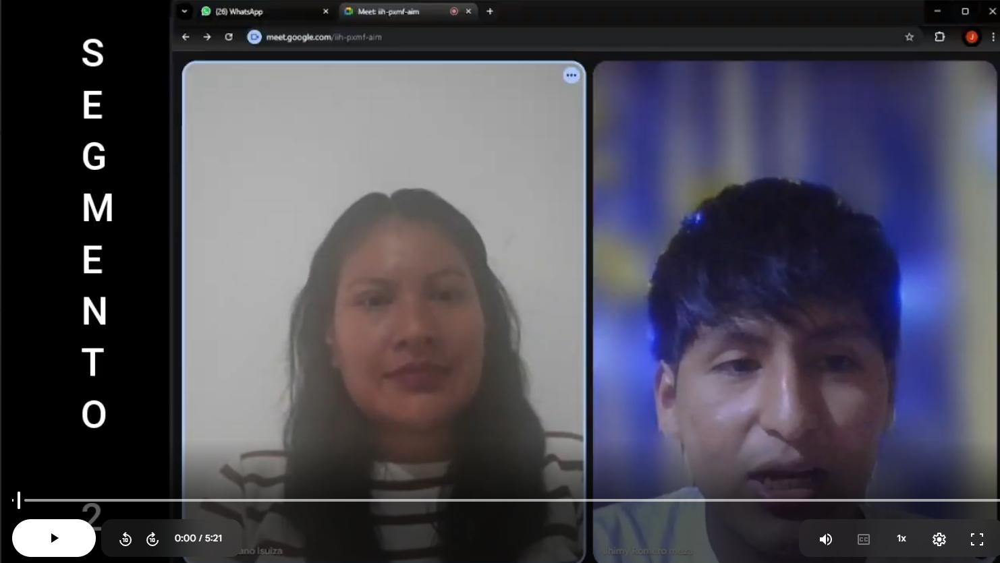
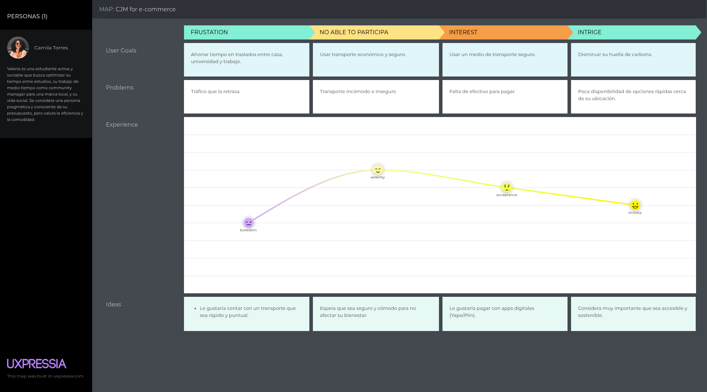
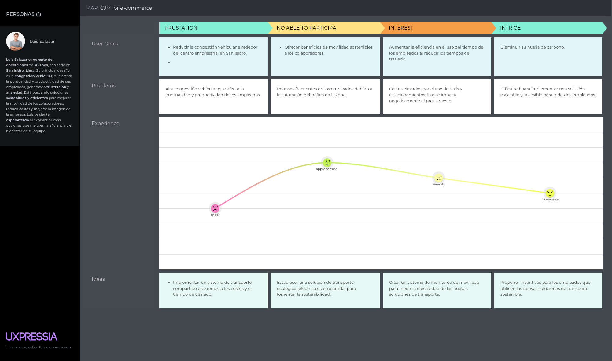

## 2.1. Competidores.
### 2.1.1. Análisis competitivo.
<table>
    <tr>
      <th colspan="22">Competitive Analysis Landscape</th>
    </tr>
    <tr>
      <td colspan="1">¿Por qué llevar a cabo el análisis?</td>
      <td colspan="17">El análisis competitivo es esencial para entender el mercado, identificar oportunidades que nos diferencien y anticipar amenazas. Permite ajustar la estrategia para ganar ventaja sobre la competencia y asegurar el éxito del producto.</td>
    </tr>
    <tr>
      <td colspan="2"></td>
      <td>WeRide </td>
      <td>Lime </td>
      <td>CityBikeLima </td>
      <td>Whoosh </td>
  </tr>
    <tr>
      <td rowspan="2">Perfil</td>
      <td>Overview</td>
      <td>Plataforma diseñada para optimizar la  micromovilidad eléctrica enfocada en motos, scooters y bicis inteligentes con IoT, mejorando la experiencia de usuarios y solucionando problemas como la alta tasa de tránsito vehícular.</td>
      <td>Multinacional líder en scooters y bicicletas eléctricas compartidas, presente en múltiples ciudades globales.</td>
      <td>Programa público de bicicletas compartidas en Lima, operado con soporte municipa</td>
      <td>Plataforma internacional de scooters eléctricos compartidos con foco en Europa y Latinoamérica</td>
  </tr>
    <tr>
    <td>Ventaja competitiva ¿Qué valor ofrece a los clientes?</td>
      <td>Enfoque local: integra pagos peruanos (Yape/Plin), tarifas accesibles y flotas adaptadas al contexto nacional.</td>
      <td>Amplia cobertura internacional, marca reconocida y gran inversión en tecnología.</td>
      <td>Accesibilidad y precios bajos, integración con transporte público.</td>
      <td>Experiencia de usuario optimizada, flota moderna y rápida expansión.</td>
      </tr>
  <tr>
      <td rowspan="2">Perfil de Marketing</td>
      <td>Mercado Objetivo</td>
      <td>Jóvenes, estudiantes, profesionales urbanos, turistas en Lima y otras ciudades peruanas.</td>
      <td>Usuarios urbanos globales que buscan movilidad rápida y sostenible.</td>
      <td>Ciudadanos limeños que necesitan transporte económico y ecológico en zonas céntricas.</td>
      <td>Usuarios de centros urbanos en expansión que buscan transporte práctico.</td>
    </tr>
    <tr>
    <td>Estrategias de Marketing</td>
      <td>Campañas digitales locales, alianzas con universidades y municipalidades, enfoque en sostenibilidad.</td>
      <td>Publicidad global, branding fuerte, promociones en apps y eventos verdes.</td>
      <td>Marketing institucional con apoyo municipal, señalética en estaciones.</td>
      <td>Marketing digital, descuentos por uso recurrente, gamificación en la app.</td>
      </tr>
  <tr>
      <td rowspan="3">Perfil de Producto</td>
      <td>Productos y Servicios</td>
      <td>Scooters, motos eléctricas y bicicletas compartidas con IoT, app para reserva y pago.</td>
      <td>Scooters y bicicletas eléctricas compartidas con geolocalización.</td>
      <td>Bicicletas mecánicas y eléctricas en estaciones físicas.</td>
      <td>Scooters eléctricos con desbloqueo vía app.</td>
    </tr>
    <tr>
    <td>Precios y Costos</td>
      <td>Planes de suscripción escalonados según el número de usuarios y servicios adicionales.</td>
      <td>Tarifas más altas, variables según ciudad; paquetes promocionales.</td>
      <td>Bajos costos de alquiler por tiempo (subvencionados)</td>
      <td>Planes semanales con opciones de servicios premium.</td>
      </tr>
  <td>Canales de distribución (Web y/o Móvil)</td>
      <td>Sitio Web</td>
      <td>Sitio Web</td>
      <td>Sitio Web</td>
      <td>Sitio Web y móvil.</td>
  <tr>
      <td rowspan="4">Análisis SWOT</td>
      <td>Fortalezas</td>
      <td>Conocimiento local, integración con pagos peruanos, tarifas accesibles.</td>
      <td>Escala internacional, financiamiento robusto, marca reconocida.</td>
      <td>Respaldo municipal, precios muy bajos, simpleza.</td>
      <td>Flota moderna, app fácil de usar, expansión ágil.</td>
    </tr>
    <tr>
    <td>Debilidades</td>
      <td>Escala inicial limitada, menor financiamiento comparado a multinacionales.</td>
      <td>Altos precios en algunos mercados, críticas por sostenibilidad real.</td>
      <td>Limitada cobertura, infraestructura básica, tecnología rezagada.</td>
      <td>Menor reconocimiento global que Lime, cobertura desigual.</td>
      </tr>
    <tr>
  <td>Oportunidades</td>
      <td>Expandir a más ciudades peruanas, integrar con transporte público y turismo.</td>
      <td>Crecer en mercados emergentes, integrar más tipos de vehículos.</td>
      <td>Modernizar flota con bicicletas eléctricas, mejorar app.</td>
      <td>Expandirse en LATAM con asociaciones estratégicas.</td>
  </tr>
    <tr>
  <td>Amenazas</td>
      <td>Competencia internacional (Lime, Whoosh), trabas regulatorias locales.</td>
      <td>Regulaciones urbanas, vandalismo y saturación de mercado.
  </td>
      <td>Dependencia de apoyo municipal y presupuesto público.</td>
      <td>Competencia fuerte (Lime, WeRide), regulaciones urbanas.</td>
  </tr>
  </table>

  ---
### 2.1.2. Estrategias y tácticas frente a competidores.

Para fortalecer nuestra posición en el mercado peruano de micromovilidad eléctrica, WeRide priorizará una estrategia basada en el aprovechamiento de sus principales ventajas competitivas. Nuestra propuesta se centra en la integración de pagos locales (Yape y Plin), tarifas accesibles y un ecosistema integral de micromovilidad compuesto por scooters, bicicletas y motos eléctricas con tecnología IoT. Estas capacidades nos permiten diferenciarnos de competidores globales como Lime o Whoosh, cuya oferta no está adaptada al comportamiento, necesidades y hábitos de movilidad del usuario urbano peruano. Al ofrecer una experiencia más local, flexible y alineada a la realidad nacional, WeRide se posicionará como la alternativa más conveniente, cercana y sostenible.

En relación con nuestras debilidades, como la disponibilidad inicial limitada de flota y recursos, implementaremos una estrategia gradual de despliegue. Comenzaremos con pilotos focalizados en zonas de alto flujo, como áreas universitarias y polos empresariales, lo que permitirá validar hipótesis de uso, optimizar la operación y construir confianza en el servicio. Esta fase inicial reducirá riesgos, facilitará una asignación eficiente del capital y generará tracción para escalamiento posterior.

Para mitigar amenazas como la competencia emergente en el ámbito nacional, el ingreso potencial de actores internacionales y las barreras regulatorias de los gobiernos locales, adoptaremos un enfoque proactivo mediante alianzas estratégicas con municipalidades y empresas privadas. Estas alianzas no solo facilitarán la operación y el acceso al espacio público, sino que reforzarán la percepción de WeRide como un aliado en la movilidad urbana sostenible. Asimismo, complementaremos esta línea de acción con campañas educativas enfocadas en el uso responsable de vehículos eléctricos y en los beneficios medioambientales, fortaleciendo nuestro posicionamiento y diferenciación frente a alternativas ya existentes.

### 2.2. Entrevistas.

### 2.2.1. Diseño de entrevistas.

# Guía de Entrevistas – WeRide (Micromovilidad Eléctrica e IoT)

## Objetivo
Obtener información cualitativa que permita validar supuestos, mapear necesidades reales, priorizar funcionalidades y construir arquetipos (personas) para WeRide.

---

## Buenas prácticas para entrevistas
- Realizar entrevistas semiestructuradas (guía de preguntas flexible).
- Duración recomendada: 30 a 45 minutos (máximo 1 hora).
- Iniciar con consentimiento informado: explicar propósito, uso de datos y pedir permiso para grabar.
- Evitar preguntas cerradas al inicio; priorizar preguntas abiertas.
- Utilizar preguntas de seguimiento (*probes*):  
  - “¿Puedes contarme más?”  
  - “¿Qué pasó luego?”  
  - “¿Por qué fue importante?”
- No inducir respuestas ni sugerir soluciones.
- Tomar notas durante la entrevista y, de ser posible, grabar y transcribir.
- Seleccionar entrevistados diversos (edad, distrito, uso de tecnología).
- Validar hipótesis al final mediante preguntas cerradas.

---

## Estructura de cada entrevista
1. **Introducción (3–5 minutos):** presentación, objetivo, consentimiento.  
2. **Contexto del usuario (5–8 minutos):** rutina, desplazamientos, dispositivos.  
3. **Experiencia actual con movilidad (10–15 minutos):** rutas, problemas y soluciones actuales.  
4. **Reacción a la propuesta (10–12 minutos):** interés en WeRide, disposición a pagar y condiciones.  
5. **Cierre (3–5 minutos):** resumen, agradecimiento y preguntas finales.

---

## Campos a registrar por entrevista (plantilla mínima)
- ID de la entrevista / Fecha / Entrevistador  
- Segmento (B2C o B2B)  
- Nombre (opcional) o alias  
- Edad / Género  
- Distrito de residencia, trabajo o estudio  
- Ocupación / Institución / Rol dentro de la empresa (para B2B)  
- Teléfono o correo electrónico (opcional)  
- Uso de smartphone (sí/no) y modelo  
- Aplicaciones utilizadas (transporte, pagos)  
- Notas principales / Insights / Comentarios textuales relevantes  
- Enlace o archivo de la grabación  
- Nivel de interés (escala 1–5)  
- Comentarios finales  

---

# Segmento 1: Universitarios y Jóvenes Profesionales (B2C)

## Propósito
Entender la movilidad diaria, los puntos de fricción, el uso de aplicaciones y la disposición a utilizar WeRide, incluyendo precio, desbloqueo y métodos de pago.

---

## Guía de preguntas principales

### 1. Transporte actual
- ¿Cómo te movilizas actualmente en tu día a día?  
  *Probe:* combinación de transporte público y otros medios; proporciones.

### 2. Rutas y tiempos
- ¿Qué rutas realizas con frecuencia y cuánto tiempo pierdes en el tráfico?  
  *Probe:* ejemplos concretos (casa a universidad/oficina).

### 3. Problemas en la movilidad
- ¿Qué problemas enfrentas habitualmente? (costo, inseguridad, congestión, cobertura).  
  *Probe:* experiencias en horas punta o situaciones de riesgo.

### 4. Uso de aplicaciones
- ¿Qué aplicaciones utilizas para moverte o pagar transporte?  
  *Probe:* frecuencia de uso, aspectos que te agradan o desagradan.

### 5. Pagos digitales
- ¿Usas Yape, Plin u otros? ¿Cómo ha sido tu experiencia con estas aplicaciones?

### 6. Experiencia con micromovilidad eléctrica
- ¿Has utilizado scooters, bicicletas o motos eléctricas? Describe tu experiencia.  
  *Probe:* elementos positivos y negativos.

### 7. Motivadores y frenos
- ¿Qué te motivaría o impediría usarlas regularmente?  
  *Probe:* precio, seguridad, batería, cobertura, comodidad.

### 8. Planes de suscripción
- ¿Pagarías un plan mensual? ¿Por qué?  
  *Probe:* monto estimado, beneficios esperados.

### 9. Funcionalidades de la aplicación
- ¿Qué funcionalidades debería tener la aplicación para que la utilices?  
  *Probe:* mapa en tiempo real, estado de batería, reserva, soporte.

### 10. Factores de decisión
- ¿Qué consideras más importante: precio, conveniencia o sostenibilidad? ¿Por qué?

### 11. Descubrimiento de nuevos servicios
- ¿Cómo te enteras de nuevas aplicaciones o servicios?  
- ¿Qué te motiva a probar una nueva aplicación?

---

## Preguntas complementarias (demográficas)
- Edad, ciclo académico o año profesional  
- Distrito de residencia  
- Distancia aproximada hacia el campus o el trabajo  
- Frecuencia de desplazamientos semanales  
- Uso de tarjetas y aplicaciones bancarias  
- Participación en grupos sociales que puedan viralizar el servicio  

---

# Segmento 2: Empresas y Planes Corporativos (B2B)

## Propósito
Explorar necesidades operativas, casos de uso, disposición de pago por suscripción y requisitos de control e integración para una flota de micromovilidad eléctrica compartida.

---

## Guía de preguntas principales

### 1. Movilidad actual
- ¿Cómo gestionan actualmente la movilidad de sus colaboradores o procesos internos?  
  *Probe:* transporte corporativo, reembolsos por taxi, vehículos propios.

### 2. Problemas actuales
- ¿Qué dificultades presentan? (costos, tiempos, coordinación, mantenimiento).

### 3. Interés en micromovilidad eléctrica
- ¿Considerarían el uso de vehículos eléctricos compartidos? ¿Por qué?  
  *Probe:* traslados dentro del campus, entre sedes, entregas rápidas.

### 4. Casos de uso
- ¿Para qué situaciones específicas consideran útil la solución?

### 5. Integraciones
- ¿Requerirían integrarse con sistemas internos (RRHH, control de accesos, reservas)?  
  *Probe:* tipo de datos esperados (CSV, API), frecuencia de reportes.

### 6. Seguridad y control
- ¿Qué medidas consideran necesarias? (seguimiento, bloqueo remoto, geocercas).

### 7. Modelos de pago
- ¿Prefieren alquiler de flota, planes corporativos o pago por uso? ¿Por qué?  
  *Probe:* aceptación de un uso mínimo mensual garantizado.

### 8. Información necesaria para aprobar un piloto
- ¿Qué necesitan conocer? (costos, métricas clave, SLA, mantenimiento).

### 9. Métricas de evaluación
- ¿Cómo miden el retorno de inversión en movilidad?  
  (tiempos reducidos, costos por traslado, satisfacción del personal)

### 10. Iniciativas previas
- ¿Han implementado soluciones verdes o de movilidad anteriormente? ¿Cuáles fueron los resultados?

---

## Preguntas institucionales
- Tamaño de la organización (número de empleados)  
- Número de sedes  
- Responsable de movilidad (cargo y contacto)  
- Políticas internas de sostenibilidad  
- Horarios pico o patrones de desplazamiento  
- Restricciones internas o normativas (zonas, horarios)  

### 2.2.2. Registro de entrevistas.

**Segmento 1**

  

    <strong>Entrevista N°1</strong>
  

  

    

      <strong>Vista Previa:</strong> 
       
      Entrevista con el Sr.	Luis Gutierrez (Entrevistado) y Jefferson Castro (Entrevistador).
    

  

  <table style="width:100%; border-collapse:collapse; margin-bottom:14px; font-size:14px;">
    <tr>
      <td style="border:1px solid #111; padding:10px; vertical-align:top; width:50%;">
        <strong>Entrevistado/a:</strong> Luis Gutierrez (Estudiante)
      </td>
      <td style="border:1px solid #111; padding:10px; vertical-align:top; width:50%;">
        <strong>Entrevistador:</strong> Castro Pariona, Jefferson
      </td>
    </tr>
    <tr>
      <td colspan="2" style="border:1px solid #111; padding:10px; vertical-align:top;">
        <strong>Información del entrevistado:</strong> 
        Sexo: Masculino &nbsp;/&nbsp; Edad: 18 &nbsp;/&nbsp; Residencia: San Martin de porres
      </td>
    </tr>
    <tr>
      <td colspan="2" style="border:1px solid #111; padding:10px; vertical-align:top;">
        <strong>Enlace Entrevista:</strong> 
        <a href="" target="_blank" rel="noopener">
          https://drive.google.com/drive/u/0/folders/1XgBIMeQNKaud0Rkuwpz37M8oWlCvsBls
        </a>
      </td>
    </tr>
    <tr>
      <td style="border:1px solid #111; padding:10px; vertical-align:top;">
        <strong>Inicio:</strong> 0:00
      </td>
      <td style="border:1px solid #111; padding:10px; vertical-align:top;">
        <strong>Duración:</strong> 13:25
      </td>
    </tr>
    <tr>
      <td colspan="2" style="border:1px solid #111; padding:14px; vertical-align:top; min-height:120px;">
        <strong>Resumen de Entrevista:</strong>
        

          Se moviliza diariamente desde SMP. Problemas de congestión y transporte costoso.
        

      </td>
    </tr>
  </table>

<!--Falta -->

  

    <strong>Entrevista N°2</strong>
  

  

    

      <strong>Vista Previa:</strong> 
       
      Entrevista con el Sr. Matias Flores Flores (Entrevistado) y Jefferson Castro (Entrevistador).
    

  

  <table style="width:100%; border-collapse:collapse; margin-bottom:14px; font-size:14px;">
    <tr>
      <td style="border:1px solid #111; padding:10px; vertical-align:top; width:50%;">
        <strong>Entrevistado/a:</strong> Flores Flores, Matias
      </td>
      <td style="border:1px solid #111; padding:10px; vertical-align:top; width:50%;">
        <strong>Entrevistador:</strong> Castro Pariona, Jefferson
      </td>
    </tr>
    <tr>
      <td colspan="2" style="border:1px solid #111; padding:10px; vertical-align:top;">
        <strong>Información del entrevistado:</strong> 
        Sexo: Masculino &nbsp;/&nbsp; Edad: 25 &nbsp;/&nbsp; Residencia: Lima
      </td>
    </tr>
    <tr>
      <td colspan="2" style="border:1px solid #111; padding:10px; vertical-align:top;">
        <strong>Enlace Entrevista:</strong> 
        <a href="" target="_blank" rel="noopener">
          https://drive.google.com/drive/folders/1UKbCq7bH5Y9_RQoZWcmjvXqT5jydmitV
        </a>
      </td>
    </tr>
    <tr>
      <td style="border:1px solid #111; padding:10px; vertical-align:top;">
        <strong>Inicio:</strong> 0:00
      </td>
      <td style="border:1px solid #111; padding:10px; vertical-align:top;">
        <strong>Duración:</strong> 09:41
      </td>
    </tr>
    <tr>
      <td colspan="2" style="border:1px solid #111; padding:14px; vertical-align:top; min-height:120px;">
        <strong>Resumen de Entrevista:</strong>
        

          Matias valora la conveniencia, bajo costo y rapidez. Percibe WeRide como una opción
          práctica para desplazamientos cortos si la propuesta es clara y el proceso de
          registro/pago es sencillo. Confían más si ven precios visibles, testimonios y
          métodos de pago locales (Yape/Plin). Reportaron dudas por falta de información
          (políticas de uso, cancelaciones) y encontraron áreas de la interfaz poco
          intuitivas (CTA poco visibles, botones inactivos).
        

      </td>
    </tr>
  </table>

---

<!--Falta -->

  

    <strong>Entrevista N°3</strong>
  

  

    

      <strong>Vista Previa:</strong> 
       
      Entrevista con el Sr. Matias Flores Flores (Entrevistado) y Jefferson Castro (Entrevistador).
    

  

  <table style="width:100%; border-collapse:collapse; margin-bottom:14px; font-size:14px;">
    <tr>
      <td style="border:1px solid #111; padding:10px; vertical-align:top; width:50%;">
        <strong>Entrevistado/a:</strong> Flores Flores, Matias
      </td>
      <td style="border:1px solid #111; padding:10px; vertical-align:top; width:50%;">
        <strong>Entrevistador:</strong> Castro Pariona, Jefferson
      </td>
    </tr>
    <tr>
      <td colspan="2" style="border:1px solid #111; padding:10px; vertical-align:top;">
        <strong>Información del entrevistado:</strong> 
        Sexo: Masculino &nbsp;/&nbsp; Edad: 25 &nbsp;/&nbsp; Residencia: Lima
      </td>
    </tr>
    <tr>
      <td colspan="2" style="border:1px solid #111; padding:10px; vertical-align:top;">
        <strong>Enlace Entrevista:</strong> 
        <a href="" target="_blank" rel="noopener">
          https://drive.google.com/drive/folders/1UKbCq7bH5Y9_RQoZWcmjvXqT5jydmitV
        </a>
      </td>
    </tr>
    <tr>
      <td style="border:1px solid #111; padding:10px; vertical-align:top;">
        <strong>Inicio:</strong> 0:00
      </td>
      <td style="border:1px solid #111; padding:10px; vertical-align:top;">
        <strong>Duración:</strong> 09:41
      </td>
    </tr>
    <tr>
      <td colspan="2" style="border:1px solid #111; padding:14px; vertical-align:top; min-height:120px;">
        <strong>Resumen de Entrevista:</strong>
        

          Matias valora la conveniencia, bajo costo y rapidez. Percibe WeRide como una opción
          práctica para desplazamientos cortos si la propuesta es clara y el proceso de
          registro/pago es sencillo. Confían más si ven precios visibles, testimonios y
          métodos de pago locales (Yape/Plin). Reportaron dudas por falta de información
          (políticas de uso, cancelaciones) y encontraron áreas de la interfaz poco
          intuitivas (CTA poco visibles, botones inactivos).
        

      </td>
    </tr>
  </table>

---

**Segmento 2**

  

    <strong>Entrevista N°1</strong>
  

  

    

      <strong>Vista Previa:</strong> 
       
      Entrevista con el Sr. Angie Santos (Entrevistado) y Jefferson Castro (Entrevistador).
    

  

  <table style="width:100%; border-collapse:collapse; margin-bottom:14px; font-size:14px;">
    <tr>
      <td style="border:1px solid #111; padding:10px; vertical-align:top; width:50%;">
        <strong>Entrevistado/a:</strong> Angie Santos (Jefe de TI)
      </td>
      <td style="border:1px solid #111; padding:10px; vertical-align:top; width:50%;">
        <strong>Entrevistador:</strong> Castro Pariona, Jefferson
      </td>
    </tr>
    <tr>
      <td colspan="2" style="border:1px solid #111; padding:10px; vertical-align:top;">
        <strong>Información del entrevistado:</strong> 
        Sexo: Masculino &nbsp;/&nbsp; Edad: 46 años &nbsp;/&nbsp; Residencia: Lima - San Isidro
      </td>
    </tr>
    <tr>
      <td colspan="2" style="border:1px solid #111; padding:10px; vertical-align:top;">
        <strong>Enlace Entrevista:</strong> 
        <a href="" target="_blank" rel="noopener">
          https://upcedupe-my.sharepoint.com/personal/u201822516_upc_edu_pe/_layouts/15/stream.aspx?id=%2Fpersonal%2Fu201822516%5Fupc%5Fedu%5Fpe%2FDocuments%2FEntrevistas%2FEntrevista%5FAngieSantos%5FSegmento2%2Emp4
        </a>
      </td>
    </tr>
    <tr>
      <td style="border:1px solid #111; padding:10px; vertical-align:top;">
        <strong>Inicio:</strong> 0:00
      </td>
      <td style="border:1px solid #111; padding:10px; vertical-align:top;">
        <strong>Duración:</strong> 5:22
      </td>
    </tr>
    <tr>
      <td colspan="2" style="border:1px solid #111; padding:14px; vertical-align:top; min-height:120px;">
        <strong>Resumen de Entrevista:</strong>
        

          Consultora 150+ empleados. Impuntualidad y alto gasto en subsidios. Viable: scooters y motos eléctricas.
        

      </td>
    </tr>
  </table>

  

    <strong>Entrevista N°2</strong>
  

  

    

      <strong>Vista Previa:</strong> 
       
      Entrevista con el Sr. Bedith Lozano (Entrevistado) y Jefferson Castro (Entrevistador).
    

  

  <table style="width:100%; border-collapse:collapse; margin-bottom:14px; font-size:14px;">
    <tr>
      <td style="border:1px solid #111; padding:10px; vertical-align:top; width:50%;">
        <strong>Entrevistado/a:</strong> Bedith Lozano (Gerente Op.)
      </td>
      <td style="border:1px solid #111; padding:10px; vertical-align:top; width:50%;">
        <strong>Entrevistador:</strong> Jhimy pool romero meza
      </td>
    </tr>
    <tr>
      <td colspan="2" style="border:1px solid #111; padding:10px; vertical-align:top;">
        <strong>Información del entrevistado:</strong> 
        Sexo: Femenino &nbsp;/&nbsp; Edad: 35 &nbsp;/&nbsp; Residencia: Lima
      </td>
    </tr>
    <tr>
      <td colspan="2" style="border:1px solid #111; padding:10px; vertical-align:top;">
        <strong>Enlace Entrevista:</strong> 
        <a href="" target="_blank" rel="noopener">
          https://drive.google.com/drive/folders/1l6s8kK4PLq3Z56Flyd6ds6cXaVTdkyk4?usp=sharing
        </a>
      </td>
    </tr>
    <tr>
      <td style="border:1px solid #111; padding:10px; vertical-align:top;">
        <strong>Inicio:</strong> 0:00
      </td>
      <td style="border:1px solid #111; padding:10px; vertical-align:top;">
        <strong>Duración:</strong> 6:20
      </td>
    </tr>
    <tr>
      <td colspan="2" style="border:1px solid #111; padding:14px; vertical-align:top; min-height:120px;">
        <strong>Resumen de Entrevista:</strong>
        

          Mensajería 25 motos gasolina. Costos, mantenimiento, retrasos. Abierta a eléctrica con GPS.
        

      </td>
    </tr>
  </table>

<!-- Falta-->

  

    <strong>Entrevista N°3</strong>
  

  

    

      <strong>Vista Previa:</strong> 
       
      Entrevista con el Sr. Matias Flores Flores (Entrevistado) y Jefferson Castro (Entrevistador).
    

  

  <table style="width:100%; border-collapse:collapse; margin-bottom:14px; font-size:14px;">
    <tr>
      <td style="border:1px solid #111; padding:10px; vertical-align:top; width:50%;">
        <strong>Entrevistado/a:</strong> Flores Flores, Matias
      </td>
      <td style="border:1px solid #111; padding:10px; vertical-align:top; width:50%;">
        <strong>Entrevistador:</strong> Castro Pariona, Jefferson
      </td>
    </tr>
    <tr>
      <td colspan="2" style="border:1px solid #111; padding:10px; vertical-align:top;">
        <strong>Información del entrevistado:</strong> 
        Sexo: Masculino &nbsp;/&nbsp; Edad: 25 &nbsp;/&nbsp; Residencia: Lima
      </td>
    </tr>
    <tr>
      <td colspan="2" style="border:1px solid #111; padding:10px; vertical-align:top;">
        <strong>Enlace Entrevista:</strong> 
        <a href="" target="_blank" rel="noopener">
          https://drive.google.com/drive/folders/1UKbCq7bH5Y9_RQoZWcmjvXqT5jydmitV
        </a>
      </td>
    </tr>
    <tr>
      <td style="border:1px solid #111; padding:10px; vertical-align:top;">
        <strong>Inicio:</strong> 0:00
      </td>
      <td style="border:1px solid #111; padding:10px; vertical-align:top;">
        <strong>Duración:</strong> 09:41
      </td>
    </tr>
    <tr>
      <td colspan="2" style="border:1px solid #111; padding:14px; vertical-align:top; min-height:120px;">
        <strong>Resumen de Entrevista:</strong>
        

          Matias valora la conveniencia, bajo costo y rapidez. Percibe WeRide como una opción
          práctica para desplazamientos cortos si la propuesta es clara y el proceso de
          registro/pago es sencillo. Confían más si ven precios visibles, testimonios y
          métodos de pago locales (Yape/Plin). Reportaron dudas por falta de información
          (políticas de uso, cancelaciones) y encontraron áreas de la interfaz poco
          intuitivas (CTA poco visibles, botones inactivos).
        

      </td>
    </tr>
  </table>

### 2.2.3. Análisis de entrevistas.
## 2.3. Needfinding.
### 2.3.1. User Personas.

  

  **2do segmento:  Empresas y Planes Corporativos (B2B)**

  

  ---

### 2.3.2. User Task Matrix.

  **Camila Torres (Joven universitaria)**

  | **Tareas / Tasks**                             | **Frecuencia** | **Importancia** |
  |-------------------------------------------------|---------------|----------------|
  | Buscar información para trabajos                | Alta          | Alta           |
  | Coordinar con compañeros de grupo               | Alta          | Alta           |
  | Acceder a material de estudio (libros, PDFs, videos) | Alta      | Alta           |
  | Planificar tiempo para estudiar                 | Alta          | Alta           |
  | Asistir a clases / capacitaciones               | Alta          | Alta           |
  | Comunicar avances de proyecto                   | Media         | Alta           |
  | Resolver dudas con expertos                     | Media         | Alta           |
  | Evaluar proveedores de herramientas/servicios   | Baja          | Media          |
  | Preparar reportes de resultados                 | Baja          | Media          |

  ---

  **Luis Salazar (Gerente de Operaciones)**

  | **Tareas / Tasks**                              | **Frecuencia** | **Importancia** |
  |-------------------------------------------------|---------------|----------------|
  | Buscar información para proyectos               | Media         | Media          |
  | Planificar tiempo de trabajo                    | Media         | Alta           |
  | Asistir a reuniones/capacitaciones              | Media         | Alta           |
  | Comunicar avances de proyecto                   | Alta          | Alta           |
  | Resolver dudas con expertos                     | Alta          | Alta           |
  | Evaluar proveedores de herramientas/servicios   | Alta          | Alta           |
  | Supervisar cumplimiento de estándares o KPIs    | Alta          | Alta           |
  | Preparar reportes de resultados                 | Alta          | Alta           |  
### 2.3.3. User Journey Mapping.

El User Journey Mapping se desarrolló para comprender la experiencia de los usuarios al interactuar con nuestra plataforma. Este mapeo detalla cada paso que el usuario realiza, los obstáculos que puede encontrar, y las emociones que surgen en el proceso. Así, nos ayuda a identificar oportunidades para mejorar la usabilidad y satisfacción del usuario.

  ### Segmento 1: Jovenes Universitarios. 
  

  ### Segmento 2: Empresas y Planes Corporativos (B2B)

   

### 2.3.4. Empathy Mapping.

- Camila Torres:  

    

  - Luis Salazar:  

    

## 2.4. Big Picture Event Storming.
El **Event Storming** modela de forma secuencial el ciclo completo de uso de la plataforma de micromovilidad eléctrica. Se identifican las interacciones entre usuarios, administradores, sistemas externos ***(IoT, GPS, pasarela de pagos)*** y el sistema de negocio.
  Se muestra cómo la plataforma conecta en un mismo flujo las necesidades de movilidad del usuario, los procesos de pago y seguridad, asegurando un ecosistema completo de micromovilidad urbana.

  

## 2.5. Ubiquitous Language.
| Término                 | Tipo               | Definición                                                                 |
  |--------------------------|--------------------|-----------------------------------------------------------------------------|
  | Usuario                 | Actor              | Persona registrada que utiliza la app para alquilar scooters.              |
  | Administrador           | Actor              | Responsable de gestionar flota, usuarios y soporte desde el sistema.       |
  | Scooter                 | Entidad            | Vehículo eléctrico disponible para alquiler dentro de la plataforma.       |
  | Estación Virtual        | Entidad            | Punto geográfico donde los scooters pueden ser recogidos o dejados.        |
  | Reserva                 | Evento/Entidad     | Acción de apartar un scooter disponible antes de iniciar el alquiler.      |
  | Alquiler                | Evento/Entidad     | Proceso activo en el que el usuario usa un scooter y se mide en tiempo/distancia. |
  | Pago                    | Evento             | Transacción realizada por el usuario para completar un alquiler.           |
  | Tarifa                  | Entidad            | Costo asociado al alquiler, calculado según tiempo y distancia.            |
  | Desbloqueo              | Comando/Evento     | Acción de habilitar el scooter tras confirmar la reserva y el pago inicial. |
  | Devolución              | Evento             | Acción de finalizar el uso y dejar el scooter en una estación virtual.     |
  | Mantenimiento           | Proceso            | Revisión y reparación de scooters por parte del personal técnico.          |
  | Penalización            | Evento/Entidad     | Cargo adicional aplicado por mal uso, retraso o devolución fuera de zona.  |
  | Historial de Viajes     | Vista              | Registro de reservas, alquileres y pagos asociados a cada usuario.         |
  | Soporte                 | Servicio           | Canal de ayuda en la app para resolver incidencias de los usuarios.        |
  | Flota                   | Entidad/Conjunto   | Conjunto de scooters activos disponibles en la ciudad.                     |
  | Ubicación en Tiempo Real| Información        | Datos GPS que muestran dónde se encuentra cada scooter.                     |
  | Sesión de Usuario       | Entidad            | Periodo en que el usuario está logueado y utilizando la app.               |
