# Capítulo IV: Product Design

## 4.1. Style Guidelines

### 4.1.1.General Style Guidelines.

**Branding**

El logo de WR sintetiza de manera elegante y minimalista la propuesta de valor de la marca en el mundo de la micromovilidad eléctrica. El diseño en tipografía negra sobre fondo blanco comunica sobriedad, confianza y profesionalismo, asegurando legibilidad en cualquier soporte digital o físico.

En la parte superior, el scooter eléctrico estilizado simboliza movimiento, innovación y sostenibilidad, elementos centrales de la experiencia que WR ofrece. Su posición por encima de las iniciales representa la prioridad de la movilidad sobre cualquier otra función, transmitiendo dinamismo y acción inmediata.

La composición general mantiene un equilibrio entre modernidad y simplicidad, ideal para una plataforma tecnológica que busca conectar a las personas con alternativas de transporte accesibles, rápidas y ecológicas. La elección de una paleta monocromática resalta la seriedad de la propuesta, mientras que el ícono del scooter añade cercanía y un toque aspiracional.

Con este logo, WR se presenta como una marca confiable, eficiente y enfocada en transformar el desplazamiento urbano, adaptándose a las necesidades de estudiantes, profesionales y empresas.

***Variantes de logo***

***Logo original***

***Logo con iniciales light color***

***Colores invertidos***

**Typography**

La tipografía de nuestra app de micromovilidad eléctrica refleja dinamismo, innovación y accesibilidad, alineándose con los valores de sostenibilidad y movilidad inteligente que representamos. Hemos elegido una fuente sans-serif moderna, limpia y ligera, que transmite agilidad y simplicidad, elementos esenciales de nuestro servicio.

La fuente principal será "Kay Pho Du", que por su diseño esbelto y geométrico comunica tecnología y orden sin perder cercanía. Su alta legibilidad permite que los usuarios puedan consultar información rápida mientras se desplazan.

Para lograr una jerarquía visual clara, los títulos y subtítulos tendrán un tamaño más prominente que el cuerpo del texto. Los títulos (H1, H2) enfatizan energía y movimiento, mientras que los textos secundarios mantienen un tono amigable y sencillo.

El cuerpo del texto usará un tamaño base adaptable, que garantice lectura sin esfuerzo tanto en pantallas pequeñas (smartphones) como en tablets. Se mantendrá un interlineado aireado y márgenes equilibrados para no saturar la interfaz.

El lenguaje será directo y motivador, usando un tono casual que inspire confianza y fomente la adopción de alternativas de transporte sostenible.

**Colors**

La paleta de colores de nuestra app de micromovilidad eléctrica fue diseñada para reforzar el impacto visual del logo y proyectar dinamismo, sostenibilidad y confianza. El blanco se mantiene como base, representando simplicidad, limpieza y espacios abiertos, facilitando que los elementos clave destaquen sin saturar la vista.

El negro profundo del logo se utiliza en tipografía principal y elementos estructurales, comunicando seriedad y profesionalismo. Para transmitir energía y movimiento, incorporamos un verde lima brillante (#18FA3A) como color de acento, ideal para botones de acción (reservar, iniciar viaje) y mensajes de confirmación. Este tono evoca sostenibilidad y vitalidad, conectando con la misión de promover transporte limpio.

Un gris color (#EEEEEE) complementa la paleta y refuerza la percepción tecnológica de la plataforma, utilizado en íconos interactivos y estados activos. Además, tonos gris claro (#EAEAEA) y gris oscuro (#4F4F4F) equilibran la interfaz, mejorando la legibilidad y jerarquizando la información.

En conjunto, esta paleta crea una identidad moderna, ágil y ecológica, que motiva a los usuarios a adoptar la movilidad eléctrica como su primera opción dentro y fuera del campus.

**Paleta de Colores - WeRide**

| **Color**        | **Uso**                                                                 | **Código Hex** |
|------------------|-------------------------------------------------------------------------|---------------|
| Blanco           | Fondo principal de la interfaz, espacios vacíos, sensación de limpieza y orden. | `#FFFFFF`     |
| Negro profundo   | Logo, textos principales, íconos y elementos estructurales.              | `#000000`     |
| Verde energía    | Botones de acción (reservar, iniciar viaje), confirmaciones y mensajes de éxito. | `#18FA3A`     |
| Gris claro       | Fondos secundarios, separadores, tarjetas de información.                | `#D9D9D9`     |
| Gris medio       | Texto secundario, íconos inactivos, descripciones y estados deshabilitados. | `#A6A6A6`     |

### 4.2.4.Searching Systems.

El sistema integral de micromovilidad eléctrica compartida incorporará un **módulo de búsqueda y localización en tiempo real**, que permitirá a los usuarios identificar la ubicación disponible de los vehículos más cercanos (scooters, bicicletas y motos eléctricas). Este sistema se sustenta en las siguientes características:  
Geolocalización en tiempo real:  
 Cada vehículo estará equipado con dispositivos GPS e IoT que transmitirán su ubicación de manera constante hacia la plataforma central.

**Mapa interactivo en la aplicación móvil**:  
 La app mostrará en un mapa la ubicación exacta de los vehículos disponibles, diferenciados por tipo (scooter, bicicleta o moto eléctrica).

**Filtros de búsqueda avanzada**
 Los usuarios podrán buscar vehículos según:

-Tipo de unidad preferida.

-Nivel de batería disponible.

-Distancia a pie desde su ubicación actual.

**Reserva inmediata**:
 Una vez identificado el vehículo, el usuario podrá seleccionarlo en la aplicación, reservarlo y dirigirse a recogerlo.

**Optimización para empresas**:
 En el caso de suscripciones corporativas, los sistemas de búsqueda también permitirán a los empleados visualizar vehículos disponibles en zonas cercanas a sus oficinas o campus, garantizando disponibilidad en horas de mayor demanda.

Con este enfoque, el sistema de búsqueda se convierte en un **componente esencial para la experiencia del usuario**, asegurando eficiencia en la localización y optimizando el uso de la flota.  

### 4.2.5.Navigation Systems.  

El sistema integral de micromovilidad eléctrica compartida contará con un módulo de navegación inteligente que facilitará al usuario el uso de los vehículos y la planificación de sus desplazamientos. Dicho módulo se estructura en las siguientes funciones:  
Guía hacia el vehículo seleccionado:  
 Una vez realizada la reserva, la aplicación mostrará la ruta a pie más rápida desde la ubicación del usuario hasta el vehículo disponible, mediante mapas integrados en tiempo real.  

**Navegación durante el viaje:**   
 El sistema proporcionará indicaciones de ruta para que el usuario se desplace de manera eficiente hacia su destino, evitando zonas de alto tráfico cuando sea posible. Para ello, se integrarán APIs de mapas inteligentes como Google Maps o Mapbox, adaptadas a la movilidad ligera.  

**Seguridad en la navegación:**  

-Alertas en la aplicación respecto a calles restringidas o zonas con tráfico intenso.  

-Recomendación de rutas seguras y sostenibles para bicicletas, scooters y motos eléctricas.  

-Opciones de personalización (ruta más rápida, más segura o más ecológica).  

**Gestión de estaciones y puntos de aparcamiento:**  
 La navegación también incluirá la localización de zonas de parqueo autorizadas, estaciones de carga o puntos estratégicos de la empresa asociados a la suscripción corporativa.  

**Soporte para empresas:**  
 En el caso de planes empresariales, el sistema de navegación permitirá sugerir rutas entre las sedes de trabajo, facilitando la movilidad de los colaboradores.  

En conjunto, este módulo no solo ofrece orientación geográfica en tiempo real, sino que también optimiza la experiencia de uso, mejorando la seguridad del viaje y reduciendo la incertidumbre del usuario en entornos urbanos congestionados.  

## 4.3. Landing Page UI Desing.  
### 4.3.1. Landing Page Wireframe.  
  
- Navbar  
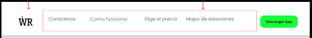
- Hero  
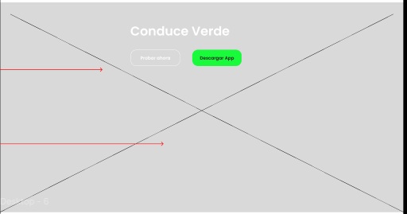
- Disposable Vehicles Section.  
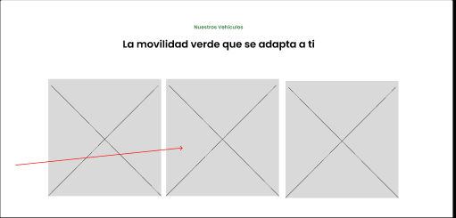
- Application user manual section.  
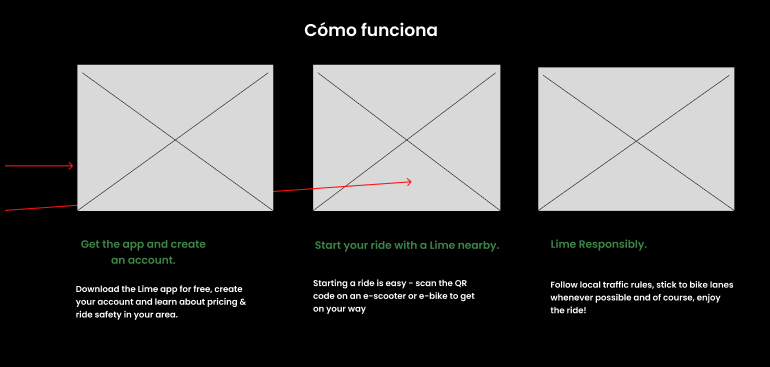
- Rates Section.  
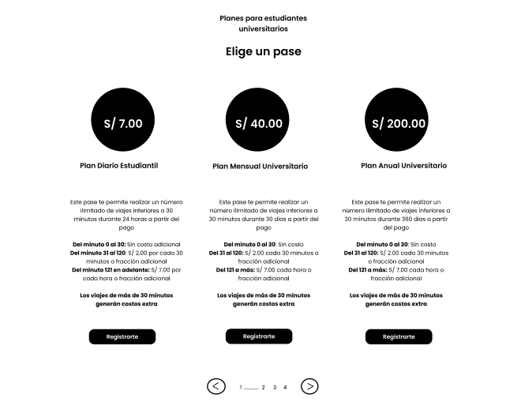
- Locations section.  
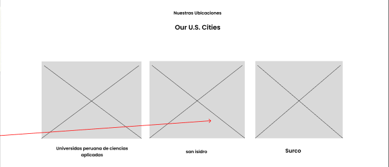
- Who we are section.  
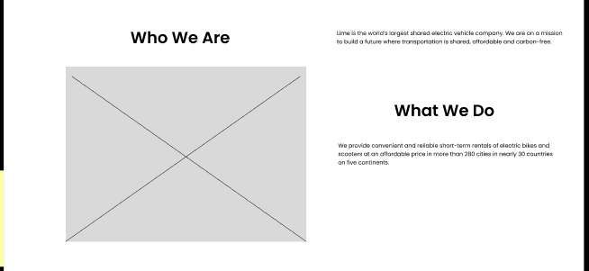
- About section.  
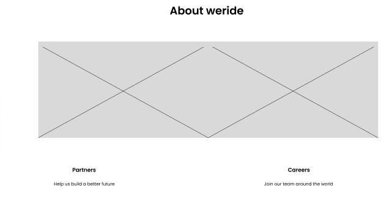
- Application download section. 
 
- Footer Section. 
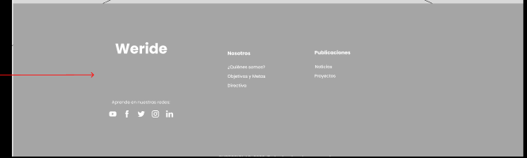 
  
### 4.3.2. Landing Page Mock-up. 
   
- Navbar  

- Hero  
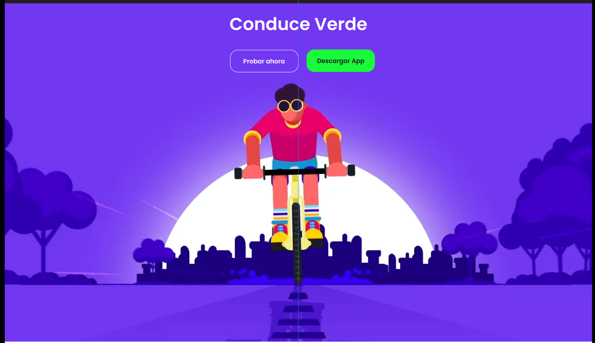
- Disposable Vehicles Section.  
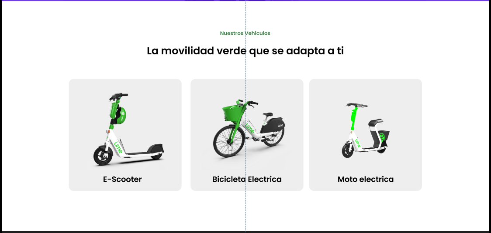
- Application user manual section.  

- Rates Section.  
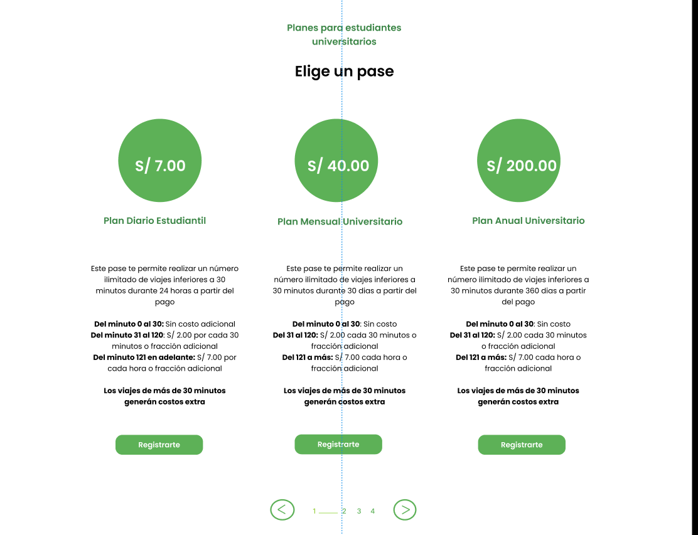
- Locations section.  

- Who we are section.  
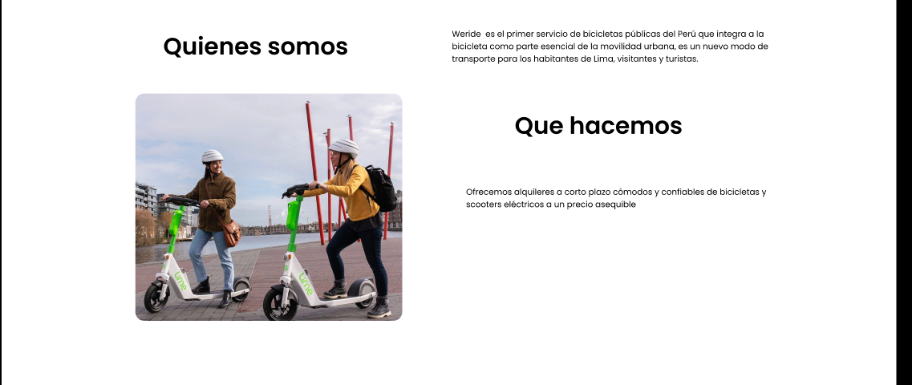
- About section.  

- Application download section. 
 
- Footer Section. 
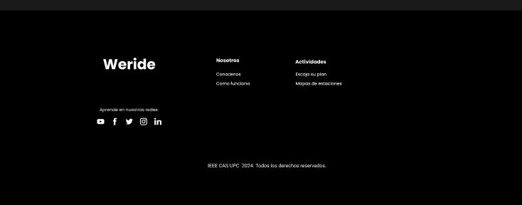 

