# Capítulo IV: Product Design

## 4.1. Style Guidelines

### 4.1.1.General Style Guidelines.

<h3>Branding</h3>

El logo de WR sintetiza de manera elegante y minimalista la propuesta de valor de la marca en el mundo de la micromovilidad eléctrica. El diseño en tipografía negra sobre fondo blanco comunica sobriedad, confianza y profesionalismo, asegurando legibilidad en cualquier soporte digital o físico.

En la parte superior, el scooter eléctrico estilizado simboliza movimiento, innovación y sostenibilidad, elementos centrales de la experiencia que WR ofrece. Su posición por encima de las iniciales representa la prioridad de la movilidad sobre cualquier otra función, transmitiendo dinamismo y acción inmediata.

La composición general mantiene un equilibrio entre modernidad y simplicidad, ideal para una plataforma tecnológica que busca conectar a las personas con alternativas de transporte accesibles, rápidas y ecológicas. La elección de una paleta monocromática resalta la seriedad de la propuesta, mientras que el ícono del scooter añade cercanía y un toque aspiracional.

Con este logo, WR se presenta como una marca confiable, eficiente y enfocada en transformar el desplazamiento urbano, adaptándose a las necesidades de estudiantes, profesionales y empresas.

***Variantes de logo***

***Logo original***


***Logo con iniciales light color***


***Colores invertidos***


<h3>Typography</h3>

La tipografía de nuestra app de micromovilidad eléctrica refleja dinamismo, innovación y accesibilidad, alineándose con los valores de sostenibilidad y movilidad inteligente que representamos. Hemos elegido una fuente sans-serif moderna, limpia y ligera, que transmite agilidad y simplicidad, elementos esenciales de nuestro servicio.

La fuente principal será "Kay Pho Du", que por su diseño esbelto y geométrico comunica tecnología y orden sin perder cercanía. Su alta legibilidad permite que los usuarios puedan consultar información rápida mientras se desplazan.

Para lograr una jerarquía visual clara, los títulos y subtítulos tendrán un tamaño más prominente que el cuerpo del texto. Los títulos (H1, H2) enfatizan energía y movimiento, mientras que los textos secundarios mantienen un tono amigable y sencillo.

El cuerpo del texto usará un tamaño base adaptable, que garantice lectura sin esfuerzo tanto en pantallas pequeñas (smartphones) como en tablets. Se mantendrá un interlineado aireado y márgenes equilibrados para no saturar la interfaz.

El lenguaje será directo y motivador, usando un tono casual que inspire confianza y fomente la adopción de alternativas de transporte sostenible.

<h3>Colors</h3>

La paleta de colores de nuestra app de micromovilidad eléctrica fue diseñada para reforzar el impacto visual del logo y proyectar dinamismo, sostenibilidad y confianza. El blanco se mantiene como base, representando simplicidad, limpieza y espacios abiertos, facilitando que los elementos clave destaquen sin saturar la vista.

El negro profundo del logo se utiliza en tipografía principal y elementos estructurales, comunicando seriedad y profesionalismo. Para transmitir energía y movimiento, incorporamos un verde lima brillante (#18FA3A) como color de acento, ideal para botones de acción (reservar, iniciar viaje) y mensajes de confirmación. Este tono evoca sostenibilidad y vitalidad, conectando con la misión de promover transporte limpio.

Un gris color (#EEEEEE) complementa la paleta y refuerza la percepción tecnológica de la plataforma, utilizado en íconos interactivos y estados activos. Además, tonos gris claro (#EAEAEA) y gris oscuro (#4F4F4F) equilibran la interfaz, mejorando la legibilidad y jerarquizando la información.

En conjunto, esta paleta crea una identidad moderna, ágil y ecológica, que motiva a los usuarios a adoptar la movilidad eléctrica como su primera opción dentro y fuera del campus.

---

#### Paleta de colores - WeRide

| **Color**        | **Uso**                                                                 | **Código Hex** |
|------------------|-------------------------------------------------------------------------|---------------|
| Blanco           | Fondo principal de la interfaz, espacios vacíos, sensación de limpieza y orden. | `#FFFFFF`     |
| Negro profundo   | Logo, textos principales, íconos y elementos estructurales.              | `#000000`     |
| Verde energía    | Botones de acción (reservar, iniciar viaje), confirmaciones y mensajes de éxito. | `#18FA3A`     |
| Gris claro       | Fondos secundarios, separadores, tarjetas de información.                | `#D9D9D9`     |
| Gris medio       | Texto secundario, íconos inactivos, descripciones y estados deshabilitados. | `#A6A6A6`     |

### 4.1.2. Web Style Guidelines.
Las guías de estilo web para WeRide garantizan una experiencia coherente y responsive en todos los dispositivos. La web está diseñada bajo los principios del Mobile-First y Responsive Design, asegurando que la interfaz se adapte fluidamente desde smartphones hasta pantallas de escritorio.
Layout:
Se utiliza un sistema de cuadrícula flexible (Grid System) de 12 columnas para organizar el contenido de manera estructurada y visualmente equilibrada. Los espaciados siguen una escala base de 8px para mantener la consistencia.
Navegación:
El menú de navegación principal es fijo en la parte superior (sticky header), con enlaces claros y accesibles. Se emplea el color verde energía (#18FA3A) para los estados activos y hover, reforzando la identidad de marca.
Componentes principales:
Botones:
Primarios: Fondo verde energía (#18FA3A), texto en negro (#000000).
Secundarios: Borde gris medio (#A6A6A6), texto gris oscuro (#4F4F4F).
Tarjetas:
Fondos gris claro (#D9D9D9) con sombras sutiles para profundidad, bordes redondeados de 8px.
Formularios:
Campos con borde gris medio (#A6A6A6) y focus en verde energía (#18FA3A).
Animaciones:
Transiciones suaves (300ms) en hover y cambios de estado para una experiencia fluida y moderna.

## 4.2. Information Architecture.

### 4.2.1. Organization Systems.

Para la **landing page** de WeRide, se ha optado por una estructura jerárquica para ambos segmentos de usuarios, ya que se cuenta con una barra de navegación superior que dirige a diferentes secciones, cada una encapsulando información relevante y relacionada.

Para el proceso de inicio de sesión o creación de cuenta, se utiliza una organización lineal, permitiendo que el usuario avance paso a paso a medida que completa los datos requeridos hasta finalizar el registro o acceso.

Dentro de la aplicación principal, se mantiene una organización jerárquica para separar y encapsular las distintas funcionalidades, independientemente del tipo de usuario. Esto asegura que, aunque los usuarios tengan diferentes necesidades y accesos, ****la estructura de la aplicación sea coherente y fácil de navegar.****

##### Usuario individual:
Para los **usuarios individuales** de WeRide, la funcionalidad principal es la gestión y uso de vehículos de micromovilidad (scooters, bicicletas y motos eléctricas). Por ello, la organización jerárquica permite agrupar subfuncionalidades como ***la reserva de vehículos, visualización del mapa, filtrado por tipo de vehículo, consulta de historial de viajes y notificaciones***, todas relacionadas con la experiencia de movilidad personal.

#### Empresa o Administrador:
En el caso de **empresas o administradores**, también se emplea una organización jerárquica para gestionar múltiples usuarios, vehículos y reportes. Además, se puede acceder a funcionalidades específicas como ***la supervisión del estado de la flota, generación de informes de uso, administración de usuarios corporativos y gestión de promociones***.


### 4.2.2. Labeling Systems.
Las etiquetas emplean un lenguaje claro y conciso, alineado con el tono casual y motivador de la marca:
**Inicio:** Vista principal con mapa y scooters disponibles.
**Reservar:** Flujo de reserva paso a paso.
**Mis Viajes:** Historial de viajes y reservas activas.
**Perfil:** Gestión de cuenta, método de pago y preferencias.
**Ayuda:** Centro de soporte con preguntas frecuentes y contacto.

---

### 4.2.3. SEO Tags and Meta Tags

**Titulo:**
```html
<title>WeRide</title>
```

**Codificación de carácteres:**
```html
<meta charset="utf-8">
```

**Descripción:**
```html
<meta name="description" content="WeRide is a web application focused on providing sustainable and smart urban mobility through electric scooters, bikes, and motorcycles.">
```

**Autor y Derechos de Autor:**
```html
<meta name="author" content="CultiConection">
<meta name="copyright" content="Copyright WeTech team" />
```

---

### 4.2.4.Searching Systems.

El sistema integral de micromovilidad eléctrica compartida incorporará un **módulo de búsqueda y localización en tiempo real**, que permitirá a los usuarios identificar la ubicación disponible de los vehículos más cercanos (scooters, bicicletas y motos eléctricas). Este sistema se sustenta en las siguientes características:  
Geolocalización en tiempo real:  
 Cada vehículo estará equipado con dispositivos GPS e IoT que transmitirán su ubicación de manera constante hacia la plataforma central.


**Mapa interactivo en la aplicación móvil**:  
 La app mostrará en un mapa la ubicación exacta de los vehículos disponibles, diferenciados por tipo (scooter, bicicleta o moto eléctrica).


**Filtros de búsqueda avanzada**
 Los usuarios podrán buscar vehículos según:


- Tipo de unidad preferida.


- Nivel de batería disponible.


- Distancia a pie desde su ubicación actual.


**Reserva inmediata**:
 Una vez identificado el vehículo, el usuario podrá seleccionarlo en la aplicación, reservarlo y dirigirse a recogerlo.


**Optimización para empresas**:
 En el caso de suscripciones corporativas, los sistemas de búsqueda también permitirán a los empleados visualizar vehículos disponibles en zonas cercanas a sus oficinas o campus, garantizando disponibilidad en horas de mayor demanda.


Con este enfoque, el sistema de búsqueda se convierte en un **componente esencial para la experiencia del usuario**, asegurando eficiencia en la localización y optimizando el uso de la flota.  

### 4.2.5.Navigation Systems.  

El sistema integral de micromovilidad eléctrica compartida contará con un módulo de navegación inteligente que facilitará al usuario el uso de los vehículos y la planificación de sus desplazamientos. Dicho módulo se estructura en las siguientes funciones:  
Guía hacia el vehículo seleccionado:  
 Una vez realizada la reserva, la aplicación mostrará la ruta a pie más rápida desde la ubicación del usuario hasta el vehículo disponible, mediante mapas integrados en tiempo real.  


**Navegación durante el viaje:**   
 El sistema proporcionará indicaciones de ruta para que el usuario se desplace de manera eficiente hacia su destino, evitando zonas de alto tráfico cuando sea posible. Para ello, se integrarán APIs de mapas inteligentes como Google Maps o Mapbox, adaptadas a la movilidad ligera.  


**Seguridad en la navegación:**  


- Alertas en la aplicación respecto a calles restringidas o zonas con tráfico intenso.  


- Recomendación de rutas seguras y sostenibles para bicicletas, scooters y motos eléctricas.  


- Opciones de personalización (ruta más rápida, más segura o más ecológica).  


**Gestión de estaciones y puntos de aparcamiento:**  
 La navegación también incluirá la localización de zonas de parqueo autorizadas, estaciones de carga o puntos estratégicos de la empresa asociados a la suscripción corporativa.  


**Soporte para empresas:**  
 En el caso de planes empresariales, el sistema de navegación permitirá sugerir rutas entre las sedes de trabajo, facilitando la movilidad de los colaboradores.  


En conjunto, este módulo no solo ofrece orientación geográfica en tiempo real, sino que también optimiza la experiencia de uso, mejorando la seguridad del viaje y reduciendo la incertidumbre del usuario en entornos urbanos congestionados.  

## 4.3. Landing Page UI Desing.  
### 4.3.1. Landing Page Wireframe.  
  
- Navbar  

- Hero  

- Disposable Vehicles Section.  

- Application user manual section.  

- Rates Section.  

- Locations section.  

- Who we are section.  

- About section.  

- Application download section.  
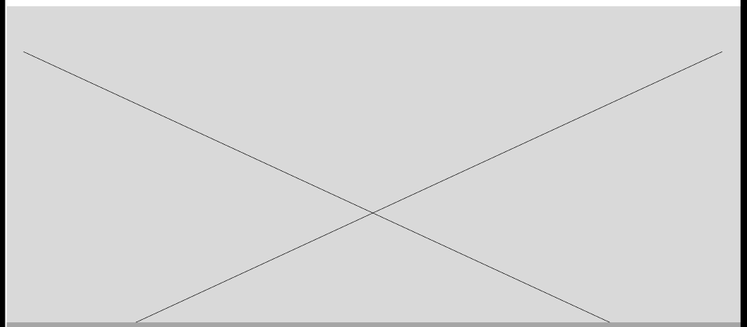
- Footer Section.  

  
### 4.3.2. Landing Page Mock-up. 
   
- Navbar  

- Hero  

- Disposable Vehicles Section.  

- Application user manual section.  

- Rates Section.  

- Locations section.  
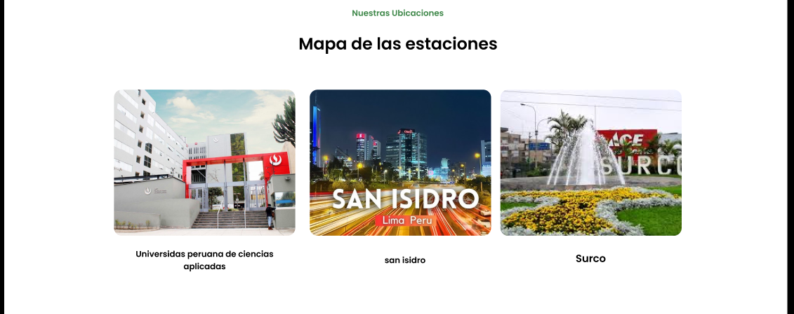
- Who we are section.  

- About section.  
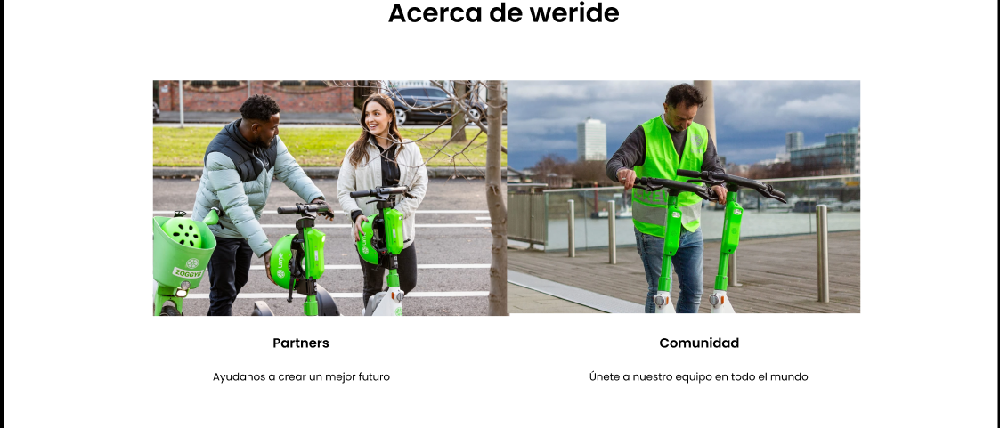
- Application download section.  
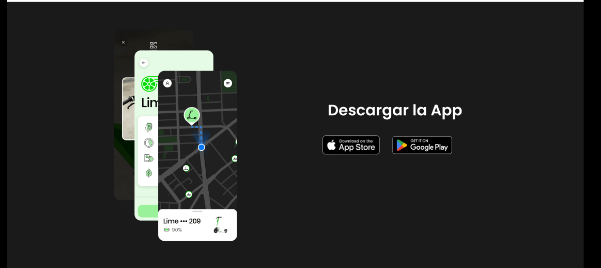
- Footer Section.  


## 4.4.Web Applications UX/UI Design.

### 4.4.1.Web Applications Wireframes. 

Wireframes are simplified, low-fidelity visual guides that outline the structure, layout, and key elements of a web application’s interface. They focus on placement of content, navigation, and functionality rather than visual design details like colors or images. Wireframes help designers and developers plan page layouts, organize information, and ensure usability before moving on to higher-fidelity mock-ups or prototypes.

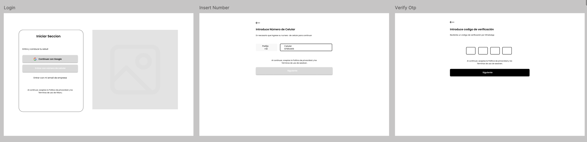

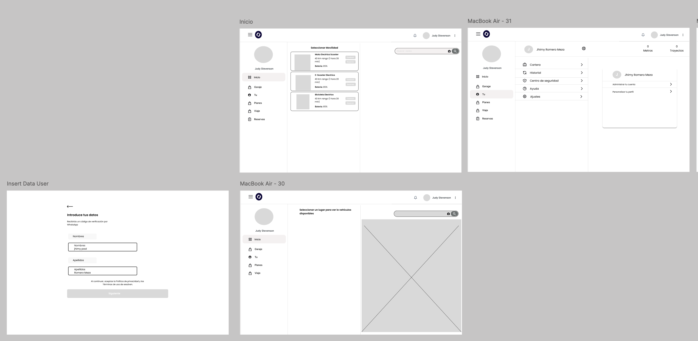

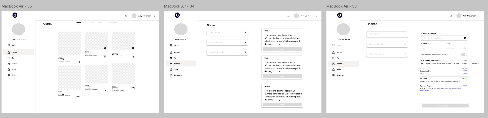

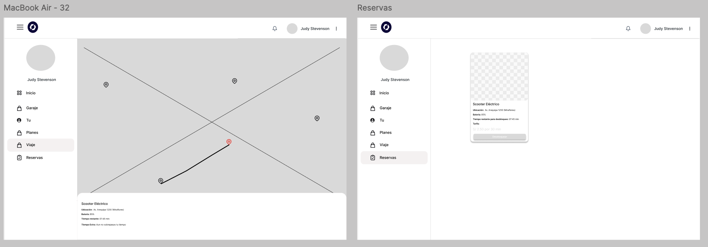

### 4.4.2.Web Applications Wireflow Diagrams.

Wireflow diagrams combine wireframes and user flow concepts to show both the layout of web pages and the paths users take through an application. They illustrate screen designs along with navigation steps, interactions, and decision points, providing a comprehensive view of how users move between pages and perform tasks. Wireflows help designers and developers plan user experience, identify potential issues, and communicate both the interface and workflow in a single visual representation.

#### Elementos clave del diseño
**Arquitectura de la información**
El contenido y las funciones están organizadas para facilitar el acceso a herramientas como el historial de servicios, monitoreo de consumo energético, o gestión de citas.
Los wireframes incluyen pantallas clave como:
Panel de control del propietario.
Dashboard del proveedor técnico.
Formulario para solicitar mantenimientos preventivos.
Historial de dispositivos y consumo energético.
Se ha priorizado una navegación simple y accesible, permitiendo que usuarios con diversas habilidades puedan moverse con facilidad por la plataforma.
Estructura de la interfaz
Los elementos interactivos (botones, menús, tarjetas de información) están ubicados estratégicamente para que el usuario pueda realizar tareas con pocos clics.
Las pantallas permiten acceso directo a secciones importantes como:
Subir o editar dispositivos eléctricos.
Contactar proveedores certificados.
Visualizar métricas de rendimiento o consumo.
Se incluye también una sección de perfil adaptable y configurable, especialmente útil para personas que requieren adaptaciones visuales, físicas o cognitivas.


### 4.4.3. Web Applications Mock-ups.  

Mock-ups are static or semi-interactive visual representations of a web application’s interface. They show the layout, design elements, content placement, and functionality of pages without fully implementing the system. Mock-ups help stakeholders, designers, and developers visualize the look and feel of the application, gather feedback, and validate design decisions before actual development begins. They are an essential step in the UI/UX design process to ensure usability, consistency, and alignment with user needs.

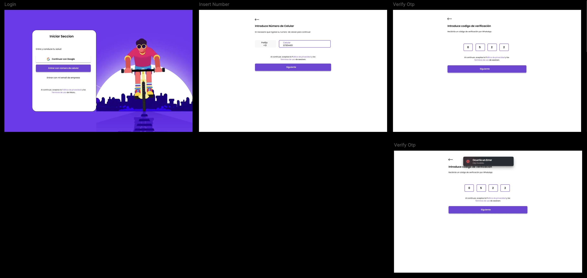

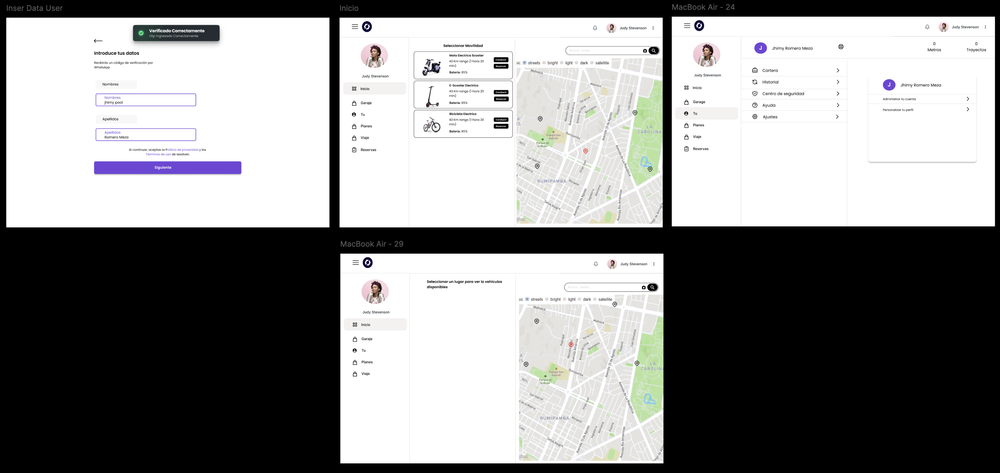

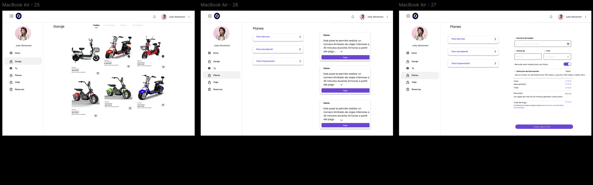

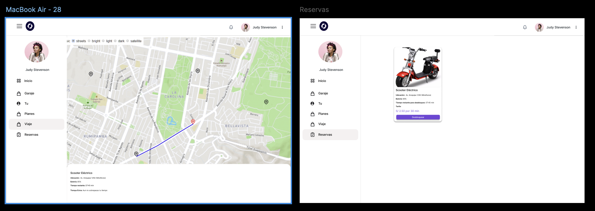

### 4.4.4. Web Applications User Flow Diagrams. 

User Flow Diagrams are visual representations that show the steps a user takes to complete specific tasks within a web application. They map the navigation paths between screens or pages, highlighting decision points, actions, and outcomes. These diagrams help designers and developers understand how users interact with the system, identify potential usability issues, and ensure smooth navigation and task completion. They are essential for planning intuitive interfaces, improving user experience, and guiding development teams in implementing consistent workflows.


.png)

## 4.5. Web Applications Prototyping.

Web Applications Prototyping es una metodología esencial en el desarrollo de aplicaciones web, que implica la creación de bocetos visuales o modelos preliminares de una aplicación antes de su implementación completa. 

## 4.6.Domain - DrivenSoftware Architecture.

Esta sección se expone la arquitectura de software del proyecto WeRide. La propuesta fue elaborada con un enfoque orientado al dominio, de manera que los elementos más relevantes de la plataforma estén correctamente representados y respondan a los requerimientos de los usuarios. Seguidamente, se incluyen diagramas esenciales que ilustran la interacción entre los distintos componentes del sistema y los actores externos.

### 4.6.1 Design-Level Event Storming.

**Command Bounded Context**


**Vehicle Managment Bounded Context**


**Level & Storm Managment Bounded Context**


**Payment Managment Bounded Context**


---

### 4.6.2. Software Architecture ContextDiagram.

El diagrama de contexto de **WeRide** ofrece una visión global de las interacciones principales entre el sistema central y los actores externos que lo rodean. La plataforma está orientada a simplificar y optimizar la movilidad urbana mediante el uso compartido de vehículos eléctricos. En este nivel, se identifican actores clave como el Usuario (quien reserva, desbloquea y utiliza los vehículos), el Administrador (encargado de la gestión de la flota y promociones), y Empresas (clientes corporativos que gestionan suscripciones para empleados). Asimismo, se muestran las integraciones externas más relevantes: la Pasarela de Pago para procesar transacciones de suscripción y uso, el Servicio de Mapas para visualizar la ubicación de los vehículos y planificar rutas, y las Redes Sociales para compartir viajes y promociones. Esta representación de alto nivel permite entender de manera clara cómo WeRide se relaciona y coopera con su ecosistema digital y humano.


### 4.6.3. Software Architecture Container Diagrams.

El diagrama de contenedores detalla la organización interna de **WeRide**, mostrando cómo los diferentes componentes de software trabajan en conjunto para brindar la funcionalidad de la plataforma. La Aplicación Web y Móvil, implementadas en React y React Native, sirven como puntos de interacción donde los usuarios pueden localizar, reservar y gestionar vehículos eléctricos. Estas interfaces se conectan con una API en Node.js, que cumple el rol de enlace entre la capa de presentación y los servicios del backend. La información esencial de usuarios, vehículos, reservas, pagos y rutas se almacena en una Base de Datos PostgreSQL. Asimismo, se integran contenedores adicionales como el Servicio de Mapas (basado en Google Maps API o Mapbox) para la visualización de ubicaciones y rutas, y la Pasarela de Pago (Stripe o similar), destinada a la gestión de transacciones. En conjunto, este nivel del modelo permite comprender cómo se estructuran y comunican las partes técnicas del sistema.


### 4.6.4. Software Architecture Components Diagrams.

El diagrama de componentes pone el foco en la arquitectura interna de la API de **WeRide**, encargada de coordinar la lógica de negocio central de la plataforma. Esta API, desarrollada en Node.js, se organiza en distintos componentes especializados, cada uno orientado a un dominio concreto. El Componente de Gestión de Usuarios administra la autenticación, perfiles y métodos de pago; Gestión de Vehículos permite realizar operaciones sobre los vehículos disponibles (ubicación, estado, batería); Reservas y Viajes abarca el ciclo completo de reserva, desbloqueo y finalización de viajes; Rutas y Mapas gestiona la localización y navegación de los vehículos; y Promociones y Notificaciones procesa tanto la gestión de descuentos como el envío de alertas a los usuarios. La interacción entre estos módulos sigue un flujo funcional definido: los usuarios gestionan reservas y viajes, los administradores supervisan la flota y las promociones, y las empresas pueden gestionar suscripciones corporativas. Esta separación de responsabilidades refleja un diseño guiado por el dominio, donde cada componente encapsula una función específica y colabora con los demás para dar soporte integral a la plataforma, junto a los Bounded Contexts desarrollados que explican de forma detallada la funcionalidad de cada componente existente en WeRide.


## 4.7.Software Object-Oriented Design.

El diagrama de clases nos ayuda a definir la funcionalidad de el producto de **WeRide** mediante los atributos y funcionalidades de las clases de nuestras entidades relacionadas al funcionamiento del producto, desde interfaces, clases y atributos.

### 4.7.1.Class Diagrams.
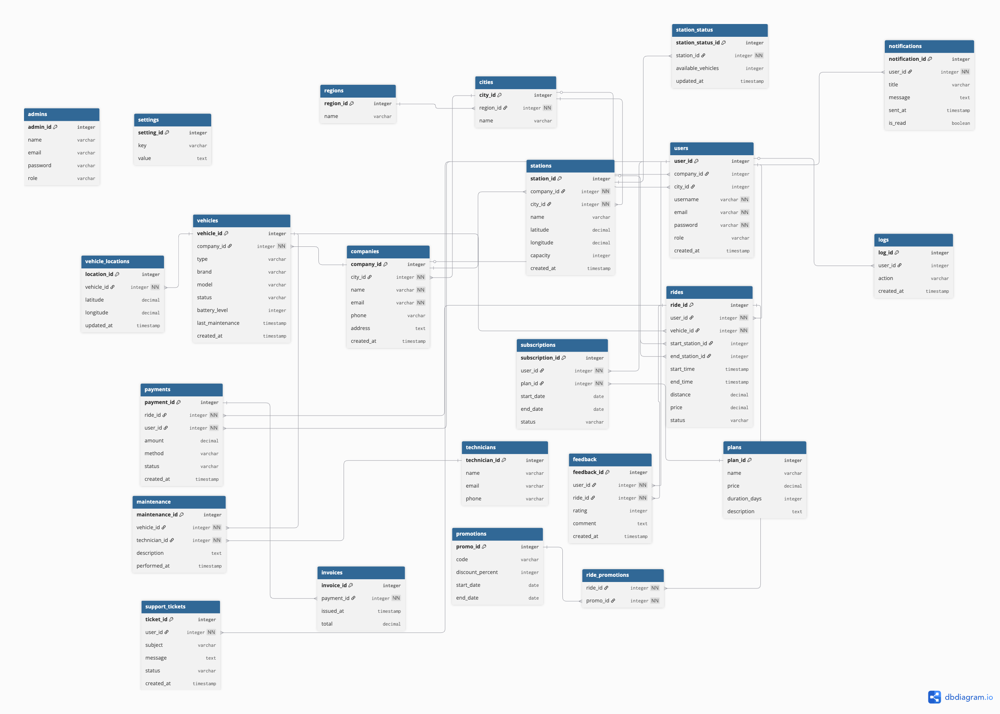

## 4.8.Database Design.

El diagrama de base de datos nos ayudara a la correcta definicion de entidades dentro de la base de datos funcional de **WeRide**, definiendo que entidades se vinculan mediante las id's principales para la correcta organizacion y manejo de informacion.

### 4.8.1.Database Diagrams.


<p align="center">

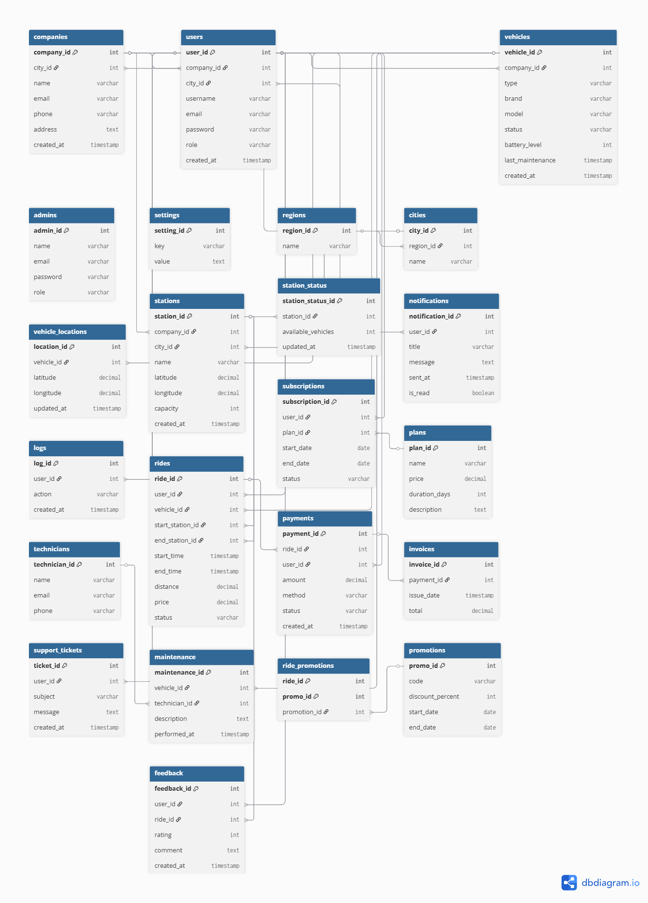
</p>


