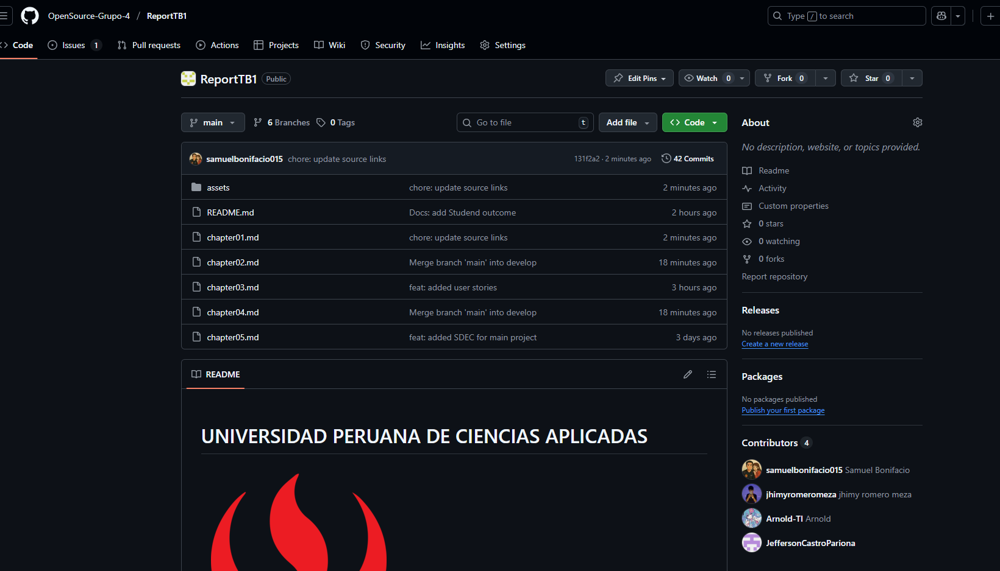
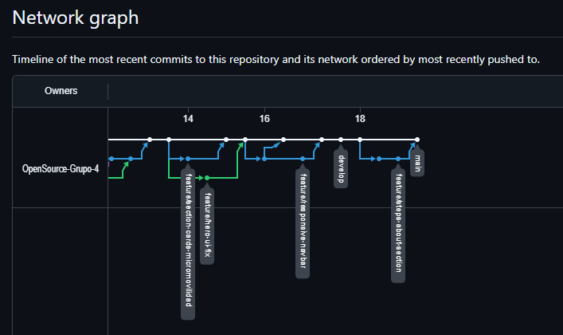
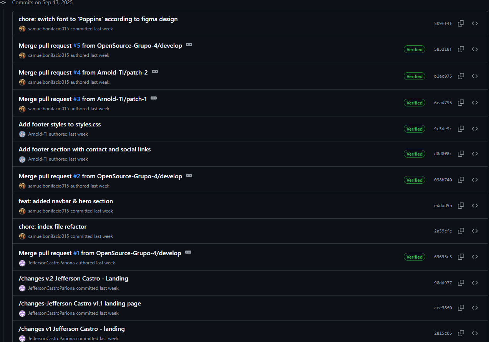
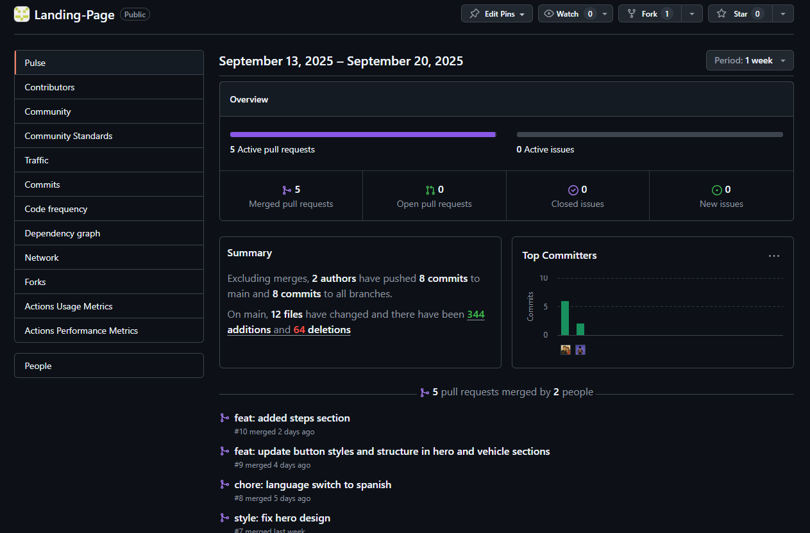
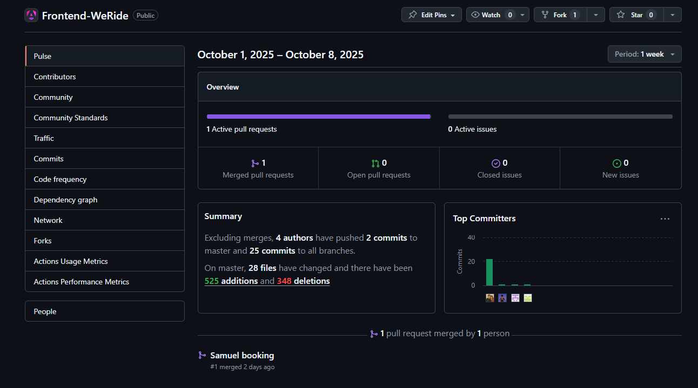
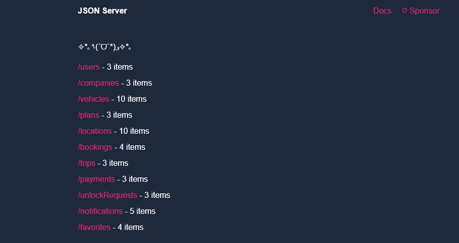

# Capítulo V: Product Implementation, Validation & Deployment.
## 5.1. Software Configuration Management.

Esta guía define las decisiones y acuerdos fundamentales para el desarrollo, mantenimiento y despliegue de la aplicación **WeRide**, que gestiona el alquiler de vehículos. El objetivo es asegurar la coherencia, eficiencia y calidad a lo largo del ciclo de vida del proyecto.

---

### 5.1.1. Software Development Environment Configuration.

<table border="1">

  <tr>
    <td>Project Management</td>
    <td><h4>Github</h4>Plataforma en línea que permite almacenar código fuente en repositorios. Gracias a la tecnología de control de versiones de Git se puede organizar el código y llevar un mejor trabajo en conjunto.</td>
  </tr>
  <tr>
    <td></td>
    <td><h4>Whatsapp</h4>Red Social destinada a la comunicación donde se realizaron acuerdos y recordatorios de las reuniones.</td>
  </tr>
  <tr>
    <td></td>
    <td><h4>Trello</h4>Software de administración y gestión de proyectos que se utilizó para establecer y designar las tareas</td>
  </tr>
  <tr>
    <td>Requirements Management</td>
    <td><h4>Miro</h4>Plataforma en línea de gestión de requisitos que permite colaborar y organizar proyectos de forma visual y representativa.
</td>
  </tr>
  <tr>
    <td>Product UX/UI Design</td>
    <td><h4>Figma</h4>Aplicación que permite el diseño libre de interfaces a través de las múltiples herramientas que ofrece. Permitiendo la creación de prototipos interactivos que simulan la experiencia de usuario.
</td>
  </tr>
  <tr>
    <td>Software Development</td>
    <td><h4>Git</h4>Es un software de control de versiones para los trabajos en equipos y confiabilidad del desarrollo.</td>
  </tr>
  <tr>
    <td></td>
    <td><h4>Node.js</h4>Node.js es un entorno de ejecución de JavaScript del lado del servidor, que permite desarrollar aplicaciones web escalables y de alto rendimiento fuera del navegador.</td>
  </tr>
  <tr>
    <td></td>
    <td><h4>HTML</h4>Lenguaje de etiquetas, utilizado para la estructuración y la presentación de contenido.</td>
  </tr>
  <tr>
    <td></td>
    <td><h4>CSS</h4>CSS es un lenguaje utilizado para estilizar y dar formato a documentos HTML.</td>
  </tr>
  <tr>
    <td></td>
    <td><h4>TypeScript</h4>TypeScript es un lenguaje de programación de alto nivel, interpretado y multi-paradigma, utilizado para crear interactividad en páginas web.</td>
  </tr>
  <tr>
    <td></td>
    <td><h4>VSCode</h4>Es un editor de código fuente con extensiones que ayudan al desarrollo.</td>
  </tr>
    <tr>
    <td></td>
    <td><h4>WebStorm</h4>Es un IDE centrado en desarrollo frontend, por su gran variedad de herramientas que agilizan el proceso de desarrollo.</td>
  </tr>
  <tr>
    <td></td>
    <td><h4>Angular</h4>Framework robusto para el desarrollo de aplicaciones web modernas y escalables, basado en el patrón de Single Page Application (SPA),  facilita la creación de interfaces dinámicas mediante TypeScript.</td>
  </tr>
  <tr>
    <td></td>
    <td><h4>IntelliJIdea</h4>Entorno de desarrollo integrado (IDE) utilizado principalmente para el desarrollo en Java, que ofrece herramientas avanzadas para la codificación, depuración y pruebas.</td>
  </tr>
  <tr>
  <td></td>
    <td><h4>Java</h4>Lenguaje de programación orientado a objetos, utilizado para desarrollar aplicaciones robustas y portables.</td>
  </tr>
  <tr>
    <td></td>
    <td><h4>Springboot</h4>Framework para el desarrollo de aplicaciones Java basadas en microservicios, que facilita la creación de aplicaciones robustas y escalables.</td>
  </tr>
  <tr>
    <td></td>
    <td><h4>Swagger</h4>Herramienta para diseñar, construir, documentar y consumir APIs RESTful.</td>
  </tr>
  <tr>
    <td></td>
    <td><h4>MySQLWorkbench</h4>Herramienta visual para el diseño, modelado, generación y administración de bases de datos MySQL.</td>
  </tr>
  <tr>
    <td>Software Deployment</td>
    <td><h4>Github Pages</h4>Plataforma que nos permite realizar el despliegue de nuestro landing page.</td>
  </tr>
</table>

---

### 5.1.2. Source Code Management.

Hemos optado por crear un repositorio en GitHub para nuestro proyecto, tanto para el informe como para la landing page. Esto facilitó la colaboración entre los miembros del equipo,aprovechando las herramientas útiles que esta plataforma ofrece para el manejo del código fuente y sus versiones.

- URL del repositorio Report en GitHub: https://github.com/OpenSource-Grupo-4/ReportTB1
- URL del repositorio Landing Page en GitHub: https://github.com/OpenSource-Grupo-4/Landing-Page
- URL del repositorio de la Web Application en GitHub:https://github.com/OpenSource-Grupo-4/Frontend-WeRide
- URL del respositorio de los Web Services en GitHub:https://github.com/OpenSource-Grupo-4/Backend-WeRide

---

### 5.1.3. Source Code Style Guide & Conventions

##### Landing Page:

Para "**WeRide**", hemos utilizado "**HTML y CSS**". Para estructurar el contenido usamos etiquetas de section y divisiones para contenido específico de cada una de las secciones. Además, hemos empleado atributos como ***HTML Style*** para personalizar el aspecto visual, definiendo propiedades como color, tamaño de fuente y tipo de letra.

Para resaltar elementos importantes, hemos aplicado ***HTML Text Formatting***, incluyendo etiquetas como b para negrita, strong para resaltado y del para mostrar cambios de precios. En cuanto a la navegación, hemos implementado una barra de navegación horizontal utilizando **CSS** para mejorar la experiencia del usuario al explorar el contenido.

Los formularios, creados con **CSS**, permiten a los usuarios ingresar información relevante, como detalles de inicio de sesión, información de pago y dirección de envío. Para añadir interactividad, hemos agregado botones con efectos hover utilizando CSS y paginación CSS para facilitar la navegación entre las diferentes páginas de productos.

Finalmente, en el **footer**, hemos incluido enlaces a las redes sociales de la organización para brindar a los usuarios una forma adicional de conectarse y seguir nuestras actualizaciones.

##### Web Application:

Para "**WeRide App**", hemos utilizado "**TypeScript, HTML y CSS**". La estructura del proyecto sigue el patrón de arquitectura de **Single Page Application (SPA)**, utilizando el framework **Angular** para organizar el código en módulos, componentes y servicios.

Los componentes estan estructurados según DDD (Domain-Driven Design), donde cada componente representa un bounded context específico, como **auth**, **booking**, **garage**, **plans** y **trip**. Cada componente tiene su propio archivo HTML para la estructura, CSS para el estilo y TypeScript para la lógica y enrutamiento así como la comunicación entre componentes y servicios.

### 5.1.4. Software Deployment Configuration.

##### Landing Page:

Utilizaremos GitHub Pages para alojar nuestra Landing Page. Para lograrlo, subiremos los archivos esenciales (HTML, CSS, etc.) a un repositorio público en GitHub. De
esta manera, nuestra página estará disponible en línea y accesible para todos los usuarios.

##### Web Application:

Utilizaremos Vercel para alojar nuestra Web Application.
Para lograrlo, configuraremos un proyecto en Vercel y conectaremos nuestro repositorio de GitHub. Vercel se encargará de la construcción y el despliegue de nuestra aplicación automáticamente cada vez que realicemos un push a la rama principal.

---

## 5.2. Landing Page, Services & Applications Implementation.

### 5.2.1. Sprint 1

#### 5.2.1.1. Sprint Planning 1.

<table>
  <tr>
    <th>Elemento</th>
    <th>Detalle</th>
  </tr>
  <tr>
    <td><strong>Sprint</strong></td>
    <td>Sprint 1 — Implementación inicial: estructura de producto, landing y autenticación (WeRide)</td>
  </tr>
  <tr>
    <td><strong>Sprint Planning Background</strong></td>
    <td>Sprint de arranque para validar funcionalidades esenciales del MVP: landing pública, registro, inicio de sesión y vista inicial de vehículos simulados. Se prioriza entregar valor temprano a usuarios universitarios y pilotos corporativos.</td>
  </tr>
  <tr>
    <td><strong>Fecha</strong></td>
    <td>2025-09-19</td>
  </tr>
  <tr>
    <td><strong>Hora</strong></td>
    <td>22:00 (GMT-5)</td>
  </tr>
  <tr>
    <td><strong>Lugar</strong></td>
    <td>Reunión virtual — Discord</td>
  </tr>
  <tr>
    <td><strong>Preparado por</strong></td>
    <td>WeTech</td>
  </tr>
  <tr>
    <td><strong>Asistentes</strong></td>
    <td>Samuel Bonifacio, Jefferson Castro, Diego Seminario, Jhimy Romero, Arnold Morales</td>
  </tr>
  <tr>
    <td><strong>Sprint n-1 Review</strong></td>
    <td>Se creó la organización WeTech en GitHub, se definieron ramas, convenciones de commits y se asignaron tareas iniciales en investigación de usuarios, wireframes y mockups.</td>
  </tr>
  <tr>
    <td><strong>Sprint n-1 Retrospective</strong></td>
    <td>Se completó la estructura base de la landing page (HTML/CSS/JS). Lecciones aprendidas: mejorar granularidad en tareas y definir criterios de aceptación más claros.</td>
  </tr>
  <tr>
    <td><strong>Sprint Goal (Statement)</strong></td>
    <td><strong>Our focus is on</strong> entregar un flujo de onboarding confiable y una landing inicial atractiva con visualización simulada de vehículos. <strong>We believe it delivers</strong> mayor adopción temprana y confianza de usuarios iniciales (estudiantes y pilotos corporativos). <strong>This will be confirmed when</strong> al menos 50 usuarios de prueba completen el registro y login; la duración media de sesión sea ≥ 2 minutos; y la vista del mapa (vehículos simulados) sea accedida en ≥ 60% de las sesiones.</td>
  </tr>
  <tr>
    <td><strong>User Stories (SP)</strong></td>
    <td>
      - <strong>US-12 (3 SP) 
      - <strong>US-10 (3 SP) 
      - <strong>US-11 (5 SP) 
      - <strong>US-14 (3 SP) 
    </td>
  </tr>
  <tr>
    <td><strong>Sprint 1 Velocity (forecast)</strong></td>
    <td>17 puntos</td>
  </tr>
  <tr>
    <td><strong>Sum of Story Points (commit)</strong></td>
    <td>17 puntos</td>
  </tr>
</table>

#### User Stories seleccionadas para el Sprint 1

| ID  | User Story                                                                                  | Puntos |
|-----|---------------------------------------------------------------------------------------------|--------|
| 12   | Como usuario quiero contactar con el soporte de la aplicación para resolver mis dudas.  |   5    |
| 10   | Como usuario quiero tener acceso a la información de la aplicación para estar informado de las actualizaciones.                  |   5    |
| 11   | Como usuario quiero saber dónde se ubican presencialmente para acudir a uno de los locales.     |   4    |
| 14  | Como usuario, quiero reportar un problema con el vehículo para alertar a soporte y obtener ayuda rápida.   |   3    |

**Total de puntos:** 17

---

#### 5.2.1.2. Aspect Leaders and Collaborators

En esta sección se presenta la matriz de liderazgo y colaboración (Leadership-and-Collaboration Matrix, LACX) para el Sprint 1 de WeRide. Esta matriz identifica, para cada aspecto clave del Sprint, quién es el líder responsable y quiénes son los colaboradores, facilitando así la comunicación y la asignación de tareas dentro del equipo. 

Los aspectos considerados en este Sprint incluyen: diseño de la landing page, desarrollo de funcionalidades de registro e inicio de sesión, implementación de la barra de navegación, y configuración del footer con enlaces de contacto y redes sociales.

| Team Member (Apellido, Nombre)         | GitHub Username      | Landing Page Design | Registro/Inicio de Sesión | Barra de Navegación | Footer y Redes Sociales |
|----------------------------------------|----------------------|---------------------|--------------------------|---------------------|------------------------|
| Bonifacio, Samuel                     | samuelbonifacio015      | L                   | L                       | L                   | L                      |
| Castro, Jefferson                      | JeffersonCastroPariona     | C                   | L                        | C                   | C                      |
| Seminario, Diego                             | DiegoSeminario            | C                   | C                        | L                   | C                      |                     |
| Romero, Jhimy                        | jhimyromeromeza       | L                   | L                        | L                   | C                      |
| Morales, Arnold                        | Arnold-TI       | C                   | C                        | C                   | L                      |

**L:** Leader (Líder)  
**C:** Collaborator (Colaborador)

Esta organización permite una asignación clara de responsabilidades y fomenta la colaboración efectiva durante el desarrollo del Sprint.

---

#### 5.2.1.3. Sprint Backlog 1.

| ID   | Title/Section                | Description                                                                                                                        | Estimation (Hours) | Assigned To                        | Status |
|------|------------------------------|------------------------------------------------------------------------------------------------------------------------------------|--------------------|-------------------------------------|--------|
| US01 | Landing Page                 | Como usuario, quiero acceder a una landing page clara y atractiva para conocer los beneficios y funcionalidades de WeRide.         | 3                  | Bonifacio Jaramillo, Samuel Jesus   | Done   |
| US02 | Registro de Usuario          | Como usuario, quiero registrar una cuenta desde la landing page para poder acceder a los servicios de WeRide.                      | 3                  | Castro Pariona, Jefferson Ernesto   | Done   |
| US03 | Inicio de Sesión             | Como usuario, quiero iniciar sesión desde la landing page para gestionar mis reservas y perfil.                                    | 3                  | Castro Pariona, Jefferson Ernesto   | Done   |
| US04 | Barra de Navegación          | Como usuario, quiero una barra de navegación intuitiva y responsive para moverme fácilmente entre las secciones de la landing page.| 2                  | Seminario Castillo, Diego Vicente            | Done   |
| US05 | Footer y Redes Sociales      | Como usuario, quiero un footer con enlaces de contacto y redes sociales para comunicarme o seguir novedades de WeRide.             | 2                  | Morales Sosa, Arnold Gabriel        | Done   |
| US06 | Página de Información        | Como usuario, quiero una sección informativa sobre WeRide y sus beneficios para entender el propósito de la plataforma.            | 2                  | Bonifacio Jaramillo, Samuel Jesus   | Done   |
| US07 | Validación de Formularios    | Como usuario, quiero que los formularios de registro e inicio de sesión validen mis datos para evitar errores y mejorar la seguridad.| 2                 | Castro Pariona, Jefferson Ernesto   | Done   |
| US08 | Estilos Generales            | Como usuario, quiero una interfaz visualmente coherente (colores, fuentes, espaciados) para una experiencia agradable y moderna.   | 1                  | Romero Meza, Jhimy Pool   | Done   |

#### 5.2.1.4. Development Evidence for Sprint Review

Durante el Sprint 1, el equipo de **WeTech** realizó múltiples commits en el repositorio de GitHub, evidenciando el avance y cumplimiento de las tareas planificadas. A continuación, se presenta una tabla con los principales commits realizados, siguiendo el formato requerido:

| Repository                                         | Branch | Commit Id | Commit Message                                 | Commit Message Body                                   | Committed on (Date)     |
|----------------------------------------------------|--------|-----------|------------------------------------------------|-------------------------------------------------------|------------------------|
| OpenSource-Grupo-4/Landing-Page                    | develop   | 9c5de9c   | Add footer styles to styles.css                | Se agregaron estilos para el footer en styles.css.    | 13/09/2025             |
| OpenSource-Grupo-4/Landing-Page                    | develop   | d0d0f0c   | Add footer section with contact and social links| Se añadió la sección de footer con enlaces de contacto y redes sociales. | 13/09/2025             |
| OpenSource-Grupo-4/Landing-Page                    | develop   | 098b740   | Merge pull request #2 from OpenSource-Grupo-4/develop | Se fusionaron cambios de la rama develop.             | 12/09/2025             |
| OpenSource-Grupo-4/Landing-Page                    | feature/responsive-navbar   | eddad5b   | feat: added navbar & hero section              | Se agregó la barra de navegación y la sección principal. | 12/09/2025             |
| OpenSource-Grupo-4/Landing-Page                    | develop   | 2a59cfe   | chore: index file refactor                     | Refactorización del archivo index.                    | 12/09/2025             |
| OpenSource-Grupo-4/Landing-Page                    | main   | 69695c3   | Merge pull request #1 from OpenSource-Grupo-4/develop | Se fusionaron cambios iniciales de la rama develop.   | 11/09/2025             |
| OpenSource-Grupo-4/Landing-Page                    | hero-ui-fix   | 90dd977   | /changes v.2 Jefferson Castro - Landing        | Cambios en la landing page por Jefferson Castro.      | 11/09/2025             |
| OpenSource-Grupo-4/Landing-Page                    | main   | 59a25be   | feat: added steps section                      | Se agregó la sección de pasos.                        | 18/09/2025             |
| OpenSource-Grupo-4/Landing-Page                    | feature/responsive   | 4317f4c   | styles: updated responsive for steps cards     | Se mejoró la responsividad de las tarjetas de pasos.  | 18/09/2025             |
| OpenSource-Grupo-4/Landing-Page                    | main   | 9deb5a8   | feat: added steps section                      | Se agregó la sección de pasos.                        | 18/09/2025             |
| OpenSource-Grupo-4/Landing-Page                    | develop   | 6802c55   | chore: added imgs & syntax updates             | Se añadieron imágenes y se actualizaron detalles de sintaxis. | 18/09/2025             |

Cada commit refleja el trabajo colaborativo y el cumplimiento de los objetivos del Sprint, asegurando la trazabilidad y transparencia en el desarrollo de **WeRide**.

**Reporte de commits:**

---

#### 5.2.1.5. Execution Evidence for Sprint Review.

En esta entrega, nos centramos en el desarrollo completo de la Landing Page para nuestra plataforma de alquiler en línea. Nuestro objetivo es desplegar una página web atractiva y efectiva que actúe como el punto de entrada para nuestros usuarios. 

Es por ello que se comparte las evidencias de ambos repositorios para corroborar el trabajo hecho por cada uno de los participantes.

#### 5.2.1.6. Services Documentation Evidence for Sprint Review.

Para esta primera entrega no hubo implementación de APIs, pues solo se realizó la Landing Page.

#### 5.2.1.7. Software Deployment Evidence for Sprint Review.

El objetivo del primer Sprint fue el desarrollo e implementación de la Landing Page. Para eso, utilizamos GitHub y GitHub Pages. El proceso del desarrollo fue el siguiente:

1. Se creó una organización en GitHub y, dentro de ella, se crearon dos repositorios. Uno para el informe del trabajo y otro para la Landing Page 
2. Luego, a través de los commits, el equipo fue editando los archivos index.html y styles.css, además de ir añadiendo imágenes a utilizar en el directorio images. 
3. Finalmente, se implementó GitHub Pages en el repositorio de GitHub y se desplegó la Landing Page, la que se puede visitar en el siguiente link: https://opensource-grupo-4.github.io/Landing-Page

#### 5.2.1.8. Team Collaboration Insights during Sprint.

A continuación, se adjuntan las capturas de evidencia de los insights de los repositorios del informe y Landing Page para evidenciar la participación de todos los miembros:

- Insight Landing Page:

- Insight Report

## 5.2.2. Sprint 2

### 5.2.2.1. Sprint Planning 2

<table>
  <tr>
    <th>Elemento</th>
    <th>Detalle</th>
  </tr>

  <tr>
    <td><strong>Sprint</strong></td>
    <td>Sprint 2 — Implementación de base de datos local (<code>db.json</code>) y primera versión desplegada del Back/Front (WeRide)</td>
  </tr>

  <tr>
    <td><strong>Sprint Planning Background</strong></td>
    <td>Sprint orientado a proveer una capa de datos simulada (db.json) que permita al frontend consumir lecturas IoT y estados de vehículos, y a la vez desarrollar los bounded contexts principales para validar flujos de negocio (auth, booking, garage, plans, trip). Se busca reducir dependencia de servicios externos y preparar la integración con el backend real en sprints posteriores.</td>
  </tr>

  <tr>
    <td><strong>Fecha</strong></td>
    <td>2025-10-08</td>
  </tr>

  <tr>
    <td><strong>Hora</strong></td>
    <td>21:00 (GMT-5)</td>
  </tr>

  <tr>
    <td><strong>Lugar</strong></td>
    <td>Reunión virtual — Google Meet</td>
  </tr>

  <tr>
    <td><strong>Preparado por</strong></td>
    <td>WeTech</td>
  </tr>

  <tr>
    <td><strong>Asistentes</strong></td>
    <td>Samuel Bonifacio, Jefferson Castro, Diego Seminario, Jhimy Romero, Arnold Morales</td>
  </tr>

  <tr>
    <td><strong>Sprint n-2 Review</strong></td>
    <td>Se completó la primera versión desplegada del Frontend Web Application de WeRide; se validaron wireframes y se obtuvo feedback inicial de usuarios de prueba.</td>
  </tr>

  <tr>
    <td><strong>Sprint n-2 Retrospective</strong></td>
    <td>Buena coordinación y avance en frontend; se identificó la necesidad de una capa de datos simulada (db.json) y de criterios de aceptación más precisos para las integraciones.</td>
  </tr>

  <tr>
    <td><strong>Sprint Goal (Statement)</strong></td>
    <td>
      <strong>Our focus is on</strong> implementar una base de datos local (<code>db.json</code>) que simule endpoints y telemetría, y desarrollar los bounded contexts <strong>auth</strong>, <strong>booking</strong>, <strong>garage</strong>, <strong>plans</strong> y <strong>trip</strong> en el frontend para validar flujos clave. 
      <strong>We believe it delivers</strong> mayor estabilidad del desarrollo frontend, permite pruebas deterministas y acelera la integración con el backend real para pilotos. 
      <strong>This will be confirmed when</strong> el frontend consume correctamente <code>db.json</code> (endpoints simulados), los flujos de autenticación, reserva y gestión de vehículos funcionan end-to-end en entorno de pruebas, y se registran ≥ 30 interacciones de prueba entre usuarios y booking/garage durante la fase de validación.
    </td>
  </tr>

  <tr>
    <td><strong>User Stories (SP)</strong></td>
    <td>
      - <strong>US-06 (3 SP):</strong> Crear <code>db.json</code> con modelos: usuarios, vehículos, estado batería, ubicaciones y trips. 
      - <strong>US-07 (5 SP):</strong> Implementar bounded context <strong>booking</strong>: reserva, confirmación y cancelación (frontend + lectura/sync con <code>db.json</code>). 
      - <strong>US-08 (4 SP):</strong> Implementar bounded context <strong>garage</strong>: vista de vehículo, estado, reportes de incidencia y lógica de disponibilidad. 
      - <strong>US-09 (3 SP):</strong> Implementar bounded context <strong>plans</strong>: planes/subscripciones mock (interfaz + lógica de selección). 
      - <strong>US-10 (5 SP):</strong> Implementar bounded context <strong>trip</strong>: inicio/final de viaje simulado, registro de evento en <code>db.json</code> y visualización de historial.
    </td>
  </tr>

  <tr>
    <td><strong>Sprint 2 Velocity (forecast)</strong></td>
    <td>20 puntos</td>
  </tr>

  <tr>
    <td><strong>Sum of Story Points (commit)</strong></td>
    <td>20 puntos</td>
  </tr>
</table>

<h2>Objetivo del Sprint (versión SMART)</h2>

<strong>Objetivo:</strong> Implementar una base de datos simulada (<code>db.json</code>) y desarrollar los bounded contexts auth, booking, garage, plans y trip en el frontend para permitir pruebas end-to-end controladas.

<ul>
  <li><strong>Específico:</strong> <code>db.json</code> con entidades clave y endpoints simulados; booking/garage/trip/plans/auth funcionales en entorno de pruebas.</li>
  <li><strong>Medible:</strong> 30 interacciones de prueba en booking/garage/trip; todas las historias con criterios de aceptación verificados.</li>
  <li><strong>Alcanzable:</strong> Basado en la velocity estimada (20 SP) y competencias del equipo.</li>
  <li><strong>Relevante:</strong> Permite validar integraciones sin dependencia de backend real y acelera la preparación del piloto.</li>
  <li><strong>Tiempo-bound:</strong> Entrega al cierre del Sprint 2 (1 iteración).</li>
</ul>

#### User Stories seleccionadas para el Sprint 2

| ID  | User Story | Puntos |
|-----|-------------|--------|
| 01  | Como usuario quiero poder iniciar sesión o registrarme en la app para usarla diariamente. | 5 |
| 02  | Como usuario, quiero introducir mi número de celular para validar mi identidad y recibir notificaciones importantes. | 4 |
| 03  | Como usuario, quiero introducir un código de verificación para validar mi identidad en la aplicación. | 4 |
| 04  | Como usuario quiero poder crear un perfil para colocar mis datos. | 5 |
| 05  | Como usuario quiero poder ver una pantalla principal estética que me atraiga a usar el servicio. | 2 |

**Total de puntos:** 20  

---

### 5.2.2.2. Aspect Leaders and Collaborators

| Team Member (Apellido, Nombre) | GitHub Username | Base de Datos (db.json) | Registro de Usuario | Reserva de Vehículo | Pagos | Integración y Pruebas |
|--------------------------------|------------------|-------------------------|---------------------|---------------------|-------|----------------------|
| Bonifacio, Samuel | samuelbonifacio015 | L | L | L | L | L |
| Castro, Jefferson | JeffersonCastroPariona | L | L | L | L | L |
| Seminario, Diego | DiegoSeminario | C | C | L | C | C |
| Romero, Jhimy | jhimyromeromeza | L | C | C | C | L |
| Morales, Arnold | Arnold-TI | L | L| L | L | C |

**L:** Leader (Líder)  
**C:** Collaborator (Colaborador)

---

### 5.2.2.3. Sprint Backlog 2

| ID | Title/Section | Description | Estimation (Hours) | Assigned To | Status |
|----|----------------|--------------|--------------------|--------------|--------|
| US21 | Registro de Usuario | Como usuario, quiero registrar una cuenta desde la aplicación para acceder a los servicios de WeRide. | 3 | Castro Pariona, Jefferson Ernesto | Done |
| US22 | Visualización de Vehículos | Como usuario, quiero visualizar los vehículos disponibles para elegir uno según mis necesidades. | 4 | Seminario Castillo, Diego Vicente | Done |
| US23 | Reserva de Vehículo | Como usuario, quiero poder reservar un vehículo seleccionando fecha y hora de uso. | 4 | Romero Meza, Jhimy Pool | Done |
| US24 | Pago en Línea | Como usuario, quiero realizar el pago de mi reserva de manera segura mediante una interfaz simple y funcional. | 5 | Morales Sosa, Arnold Gabriel | Done |
| US25 | Archivo db.json | Como desarrollador, quiero crear un archivo db.json con los datos de usuarios, vehículos y reservas para pruebas locales. | 2 | Bonifacio Jaramillo, Samuel Jesús | Done |
| US26 | Pruebas e Integración | Como equipo, queremos realizar pruebas de funcionamiento e integración del flujo completo del sistema. | 2 | Todos | Done |

---

### 5.2.2.4. Development Evidence for Sprint Review

Durante el Sprint 2 se implementaron los principales módulos de la aplicación web, incluyendo el componente de **garaje, mapa de viajes, historial de viajes, gestión de planes, integración de pagos y el archivo db.json.** Cada funcionalidad fue desarrollada y registrada en los siguientes commits y ramas, evidenciando la colaboración del equipo:

| Repository | Branch | Commit Id | Commit Message | Autor | Committed on (Date) |
|-------------|-----------------------------|-----------|-----------------------------------------------|--------------------------|----------------------|
| OpenSource-Grupo-4/Landing-Page | samuel-1 | caa30aa | feat: added garage component (pending features) | samuelbonifacio015 | 07/10/2025 |
| OpenSource-Grupo-4/Landing-Page | samuel-1 | 33a6fef | feat: added trip-map | samuelbonifacio015 | 07/10/2025 |
| OpenSource-Grupo-4/Landing-Page | samuel-1 | c885f8f | feat: added db.json | samuelbonifacio015 | 07/10/2025 |
| OpenSource-Grupo-4/Landing-Page | samuel-1 | 64615a8 | feat: plan component added | samuelbonifacio015 | 07/10/2025 |
| OpenSource-Grupo-4/Landing-Page | samuel-1 | f078e3d | feat: added trip-history component | samuelbonifacio015 | 07/10/2025 |
| OpenSource-Grupo-4/Landing-Page | jefferson | fbe7e9c | Implementation bounded-context booking | JeffersonCastroPariona | 06/10/2025 |
| OpenSource-Grupo-4/Landing-Page | diego | 38ba86c | us7,8 | DiegoSeminario | 07/10/2025 |
| OpenSource-Grupo-4/Landing-Page | feature/US-05-Map | 3d5995a | feat(Map): add map component whit marker and location user | jhimyromeromeza | 07/10/2025 |

Cada commit refleja el trabajo colaborativo y el cumplimiento de los objetivos del Sprint, asegurando la trazabilidad y transparencia en el desarrollo de **WeRide.**

**Reporte de commits:**

---

### 5.2.2.5. Execution Evidence for Sprint Review

En esta entrega, nos centramos en el desarrollo completo del desarrollo de la **Web Application** de WeRide.

Es por ello que se comparte las evidencias de ambos repositorios para corroborar el trabajo hecho por cada uno de los participantes.

---

### 5.2.2.6. Services Documentation Evidence for Sprint Review

El db.json fue creado para simular una base de datos local y facilitar el desarrollo y pruebas de la aplicación web. Este archivo contiene datos estructurados en formato JSON, representando las entidades principales del sistema: **usuarios, vehículos, reservas y planes.**

***json server:***

---

### 5.2.2.7. Software Deployment Evidence for Sprint Review

El objetivo del segundo Sprint fue el desarrollo e implementación de la Web Application. Para eso, utilizamos GitHub y GitHub Pages. El proceso del desarrollo fue el siguiente:

1. Se creó un repositorio para el desarrollo de la Web Application en GitHub. 
2. Se creó el entorno de desarrollo con Node.js y Angular usando WebStorm como IDE. 
3. Se desplegó el db.json con json-server para simular una base de datos local. 
4. Se desarrollaron los componentes usando el patrón de DDD (Domain-Driven Design) para estructurar el código. 
5. Se desplegó el frontend en github pages para pruebas y visualización.

---

### 5.2.2.8. Team Collaboration Insights during Sprint

A continuación, se adjuntan las capturas de evidencia de los insights del repositorio del desarrollo de la Web Application para evidenciar la participación de todos los miembros:

* Insight Web Application:
  

* Insight Report
  

## 5.2.3. Sprint 3

<h3>5.2.3.1. Sprint Planning 3</h3>

<table>
  <tr>
    <th>Elemento</th>
    <th>Detalle</th>
  </tr>

  <tr>
    <td><strong>Sprint</strong></td>
    <td>Sprint 3 — Primera versión del backend con Java (Spring Boot) y conexión a MySQL (WeRide)</td>
  </tr>

  <tr>
    <td><strong>Sprint Planning Background</strong></td>
    <td>Sprint orientado a entregar la capa mínima de backend que soporte autenticación, gestión de vehículos y reservas; establecer conexión estable con MySQL Workbench; y preparar los bounded contexts para futuras integraciones (auth, vehicle, booking). Se prioriza robustez, pruebas básicas y scripts de inicialización de esquema.</td>
  </tr>

  <tr>
    <td><strong>Fecha</strong></td>
    <td>2025-10-27</td>
  </tr>

  <tr>
    <td><strong>Hora</strong></td>
    <td>20:00 (GMT-5)</td>
  </tr>

  <tr>
    <td><strong>Lugar</strong></td>
    <td>Reunión virtual — Google Meet</td>
  </tr>

  <tr>
    <td><strong>Preparado por</strong></td>
    <td>WeTech</td>
  </tr>

  <tr>
    <td><strong>Asistentes</strong></td>
    <td>Samuel Bonifacio, Jefferson Castro, Diego Seminario, Arnold Morales</td>
  </tr>

  <tr>
    <td><strong>Sprint n-2 Review</strong></td>
    <td>Se asignaron los bounded contexts para el backend y se iniciaron las primeras contribuciones en el repositorio; frontend consumiendo <code>db.json</code> para pruebas.</td>
  </tr>

  <tr>
    <td><strong>Sprint n-2 Retrospective</strong></td>
    <td>Buena coordinación y claridad en las tareas; pendiente mejorar cobertura de pruebas unitarias y definir pipelines CI/CD para despliegues automáticos.</td>
  </tr>

  <tr>
    <td><strong>Sprint Goal (Statement)</strong></td>
    <td>
      <strong>Our focus is on</strong> entregar la primera versión operativa del backend (servicios REST) que permita autenticación, gestión de vehículos y reservas, conectada a MySQL Workbench. 
      <strong>We believe it delivers</strong> la capacidad de realizar pruebas end-to-end entre frontend y backend, garantizando persistencia y consistencia básica de datos. 
      <strong>This will be confirmed when</strong> los endpoints de autenticación, consulta de vehículos y creación de reservas responden correctamente en el entorno de pruebas y las operaciones CRUD se verifican contra la base de datos MySQL mediante consultas y pruebas automatizadas.
    </td>
  </tr>

  <tr>
    <td><strong>User Stories (seleccionadas)</strong></td>
    <td>Ver tabla abajo (IDs, descripción y puntos).</td>
  </tr>

  <tr>
    <td><strong>Sprint 3 Velocity (forecast)</strong></td>
    <td>20 puntos</td>
  </tr>

  <tr>
    <td><strong>Sum of Story Points (commit)</strong></td>
    <td>20 puntos</td>
  </tr>
</table>

 

<h4>Objetivo del Sprint (versión SMART)</h4>

<strong>Objetivo:</strong> Entregar la primera iteración del backend en Spring Boot con conexión a MySQL que permita registro/inicio de sesión, creación y consulta de perfiles, y persistencia de reservas/vehículos para pruebas end-to-end.

<ul>
  <li><strong>Específico:</strong> Endpoints de auth (registro/login), persistencia de usuario/perfil, endpoints para vehículos y reservas; scripts de inicialización de esquema en MySQL.</li>
  <li><strong>Medible:</strong> Todos los endpoints listados en las user stories pasan sus criterios de aceptación y las operaciones CRUD quedan verificadas contra MySQL.</li>
  <li><strong>Alcanzable:</strong> Basado en la capacidad del equipo y velocity estimada (20 SP).</li>
  <li><strong>Relevante:</strong> Habilita integración real con frontend y pruebas de integración para pilotos.</li>
  <li><strong>Time-bound:</strong> Entrega al cierre de Sprint 3 (1 iteración).</li>
</ul>

<h4>User Stories seleccionadas para el Sprint 3</h4>

<table>
  <tr>
    <th>ID</th>
    <th>User Story</th>
    <th>Puntos</th>
  </tr>
  <tr>
    <td>01</td>
    <td>Como usuario quiero poder iniciar sesión o registrarme en la app para usarla diariamente.</td>
    <td>5</td>
  </tr>
  <tr>
    <td>02</td>
    <td>Como usuario, quiero introducir mi número de celular para validar mi identidad y recibir notificaciones.</td>
    <td>4</td>
  </tr>
  <tr>
    <td>03</td>
    <td>Como usuario, quiero introducir un código de verificación para validar mi identidad en la aplicación.</td>
    <td>4</td>
  </tr>
  <tr>
    <td>04</td>
    <td>Como usuario quiero poder crear un perfil para colocar mis datos.</td>
    <td>5</td>
  </tr>
  <tr>
    <td>05</td>
    <td>Como usuario quiero poder ver una pantalla principal estética que me atraiga a usar el servicio.</td>
    <td>2</td>
  </tr>
  <tr>
    <td></td>
    <td><strong>Total de puntos comprometidos:</strong></td>
    <td><strong>20</strong></td>
  </tr>
</table>

<h4>Criterios de aceptación (ejemplos rápidos)</h4>
<ul>
  <li><strong>US-01:</strong> Registro almacena usuario en MySQL, responde 201 Created y devuelve token JWT; login valida credenciales y retorna token.</li>
  <li><strong>US-02 / US-03:</strong> Número celular guardado y proceso de verificación simulado (código) implementado; endpoints de verificación devuelven estado validado.</li>
  <li><strong>US-04:</strong> Perfil editable con campos básicos (nombre, documento, foto URL) y persistencia verificada.</li>
  <li><strong>US-05:</strong> Endpoint que provee datos para la pantalla principal (promociones/estadísticas) y respuesta &lt; 500ms en entorno de pruebas.</li>
</ul>

<h4>Riesgos identificados y mitigaciones</h4>
<ul>
  <li><strong>Riesgo:</strong> Problemas de conexión o configuración con MySQL Workbench. <strong>Mitigación:</strong> scripts de bootstrap de DB y contenedores locales (Docker Compose) para entorno reproducible.</li>
  <li><strong>Riesgo:</strong> Falta de pruebas automatizadas. <strong>Mitigación:</strong> incluir pruebas unitarias básicas y pruebas de integración que validen CRUD contra una DB de prueba.</li>
  <li><strong>Riesgo:</strong> Dependencias inseguras en librerías. <strong>Mitigación:</strong> revisar versiones y políticas de seguridad (dependabot/scan).</li>
</ul>

### 5.2.3.2. Aspect Leaders and Collaborators

| Team Member (Apellido, Nombre) | GitHub Username | Deploy de Base de Datos | Historial de Viajes | Gestión de Perfiles | Reservas | Garage |
|--------------------------------|------------------|-------------------------|---------------------|---------------------|-------|----------------------|
| Bonifacio, Samuel | samuelbonifacio015 | L | L | L | L | L |
| Castro, Jefferson | JeffersonCastroPariona | L | C | L | L | C |
| Seminario, Diego | DiegoSeminario | L | C | L | C | L |
| Romero, Jhimy | jhimyromeromeza | L | C | C | C | C |
| Morales, Arnold | Arnold-TI | L | L| L | L | C |

**L:** Leader (Líder)  
**C:** Collaborator (Colaborador)

---

### 5.2.3.3. Sprint Backlog 3

| ID | Title/Section | Description | Estimation (Hours) | Assigned To | Status |
|----|----------------|--------------|--------------------|--------------|--------|
| US21 | Registro de Usuario | Como usuario, quiero registrar una cuenta desde la aplicación para acceder a los servicios de WeRide. | 3 | Castro Pariona, Jefferson Ernesto | Done |
| US22 | Visualización de Vehículos | Como usuario, quiero visualizar los vehículos disponibles para elegir uno según mis necesidades. | 4 | Seminario Castillo, Diego Vicente | Done |
| US23 | Reserva de Vehículo | Como usuario, quiero poder reservar un vehículo seleccionando fecha y hora de uso. | 4 | Romero Meza, Jhimy Pool | Done |
| US24 | Pago en Línea | Como usuario, quiero realizar el pago de mi reserva de manera segura mediante una interfaz simple y funcional. | 5 | Morales Sosa, Arnold Gabriel | Done |
| US25 | Archivo db.json | Como desarrollador, quiero crear un archivo db.json con los datos de usuarios, vehículos y reservas para pruebas locales. | 2 | Bonifacio Jaramillo, Samuel Jesús | Done |
| US26 | Pruebas e Integración | Como equipo, queremos realizar pruebas de funcionamiento e integración del flujo completo del sistema. | 2 | Todos | Done |

---

### 5.2.3.4. Development Evidence for Sprint Review

Durante el Sprint 3 se implementaron los principales módulos del backend, incluyendo el componente de **gestión de perfiles, reservas, historial de viajes y garage de autos.** A continuación se listan los commits más relevantes registrados en el repositorio del backend durante este Sprint (captura en el panel de commits):

| Repository | Branch | Commit Id | Commit Message | Autor | Committed on (Date) |
|------------|--------------------------|-----------|----------------------------------------------------------------------------------------------------------------------------------|-----------------------|----------------------|
| OpenSource-Grupo-4/Backend-WeRide | feat/travelHistory | f7222d1 | feat(travelHistory): Add news endpoints for create TravelHistory and find TravelHistory by userId | jhimyromeromeza | 09/11/2025 |
| OpenSource-Grupo-4/Backend-WeRide | feature/profile | 6e8bd4f | feat: Implement Profile Bounded Context | Arnold-TI | 08/11/2025 |
| OpenSource-Grupo-4/Backend-WeRide | main | 69c362f | feat: implement JWT auth | samuelbonifacio015 | 29/10/2025 |
| OpenSource-Grupo-4/Backend-WeRide | main | e733cf1 | feat: added rest interfaces for iam | samuelbonifacio015 | 29/10/2025 |
| OpenSource-Grupo-4/Backend-WeRide | main | 7c22d3e | feat: added iam infrastructure | samuelbonifacio015 | 29/10/2025 |
| OpenSource-Grupo-4/Backend-WeRide | feat/booking | e3c8283 | feat(booking): update classes logic validation | JeffersonCastroPariona | 29/10/2025 |
| OpenSource-Grupo-4/Backend-WeRide | feat/booking | a60ea90 | feat(booking): implement aggregate and commands queries services | JeffersonCastroPariona | 28/10/2025 |
| OpenSource-Grupo-4/Backend-WeRide | bc/garage | 5875d27 | bc/garage | DiegoSeminario | 11/11/2025 |

Cada commit refleja el trabajo colaborativo y el cumplimiento de los objetivos del Sprint, asegurando la trazabilidad y transparencia en el desarrollo de **WeRide.**

**Reporte de commits (captura):**

---

### 5.2.3.5. Execution Evidence for Sprint Review

En esta entrega, nos centramos en el desarrollo completo del desarrollo de los **Web Services** de WeRide.

Es por ello que se comparte las evidencias de ambos repositorios para corroborar el trabajo hecho por cada uno de los participantes.

---

### 5.2.3.6. Services Documentation Evidence for Sprint Review

Para el backend, hemos desarrollado nuestro API utilizando Java con el framework Spring Boot. Este backend se conecta a una base de datos MySQL Workbench para gestionar el inicio de sesión, gestión de perfiles, reservas, historial de viajes y garage de autos.

Para verificar que la optención de datos se realice correctamente, utilizamos Swagger UI, una herramienta que nos permite interactuar con nuestra API de manera visual y probar los diferentes endpoints que hemos creado.

*Schemas:*

*Swagger:*

##### Accounts

  

##### Authentication

##### SignUp:

##### SignIn:

##### Auth:

##### Reservations:

##### Profiles:

##### Bookings:

##### Vehicles:

##### Travel History:

##### Users:

--- 

### 5.2.3.7. Software Deployment Evidence for Sprint Review

El objetivo del tercer Sprint fue el desarrollo e implementación del Backend de la Web Application. Para eso, utilizamos GitHub. El proceso del desarrollo fue el siguiente:

1. Se creó un repositorio para el desarrollo del Backend en GitHub. 
2. Se creó el entorno de desarrollo con Java(Springboot) y MySQL Workbench usando IntelliJ IDEA como IDE. 
3. Se desarrollaron los bounded context usando el patrón de DDD (Domain-Driven Design) para estructurar el código. 
4. Se utilizó Swagger UI para documentar y probar los endpoints del API desarrollado.
5. Se desplegó el backend en un servidor local para pruebas y visualización.
   
---
   
### 5.2.3.8. Team Collaboration Insights during Sprint

A continuación, se adjuntan las capturas de evidencia de los insights del repositorio del desarrollo de los Web Services para evidenciar la participación de todos los miembros:

* Insight Web Service:
  

* Insight Report
  

## 5.2.3. Sprint 4
### 5.2.3.1.Sprint Planning 4.
Para el sprint 4, el equipo realizó el sprint planning meeting para la distribución de tareas y revisión de errores a corregir. El resumen se mostrará a continuación:

<table>
  <tr>
    <th>Elemento</th>
    <th>Detalle</th>
  </tr>

  <tr>
    <td><strong>Sprint</strong></td>
    <td>Sprint 4 — Integración final Frontend ↔ Backend, despliegue y mejora del informe / landing page (WeRide)</td>
  </tr>

  <tr>
    <td><strong>Sprint Planning Background</strong></td>
    <td>Sprint orientado a integrar los componentes desarrollados (frontend y backend), corregir errores críticos identificados en pruebas, completar secciones faltantes del informe y pulir la landing page para el despliegue final del piloto. Prioriza estabilidad, experiencias end-to-end y evidencia documental para entrega.</td>
  </tr>

  <tr>
    <td><strong>Fecha</strong></td>
    <td>2025-12-01</td>
  </tr>

  <tr>
    <td><strong>Hora</strong></td>
    <td>21:00 (GMT-5)</td>
  </tr>

  <tr>
    <td><strong>Lugar</strong></td>
    <td>Reunión virtual — Google Meet</td>
  </tr>

  <tr>
    <td><strong>Preparado por</strong></td>
    <td>Seminario Castillo, Diego Vicente (WeTech)</td>
  </tr>

  <tr>
    <td><strong>Asistentes (Planning Meeting)</strong></td>
    <td>Castro Pariona, Jefferson Ernesto · Bonifacio Jaramillo, Samuel Jesus · Seminario Castillo, Diego Vicente · Romero Meza, Jhimy Pool · Morales Sosa, Arnold Gabriel</td>
  </tr>

  <tr>
    <td><strong>Sprint n-3 Review (Resumen)</strong></td>
    <td>Se completó la primera versión del backend, se integró con frontend simulando <code>db.json</code> y se corrigieron la mayoría de errores reportados del frontend. Se desplegó la versión inicial en entorno de staging y se avanzó en el diseño final de la landing page.</td>
  </tr>

  <tr>
    <td><strong>Sprint n-3 Retrospective (Resumen)</strong></td>
    <td>Buena coordinación del equipo; mejora en procesos de revisión. Acciones de mejora: reforzar pruebas e2e, documentar criterios de aceptación y automatizar despliegues.</td>
  </tr>

  <tr>
    <td><strong>Sprint Goal (Statement)</strong></td>
    <td>
      <strong>Our focus is on</strong> entregar la versión integrada y estable de frontend y backend, corrigiendo errores críticos, completando las secciones faltantes del informe y refinando la landing page para el despliegue piloto. 
      <strong>We believe it delivers</strong> mayor confianza operativa y evidencia para presentación académica y pilotos corporativos, aumentando la probabilidad de adopción inicial. 
      <strong>This will be confirmed when</strong> la aplicación integrada realiza viajes simulados end-to-end, las APIs responden en staging, el informe está actualizado y validado por el equipo, y la landing page está publicada con métricas iniciales (visitas y conversiones de registro).
    </td>
  </tr>

  <tr>
    <td><strong>Sprint 4 Velocity</strong></td>
    <td>61 puntos</td>
  </tr>

  <tr>
    <td><strong>Sum of Story Points (commit)</strong></td>
    <td>61 puntos</td>
  </tr>

</table>

### 5.2.3.2. Aspect Leaders and Collaborators.

Durante este Sprint, el equipo se enfocó en el **diseño visual, maquetación y despliegue de la Landing Page** de **Smart Stay**, junto con la implementación inicial del soporte multilenguaje y la adaptación responsiva del sitio web.  
Para optimizar el trabajo colaborativo, se elaboró la **Matriz de Liderazgo y Colaboración (LACX)**, donde se asignan los roles de **Líder (L)** y **Colaborador (C)** en los principales aspectos del Sprint.

| **Team Member (Last Name, First Name)** | **GitHub Username**                                      | **Diseño visual y maquetación web (Frontend funcional)** | **Implementación técnica del cambio de idioma (Multilenguaje funcional)** | **Responsividad y pruebas en distintos dispositivos** | **Despliegue de la aplicación web** |
|-----------------------------------------|----------------------------------------------------------|----------------------------------------------------------|---------------------------------------------------------------------------|-------------------------------------------------------|-------------------------------------|
| **Bonifacio Jaramillo, Samuel Jesus**   | [@samuelbonifacio015](https://github.com/samuelbonifacio015) | L                                                        | C                                                                         | C                                                     | C                                   |
| **Romero Meza, Jhimy Pool**             | [@jhimyromeromeza](https://github.com/jhimyromeromeza)       | C                                                        | L                                                                         | C                                                     | C                                   |
| **Seminario Castillo ,Diego Vicente**   | [@DiegoSeminario](https://github.com/DiegoSeminario)     | C                                                        | C                                                                         | C                                                     | L                                   |
| **Morales Sosa, Arnold Gabriel**        | [@Arnold-TI](https://github.com/Arnold-TI)           | C                                                        | C                                                                         | C                                                     | L                                   |
| **Castro Pariona, Jefferson Ernesto**   | [@JeffersonCastroPariona](https://github.com/JeffersonCastroPariona)                              | C                                                        | L                                                                         | L                                                     |                                     |
### 5.2.3.3.Sprint Backlog 4.

### 5.2.3.3 Sprint Backlog — Sprint 4 (WeRide)

| ID   | Título (HU)                                | Descripción (resumen)                                                                 | Story Points | Est. (hrs) | Assigned To                                        | Status      |
|------|--------------------------------------------|----------------------------------------------------------------------------------------|:------------:|:----------:|----------------------------------------------------|-------------|
| US-01| Inicio de sesión y registro                 | Registro/login, persistencia en backend, token JWT                                    |      8       |    12      | Jefferson Castro (Frontend) / Backend support       | In Progress |
| US-02| Introducir número de celular + verificación | Guardar número, solicitar código y validar (flow SMS/sandbox)                         |      5       |     8      | Samuel Bonifacio (Backend/DevOps)                   | In Progress |
| US-04| Datos de usuario / Perfil                   | Crear/editar perfil (nombre, foto, correo) y persistencia                             |      3       |     6      | Jhimy Romero (Frontend) / Backend support           | To Do       |
| US-05| Página principal / Landing (pulido)         | Pulir UI/UX de la pantalla principal y landing (performance, CTA, tracking)           |      3       |     6      | Diego Seminario (Frontend)                          | In Progress |
| US-11| Seleccionar ubicación y ver vehículos       | Al seleccionar ubicación en mapa mostrar vehículos cercanos y detalles (realtime)     |      8       |    10      | Diego Seminario (Frontend) / Backend support        | In Progress |
| US-07| Gestión/Visualización en Garaje             | Vista Garaje con listados, detalles y filtros (tipo, batería, valoración)             |      5       |     8      | Jhimy Romero (Frontend) / Backend support          | To Do       |
| US-17| Crear una reserva                            | Reserva de vehículo: seleccionar, confirmar, bloquear vehículo y temporizador         |      8       |    10      | Jhimy Romero (Frontend) / Arnold Morales (Backend)  | To Do       |
| US-24| Pago en línea (sandbox)                      | Integración mock/sandbox Yape/Plin; registro de transacción en backend                |      8       |    12      | Arnold Morales (Backend) / Frontend support         | To Do       |
| US-19| Desbloqueo con QR / US-20 Desbloqueo app     | Flujo de desbloqueo (QR y botón app) + estado de desbloqueo en tiempo real            |      5       |     8      | Arnold Morales (Backend) / Jhimy (Frontend)        | To Do       |
| US-12| Visualización de viaje en mapa               | Mostrar trayecto en tiempo real con datos de vehículo (batería, tiempo restante)      |      3       |     6      | Jhimy Romero (Frontend) / Backend support          | To Do       |
| CI-1 | CI/CD pipeline & Deploy a staging            | Pipeline (build/test/deploy) automático a staging                                     |      3       |     8      | Samuel Bonifacio (DevOps)                           | To Do       |
| TST1 | Pruebas E2E (smoke)                          | Suite e2e mínima para flujo crítico: registro→login→reserva→pago                      |      2       |     6      | Equipo (coordinado)                                 | To Do       |
| US-25| Archivo db.json (verificar)                  | db.json ya creado; verificar migración / uso en staging                              |      0       |     3      | Samuel Bonifacio (DevOps)                           | Done        |

**Sum Story Points comprometidos (Sprint 4):** 61 SP  
**Nota:** US-25 aparece como *Done* (verificado) y no suma SP al comprometido arriba.

### 5.2.3.4.Development Evidence for Sprint Review.
| **Repository**  | **Branch**            | **Commit ID**                            | **Author**        | **Time ago** |
|-----------------|-----------------------|------------------------------------------|-------------------|--------------|
| Backend-WeRide | master                | d92fe801832a83b5b698f5b24639effd021daaf7 | samuelbonifacio015 | 1 days ago   |
| Backend-WeRide  | Arnold                | 6e8bd4fc9fa6ef5ad2faf2109d06f411ba538402 | Arnold-TI         | 1 days ago   |
| Backend-WeRide  | feature/garage        | 5875d271c3a5cbbdeb171e9f6cabbe8d3c95f24c | DiegoSeminario    | 1 days ago   |
| Backend-WeRide  | feature/travelhistory | f7222d1cf6576893ce94db44932de35a96058eae | jhimyromeromeza| 14 days ago  |
| Backend-WeRide | jefferson             | e3c8283af91b64fd807e18d1bfd90f27fa7fd04b | JeffersonCastroPariona   | 1 days ago   |
| Backend-WeRide  | samuel                | bfd7ddf55775bc30cdd1eb003c869e8ec897045b | samuelbonifacio   | 6 days ago   |
| Backend-WeRide  | develop               | 538a2e9a51d6fe0d2a8c95d429a24bbeb598237f | samuelbonifacio015| 1 days ago   |

<!-- ========================= -->
<!-- 5.2.3.5 Execution Evidence -->
<!-- ========================= -->
<h3 id="5-2-3-5">5.2.3.5. Execution Evidence for Sprint Review</h3>

En el Sprint 4 se completó la integración final entre Frontend y Backend, se corrigieron errores críticos identificados en pruebas de staging, se pulió la landing page y se realizó el despliegue del backend real en una máquina virtual en Azure. Las funcionalidades validadas end-to-end incluyen: registro/login con JWT, visualización de vehículos, flujo de reserva y ejecución de viajes simulados. Se generaron evidencias visuales (capturas) y un video de demostración que muestra la navegación y los flujos principales.

<h4>Principales logros</h4>
<ul>
  <li>Integración Frontend ↔ Backend funcionando en entorno de staging y ambiente real en Azure VM.</li>
  <li>Corrección de errores críticos y mejoras de rendimiento en endpoints clave.</li>
  <li>Landing page actualizada y publicada con métricas iniciales de navegación.</li>
  <li>Validación de flujos: onboarding (registro/login), reserva, inicio/fin de viaje, historial de trips.</li>
</ul>

<h4>Capturas (incluir en informe)</h4>
<ul>
  <li><strong>Screenshot 1:</strong> Página de login/registro — </li>
  <li><strong>Screenshot 2:</strong> Vista de mapa con vehículos simulados — </li>
  <li><strong>Screenshot 3:</strong> Flujo de reserva (confirmación) — </li>
  <li><strong>Screenshot 4:</strong> Historial de viajes (trip history) —</li>
</ul>

<!-- =================================== -->
<!-- 5.2.3.6 Services Documentation -->
<!-- =================================== -->
<h3 id="5-2-3-6">5.2.3.6. Services Documentation Evidence for Sprint Review</h3>

En este Sprint se completó y publicó la documentación OpenAPI (Swagger) de los endpoints incluidos en el alcance: auth, vehicles, bookings y trips. A continuación se presenta una tabla resumen con los endpoints más relevantes, acciones soportadas, ejemplos de llamada y ejemplo de respuesta. Al final se indican enlaces y commits relacionados con la documentación generada.

<table border="1" cellpadding="6" cellspacing="0">
  <thead>
    <tr>
      <th>Endpoint</th>
      <th>Acciones</th>
      <th>Método</th>
      <th>Ejemplo</th>
      <th>Parámetros</th>
      <th>Ejemplo response</th>
    </tr>
  </thead>
  <tbody>
    <tr>
      <td>/api/auth/register</td>
      <td>Registro de usuario</td>
      <td>POST</td>
      <td><pre>POST /api/auth/register</pre></td>
      <td>email, phone, password</td>
      <td><pre>{
 "id": "user-uuid",
 "email": "usuario@ejemplo.com"
}</pre></td>
    </tr>
    <tr>
      <td>/api/auth/login</td>
      <td>Autenticación (JWT)</td>
      <td>POST</td>
      <td><pre>POST /api/auth/login</pre></td>
      <td>email, password</td>
      <td><pre>{
 "token": "jwt-token",
 "expiresIn": 3600
}</pre></td>
    </tr>
    <tr>
      <td>/api/vehicles</td>
      <td>Listar / Crear vehículos</td>
      <td>GET / POST</td>
      <td><pre>GET /api/vehicles</pre></td>
      <td>filtros opcionales / body</td>
      <td><pre>[{ "id":"veh-1","plate":"ABC-123" }]</pre></td>
    </tr>
    <tr>
      <td>/api/vehicles/{id}</td>
      <td>Consultar / Actualizar / Eliminar</td>
      <td>GET / PUT / DELETE</td>
      <td><pre>GET /api/vehicles/veh-1</pre></td>
      <td>path: id</td>
      <td><pre>{
 "id": "veh-1",
 "plate": "ABC-123"
}</pre></td>
    </tr>
    <tr>
      <td>/api/bookings</td>
      <td>Crear / Listar reservas</td>
      <td>POST / GET</td>
      <td><pre>POST /api/bookings</pre></td>
      <td>vehicleId, userId, start, end</td>
      <td><pre>{
 "bookingId": "book-456",
 "status": "CONFIRMED"
}</pre></td>
    </tr>
    <tr>
      <td>/api/trips</td>
      <td>Inicio / Fin de viaje</td>
      <td>POST / GET</td>
      <td><pre>POST /api/trips</pre></td>
      <td>bookingId, event, timestamp</td>
      <td><pre>{
 "tripId":"trip-789",
 "status":"COMPLETED"
}</pre></td>
    </tr>
  </tbody>
</table>

<!-- ============================== -->
<!-- 5.2.3.7 Software Deployment Evidence -->
<!-- ============================== -->
<h3 id="5-2-3-7">5.2.3.7. Software Deployment Evidence for Sprint Review</h3>

Durante este Sprint se desplegó el backend en una máquina virtual en Azure (VM) para disponer de un entorno real que permita realizar pruebas de integración reales con persistencia en MySQL. A continuación se documentan los pasos clave, comandos ejecutados y evidencias (capturas) que deben incluirse en el informe.

<h4>Resumen del proceso de despliegue</h4>
<ol>
  <li>Creación de recursos en Azure: Resource Group + Virtual Machine (Ubuntu 22.04) + apertura de puertos (SSH, HTTP, HTTPS)</li>
  <li>Preparación de la VM: instalación de Java, Maven, MySQL Server (o conexión a instancia RDS/managed), configuración de firewall (ufw).</li>
  <li>Clonado del repositorio y build: maven clean package → jar/war generado.</li>
  <li>Configuración de servicio systemd para ejecutar la aplicación Java como servicio.</li>
  <li>Configuración de reverse proxy (nginx) para exponer la API en puerto 80/443 y soporte HTTPS.</li>
  <li>Verificación: healthchecks, logs del servicio, smoke tests automáticos (curl a endpoints).</li>
  <li>Documentación de pasos y capturas incluida en este informe.</li>
</ol>

<h4>Comandos y pasos reproducibles</h4>
<pre><code># 1) Azure CLI: crear resource group y VM (ejemplo)
az login
az group create --name weRideRG --location eastus
az vm create --resource-group weRideRG --name WeRideVM --image UbuntuLTS --admin-username weuser --generate-ssh-keys --public-ip-address-dns-name weride-vm

# 2) Abrir puertos
az vm open-port --port 80 --resource-group weRideRG --name WeRideVM
az vm open-port --port 443 --resource-group weRideRG --name WeRideVM
az vm open-port --port 22 --resource-group weRideRG --name WeRideVM

# 3) Conectar por SSH (desde local)
ssh weuser@weride-vm.&lt;region&gt;.cloudapp.azure.com

# 4) En la VM: instalar JDK, Maven y Git
sudo apt update && sudo apt upgrade -y
sudo apt install -y openjdk-17-jdk maven git nginx certbot python3-certbot-nginx

# 5) Instalar y configurar MySQL (o conectar a instancia gestionada)
sudo apt install -y mysql-server
sudo mysql_secure_installation
sudo mysql -u root -p -e "CREATE DATABASE weride; CREATE USER 'werideuser'@'localhost' IDENTIFIED BY 'StrongPass!'; GRANT ALL ON weride.* TO 'werideuser'@'localhost'; FLUSH PRIVILEGES;"

# 6) Clonar y construir la app
git clone [INSERT_REPO_URL] weride-backend
cd weride-backend
git checkout [INSERT_DEPLOY_COMMIT_HASH]
mvn clean package -DskipTests

# 7) Configurar service systemd 
sudo tee /etc/systemd/system/weride.service > /dev/null <<EOF
[Unit]
Description=WeRide Spring Boot App
After=network.target

[Service]
User=weuser
WorkingDirectory=/home/weuser/weride-backend
ExecStart=/usr/bin/java -jar /home/weuser/weride-backend/target/weride.jar --spring.config.location=/home/weuser/weride-backend/config/application-prod.yml
SuccessExitStatus=143
Restart=always
RestartSec=10

[Install]
WantedBy=multi-user.target
EOF

sudo systemctl daemon-reload
sudo systemctl enable weride
sudo systemctl start weride
sudo journalctl -u weride -f

# 8) Configurar nginx reverse proxy
sudo tee /etc/nginx/sites-available/weride > /dev/null <<EOF
server {
    listen 80;
    server_name weride-vm.&lt;region&gt;.cloudapp.azure.com;

    location / {
        proxy_pass http://127.0.0.1:8080;
        proxy_set_header Host $host;
        proxy_set_header X-Real-IP $remote_addr;
    }
}
EOF

sudo ln -s /etc/nginx/sites-available/weride /etc/nginx/sites-enabled/
sudo nginx -t
sudo systemctl reload nginx
</code></pre>

<!-- ================================== -->
<!-- 5.2.3.8 Team Collaboration Insights -->
<!-- ================================== -->
<h3 id="5-2-3-8">5.2.3.8. Team Collaboration Insights during Sprint</h3>

El equipo ejecutó actividades coordinadas para entregar la integración y despliegue final. Se trabajó con GitHub (issues, PRs, branches), reuniones diarias de seguimiento (standups), revisión de código y pruebas colaborativas en staging y producción. A continuación se presentan los principales insights y métricas a documentar en el informe.

<h4>Prácticas y procesos aplicados</h4>
<ul>
  <li><strong>Branching:</strong> flujo git feature/ → PR → review → main → deploy (GitHub Actions).</li>
  <li><strong>Code Review:</strong> todas las PRs requerían al menos 1 revisor y checklist de QA (tests, lint, documentación de endpoints).</li>
  <li><strong>Gestión de tareas:</strong> backlog y tablero Kanban (GitHub Projects / Trello) con estados: To Do / In Progress / Code Review / QA / Done.</li>
  <li><strong>Comunicación:</strong> reuniones de planificación y retro en Google Meet; coordinación diaria en canal de Discord/Slack.</li>
  <li><strong>Testing colaborativo:</strong> sesiones de QA donde distintos miembros ejecutaron pruebas end-to-end y reportaron issues en GitHub Issues.</li>
</ul>

<h4>Evidencias</h4>
<ul>
  <li>Captura: gráfico de contributions por miembro (GitHub Insights / Contributors).</li>
  
  
  
</ul>

## 5.3 Validation Interviews

### 5.3.1 Diseño de Entrevistas

**Segmento 1: Universitarios y Jóvenes Profesionales (B2C)**

**Preguntas principales (Landing Page):**

- "¿Qué entiendes que ofrece WeRide al ver la landing page?"
  
- "¿Cuál es el elemento que más te llama la atención o te genera confianza? (ej. precios, testimonios, método de pago)"
  
- "¿Qué información te falta para sentirte seguro al registrarte?"
  
- "¿Qué cambiarías en el diseño o en el copy para que la propuesta sea más clara?"

- "¿El llamado a la acción (CTA) es claro y te invita a registrarte o saber más?"
  
- "¿Las imágenes y gráficos reflejan la experiencia real del servicio?"

- "¿Confías en las formas de pago mostradas en la landing? ¿Por qué sí/no?"
  
- "¿La landing carga rápido y se ve bien en tu dispositivo móvil?"
  
**Preguntas principales (Frontend Web Application):**

- "Si elegiste 'Continuar como invitado', ¿te quedó claro qué funcionalidades tendrías disponibles sin registrarte?"

- "Al llegar a WeRide por primera vez, ¿qué impresión te causó la página de inicio? ¿Te resultó clara la propuesta de valor?"

- "Después de acceder, ¿te resultó intuitivo entender cómo navegar por la aplicación? ¿Qué fue lo primero que intentaste hacer?"

- "Si tuvieras que buscar el historial de tus viajes anteriores, ¿dónde buscarías primero? ¿Te parece lógica esa ubicación?"
  
- "Al buscar un vehículo, ¿la información mostrada (imagen, batería, marca, disponibilidad, precio) fue suficiente para decidir?"

- "Si todos los vehículos cercanos estuvieran ocupados, ¿qué esperarías que la app te ofreciera? (notificaciones, reserva anticipada, alternativas)"
  
- "Describe el proceso de crear una reserva: ¿hubo pasos poco claros o que te generaron dudas?"
  
- "¿Qué te pareció el proceso de pago y los formularios asociados (tarjeta, selección de plan)?"
  
- "¿Hubo algún momento en que te sentiste perdido/a o no supiste qué hacer a continuación?"

**Segmento 2: Empresas y Planes Corporativos (B2B)**

**Preguntas principales (Landing Page):**
- “Al ver la landing de WeRide, ¿qué entendiste que ofrece la plataforma específicamente para empresas?”

- “¿La propuesta de valor empresarial te pareció clara o orientada más al usuario final?”

- “¿Qué elemento visual o textual te transmitió mayor confianza para un uso corporativo?”

- “¿Qué información clave te faltó para evaluar si esto es viable para tu empresa? (precios, soporte, infraestructura, contratos, SLA, mantenimiento…)”

- “¿El CTA te orientó a una solución empresarial (‘solicitar demo’, ‘agendar llamada’, etc.) o lo sentiste más de consumo público?”

- “¿Consideras que la landing diferencia bien entre los servicios B2C y B2B?”

- “¿El diseño te transmite profesionalismo suficiente para un proveedor corporativo?”

**Preguntas principales (Frontend Web Application):**
- “¿Los empleados deberían poder reservar vehículos? ¿O prefieres uso inmediato sin reserva?”

- “En una operación real, ¿cuánto antes se planifican los desplazamientos?”

- “¿Se necesitarían restricciones personalizadas (por sede, por tipo de vehículo, por horas)?”

- “Si todos los vehículos estuvieran ocupados, ¿qué solución esperas? (lista de espera, reserva prioritaria por cargo/área, flota adicional, alertas)”

- “¿Qué tipo de procesos necesitan aprobación previa?”

- “¿Qué modelo se adapta mejor a tu empresa: pago por uso, suscripción mensual, leasing de flota, tarifa fija por empleado?”

- “¿La interfaz te transmite suficiente profesionalismo para un uso corporativo?”
  
---
### 5.3.2 Registro de Entrevistas

### 5.3.2 Registro de Entrevistas

**Segmento 1: Universitarios y Jóvenes Profesionales (B2C)**

#### Entrevista 1

| Campo | Valor |
|-------|-------|
| **Nombre** | Williams Avendaño |
| **Edad** | 20 años |
| **Distrito** | Surco |
| **Institución** | Estudiante ESAN |
| **Video** | [https://www.youtube.com/watch?v=vxBR4mxMcmQ](https://www.youtube.com/watch?v=vxBR4mxMcmQ) |
| **Timing** | 00:00:00 – 00:10:44 |
| **Duración** | 10:44 |
| **Resumen** | Williams comenta que usa apps como Beat y scooters públicos para moverse. Le interesa WeRide porque ahorra tiempo y es más económico. Sugiere más información sobre cobertura. Valora que la app sea fácil de usar y que permita reservar vehículos. |
| **Características Objetivas** | iPhone 12, laptop ASUS; apps: Google Maps, Beat, Yape, WhatsApp. |
| **Características Subjetivas** | Organizado, práctico; prefiere marcas confiables (Apple, Nike); influenciado por amigos y TikTok. |

---

#### Entrevista 2

| Campo | Valor |
|-------|-------|
| **Nombre** | Patrick Cárdenas |
| **Edad** | 19 años |
| **Distrito** | Ate |
| **Institución** | Estudiante PUCP |
| **Video** | [https://www.youtube.com/watch?v=vxBR4mxMcmQ](https://www.youtube.com/watch?v=vxBR4mxMcmQ) |
| **Timing** | 00:10:45 – 00:19:15 |
| **Duración** | 8:30 |
| **Resumen** | Patrick se mueve entre casa, universidad y prácticas. Usa buses y motos por apps. Sugiere agregar un mapa de disponibilidad en tiempo real. La landing y la app le parecen claras y profesionales. |
| **Características Objetivas** | Samsung A52, laptop Lenovo; apps: Moovit, Google Maps, Uber Moto, Plin. |
| **Características Subjetivas** | Extrovertido, sociable; busca rapidez. Prefiere Samsung/Xiaomi; influido por YouTube. |

---

#### Entrevista 3

| Campo | Valor |
|-------|-------|
| **Nombre** | Patrick Correa |
| **Edad** | 20 años |
| **Distrito** | San Miguel |
| **Institución** | Estudiante Universidad de Lima |
| **Video** | [https://www.youtube.com/watch?v=vxBR4mxMcmQ](https://www.youtube.com/watch?v=vxBR4mxMcmQ) |
| **Timing** | 00:19:16 – 00:47:42 |
| **Duración** | 28:22 |
| **Resumen** | Correa usa transporte público y bicicleta. Percibe WeRide como útil si opera cerca de su universidad. Entendió bien la landing, pero pide más información sobre seguridad. La app le parece intuitiva e incluso sugiere incluir tutoriales para nuevos usuarios. |
| **Características Objetivas** | iPhone XR, iPad 8th gen; apps: Google Maps, Cabify, Duolingo, Instagram. |
| **Características Subjetivas** | Tranquilo, analítico; prefiere diseños minimalistas; influido por TikTokers y creadores estudiantiles. |

**Segmento 2: Empresas y Planes Corporativos (B2B)**

#### Entrevista 1

| Campo | Valor |
|-------|-------|
| **Nombre** | Ricardo Del Aguila |
| **Edad** | 27 años |
| **Distrito** | San Miguel |
| **Cargo** | Jefe de inmobiliaria Grupo Horc |
| **Video** | [https://www.youtube.com/watch?v=0qsQ9NOwHMc](https://www.youtube.com/watch?v=0qsQ9NOwHMc) |
| **Timing** | 00:00:00 – 00:13:14 |
| **Duración** | 13:14 |
| **Resumen** | Ricardo entiende que WeRide ofrece movilidad interna eficiente y controlable para empresas. La landing le pareció más dirigida al usuario final, pero identifica potencial corporativo. Señala que necesita información sobre SLA, costos y soporte técnico. Destaca que la interfaz del panel corporativo inspira confianza. Sugiere agregar casos de éxito y comparativas de ahorro. |
| **Características Objetivas** | Laptop Dell Latitude corporativa, iPhone 14 Pro; usa Slack, Microsoft Teams, Trello, Google Workspace; maneja dashboards a diario. |
| **Características Subjetivas** | Perfil analítico, orientado a procesos. Prefiere soluciones confiables y con respaldo técnico. Le influyen benchmarks y referencias de otras empresas del sector. |

---

#### Entrevista 2

| Campo | Valor |
|-------|-------|
| **Nombre** | Matias Flores Flores |
| **Edad** | 26 años |
| **Distrito** | San Isidro |
| **Cargo** | Jefe de Recursos Humanos – empresa de servicios |
| **Video** | [https://www.youtube.com/watch?v=vxBR4mxMcmQ](https://www.youtube.com/watch?v=vxBR4mxMcmQ) |
| **Timing** | 00:13:15 – 00:22:35 |
| **Duración** | 9:20 |
| **Resumen** | Matias percibe que WeRide ofrece una alternativa sostenible de movilidad para colaboradores, reduciendo tiempos muertos. Considera que la landing transmite profesionalismo, pero falta segmentación clara B2B/B2C. Requiere información sobre modelos de pago por empleado y contratos mensuales. En el frontend destaca la necesidad de restricciones por sede y roles. También menciona que valoraría flujos de aprobación por jefatura. |
| **Características Objetivas** | iPhone 13, laptop MacBook Air M1; apps: Teams, Outlook, BambooHR, Zoom; gestión constante de personal. |
| **Características Subjetivas** | Empático, orientado a bienestar laboral. Prefiere marcas con enfoque moderno y sostenible (Apple, Notion). Influenciado por tendencias de HR Tech y recomendaciones en LinkedIn. |

---

#### Entrevista 3

| Campo | Valor |
|-------|-------|
| **Nombre** | Angie Santos |
| **Edad** | 46 años |
| **Distrito** | Santiago de Surco |
| **Cargo** | Jefa de TI – empresa corporativa multisede |
| **Video** | [https://www.youtube.com/watch?v=vxBR4mxMcmQ](https://www.youtube.com/watch?v=vxBR4mxMcmQ) |
| **Timing** | 00:22:36 – 00:29:05 |
| **Duración** | 7:31 |
| **Resumen** | Angie entendió que WeRide puede integrarse como una solución tecnológica para movilidad interna, con trazabilidad y control. La landing le pareció visualmente sólida, pero requiere información técnica: API, integraciones, seguridad, infraestructura y tiempos de mantenimiento. En la app considera importante la disponibilidad en tiempo real y alertas automáticas. Prefiere modelos de suscripción con leasing de flota. |
| **Características Objetivas** | Laptop ThinkPad serie T, Pixel 7 Pro; apps: Azure AD, Jira, Confluence, Power BI, Google Admin; revisa métricas y KPIs a diario. |
| **Características Subjetivas** | Perfil estratégico y exigente en temas de ciberseguridad. Prefiere soluciones escalables y con soporte 24/7. Influenciada por estándares internacionales y casos de integración tecnológica. |

### 5.3.3 Evaluaciones según heuristicas

### Auditoria del Grupo 4:

**UX Heuristics & Principles Evaluation**

**Usability – Inclusive Design – Information Architecture**

**CARRERA:** Ingeniería de Software

**CURSO:** Desarrollo de Aplicaciones Open Source

**SECCIÓN:** 7380  

**PROFESORES:** Todos

**AUDITOR:** Apaza Bocanegra, Elizabeth Noelia

**CLIENTE(S):**
- Bonifacio Jaramillo, Samuel Jesus
- Castro Pariona, Jefferson Ernesto
- Morales Sosa, Arnold Gabriel
- Romero Meza, Jhimy Pool
- Seminario Castillo, Diego Vicente

**SITE o APP A EVALUAR:** WeRide

## TAREAS A EVALUAR:

El alcance de esta evaluación incluye la revisión de la usabilidad de las siguientes tareas:

1. Falta de Login en la Landing Page.
2. Funciones Inaccesibles en el login.
3. Interfaz demasiado limpia y sin distribucion clara, imagenes demasiado grandes.
4. Cards demasiado amplias, no funciona el boton de filtrado ni el de favoritos.
5. No hay datos para Bicicletas electricas.
6. No permite Cancelar Reservas.
7. No permite Guardar nuevas reservas desde Booking.
8. La seccion de viaje en ver detalles esta inactiva.
9. El boton Pagar de la seccion planes esta inactivo.
10. Botones de la barra principal como setings, user y demas estan inactivos.
11. No hay opciones de traduccion dificultan comprension de recibos.
12. Reservar vehiculo inactivo.
13. Boton de reservar en cards tambien Inactivo.
14. No permite usar el boton edit booking.

## ESCALA DE SEVERIDAD:

Los errores serán puntuados tomando en cuenta la siguiente escala de severidad

| Nivel | Descripción                                                                                                                                                                                    |
| :---: | :--------------------------------------------------------------------------------------------------------------------------------------------------------------------------------------------- |
| 1     | Problema superficial: puede ser fácilmente superador por el usuario ó ocurre con muy poco frecuencia. No necesita ser arreglado a no ser que exista disponibilidad de tiempo.                  |
| 2     | Problema menor: puede ocurrir un poco más frecuentemente o es un poco más difícil de superar para el usuario. Se le debería asignar una prioridad baja resolverlo de cara al siguiente reléase |
| 3     | Problema mayor: ocurre frecuentemente o los usuarios no son capaces de resolverlos. Es importante que sean corregidos y se les debe asignar una prioridad alta.                                |
| 4     | Problema muy grave: un error de gran impacto que impide al usuario continuar con el uso de la herramienta. Es imperativo que sea corregido antes del lanzamiento.                              |

## TABLA RESUMEN:

| \#    | Problema                                                    | Escala de severidad | Heurística/Principio violada(o)                 |
| :---: | :---------------------------------------------------------- | :-----------------: | :---------------------------------------------- |
| 1	    | Falta de Login en la Landing Page	                          | 2	                  | Usability: Libertad y control del usuario       |
| 2	    | Funciones inaccesibles en el Login	                        | 3	                  | Usability: Visibilidad del estado del sistema   | 
| 3	    | Interfaz sin distribución clara; imágenes demasiado grandes	| 1	                  | Usability: Diseño estético y minimalista        |
| 4	    | Cards muy amplias; filtrado y favoritos inactivos	          | 3	                  | Usability: Libertad y control del usuario       |
| 5	    | No hay datos para Bicicletas Eléctricas	                    | 2	                  | Usability: Consistencia y estándares            |
| 6	    | No permite cancelar reservas	                              | 4	                  | Usability: Libertad y control del usuario       |
| 7	    | No se guardan nuevas reservas desde Booking	                | 4	                  | Usability: Prevención y recuperación de errores |
| 8	    | Sección “Viaje” en Ver Detalles inactiva	                  | 2	                  | Usability: Visibilidad del estado del sistema   |
| 9	    | Botón “Pagar” inactivo en la sección Planes	                | 3	                  | Usability: Libertad y control del usuario       |
| 10	  | Botones del menú superior (Settings, User, etc.) inactivos	| 2	                  | Usability: Visibilidad del estado del sistema   |
| 11	  | No hay traducción; dificulta comprensión de recibos	        | 1	                  | Usability: Consistencia y estándares            |
| 12	  | Función “Reservar vehículo” inactiva	                      | 4	                  | Usability: Prevención de errores                |
| 13	  | Botón reservar en las cards inactivo	                      | 3	                  | Usability: Libertad y control del usuario       |
| 14	  | Botón “Edit Booking” no funciona	                          | 3	                  | Usability: Flexibilidad y eficiencia de uso     |

## DESCRIPCIÓN DE PROBLEMAS:

## OBSERVACIÓN 1: Falta de Login en la Landing Page

- **Severidad:** 2. Heurística violada: Usabilidad – Libertad y control del usuario
- **Problema:** La Landing Page no ofrece un acceso visible hacia la pantalla de Login. El usuario no tiene una ruta clara para ingresar al sistema, generando confusión y aumentando la tasa de abandono.
- **Recomendación:** Agregar un botón visible (“Iniciar Sesión”, “Ir al Panel”), ubicado en el header o hero principal.

        

## OBSERVACIÓN 2: Funciones inaccesibles en el Login

- **Severidad:** 3. Heurística violada: Usabilidad – Visibilidad del estado del sistema
- **Problema:** Algunas funciones de la pantalla de Login no responden o no muestran retroalimentación, como recuperación de contraseña o creación de cuenta. El usuario queda sin información sobre fallas.
- **Recomendación:** Habilitar todos los botones y agregar mensajes de feedback claros (error, éxito, pasos a seguir).

        

## OBSERVACIÓN 3: Interfaz demasiado limpia, sin distribución clara e imágenes muy grandes

- **Severidad:** 1. Heurística violada: Usabilidad – Diseño estético y minimalista
- **Problema:** La interfaz presenta espacios vacíos extensos y elementos demasiado grandes, lo que dificulta encontrar las funciones principales.
- **Recomendación:** Redistribuir el layout usando jerarquía visual, reducir el tamaño de imágenes y reforzar la navegación.

        

## OBSERVACIÓN 4: Cards demasiado amplias; botones de filtrado y favoritos no funcionan

- **Severidad:** 3. Heurística violada: Usabilidad – Libertad y control del usuario
- **Problema:** Las cards ocupan demasiado espacio y los botones clave no funcionan, afectando directamente el flujo de selección de vehículos.
- **Recomendación:** Optimizar dimensiones, activar funcionalidad de filtros, favoritos y feedback visual.

        

## OBSERVACIÓN 5: No hay datos para Bicicletas eléctricas

- **Severidad:** 2. Heurística violada: Usabilidad – Consistencia y estándares
- **Problema:** La sección aparece vacía, lo que genera una experiencia inconsistente frente a otras categorías que sí muestran información.
- **Recomendación:** Cargar datos por defecto, mostrar placeholders o indicar que “Pronto habrá disponibilidad”.

        

## OBSERVACIÓN 6: No permite Cancelar Reservas

- **Severidad:** 4. Heurística violada: Usabilidad – Libertad y control del usuario
- **Problema:** Los usuarios no pueden cancelar sus reservas, bloqueando su flujo y generando frustración.
- **Recomendación:** Incorporar botón “Cancelar reserva” con confirmación de acción.

        

## OBSERVACIÓN 7: No permite guardar nuevas reservas desde Booking

- **Severidad: 4**. Heurística violada: Usabilidad – Prevención y recuperación de errores
- **Problema:** El flujo de Booking falla al guardar una nueva reserva, interrumpiendo una función crítica.
- **Recomendación:** Corregir el flujo técnico y añadir mensajes que indiquen causa del error y pasos sugeridos.

        

## OBSERVACIÓN 8: La sección “Viaje” en Ver Detalles está inactiva

- **Severidad:** 2. Heurística violada: Usabilidad – Visibilidad del estado del sistema
- **Problema:** El panel “Viaje” no despliega información ni responde a la interacción. El usuario no entiende si es temporal, un error o falta de permisos.
- **Recomendación:** Activar el componente o mostrar un mensaje informativo (“Función en desarrollo”, “No hay información disponible”).

        

## OBSERVACIÓN 9: El botón “Pagar” de la sección Planes está inactivo

- **Severidad:** 3. Heurística violada: Usabilidad – Libertad y control del usuario
- **Problema:** El usuario no puede completar el pago de un plan, bloqueando una acción central del modelo de negocio.
- **Recomendación:** Activar el botón, conectar el flujo a la pasarela de pago y agregar validaciones previas.

        

## OBSERVACIÓN 10: Botones como Settings y User en la barra principal están inactivos

- **Severidad:** 2. Heurística violada: Usabilidad – Visibilidad del estado del sistema
- **Problema:** Los accesos principales no ejecutan acción alguna, lo que genera percepción de sistema incompleto o fallido.
- **Recomendación:** Implementar navegación interna o, al menos, mensajes temporales de “módulo en construcción”.

        

## OBSERVACIÓN 11: No hay opciones de traducción y dificulta la comprensión de recibos

- **Severidad:** 1. Heurística violada: Usabilidad – Consistencia y estándares
- **Problema:** El contenido de recibos y pantallas clave está solo en un idioma, dificultando la comprensión para usuarios que no lo manejan.
- **Recomendación:** Integrar sistema de internacionalización (i18n) y traducciones completas.

        

## OBSERVACIÓN 12: Reservar vehículo está inactivo

- **Severidad:** 4. Heurística violada: Usabilidad – Prevención de errores
- **Problema:** Al intentar reservar un vehículo, el botón o acción no funciona. Esto afecta directamente la funcionalidad principal del sistema.
- **Recomendación:** Habilitar el botón, validar datos y mostrar confirmación de reserva exitosa.

        

## OBSERVACIÓN 13: Botón de reservar dentro de las cards también está inactivo

- **Severidad:** 3. Heurística violada: Usabilidad – Libertad y control del usuario
- **Problema:** El usuario no puede reservar desde la vista de cards, obligándolo a pasos adicionales o impidiendo continuar.
- **Recomendación:** Activar interacción, añadir feedback visual y redirigir al flujo de Booking.

        

## OBSERVACIÓN 14: No permite usar el botón “Edit Booking”

- **Severidad:** 3. Heurística violada: Usabilidad – Flexibilidad y eficiencia de uso
- **Problema:** El botón para editar una reserva no responde, y el usuario no puede modificar fechas, horarios o vehículo seleccionado.
- **Recomendación:** Implementar formulario editable, mensajes de validación y confirmación de cambios.

        

---

## 5.4. Video About The Product

<a href="https://www.youtube.com/watch?v=UVP-NVpaT6Y" target="_blank" rel="noopener">Ver Video del Producto</a>

## Conclusiones
- El proyecto de micromovilidad eléctrica compartida responde a necesidades reales de movilidad en áreas urbanas peruanas: congestión, tiempos de traslado elevados, y demanda por alternativas más económicas y sostenibles. La combinación de scooters, bicicletas y motos eléctricas gestionadas desde una única plataforma web representa una propuesta con alto potencial de adopción, especialmente en segmentos juveniles y corporativos.
- La identificación de dos segmentos prioritarios —jóvenes universitarios y empresas con planes de suscripción— es coherente con los hallazgos cualitativos. Los primeros buscan conveniencia, bajo costo y métodos de pago locales (Yape/Plin); las empresas buscan soluciones de movilidad para colaboradores y valoran la previsibilidad de costos y la imagen de sostenibilidad. Esta segmentación favorece estrategias de adquisición y retención diferenciadas.
- La propuesta de combinar pago por uso (desbloqueo + tarifa por minuto) con pases diarios, mensuales y corporativos ofrece una mezcla adecuada para equilibrar ingresos inmediatos y recurrentes. Los precios sugeridos y el descuento universitario crean incentivos para adopción temprana y fidelización. No obstante, la rentabilidad dependerá de la tasa de utilización por vehículo (objetivo mínimo: 4–5 viajes/día) y de una gestión eficiente de costos operativos (mantenimiento, recarga, logística).
- Las funciones críticas —búsqueda en tiempo real (GPS/IoT), mapa interactivo, reservas con temporizador y desbloqueo digital (QR/PIN/IoT)— están correctamente priorizadas. Estas funcionalidades garantizan una experiencia simple y confiable desde la web, mientras que el desbloqueo digital y la gestión remota son componentes esenciales para control y seguridad de la flota.

  

<ul>
  <li>Alexander, I., & Beus-Dukic, L. (2009). <em>Discovering Requirements: How to Specify Products and Services</em>. Wiley.</li>
  <li>Cohn, M. (2004). <em>User Stories Applied: For Agile Software Development</em>. Addison-Wesley.</li>
  <li>Gamma, E., Helm, R., Johnson, R., & Vlissides, J. (1994). <em>Design Patterns: Elements of Reusable Object-Oriented Software</em>. Addison-Wesley.</li>
  <li>Kruchten, P. (2003). <em>The Rational Unified Process: An Introduction</em>. Addison-Wesley.</li>
  <li>Newman, S. (2015). <em>Building Microservices: Designing Fine-Grained Systems</em>. O’Reilly Media.</li>
  <li>Sommerville, I. (2016). <em>Software Engineering</em> (10th ed.). Pearson.</li>
  <li>W3C. (2024). <em>HTML &amp; CSS Standards</em>. Recuperado de: <a href="https://www.w3.org/" target="_blank" rel="noopener">https://www.w3.org/</a></li>
  <li>Mozilla Developer Network (MDN). (2024). <em>JavaScript Guide</em>. Recuperado de: <a href="https://developer.mozilla.org/es/docs/Web/JavaScript/Guide" target="_blank" rel="noopener">https://developer.mozilla.org/es/docs/Web/JavaScript/Guide</a></li>
  <li>GitHub Docs. (2024). <em>GitHub Pages Documentation</em>. Recuperado de: <a href="https://docs.github.com/en/pages" target="_blank" rel="noopener">https://docs.github.com/en/pages</a></li>
  <li>Stripe Docs. (2024). <em>Stripe Payments Integration Guide</em>. Recuperado de: <a href="https://stripe.com/docs" target="_blank" rel="noopener">https://stripe.com/docs</a></li>
  <li>Figma. (2024). <em>Figma Design Documentation</em>. Recuperado de: <a href="https://help.figma.com/" target="_blank" rel="noopener">https://help.figma.com/</a></li>
  <li>Google Maps Platform. (2024). <em>Maps JavaScript API Documentation</em>. Recuperado de: <a href="https://developers.google.com/maps/documentation/javascript" target="_blank" rel="noopener">https://developers.google.com/maps/documentation/javascript</a></li>
  <li>Node.js Foundation. (2024). <em>Node.js Documentation</em>. Recuperado de: <a href="https://nodejs.org/en/docs/" target="_blank" rel="noopener">https://nodejs.org/en/docs/</a></li>
  <li>Vue.js. (2024). <em>Vue.js Guide</em>. Recuperado de: <a href="https://vuejs.org/guide/introduction.html" target="_blank" rel="noopener">https://vuejs.org/guide/introduction.html</a></li>
</ul>

## Anexos.

<a href="https://www.youtube.com/watch?v=UVP-NVpaT6Y" target="_blank" rel="noopener">About The Product</a>

<a href="https://github.com/OpenSource-Grupo-4" target="_blank" rel="noopener">Organización</a>

<a href="https://github.com/OpenSource-Grupo-4/ReportTB1" target="_blank" rel="noopener">Reporte del Proyecto</a>

<a href="https://github.com/OpenSource-Grupo-4/Frontend-WeRide" target="_blank" rel="noopener">Repositorio de Frontend Web Application</a>

<a href="https://frontend-we-ride-lake.vercel.app" target="_blank" rel="noopener">Deploy de Frontend Web Application</a>

<a href="https://github.com/OpenSource-Grupo-4/Backend-WeRide" target="_blank" rel="noopener">Repositorio de Backend Web Services</a>

<a href="http://20.81.154.140:8080/swagger-ui/index.html" target="_blank" rel="noopener">Deploy de Backend Web Services</a>

<a href="https://github.com/OpenSource-Grupo-4/Landing-Page" target="_blank" rel="noopener">Repositorio de Landing Page</a>

<a href="https://opensource-grupo-4.github.io/Landing-Page" target="_blank" rel="noopener">Deploy de Landing Page</a>

<a href="https://www.canva.com/design/DAGzltc5qz0/jV9yXK8Nme4XSOk6AUhFgg/edit" target="_blank" rel="noopener">Presentación de Canvas</a>

<a href="https://www.figma.com/design/6R0aWHPQEpwX8DyWLrCHmd/Open-Source-2025-2?t=moMeoEwSHQRhgL2O-0" target="_blank" rel="noopener">Figma</a>
