<div style="text-align: center; font-family: Arial; margin-top: 20px;">

# <span style="font-size: 32px; font-weight: bold;">UNIVERSIDAD PERUANA DE CIENCIAS APLICADAS</span>


# <span style="font-size: 30px;">DESARROLLO DE APLICACIONES OPEN SOURCE (ASI0729)</span>

## <span style="font-size: 26px;">INFORME DE TRABAJO FINAL</span>
## <span style="font-size: 22px;">FACULTAD DE INGENIERÍA DE SOFTWARE</span>

### <span style="font-size: 22px;">STARTUP: <strong>WeTech</strong></span>
### <span style="font-size: 22px;">PRODUCTO: <strong>WeRide</strong></span>
### <span style="font-size: 20px;">SECCIÓN: 7380</span>
### <span style="font-size: 20px;">PROFESOR: Hugo Allan Mori Paiva</span>

---

### <span style="font-size: 24px; font-weight: bold;">INTEGRANTES</span>

<div style="display: flex; justify-content: center; margin-top: 20px;">

<table style="border-collapse: collapse; width: 75%; text-align: center; font-family: Arial; font-size: 16px;">
  <thead>
    <tr>
      <th style="background-color: #333; color: #fff; padding: 10px; border: 1px solid #555;">Apellidos y Nombres</th>
      <th style="background-color: #333; color: #fff; padding: 10px; border: 1px solid #555;">Código</th>
    </tr>
  </thead>
  <tbody>
    <tr>
      <td style="padding: 10px; border: 1px solid #aaa;">Bonifacio Jaramillo, Samuel Jesus</td>
      <td style="padding: 10px; border: 1px solid #aaa;">U202317269</td>
    </tr>
    <tr>
      <td style="padding: 10px; border: 1px solid #aaa;">Castro Pariona, Jefferson Ernesto</td>
      <td style="padding: 10px; border: 1px solid #aaa;">U201822823</td>
    </tr>
    <tr>
      <td style="padding: 10px; border: 1px solid #aaa;">Romero Meza, Jhimy Pool</td>
      <td style="padding: 10px; border: 1px solid #aaa;">U202321510</td>
    </tr>
    <tr>
      <td style="padding: 10px; border: 1px solid #aaa;">Seminario Castillo, Diego Vicente</td>
      <td style="padding: 10px; border: 1px solid #aaa;">U202412591</td>
    </tr>
    <tr>
      <td style="padding: 10px; border: 1px solid #aaa;">Morales Sosa, Arnold Gabriel</td>
      <td style="padding: 10px; border: 1px solid #aaa;">U201822516</td>
    </tr>
  </tbody>
</table>

</div>

---

### <span style="font-size: 18px; margin-top: 20px;">Lima, Perú – diciembre 2025</span>

</div>

<!-- salto de hoja-->
<div style="page-break-before: always;"></div>

# Registro de Versiones del Informe

El objetivo de esta sección es resumir las modificaciones relevantes que se realizan al informe durante el ciclo de vida del proyecto.  

<div style="display: flex; justify-content: center; margin-top: 12px;">

<table style="border-collapse: collapse; width: 85%; text-align: left; font-family: Arial, sans-serif;">
  <caption style="caption-side: top; text-align: left; font-weight: bold; margin-bottom: 8px;">Tabla: Registro de versiones</caption>
  <thead>
    <tr>
      <th style="background-color: #222; color: #fff; padding: 10px; border: 1px solid #444; width: 12%;">Versión</th>
      <th style="background-color: #222; color: #fff; padding: 10px; border: 1px solid #444; width: 18%;">Fecha</th>
      <th style="background-color: #222; color: #fff; padding: 10px; border: 1px solid #444; width: 20%;">Autor</th>
      <th style="background-color: #222; color: #fff; padding: 10px; border: 1px solid #444;">Descripción de modificación</th>
    </tr>
  </thead>
  <tbody>
    <tr>
      <td style="padding: 10px; border: 1px solid #ccc; font-weight: bold;">V1.0</td>
      <td style="padding: 10px; border: 1px solid #ccc;">10 Sep 2025</td>
      <td style="padding: 10px; border: 1px solid #ccc;">G4 WeTech</td>
      <td style="padding: 10px; border: 1px solid #ccc;">Versión inicial del informe: se completaron los 5 capítulos principales y se desplegó la primera versión del landing page.</td>
    </tr>
    <tr>
      <td style="padding: 10px; border: 1px solid #ccc; font-weight: bold;">V2.0</td>
      <td style="padding: 10px; border: 1px solid #ccc;">21 Sep 2025</td>
      <td style="padding: 10px; border: 1px solid #ccc;">G4 WeTech</td>
      <td style="padding: 10px; border: 1px solid #ccc;">Despliegue de la primera versión de la Web Application y actualización de la documentación técnica asociada.</td>
    </tr>
    <tr>
      <td style="padding: 10px; border: 1px solid #ccc; font-weight: bold;">V3.0</td>
      <td style="padding: 10px; border: 1px solid #ccc;">30 Oct 2025</td>
      <td style="padding: 10px; border: 1px solid #ccc;">G4 WeTech</td>
      <td style="padding: 10px; border: 1px solid #ccc;">Primer despliegue funcional de los Web Services; se añadieron diagramas y API spec en la documentación.</td>
    </tr>
    <tr>
      <td style="padding: 10px; border: 1px solid #ccc; font-weight: bold;">V4.0</td>
      <td style="padding: 10px; border: 1px solid #ccc;">16 Nov 2025</td>
      <td style="padding: 10px; border: 1px solid #ccc;">G4 WeTech</td>
      <td style="padding: 10px; border: 1px solid #ccc;">Revisión y consolidación de la documentación final, correcciones de estilo y ajustes según retroalimentación del docente.</td>
    </tr>
  </tbody>
</table>

</div>


# Project Report Collaboration Insights

Para la elaboración del informe del proyecto utilizamos GitHub como herramienta principal para la organización, control de versiones y colaboración del equipo.  
A través del repositorio del informe registramos cambios, realizamos revisiones continuas y mantenemos el historial de actualizaciones alineado con cada entrega del curso.

### Repositorios relevantes
- https://github.com/orgs/OpenSource-Grupo-4/repositories  
- https://github.com/OpenSource-Grupo-4/ReportTB1  
- https://github.com/OpenSource-Grupo-4/Landing-Page  
- https://github.com/OpenSource-Grupo-4/Frontend-WeRide  
- https://github.com/OpenSource-Grupo-4/Backend-WeRide  

---

## Entrega TB1: V1.0

Durante la entrega TB1 el equipo desarrolló el Sprint 1, donde se trabajaron las primeras historias de usuario asociadas al proyecto y se construyó la primera versión de la Landing Page.  
En esta etapa también se inició la estructura del informe, estableciendo la base de contenidos y el orden de secciones.

### Evidencias


---

## Entrega TP1: V2.0

En la entrega TP1 se desarrolló el Sprint 2, enfocado en las historias de usuario del Frontend para la aplicación de alquiler de bicicletas y scooters eléctricas.  
Se trabajó la experiencia del usuario, pantallas principales y simulación del backend utilizando JSON Server para representar datos IoT de localización.

### Evidencias


---

## Entrega TB2: V3.0

En la entrega TB2 el equipo trabajó en el desarrollo del backend utilizando Java, aplicando principios de Domain-Driven Design (DDD) y el patrón CQRS.  
Se implementaron los agregados principales, la lógica del dominio y las capas internas del proyecto siguiendo buenas prácticas de arquitectura.

### Evidencias


---

## Entrega Final (TF): V4.0

En la entrega final se trabajó el Sprint 4, integrando Frontend y Backend, resolviendo incidencias y mejorando la estabilidad general del sistema.  
Adicionalmente, se realizaron mejoras completas al informe, ajustándolo a los requerimientos del curso y asegurando coherencia con el Registro de Versiones.

### Evidencias


<!-- salto de hoja-->
<div style="page-break-before: always;"></div>

# Contenido
## Tabla de Contenidos
### [Registro de versiones del informe](#registro-de-versiones-del-informe)
### [Project Report Collaboration Insights](#project-report-collaboration-insights)
### [Contenido](#contenido)
### [Student Outcome](#student-outcome-1)

### [Capítulo I: Introducción](/chapter01.md)
- [1.1. Startup Profile](/chapter01.md#11-startup-profile)
    - [1.1.1. Descripción de la Startup](/chapter01.md#111-descripción-de-la-startup)
    - [1.1.2. Perfiles de integrantes del equipo](/chapter01.md#112-perfiles-de-integrantes-del-equipo)
- [1.2. Solution Profile](/chapter01.md#12-solution-profile)
    - [1.2.1 Antecedentes y problemática](/chapter01.md#121-antecedentes-y-problemática)
    - [1.2.2 Lean UX Process](/chapter01.md#12-solution-profile)
        - [1.2.2.1. Lean UX Problem Statements](/chapter01.md#1221-lean-ux-problem-statements)
        - [1.2.2.2. Lean UX Assumptions](/chapter01.md#1222-lean-ux-assumptions)
        - [1.2.2.3. Lean UX Hypothesis Statements](/chapter01.md#1223-lean-ux-hypothesis-statements)
        - [1.2.2.4. Lean UX Canvas](/chapter01.md#1224-lean-ux-canvas)
- [1.3. Segmentos objetivos](/chapter01.md#13-segmentos-objetivos)

### [Capítulo II: Requirements Elicitation & Analysis](/chapter02.md)
- [2.1. Competidores](/chapter02.md#21-competidores)
    - [2.1.1. Análisis competitivo](/chapter02.md#211-análisis-competitivo)
    - [2.1.2. Estrategias y tácticas frente a competidores](/chapter02.md#212-estrategias-y-tácticas-frente-a-competidores)
- [2.2. Entrevistas](/chapter02.md#22-entrevistas)
    - [2.2.1. Diseño de entrevistas](/chapter02.md#221-diseño-de-entrevistas)
    - [2.2.2. Registro de entrevistas](/chapter02.md#222-registro-de-entrevistas)
    - [2.2.3. Análisis de entrevistas](/chapter02.md#223-análisis-de-entrevistas)
- [2.3. Needfinding](/chapter02.md#23-needfinding)
    - [2.3.1. User Persona](/chapter02.md#231-user-persona)
    - [2.3.2. User Task Matrix](/chapter02.md#232-user-task-matrix)
    - [2.3.3. User Journey Mapping](/chapter02.md#233-user-journey-mapping)
    - [2.3.4. Empathy Mapping](/chapter02.md#234-empathy-mapping)
    - [2.3.5. As-is Scenario Mapping](/chapter02.md#235-as-is-scenario-mapping)

### [Capítulo III: Requirements Specification](/chapter03.md)
- [3.1. To-Be Scenario Mapping](/chapter03.md#31-to-be-scenario-mapping)
- [3.2. User Stories](/chapter03.md#32-user-stories)
- [3.3. Impact Mapping](/chapter03.md#33-impact-mapping)
- [3.4. Product Backlog](/chapter03.md#34-product-backlog)

### [Capítulo IV: Product Design](/chapter04.md)
- [4.1. Style Guidelines](/chapter04.md#41-style-guidelines)
    - [4.1.1. General Style Guidelines](/chapter04.md#411-general-style-guidelines)
    - [4.1.2. Web Style Guidelines](/chapter04.md#412-web-style-guidelines)
- [4.2. Information Architecture](/chapter04.md#42-information-architecture)
    - [4.2.1. Organization Systems](/chapter04.md#421-organization-systems)
    - [4.2.2. Labeling Systems](/chapter04.md#422-labeling-systems)
    - [4.2.3. SEO Tags and Meta Tags](/chapter04.md#423-seo-tags-and-meta-tags)
    - [4.2.4. Searching Systems](/chapter04.md#424-searching-systems)
    - [4.2.5. Navigation Systems](/chapter04.md#425-navigation-systems)
- [4.3. Landing Page UI Design](/chapter04.md#43-landing-page-ui-design)
    - [4.3.1. Landing Page Wireframe](/chapter04.md#431-landing-page-wireframe)
    - [4.3.2. Landing Page Mock-up](/chapter04.md#432-landing-page-mock-up)
- [4.4. Web Applications UX/UI Design](/chapter04.md#44-web-applications-uxui-design)
    - [4.4.1. Web Applications Wireframes](/chapter04.md#441-web-applications-wireframes)
    - [4.4.2. Web Applications Wireflow Diagrams](/chapter04.md#442-web-applications-mock-ups)
    - [4.4.3. Web Applications Mock-ups](/chapter04.md#443-web-applications-user-flow-diagrams)
    - [4.4.4. Web Applications User Flow Diagrams](/chapter04.md)
- [4.5. Web Applications Prototyping](/chapter04.md#45-web-applications-prototyping)
- [4.6. Domain-Driven Software Architecture](/chapter04.md#46-domain-driven-software-architecture)
    - [4.6.1. Software Architecture Context Diagram](/chapter04.md#461-software-architecture-context-diagram)
    - [4.6.2. Software Architecture Container Diagrams](/chapter04.md#462-software-architecture-container-diagrams)
    - [4.6.3. Software Architecture Components Diagrams](/chapter04.md#463-software-architecture-components-diagrams)
- [4.7. Software Object-Oriented Design](/chapter04.md#47-software-object-oriented-design)
    - [4.7.1. Class Diagrams](/chapter04.md#471-class-diagrams)
    - [4.7.2. Class Dictionary](/chapter04.md#472-class-dictionary)
- [4.8. Database Design](/chapter04.md#48-database-design)
    - [4.8.1. Database Diagram](/chapter04.md#481-database-diagram)

### [Capítulo V: Product Implementation, Validation & Deployment](/chapter05.md)
- [5.1. Software Configuration Management](/chapter05.md#51-software-configuration-management)
    - [5.1.1. Software Development Environment Configuration](/chapter05.md#511-software-development-environment-configuration)
    - [5.1.2. Source Code Management](/chapter05.md#512-source-code-management)
    - [5.1.3. Source Code Style Guide & Conventions](/chapter05.md#513-source-code-style-guide--conventions)
    - [5.1.4. Software Deployment Configuration](/chapter05.md#514-software-deployment-configuration)
- [5.2. Landing Page, Services & Applications Implementation](/chapter05.md#52-landing-page-services--applications-implementation)
  - [5.2.1. Sprint 1](/chapter05.md#521-sprint-1)
    - [5.2.1.1. Sprint Planning 1](/chapter05.md#5211-sprint-planning-1)
    - [5.2.1.2. Aspect Leaders and Collaborators](/chapter05.md#5212-aspect-leaders-and-collaborators)
    - [5.2.1.3. Sprint Backlog 1](/chapter05.md#5213-sprint-backlog-1)
    - [5.2.1.4. Development Evidence for Sprint Review](/chapter05.md#5214-development-evidence-for-sprint-review)
    - [5.2.1.5. Execution Evidence for Sprint Review](/chapter05.md#5215-execution-evidence-for-sprint-review)
    - [5.2.1.6. Services Documentation Evidence for Sprint Review](/chapter05.md#5216-services-documentation-evidence-for-sprint-review)
    - [5.2.1.7. Software Deployment Evidence for Sprint Review](/chapter05.md#5217-software-deployment-evidence-for-sprint-review)
    - [5.2.1.8. Team Collaboration Insights during Sprint](/chapter05.md#5218-team-collaboration-insights-during-sprint)
  - [5.2.2. Sprint 2](/chapter05.md#522-sprint-2)
    - [5.2.2.1. Sprint Planning 2](/chapter05.md#5221-sprint-planning-2)
    - [5.2.2.2. Aspect Leaders and Collaborators](/chapter05.md#5222-aspect-leaders-and-collaborators)
    - [5.2.2.3. Sprint Backlog 2](/chapter05.md#5223-sprint-backlog-2)
    - [5.2.2.4. Development Evidence for Sprint Review](/chapter05.md#5224-development-evidence-for-sprint-review)
    - [5.2.2.5. Execution Evidence for Sprint Review](/chapter05.md#5225-execution-evidence-for-sprint-review)
    - [5.2.2.6. Services Documentation Evidence for Sprint Review](/chapter05.md#5226-services-documentation-evidence-for-sprint-review)
    - [5.2.2.7. Software Deployment Evidence for Sprint Review](/chapter05.md#5227-software-deployment-evidence-for-sprint-review)
    - [5.2.2.8. Team Collaboration Insights during Sprint](/chapter05.md#5228-team-collaboration-insights-during-sprint)
  - [5.2.3. Sprint 3](/chapter05.md#523-sprint-3)
    - [5.2.3.1. Sprint Planning 3](/chapter05.md#5231-sprint-planning-3)
    - [5.2.3.2. Aspect Leaders and Collaborators](/chapter05.md#5232-aspect-leaders-and-collaborators)
    - [5.2.3.3. Sprint Backlog 3](/chapter05.md#5233-sprint-backlog-3)
    - [5.2.3.4. Development Evidence for Sprint Review](/chapter05.md#5234-development-evidence-for-sprint-review)
    - [5.2.3.5. Execution Evidence for Sprint Review](/chapter05.md#5235-execution-evidence-for-sprint-review)
    - [5.2.3.6. Services Documentation Evidence for Sprint Review](/chapter05.md#5236-services-documentation-evidence-for-sprint-review)
    - [5.2.3.7. Software Deployment Evidence for Sprint Review](/chapter05.md#5237-software-deployment-evidence-for-sprint-review)
    - [5.2.3.8. Team Collaboration Insights during Sprint](/chapter05.md#5238-team-collaboration-insights-during-sprint)
  - [5.2.4. Sprint 4](/chapter05.md#524-sprint-4)
    - [5.2.4.1. Sprint Planning 4](/chapter05.md#5241-sprint-planning-4)
    - [5.2.4.2. Aspect Leaders and Collaborators](/chapter05.md#5242-aspect-leaders-and-collaborators)
    - [5.2.4.3. Sprint Backlog 4](/chapter05.md#5243-sprint-backlog-4)
    - [5.2.4.4. Development Evidence for Sprint Review](/chapter05.md#5244-development-evidence-for-sprint-review)
    - [5.2.4.5. Execution Evidence for Sprint Review](/chapter05.md#5245-execution-evidence-for-sprint-review)
    - [5.2.4.6. Services Documentation Evidence for Sprint Review](/chapter05.md#5246-services-documentation-evidence-for-sprint-review)
    - [5.2.4.7. Software Deployment Evidence for Sprint Review](/chapter05.md#5247-software-deployment-evidence-for-sprint-review)
    - [5.2.4.8. Team Collaboration Insights during Sprint](/chapter05.md#5248-team-collaboration-insights-during-sprint)
- [5.3. Validation Interviews](/chapter05.md#53-validation-interviews)
  - [5.3.1. Diseño de Entrevistas](/chapter05.md#531-diseño-de-entrevistas)
  - [5.3.1. Registro de Entrevistas](/chapter05.md#532-registro-de-entrevistas)
  - [5.3.1. Evaluaciones según heurísticas](/chapter05.md#533-evaluaciones-según-heurísticas)
- [5.4. Video About-the-Product](/chapter05.md#54-video-about-the-product)

<!-- salto de hoja-->
<div style="page-break-before: always;"></div>

# Student Outcome

### ABET - EAC - Student Outcome 3

Criterio: Capacidad de comunicarse efectivamente con un rango de audiencias. 
En el siguiente cuadro, se indicarán las acciones realizadas y conclusiones 
de los integrantes del grupo que evidencien y sustenten que se desarrolló el 
logro del student outcome.

<table style="width:100%; border-collapse:collapse; text-align:left; font-size:14px;">
  <thead>
    <tr style="background:#f2f2f2;">
      <th style="border:1px solid #999; padding:8px; font-weight:bold; text-align:center;">Criterio Específico</th>
      <th style="border:1px solid #999; padding:8px; font-weight:bold; text-align:center;">Acciones Realizadas</th>
      <th style="border:1px solid #999; padding:8px; font-weight:bold; text-align:center;">Conclusiones</th>
    </tr>
  </thead>

  <tbody>
    <!-- CRITERIO 1 -->
    <tr>
      <td style="border:1px solid #999; padding:8px; vertical-align:top; font-weight:bold;">
        Comunica oralmente con efectividad a diferentes rangos de audiencia
      </td>
      <td style="border:1px solid #999; padding:8px; vertical-align:top;">
        <strong>Bonifacio Jaramillo Samuel Jesus</strong>
        <ul style="margin:4px 0 10px; padding-left:20px;">
          <li><b>TB1:</b> Reuniones presenciales y virtuales para coordinar el desarrollo del proyecto.</li>
          <li><b>TP1:</b> Participación oral en planificación del frontend, bounded contexts y estructura del db.json.</li>
          <li><b>TB2:</b> Coordinación en sesiones técnicas de backend para aplicar DDD y CQRS.</li>
          <li><b>TF:</b> Reuniones de integración final y validación del informe.</li>
        </ul>
        <strong>Romero Meza Jhimy Pool</strong>
        <ul style="margin:4px 0 10px; padding-left:20px;">
          <li><b>TB1:</b> Presentación clara de wireframes, mockups y requerimientos.</li>
          <li><b>TP1:</b> Explicación del flujo de usuario y validación de pantallas del frontend.</li>
          <li><b>TB2:</b> Coordinación oral para definir la arquitectura basada en DDD.</li>
          <li><b>TF:</b> Reuniones de integración y explicación de correcciones del informe.</li>
        </ul>
        <strong>Morales Sosa Arnold Gabriel</strong>
        <ul style="margin:4px 0 10px; padding-left:20px;">
          <li><b>TB1:</b> Participación en Sprint Planning y presentación de avances.</li>
          <li><b>TP1:</b> Explicación del flujo y requerimientos de US-24.</li>
          <li><b>TB2:</b> Exposición del diseño del bounded context de Perfiles.</li>
          <li><b>TF:</b> Coordinación de integración final y resolución de errores del informe.</li>
        </ul>
        <strong>Castro Pariona Jefferson Ernesto</strong>
        <ul style="margin:4px 0 10px; padding-left:20px;">
          <li><b>TB1:</b> Coordinación de reuniones y presentación de propuestas de diseño.</li>
          <li><b>TP1:</b> Participación en planificación del frontend y revisión del db.json.</li>
          <li><b>TB2:</b> Reuniones técnicas para organización del backend.</li>
          <li><b>TF:</b> Coordinación oral para validación del despliegue final.</li>
        </ul>
      </td>
      <td style="border:1px solid #999; padding:8px; vertical-align:top;">
        <ul style="margin:4px 0 10px; padding-left:20px;">
          <li><b>TB1:</b> Comunicación clara permitió coordinar planificación, user stories y diseño inicial.</li>
          <li><b>TP1:</b> Coordinación efectiva para construir la Web Application.</li>
          <li><b>TB2:</b> Comunicación técnica precisa garantizó coherencia en el backend DDD/CQRS.</li>
          <li><b>TF:</b> Comunicación fluida permitió integrar correctamente todas las funcionalidades.</li>
        </ul>
      </td>
    </tr>
    <!-- CRITERIO 2 -->
    <tr>
      <td style="border:1px solid #999; padding:8px; vertical-align:top; font-weight:bold;">
        Comunica por escrito con efectividad a diferentes rangos de audiencia
      </td>
      <td style="border:1px solid #999; padding:8px; vertical-align:top;">
        <strong>Bonifacio Jaramillo Samuel Jesus</strong>
        <ul style="margin:4px 0 10px; padding-left:20px;">
          <li><b>TB1:</b> Documentación de capítulos I, II, IV y V.</li>
          <li><b>TP1:</b> Redacción de bounded contexts, criterios de aceptación y db.json.</li>
          <li><b>TB2:</b> Documentación de backend y dominios DDD.</li>
          <li><b>TF:</b> Ajustes finales al informe y redacción de anexos.</li>
        </ul>
        <strong>Romero Meza Jhimy Pool</strong>
        <ul style="margin:4px 0 10px; padding-left:20px;">
          <li><b>TB1:</b> Documentación detallada de wireframes, mockups y análisis inicial.</li>
          <li><b>TP1:</b> Redacción técnica del frontend y flujo de navegación.</li>
          <li><b>TB2:</b> Documentación del diseño y lógica del backend.</li>
          <li><b>TF:</b> Redacción final y correcciones del informe.</li>
        </ul>
        <strong>Morales Sosa Arnold Gabriel</strong>
        <ul style="margin:4px 0 10px; padding-left:20px;">
          <li><b>TB1:</b> Documentación de US-05 y commits semánticos.</li>
          <li><b>TP1:</b> Documentación de pagos y db.json.</li>
          <li><b>TB2:</b> Documentación del bounded context de perfiles.</li>
          <li><b>TF:</b> Documentación técnica final y mejoras del informe.</li>
        </ul>
        <strong>Castro Pariona Jefferson Ernesto</strong>
        <ul style="margin:4px 0 10px; padding-left:20px;">
          <li><b>TB1:</b> Redacción de capítulos I, III y V.</li>
          <li><b>TP1:</b> Documentación del frontend y db.json.</li>
          <li><b>TB2:</b> Documentación de APIs y arquitectura del dominio.</li>
          <li><b>TF:</b> Revisión y consolidación del informe final.</li>
        </ul>
      </td>
      <td style="border:1px solid #999; padding:8px; vertical-align:top;">
        <ul style="margin:4px 0 10px; padding-left:20px;">
          <li><b>TB1:</b> Documentación base clara que sustentó el proyecto.</li>
          <li><b>TP1:</b> Redacción técnica precisa para reproducir procesos y pruebas.</li>
          <li><b>TB2:</b> Documentación sólida del backend y arquitectura.</li>
          <li><b>TF:</b> Informe final coherente y completo.</li>
        </ul>
      </td>
    </tr>

  </tbody>
</table>


# Capitulo I: Introducción

## 1.1. Startup Profile

### 1.1.1. Descripción de la Startup

Somos WeTech, interesados en el desarrollo de soluciones de micromovilidad eléctrica compartida, integrando tecnología de vanguardia en transporte urbano. 

Buscamos transformar la movilidad urbana en Lima  ofreciendo un transporte rápido, económico, sostenible y adaptado a la realidad peruana.

<div style="display:flex; justify-content:center; margin-top:18px;">
  <table style="width:95%; max-width:900px; border-collapse:collapse; font-family:Arial, sans-serif; font-size:14px;">
    <caption style="caption-side:top; text-align:left; font-weight:bold; margin-bottom:8px;">Misión, Visión y Valores — WeTech</caption>
    <thead>
      <tr>
        <th style="background:#222; color:#fff; padding:12px; border:1px solid #ccc; text-align:left;">Misión</th>
        <th style="background:#222; color:#fff; padding:12px; border:1px solid #ccc; text-align:left;">Visión</th>
        <th style="background:#222; color:#fff; padding:12px; border:1px solid #ccc; text-align:left;">Valores</th>
      </tr>
    </thead>
    <tbody>
      <tr>
        <td style="padding:12px; border:1px solid #ddd; vertical-align:top;">
          <ul style="margin:0; padding-left:18px;">
            <li>Impulsar la transición hacia una movilidad urbana sostenible en el Perú.</li>
            <li>Ofrecer alternativas de transporte compartido que reduzcan el tráfico y las emisiones.</li>
            <li>Mejorar la calidad de vida de nuestros usuarios mediante servicios accesibles y seguros.</li>
          </ul>
        </td>
        <td style="padding:12px; border:1px solid #ddd; vertical-align:top;">
          <ul style="margin:0; padding-left:18px;">
            <li>Ser la opción principal en micromovilidad eléctrica en Lima y otras ciudades del Perú.</li>
            <li>Ser reconocidos por la innovación, el impacto social y por contribuir a ciudades más limpias y conectadas.</li>
          </ul>
        </td>
        <td style="padding:12px; border:1px solid #ddd; vertical-align:top;">
          <ul style="margin:0; padding-left:18px;">
            <li><strong>Confidencialidad:</strong> Protección de vehículos y datos de clientes.</li>
            <li><strong>Innovación:</strong> Mejora continua del servicio y la plataforma.</li>
            <li><strong>Sostenibilidad:</strong> Compromiso con soluciones que reduzcan el impacto ambiental.</li>
            <li><strong>Accesibilidad:</strong> Servicios diseñados para ser económicos y fáciles de usar.</li>
          </ul>
        </td>
      </tr>
    </tbody>
  </table>
</div>

# Perfiles de los miembros del equipo

<table style="width:100%; border-collapse: collapse; font-family: Arial, sans-serif; font-size: 12px; table-layout: fixed;">
  <thead>
    <tr>
      <th style="padding: 10px; border: 1px solid #aaa; background:#f2f2f2; width: 28%;">Integrantes</th>
      <th style="padding: 10px; border: 1px solid #aaa; background:#f2f2f2; width: 18%;">Foto</th>
      <th style="padding: 10px; border: 1px solid #aaa; background:#f2f2f2;">Descripción del perfil</th>
    </tr>
  </thead>

  <tbody>
    <tr>
      <td style="padding: 10px; border: 1px solid #aaa;">
        Castro Pariona, Jefferson Ernesto<br>
        <span style="font-size:11px; color:#555;">(U201822823)</span>
      </td>
      <td style="padding: 10px; border: 1px solid #aaa; text-align:center;">
        
      </td>
      <td style="padding: 10px; border: 1px solid #aaa; text-align: justify;">
        Estudiante de Ingeniería de Software. Se caracteriza por ser un motivador dentro de los equipos y demostrar una fuerte orientación al trabajo en conjunto. Posee interés en integrarse a grandes empresas y desarrollar en el futuro un emprendimiento propio relacionado a la tecnología.
      </td>
    </tr>
    <tr>
      <td style="padding: 10px; border: 1px solid #aaa;">
        Bonifacio Jaramillo, Samuel Jesus<br>
        <span style="font-size:11px; color:#555;">(U202317269)</span>
      </td>
      <td style="padding: 10px; border: 1px solid #aaa; text-align:center;">
        
      </td>
      <td style="padding: 10px; border: 1px solid #aaa; text-align: justify;">
        Estudiante de Ingeniería de Software (5to ciclo). Cuenta con experiencia práctica en Javascript, C++, Typescript y React. Es apasionado por la inteligencia artificial, el ajedrez, la música y el fútbol, combinando habilidades técnicas con una perspectiva creativa e interdisciplinaria.
      </td>
    </tr>
    <tr>
      <td style="padding: 10px; border: 1px solid #aaa;">
        Romero Meza, Jhimy Pool<br>
        <span style="font-size:11px; color:#555;">(U202321510)</span>
      </td>
      <td style="padding: 10px; border: 1px solid #aaa; text-align:center;">
        
      </td>
      <td style="padding: 10px; border: 1px solid #aaa; text-align: justify;">
        Estudiante de Ingeniería de Software (5to ciclo). Se destaca por su responsabilidad, compromiso y disposición constante para colaborar. Cuenta con conocimientos previos en tecnología y en el desarrollo de proyectos, demostrando iniciativa y capacidad de aprendizaje autónomo.
      </td>
    </tr>
    <tr>
      <td style="padding: 10px; border: 1px solid #aaa;">
        Seminario Castillo, Diego Vicente<br>
        <span style="font-size:11px; color:#555;">(U202412591)</span>
      </td>
      <td style="padding: 10px; border: 1px solid #aaa; text-align:center;">
        
      </td>
      <td style="padding: 10px; border: 1px solid #aaa; text-align: justify;">
        Estudiante de Ingeniería de Software. Se caracteriza por su responsabilidad y su enfoque orientado a resultados de calidad. Mantiene una actitud innovadora y práctica, participando activamente en el trabajo colaborativo y en la búsqueda de soluciones eficientes.
      </td>
    </tr>
    <tr>
      <td style="padding: 10px; border: 1px solid #aaa;">
        Morales Sosa, Arnold Gabriel<br>
        <span style="font-size:11px; color:#555;">(U201822516)</span>
      </td>
      <td style="padding: 10px; border: 1px solid #aaa; text-align:center;">
        
      </td>
      <td style="padding: 10px; border: 1px solid #aaa; text-align: justify;">
        Estudiante de Ingeniería de Software. Posee experiencia en ensamblaje, mantenimiento, conectividad y desarrollo de software. Maneja tecnologías como C++, Python, Javascript, SQL, NoSQL, Vue.js, Jenkins y metodologías ágiles. Se distingue por su responsabilidad, proactividad, creatividad y facilidad para el trabajo en equipo.
      </td>
    </tr>
  </tbody>
</table>


## 1.2. Solution Profile
### 1.2.1 Antecedentes y problemática
# Antecedentes

En los últimos años, la ciudad de Lima ha experimentado un incremento significativo en el tráfico vehicular, la congestión urbana y los niveles de contaminación ambiental. Paralelamente, la tendencia global hacia la micromovilidad eléctrica ha demostrado ser una alternativa eficiente, sostenible y económica para los desplazamientos de corta distancia en entornos urbanos densos.

En este contexto surge **WeTech**, una startup enfocada en desarrollar soluciones de **micromovilidad eléctrica compartida** mediante bicicletas y scooters inteligentes equipados con tecnología **IoT**. Esta tecnología permite el monitoreo en tiempo real, la geolocalización, la detección de incidentes, el control operativo y la seguridad del sistema.

La propuesta combina **hardware IoT**, una **plataforma backend escalable** y **aplicaciones web/móviles**, con el objetivo de ofrecer un servicio accesible, confiable y sostenible que contribuya a **reducir el tráfico y mejorar la calidad de vida en Lima**.

---

# Problemática — Análisis 5W2H

## Who — ¿Quiénes están involucrados?
- Usuarios urbanos que buscan movilizarse rápida y económicamente.
- Estudiantes, trabajadores y turistas que realizan trayectos cortos diarios.
- La ciudad de Lima, afectada por congestión, contaminación y falta de alternativas eficientes.
- **WeTech**, responsable de la operación, mantenimiento y gestión IoT de la flota.

---

## What — ¿Qué problema se busca resolver?

Lima carece de un sistema de micromovilidad eléctrica compartida que integre accesibilidad, sostenibilidad, seguridad y monitoreo en tiempo real. Esto genera:

- Escasez de opciones eficientes para distancias cortas.
- Tiempos de viaje elevados y congestión persistente.
- Baja adopción de soluciones de transporte basadas en IoT.
- Gestión ineficiente de flotas por falta de datos actualizados.

---

## Where — ¿Dónde ocurre?

El problema se presenta en **Lima Metropolitana**, especialmente en zonas con:

- Congestión vehicular recurrente.
- Alta afluencia peatonal.
- Necesidad de alternativas de movilidad de “última milla”.

---

## When — ¿Cuándo ocurre?

- Actualmente, debido al crecimiento poblacional y la dependencia del vehículo particular.
- Se intensifica en **horas punta**, donde existe mayor demanda de alternativas sostenibles.

---

## Why — ¿Por qué ocurre?

- Infraestructura insuficiente para transporte urbano sostenible.
- Alta dependencia de autos particulares y taxis.
- Ausencia de soluciones IoT que optimicen monitoreo y gestión operativa.
- Brecha tecnológica en el sistema de transporte peruano.

---

## How — ¿Cómo se manifiesta el problema?

- Mayor tiempo de desplazamiento y pérdida de productividad.
- Incremento de emisiones contaminantes.
- Dificultad para localizar vehículos, prevenir robos o detectar fallas sin IoT.
- Operaciones manuales costosas y lentas para gestionar la flota.

---

## How Much — ¿Cuánto impacta?

- Pérdidas económicas significativas por horas-hombre perdidas en tráfico.
- El transporte genera **más del 30% de las emisiones urbanas**.
- Los usuarios pagan entre **30% y 40% más** por trayectos cortos al no existir alternativas.
- La falta de monitoreo IoT incrementa los costos operativos entre **25% y 50%**.

---

La ausencia de un sistema de micromovilidad eléctrica inteligente afecta directamente la eficiencia del transporte urbano en Lima, generando impactos económicos, ambientales y sociales. **WeTech** plantea una solución integral basada en vehículos eléctricos compartidos, tecnología IoT y una plataforma robusta que responde a una necesidad **urgente y creciente** en la ciudad.

# 1.2.2 Lean UX Process

En esta sección aplicamos el **Lean UX Process** (Gothelf & Seiden, 3rd Edition).  
Se presenta: **Problem Statement**, **Assumptions**, **Hypothesis Statements** y el **Lean UX Canvas**, adaptados al proyecto **WeTech** (micromovilidad eléctrica compartida + IoT).

---

## 1.2.2.1 Lean UX — Problem Statement

**Context (Contexto)**  
En Lima existe alta congestión urbana, emisiones elevadas y carencia de alternativas de transporte económico y sostenible para recorridos de corta distancia. La operación de flotas (bicicletas y scooters eléctricos) requiere herramientas de monitoreo en tiempo real y gestión eficiente para reducir pérdidas, mejorar disponibilidad y aumentar seguridad.

**Problem (Problema)**  
No hay una solución integrada que combine micromovilidad compartida + IoT + plataforma digital que ofrezca: geolocalización fiable, estado de batería y vehículo en tiempo real, reservas y desbloqueo sencillos, y métricas operativas que permitan una operación escalable y segura en Lima.

**Impact (Impacto esperado)**  
Sin una solución integrada: pérdidas operativas por robos/fallas, baja tasa de uso por falta de confianza/visibilidad, y altos costos de mantenimiento. Con la solución (WeTech) se espera aumentar la utilización de la flota, reducir tiempos de búsqueda/disponibilidad y disminuir costos operativos.

**Measure of success (Criterios de éxito)**  
- Disponibilidad media de la flota ≥ 85% en zonas objetivo.  
- Incremento de la utilización por vehículo ≥ 20% en 12 semanas.  
- Reducción de incidentes operativos (robos/fallas) ≥ 30% tras despliegue de IoT y procesos.  
- Satisfacción de usuarios (NPS o encuesta) ≥ 60.

---

## 1.2.2.2 Lean UX — Assumptions

> Las assumptions se agrupan en: Business, User, Value, Feature.

**a) Business Assumptions**  
- Existe demanda suficiente en Lima para un servicio de micromovilidad eléctrica compartida rentable.  
- Un modelo de ingreso mixto (tarifa por uso + suscripción para usuarios frecuentes + acuerdos B2B con empresas/municipalidades) es viable.  
- Reducción de costos operativos mediante telemetría IoT permitirá escalabilidad del negocio.

**b) User Assumptions**  
- Usuarios urbanos (estudiantes, trabajadores, turistas) adoptarán el servicio si es más rápido y económico que sus opciones actuales.  
- Los usuarios valoran la visibilidad en tiempo real (ubicación y estado del vehículo) y procesos de desbloqueo sencillos.  
- La percepción de seguridad influye decisivamente en la intención de uso.

**c) Value Assumptions**  
- Proveer datos en tiempo real (batería, ubicación, disponibilidad) aumentará la confianza del usuario y la retención.  
- La optimización de rutas y redistribución basada en datos reducirá costos operativos y mejorará la experiencia.  
- Integración de IoT permitirá diagnósticos preventivos y reducción de fallas.

**d) Feature Assumptions**  
- Un mapa con disponibilidad en tiempo real y reserva rápida aumentará conversiones de uso.  
- Alertas de batería y mantenimiento automático reducirán tiempos de inactividad.  
- Simulación de backend (JSON Server) es suficiente en fases tempranas para validar flujos UX del frontend.

---

## 1.2.2.3 Lean UX — Hypothesis Statements

> Cada hipótesis sigue el patrón: *We believe... / We will know this is true when...*

**a) Business Hypothesis**  
We believe that WeTech will achieve a sustainable unit economics if IoT-driven operations reduce downtime and maintenance costs by ≥25%.  
**We will know this is true when:** acuerdos piloto con al menos 1 operador/empresa, costo operativo por vehículo disminuye ≥25% en 3 meses y el ingreso promedio por vehículo aumenta ≥15%.

**b) User Hypothesis**  
We believe that urban users (initial segment: commuters 18–45 años) will choose WeTech if they can reliably find and unlock vehicles in <60s and see battery/estado en tiempo real.  
**We will know this is true when:** tasa de conversión de vista→reserva ≥10%, tiempo medio de desbloqueo <60s y retención semanal positiva tras 4 semanas.

**c) Value Hypothesis**  
We believe that combinar IoT con notificaciones y un UX simple disminuirá la fricción de uso y aumentará la utilización por vehículo.  
**We will know this is true when:** utilización por vehículo aumenta ≥20% en 8–12 semanas y encuestas de satisfacción muestran mejora significativa.

**d) Feature Hypothesis**  
We believe that implementar: (1) mapa en tiempo real, (2) reservas rápidas y (3) alertas de estado, incrementará logs de uso y reducirá incidencias operativas.  
**We will know this is true when:** número de sesiones activas aumenta semanalmente, tickets/averías por vehículo disminuyen ≥30% y el uso del mapa/reserva representa ≥50% de sesiones.

---

## 1.2.2.4 Lean UX Canvas


**Resumen:**  
El Lean UX Canvas integra la visión de negocio, las necesidades del usuario, las hipótesis clave y los experimentos necesarios para validar el modelo de micromovilidad inteligente de **WeTech**. Este enfoque prioriza aprendizaje rápido con usuarios reales, minimiza riesgos y utiliza IoT y datos operativos para diferenciarse frente a competidores tradicionales en el contexto urbano de Lima.

---

## 1. Business Problem
Lima enfrenta congestión vehicular, largos tiempos de traslado y aumento de la contaminación. Las operaciones de micromovilidad existentes son ineficientes por falta de telemetría, baja disponibilidad de flota y escasa adaptación a la realidad local. No existe una solución de micromovilidad eléctrica, económica y confiable, optimizada con IoT para las necesidades de la ciudad.

---

## 2. Users / Customers (Initial Segment)
- **Usuarios finales (B2C):** Personas de 18–45 años (estudiantes, profesionales, trabajadores) que realizan desplazamientos cortos diarios en Lima.  
- **Clientes institucionales (B2B/B2G):** Universidades, empresas, parques industriales y municipalidades que requieren movilidad interna o gestión de flota.  
- Ambos segmentos priorizan disponibilidad, seguridad y costos accesibles.

---

## 3. User Needs / Pain Points
- Dificultad para encontrar vehículos cercanos y operativos.  
- Incertidumbre sobre nivel de batería y estado técnico.  
- Procesos de desbloqueo lentos o poco fiables.  
- Falta de transparencia en costos y tiempos de viaje.  
- Riesgo de robos y vandalismo en zonas inseguras.  
- Escasez de opciones ecológicas y económicas para trayectos cortos.

---

## 4. Value Proposition / Solution Ideas
- **Flota inteligente con IoT** (GPS, telemetría, bloqueo remoto, alertas).  
- **Aplicación móvil**: registro ágil, mapa en tiempo real, reserva y desbloqueo.  
- **Backend de operaciones** con algoritmos para optimización de rutas y mantenimiento predictivo.  
- **Dashboard administrativo** para monitoreo, gestión de zonas y KPIs.  
- Modelos de tarifa: pago por uso, suscripciones y alianzas corporativas.

---

## 5. Assumptions (Negocio, Usuario, Tecnología)
- Los usuarios adoptarán micromovilidad si la experiencia es simple, económica y confiable.  
- Existe demanda suficiente en distritos con alta congestión.  
- Telemetría IoT reducirá costos operativos (downtime, pérdidas, mantenimiento).  
- Clientes B2B valorarán soporte local y personalización.  
- La infraestructura urbana permite operar rutas de última milla.

---

## 6. Hypothesis Statements
- **Usuario:** Si ofrecemos vehículos visibles en un mapa y reservas rápidas, los usuarios usarán la app para viajes cortos.  
- **Valor:** Si implementamos telemetría IoT, la disponibilidad aumentará y las fallas disminuirán, mejorando la confiabilidad percibida.  
- **Negocio:** Si validamos demanda en zonas piloto, el modelo freemium/suscripción será sostenible.  
- **Feature:** Si mostramos batería y estado del vehículo, reduciremos cancelaciones y fricción.

---

## 7. Experiments / MVP Plan
- Construir un **MVP**: Landing page + App mínima (mapa básico, registro, reserva, simulación IoT) + Dashboard inicial.  
- Simular IoT con **JSON Server / MQTT mock / simuladores** para validar flujos sin hardware físico.  
- Ejecutar un **piloto cerrado** (campus, empresa o zona acotada) para recopilar datos reales.  
- Medir con analytics propio y métricas clave; realizar entrevistas y tests de usabilidad.  
- Iterar priorizando features que reduzcan fricción y mejoren conversión.

---

## 8. Success Metrics (Métricas de Éxito)
- **Disponibilidad de flota ≥ 85%**.  
- **Tasa de utilización (trips/vehículo/día) +20%** durante semanas iniciales.  
- **Reducción de incidentes/fallas ≥ 30%** por uso de IoT.  
- **Retención semanal** y usuarios activos recurrentes.  
- **Tiempo de desbloqueo ≤ 5 segundos**.  
- **NPS ≥ 40** en fase piloto.

---

## 9. Risks & Mitigations
- **Riesgo:** Vandalismo o robos.  
  **Mitigación:** Geofencing, alarmas, bloqueo remoto, sensores de movimiento y zonas seguras.  
- **Riesgo:** Baja adopción inicial.  
  **Mitigación:** Promociones, acuerdos B2B, hubs en hotspots y UX simplificada.  
- **Riesgo:** Fallas técnicas de IoT.  
  **Mitigación:** Tests progresivos, redundancia de datos y actualizaciones de firmware seguras.  
- **Riesgo:** Fricciones regulatorias.  
  **Mitigación:** Coordinación con municipalidades, cumplimiento normativo y pilotos conjuntos.

---

<table style="border-collapse:collapse; width:100%; max-width:1200px; margin:24px auto; font-family:Arial, Helvetica, sans-serif; font-size:13px;">
  <thead>
    <tr>
      <th style="border:1px solid #ddd; padding:12px; background:#f6f6f6; text-align:center; width:28%;">Bloque del Lean UX Canvas</th>
      <th style="border:1px solid #ddd; padding:12px; background:#f6f6f6; text-align:center; width:72%;">Contenido Mejorado (WeTech)</th>
    </tr>
  </thead>
  <tbody>
    <tr>
      <td style="border:1px solid #ddd; padding:12px; vertical-align:top;"><strong>1. Business Problem</strong></td>
      <td style="border:1px solid #ddd; padding:12px; vertical-align:top;">
        Lima enfrenta congestión, altos tiempos de traslado y mayor contaminación. Las empresas actuales de micromovilidad operan sin telemetría, con baja disponibilidad y adaptación local. No existe una solución eléctrica, accesible y optimizada por IoT para la realidad peruana.
      </td>
    </tr>
    <tr>
      <td style="border:1px solid #ddd; padding:12px; vertical-align:top;"><strong>2. Users / Customers (Initial Segment)</strong></td>
      <td style="border:1px solid #ddd; padding:12px; vertical-align:top;">
        <ul style="margin:0; padding-left:16px;">
          <li><strong>B2C:</strong> Personas 18–45 años (estudiantes, profesionales) con trayectos cortos.</li>
          <li><strong>B2B/B2G:</strong> Universidades, empresas y municipalidades que requieren movilidad y gestión de flota.</li>
        </ul>
      </td>
    </tr>
    <tr>
      <td style="border:1px solid #ddd; padding:12px; vertical-align:top;"><strong>3. User Needs / Pain Points</strong></td>
      <td style="border:1px solid #ddd; padding:12px; vertical-align:top;">
        Dificultad para ubicar vehículos, incertidumbre sobre batería/estado, desbloqueos lentos, falta de transparencia en costos, inseguridad y escasez de alternativas ecológicas.
      </td>
    </tr>
    <tr>
      <td style="border:1px solid #ddd; padding:12px; vertical-align:top;"><strong>4. Value Proposition / Solution Ideas</strong></td>
      <td style="border:1px solid #ddd; padding:12px; vertical-align:top;">
        Flota IoT (GPS, telemetría, bloqueo remoto), app móvil con mapa y reserva, backend con optimización y mantenimiento predictivo, dashboard administrativo y modelos de tarifa flexibles.
      </td>
    </tr>
    <tr>
      <td style="border:1px solid #ddd; padding:12px; vertical-align:top;"><strong>5. Assumptions</strong></td>
      <td style="border:1px solid #ddd; padding:12px; vertical-align:top;">
        Adopción si la experiencia es simple y económica; demanda en distritos congestionados; IoT reduce costos; B2B valora soporte local; infraestructura permite rutas de última milla.
      </td>
    </tr>
    <tr>
      <td style="border:1px solid #ddd; padding:12px; vertical-align:top;"><strong>6. Hypothesis Statements</strong></td>
      <td style="border:1px solid #ddd; padding:12px; vertical-align:top;">
        Hipótesis sobre uso si hay visibilidad en mapa y reservas rápidas; telemetría mejora disponibilidad; pilotos validan modelo freemium; mostrar batería reduce cancelaciones.
      </td>
    </tr>
    <tr>
      <td style="border:1px solid #ddd; padding:12px; vertical-align:top;"><strong>7. Experiments / MVP Plan</strong></td>
      <td style="border:1px solid #ddd; padding:12px; vertical-align:top;">
        MVP (landing, app mínima, dashboard). Simulación IoT (JSON Server / MQTT mock). Piloto cerrado en zona controlada. Analytics y tests de usabilidad para iterar.
      </td>
    </tr>
    <tr>
      <td style="border:1px solid #ddd; padding:12px; vertical-align:top;"><strong>8. Success Metrics</strong></td>
      <td style="border:1px solid #ddd; padding:12px; vertical-align:top;">
        Disponibilidad ≥85%, utilización +20%, reducción de fallas ≥30%, retención semanal, desbloqueo ≤5s, NPS ≥40 en piloto.
      </td>
    </tr>
    <tr>
      <td style="border:1px solid #ddd; padding:12px; vertical-align:top;"><strong>9. Risks & Mitigations</strong></td>
      <td style="border:1px solid #ddd; padding:12px; vertical-align:top;">
        <strong>Vandalismo:</strong> geofencing, alarmas y bloqueo remoto.<br>
        <strong>Baja adopción:</strong> promociones, alianzas B2B y hubs en hotspots.<br>
        <strong>Fallos IoT:</strong> pruebas progresivas y redundancia.<br>
        <strong>Regulación:</strong> coordinación con autoridades y pilotos conjuntos.
      </td>
    </tr>
  </tbody>
</table>

## 1.3. Segmentos objetivo.

### Segmentación de Usuarios — WeTech 

El sistema integral de micromovilidad eléctrica compartida propuesto por **WeTech** se enfocará inicialmente en dos segmentos estratégicos, seleccionados según criterios demográficos, comportamentales, tecnológicos y de adopción potencial. Estos segmentos representan los grupos con mayor probabilidad de uso recurrente y sostenible del servicio, permitiendo validar el modelo operativo y escalar posteriormente hacia otros mercados.

---

### 1. Jóvenes Universitarios

Este segmento está conformado por estudiantes de educación superior —universidades, institutos y centros tecnológicos— cuyas edades oscilan entre **17 y 27 años**. Se concentran principalmente en zonas urbanas con alta congestión vehicular, como **Lima Metropolitana, Arequipa, Trujillo y Cusco**, ciudades donde los tiempos de traslado representan un problema creciente.

### **Características demográficas y tecnológicas**
- Edad: **17–27 años**, con predominancia de jóvenes que combinan transporte público con tramos cortos.
- Alta familiaridad con **aplicaciones móviles**, pagos digitales y soluciones bajo demanda.
- Acceso constante a **smartphones y conectividad móvil**.
- Alta **sensibilidad al costo** y al tiempo de transporte.

### **Necesidades y comportamientos**
- Necesitan cubrir trayectos cortos y medios (1–5 km) entre vivienda, campus, paraderos y centros de recreación.
- Buscan alternativas más económicas que taxis y más rápidas que transporte público saturado.
- Valoran opciones sostenibles, accesibles y con disponibilidad inmediata.
- Su adopción tecnológica es alta: pagos rápidos (Yape / Plin), geolocalización y desbloqueo simple.

### **Sustento**
- Más del **45% de los viajes diarios en Lima** corresponden a distancias cortas, ideales para micromovilidad.  
- Los jóvenes entre **18 y 29 años** son el grupo con mayor adopción de apps de movilidad y pagos digitales.  
- La congestión en horas punta eleva los tiempos de viaje hasta **70–90 minutos**, incentivando alternativas eficientes.

Este segmento representa la base ideal para validar el producto por su uso intensivo, su capacidad de viralización y su apertura natural a nuevas tecnologías.

---

### 2. Empresas y Organizaciones (Segmento B2B)

El segundo segmento está compuesto por **empresas privadas, instituciones educativas, entidades administrativas y parques empresariales** que buscan soluciones de movilidad sostenible para optimizar el desplazamiento interno de sus trabajadores, estudiantes o colaboradores.

### **Características institucionales**
- Organizaciones medianas y grandes con más de **200 trabajadores** o comunidades estudiantiles extensas.
- Entornos con trayectos internos frecuentes (campus, parques industriales, oficinas corporativas).
- Interés creciente en iniciativas **ESG y sostenibilidad**.

### **Necesidades y comportamientos**
- Requieren alternativas rápidas para movimientos internos o cercanos (campus y sedes conectadas).
- Necesitan **seguridad, trazabilidad y control** de flota.
- Buscan reducir costos de transporte interno y tiempos muertos.
- Demandan **planes de suscripción**, panel administrativo, métricas de uso y vehículos con telemetría IoT.

### **Sustento**
- El **35% de empresas peruanas** reporta proyectos activos relacionados con sostenibilidad.  
- Las instituciones educativas gestionan campus con **10,000–30,000 usuarios diarios**, generando alta demanda de movilidad interna.  
- Los modelos corporativos de suscripción brindan **ingresos recurrentes** y menor rotación estacional.

Este segmento es clave para establecer relaciones comerciales estables, mejorar la predictibilidad financiera y posicionar a WeTech como un aliado estratégico en movilidad sostenible.

---
## 2.1. Competidores.
### 2.1.1. Análisis competitivo.
<table>
    <tr>
      <th colspan="22">Competitive Analysis Landscape</th>
    </tr>
    <tr>
      <td colspan="1">¿Por qué llevar a cabo el análisis?</td>
      <td colspan="17">El análisis competitivo es esencial para entender el mercado, identificar oportunidades que nos diferencien y anticipar amenazas. Permite ajustar la estrategia para ganar ventaja sobre la competencia y asegurar el éxito del producto.</td>
    </tr>
    <tr>
      <td colspan="2"></td>
      <td>WeRide<br></td>
      <td>Lime<br></td>
      <td>CityBikeLima<br></td>
      <td>Whoosh<br></td>
  </tr>
    <tr>
      <td rowspan="2">Perfil</td>
      <td>Overview</td>
      <td>Plataforma diseñada para optimizar la  micromovilidad eléctrica enfocada en motos, scooters y bicis inteligentes con IoT, mejorando la experiencia de usuarios y solucionando problemas como la alta tasa de tránsito vehícular.</td>
      <td>Multinacional líder en scooters y bicicletas eléctricas compartidas, presente en múltiples ciudades globales.</td>
      <td>Programa público de bicicletas compartidas en Lima, operado con soporte municipa</td>
      <td>Plataforma internacional de scooters eléctricos compartidos con foco en Europa y Latinoamérica</td>
  </tr>
    <tr>
    <td>Ventaja competitiva ¿Qué valor ofrece a los clientes?</td>
      <td>Enfoque local: integra pagos peruanos (Yape/Plin), tarifas accesibles y flotas adaptadas al contexto nacional.</td>
      <td>Amplia cobertura internacional, marca reconocida y gran inversión en tecnología.</td>
      <td>Accesibilidad y precios bajos, integración con transporte público.</td>
      <td>Experiencia de usuario optimizada, flota moderna y rápida expansión.</td>
      </tr>
  <tr>
      <td rowspan="2">Perfil de Marketing</td>
      <td>Mercado Objetivo</td>
      <td>Jóvenes, estudiantes, profesionales urbanos, turistas en Lima y otras ciudades peruanas.</td>
      <td>Usuarios urbanos globales que buscan movilidad rápida y sostenible.</td>
      <td>Ciudadanos limeños que necesitan transporte económico y ecológico en zonas céntricas.</td>
      <td>Usuarios de centros urbanos en expansión que buscan transporte práctico.</td>
    </tr>
    <tr>
    <td>Estrategias de Marketing</td>
      <td>Campañas digitales locales, alianzas con universidades y municipalidades, enfoque en sostenibilidad.</td>
      <td>Publicidad global, branding fuerte, promociones en apps y eventos verdes.</td>
      <td>Marketing institucional con apoyo municipal, señalética en estaciones.</td>
      <td>Marketing digital, descuentos por uso recurrente, gamificación en la app.</td>
      </tr>
  <tr>
      <td rowspan="3">Perfil de Producto</td>
      <td>Productos y Servicios</td>
      <td>Scooters, motos eléctricas y bicicletas compartidas con IoT, app para reserva y pago.</td>
      <td>Scooters y bicicletas eléctricas compartidas con geolocalización.</td>
      <td>Bicicletas mecánicas y eléctricas en estaciones físicas.</td>
      <td>Scooters eléctricos con desbloqueo vía app.</td>
    </tr>
    <tr>
    <td>Precios y Costos</td>
      <td>Planes de suscripción escalonados según el número de usuarios y servicios adicionales.</td>
      <td>Tarifas más altas, variables según ciudad; paquetes promocionales.</td>
      <td>Bajos costos de alquiler por tiempo (subvencionados)</td>
      <td>Planes semanales con opciones de servicios premium.</td>
      </tr>
  <td>Canales de distribución (Web y/o Móvil)</td>
      <td>Sitio Web</td>
      <td>Sitio Web</td>
      <td>Sitio Web</td>
      <td>Sitio Web y móvil.</td>
  <tr>
      <td rowspan="4">Análisis SWOT</td>
      <td>Fortalezas</td>
      <td>Conocimiento local, integración con pagos peruanos, tarifas accesibles.</td>
      <td>Escala internacional, financiamiento robusto, marca reconocida.</td>
      <td>Respaldo municipal, precios muy bajos, simpleza.</td>
      <td>Flota moderna, app fácil de usar, expansión ágil.</td>
    </tr>
    <tr>
    <td>Debilidades</td>
      <td>Escala inicial limitada, menor financiamiento comparado a multinacionales.</td>
      <td>Altos precios en algunos mercados, críticas por sostenibilidad real.</td>
      <td>Limitada cobertura, infraestructura básica, tecnología rezagada.</td>
      <td>Menor reconocimiento global que Lime, cobertura desigual.</td>
      </tr>
    <tr>
  <td>Oportunidades</td>
      <td>Expandir a más ciudades peruanas, integrar con transporte público y turismo.</td>
      <td>Crecer en mercados emergentes, integrar más tipos de vehículos.</td>
      <td>Modernizar flota con bicicletas eléctricas, mejorar app.</td>
      <td>Expandirse en LATAM con asociaciones estratégicas.</td>
  </tr>
    <tr>
  <td>Amenazas</td>
      <td>Competencia internacional (Lime, Whoosh), trabas regulatorias locales.</td>
      <td>Regulaciones urbanas, vandalismo y saturación de mercado.
  </td>
      <td>Dependencia de apoyo municipal y presupuesto público.</td>
      <td>Competencia fuerte (Lime, WeRide), regulaciones urbanas.</td>
  </tr>
  </table>

  ---
### 2.1.2. Estrategias y tácticas frente a competidores.

Para fortalecer nuestra posición en el mercado peruano de micromovilidad eléctrica, WeRide priorizará una estrategia basada en el aprovechamiento de sus principales ventajas competitivas. Nuestra propuesta se centra en la integración de pagos locales (Yape y Plin), tarifas accesibles y un ecosistema integral de micromovilidad compuesto por scooters, bicicletas y motos eléctricas con tecnología IoT. Estas capacidades nos permiten diferenciarnos de competidores globales como Lime o Whoosh, cuya oferta no está adaptada al comportamiento, necesidades y hábitos de movilidad del usuario urbano peruano. Al ofrecer una experiencia más local, flexible y alineada a la realidad nacional, WeRide se posicionará como la alternativa más conveniente, cercana y sostenible.

En relación con nuestras debilidades, como la disponibilidad inicial limitada de flota y recursos, implementaremos una estrategia gradual de despliegue. Comenzaremos con pilotos focalizados en zonas de alto flujo, como áreas universitarias y polos empresariales, lo que permitirá validar hipótesis de uso, optimizar la operación y construir confianza en el servicio. Esta fase inicial reducirá riesgos, facilitará una asignación eficiente del capital y generará tracción para escalamiento posterior.

Para mitigar amenazas como la competencia emergente en el ámbito nacional, el ingreso potencial de actores internacionales y las barreras regulatorias de los gobiernos locales, adoptaremos un enfoque proactivo mediante alianzas estratégicas con municipalidades y empresas privadas. Estas alianzas no solo facilitarán la operación y el acceso al espacio público, sino que reforzarán la percepción de WeRide como un aliado en la movilidad urbana sostenible. Asimismo, complementaremos esta línea de acción con campañas educativas enfocadas en el uso responsable de vehículos eléctricos y en los beneficios medioambientales, fortaleciendo nuestro posicionamiento y diferenciación frente a alternativas ya existentes.

### 2.2. Entrevistas.

### 2.2.1. Diseño de entrevistas.

# Guía de Entrevistas – WeRide (Micromovilidad Eléctrica e IoT)

## Objetivo
Obtener información cualitativa que permita validar supuestos, mapear necesidades reales, priorizar funcionalidades y construir arquetipos (personas) para WeRide.

---

## Buenas prácticas para entrevistas
- Realizar entrevistas semiestructuradas (guía de preguntas flexible).
- Duración recomendada: 30 a 45 minutos (máximo 1 hora).
- Iniciar con consentimiento informado: explicar propósito, uso de datos y pedir permiso para grabar.
- Evitar preguntas cerradas al inicio; priorizar preguntas abiertas.
- Utilizar preguntas de seguimiento (*probes*):  
  - “¿Puedes contarme más?”  
  - “¿Qué pasó luego?”  
  - “¿Por qué fue importante?”
- No inducir respuestas ni sugerir soluciones.
- Tomar notas durante la entrevista y, de ser posible, grabar y transcribir.
- Seleccionar entrevistados diversos (edad, distrito, uso de tecnología).
- Validar hipótesis al final mediante preguntas cerradas.

---

## Estructura de cada entrevista
1. **Introducción (3–5 minutos):** presentación, objetivo, consentimiento.  
2. **Contexto del usuario (5–8 minutos):** rutina, desplazamientos, dispositivos.  
3. **Experiencia actual con movilidad (10–15 minutos):** rutas, problemas y soluciones actuales.  
4. **Reacción a la propuesta (10–12 minutos):** interés en WeRide, disposición a pagar y condiciones.  
5. **Cierre (3–5 minutos):** resumen, agradecimiento y preguntas finales.

---

## Campos a registrar por entrevista (plantilla mínima)
- ID de la entrevista / Fecha / Entrevistador  
- Segmento (B2C o B2B)  
- Nombre (opcional) o alias  
- Edad / Género  
- Distrito de residencia, trabajo o estudio  
- Ocupación / Institución / Rol dentro de la empresa (para B2B)  
- Teléfono o correo electrónico (opcional)  
- Uso de smartphone (sí/no) y modelo  
- Aplicaciones utilizadas (transporte, pagos)  
- Notas principales / Insights / Comentarios textuales relevantes  
- Enlace o archivo de la grabación  
- Nivel de interés (escala 1–5)  
- Comentarios finales  

---

# Segmento 1: Universitarios y Jóvenes Profesionales (B2C)

## Propósito
Entender la movilidad diaria, los puntos de fricción, el uso de aplicaciones y la disposición a utilizar WeRide, incluyendo precio, desbloqueo y métodos de pago.

---

## Guía de preguntas principales

### 1. Transporte actual
- ¿Cómo te movilizas actualmente en tu día a día?  
  *Probe:* combinación de transporte público y otros medios; proporciones.

### 2. Rutas y tiempos
- ¿Qué rutas realizas con frecuencia y cuánto tiempo pierdes en el tráfico?  
  *Probe:* ejemplos concretos (casa a universidad/oficina).

### 3. Problemas en la movilidad
- ¿Qué problemas enfrentas habitualmente? (costo, inseguridad, congestión, cobertura).  
  *Probe:* experiencias en horas punta o situaciones de riesgo.

### 4. Uso de aplicaciones
- ¿Qué aplicaciones utilizas para moverte o pagar transporte?  
  *Probe:* frecuencia de uso, aspectos que te agradan o desagradan.

### 5. Pagos digitales
- ¿Usas Yape, Plin u otros? ¿Cómo ha sido tu experiencia con estas aplicaciones?

### 6. Experiencia con micromovilidad eléctrica
- ¿Has utilizado scooters, bicicletas o motos eléctricas? Describe tu experiencia.  
  *Probe:* elementos positivos y negativos.

### 7. Motivadores y frenos
- ¿Qué te motivaría o impediría usarlas regularmente?  
  *Probe:* precio, seguridad, batería, cobertura, comodidad.

### 8. Planes de suscripción
- ¿Pagarías un plan mensual? ¿Por qué?  
  *Probe:* monto estimado, beneficios esperados.

### 9. Funcionalidades de la aplicación
- ¿Qué funcionalidades debería tener la aplicación para que la utilices?  
  *Probe:* mapa en tiempo real, estado de batería, reserva, soporte.

### 10. Factores de decisión
- ¿Qué consideras más importante: precio, conveniencia o sostenibilidad? ¿Por qué?

### 11. Descubrimiento de nuevos servicios
- ¿Cómo te enteras de nuevas aplicaciones o servicios?  
- ¿Qué te motiva a probar una nueva aplicación?

---

## Preguntas complementarias (demográficas)
- Edad, ciclo académico o año profesional  
- Distrito de residencia  
- Distancia aproximada hacia el campus o el trabajo  
- Frecuencia de desplazamientos semanales  
- Uso de tarjetas y aplicaciones bancarias  
- Participación en grupos sociales que puedan viralizar el servicio  

---

# Segmento 2: Empresas y Planes Corporativos (B2B)

## Propósito
Explorar necesidades operativas, casos de uso, disposición de pago por suscripción y requisitos de control e integración para una flota de micromovilidad eléctrica compartida.

---

## Guía de preguntas principales

### 1. Movilidad actual
- ¿Cómo gestionan actualmente la movilidad de sus colaboradores o procesos internos?  
  *Probe:* transporte corporativo, reembolsos por taxi, vehículos propios.

### 2. Problemas actuales
- ¿Qué dificultades presentan? (costos, tiempos, coordinación, mantenimiento).

### 3. Interés en micromovilidad eléctrica
- ¿Considerarían el uso de vehículos eléctricos compartidos? ¿Por qué?  
  *Probe:* traslados dentro del campus, entre sedes, entregas rápidas.

### 4. Casos de uso
- ¿Para qué situaciones específicas consideran útil la solución?

### 5. Integraciones
- ¿Requerirían integrarse con sistemas internos (RRHH, control de accesos, reservas)?  
  *Probe:* tipo de datos esperados (CSV, API), frecuencia de reportes.

### 6. Seguridad y control
- ¿Qué medidas consideran necesarias? (seguimiento, bloqueo remoto, geocercas).

### 7. Modelos de pago
- ¿Prefieren alquiler de flota, planes corporativos o pago por uso? ¿Por qué?  
  *Probe:* aceptación de un uso mínimo mensual garantizado.

### 8. Información necesaria para aprobar un piloto
- ¿Qué necesitan conocer? (costos, métricas clave, SLA, mantenimiento).

### 9. Métricas de evaluación
- ¿Cómo miden el retorno de inversión en movilidad?  
  (tiempos reducidos, costos por traslado, satisfacción del personal)

### 10. Iniciativas previas
- ¿Han implementado soluciones verdes o de movilidad anteriormente? ¿Cuáles fueron los resultados?

---

## Preguntas institucionales
- Tamaño de la organización (número de empleados)  
- Número de sedes  
- Responsable de movilidad (cargo y contacto)  
- Políticas internas de sostenibilidad  
- Horarios pico o patrones de desplazamiento  
- Restricciones internas o normativas (zonas, horarios)  

### 2.2.2. Registro de entrevistas.

**Segmento 1: Universitarios y Jóvenes Profesionales (B2C)**

<div style="border:1px solid #111; padding:12px; border-radius:4px; max-width:820px; font-family:Arial, Helvetica, sans-serif; font-size:15px;">
  <div style="padding:8px 4px 20px 4px; font-size:17px;">
    <strong>Entrevista N°1</strong>
  </div>
  <div style="border-top:1px solid #111; padding-top:10px; margin-bottom:14px;">
    <div style="font-style:italic; margin-bottom:8px;">
      <strong>Vista Previa:</strong><br/>
      <br>
      Entrevista con el Sr.	Patrick Correa (Entrevistado) y Morales Sosa, Arnold Gabriel (Entrevistador).
    </div>
  </div>
  <table style="width:100%; border-collapse:collapse; margin-bottom:14px; font-size:14px;">
    <tr>
      <td style="border:1px solid #111; padding:10px; vertical-align:top; width:50%;">
        <strong>Entrevistado/a:</strong><br>Luis Gutierrez (Estudiante)
      </td>
      <td style="border:1px solid #111; padding:10px; vertical-align:top; width:50%;">
        <strong>Entrevistador:</strong><br>Morales Sosa, Arnold Gabriel 
      </td>
    </tr>
    <tr>
      <td colspan="2" style="border:1px solid #111; padding:10px; vertical-align:top;">
        <strong>Información del entrevistado:</strong><br>
        Sexo: Masculino &nbsp;/&nbsp; Edad: 18 &nbsp;/&nbsp; Residencia: San Martin de porres
      </td>
    </tr>
    <tr>
      <td colspan="2" style="border:1px solid #111; padding:10px; vertical-align:top;">
        <strong>Enlace Entrevista:</strong><br>
        <a href="" target="_blank" rel="noopener">
          https://drive.google.com/drive/u/0/folders/1XgBIMeQNKaud0Rkuwpz37M8oWlCvsBls
        </a>
      </td>
    </tr>
    <tr>
      <td style="border:1px solid #111; padding:10px; vertical-align:top;">
        <strong>Inicio:</strong> 0:00
      </td>
      <td style="border:1px solid #111; padding:10px; vertical-align:top;">
        <strong>Duración:</strong> 13:25
      </td>
    </tr>
    <tr>
      <td colspan="2" style="border:1px solid #111; padding:14px; vertical-align:top; min-height:120px;">
        <strong>Resumen de Entrevista:</strong>
        <div style="margin-top:8px; line-height:1.45; white-space:pre-wrap;">
          Se moviliza diariamente desde SMP. Problemas de congestión y transporte costoso.
        </div>
      </td>
    </tr>
  </table>
</div>

<div style="border:1px solid #111; padding:12px; border-radius:4px; max-width:820px; font-family:Arial, Helvetica, sans-serif; font-size:15px;">
  <div style="padding:8px 4px 20px 4px; font-size:17px;">
    <strong>Entrevista N°2</strong>
  </div>
  <div style="border-top:1px solid #111; padding-top:10px; margin-bottom:14px;">
    <div style="font-style:italic; margin-bottom:8px;">
      <strong>Vista Previa:</strong><br/>
      <br>
      Entrevista con el Sr. Nelson Gutierrez (Entrevistado) y Jefferson Castro (Entrevistador).
    </div>
  </div>
  <table style="width:100%; border-collapse:collapse; margin-bottom:14px; font-size:14px;">
    <tr>
      <td style="border:1px solid #111; padding:10px; vertical-align:top; width:50%;">
        <strong>Entrevistado/a:</strong><br>Nelson Gutierrez
      </td>
      <td style="border:1px solid #111; padding:10px; vertical-align:top; width:50%;">
        <strong>Entrevistador:</strong><br>Castro Pariona, Jefferson
      </td>
    </tr>
    <tr>
      <td colspan="2" style="border:1px solid #111; padding:10px; vertical-align:top;">
        <strong>Información del entrevistado:</strong><br>
        Sexo: Masculino &nbsp;/&nbsp; Edad: 25 &nbsp;/&nbsp; Residencia: Lima
      </td>
    </tr>
    <tr>
      <td colspan="2" style="border:1px solid #111; padding:10px; vertical-align:top;">
        <strong>Enlace Entrevista:</strong><br>
        <a href="" target="_blank" rel="noopener">
          https://drive.google.com/drive/folders/1IhoIIoGrqAko63d2aeLAtHhRbXSkmOFy
        </a>
      </td>
    </tr>
    <tr>
      <td style="border:1px solid #111; padding:10px; vertical-align:top;">
        <strong>Inicio:</strong> 0:00
      </td>
      <td style="border:1px solid #111; padding:10px; vertical-align:top;">
        <strong>Duración:</strong> 07:37
      </td>
    </tr>
    <tr>
      <td colspan="2" style="border:1px solid #111; padding:14px; vertical-align:top; min-height:120px;">
        <strong>Resumen de Entrevista:</strong>
        <div style="margin-top:8px; line-height:1.45; white-space:pre-wrap;">
          El estudiante universitario promedio depende en un 80% del transporte público para            sus traslados diarios, enfrentando como principales problemas la pérdida de hasta             tres horas por el tráfico, la inseguridad en los paraderos y la incomodidad de                viajar aglomerado. Es un usuario nativo digital que depende de aplicaciones como              Yape y Google Maps, por lo que le frustra el uso de efectivo en los buses y valora            la micromovilidad eléctrica como una solución rápida y divertida, aunque su                   adopción regular se ve frenada por la percepción de peligro vial y, sobre todo, por           el costo. Su decisión final siempre prioriza el precio sobre la sostenibilidad,               mostrando disposición a pagar una suscripción mensual accesible (aprox. 60-70                 soles) y descubriendo nuevos servicios casi exclusivamente a través de TikTok y               códigos promocionales.
        </div>
      </td>
    </tr>
  </table>
</div>

---

<div style="border:1px solid #111; padding:12px; border-radius:4px; max-width:820px; font-family:Arial, Helvetica, sans-serif; font-size:15px;">
  <div style="padding:8px 4px 20px 4px; font-size:17px;">
    <strong>Entrevista N°3</strong>
  </div>
  <div style="border-top:1px solid #111; padding-top:10px; margin-bottom:14px;">
    <div style="font-style:italic; margin-bottom:8px;">
      <strong>Vista Previa:</strong><br/>
      <br>
      Entrevista con Gianella Castro (Entrevistada) y Jefferson Castro (Entrevistador).
    </div>
  </div>
  <table style="width:100%; border-collapse:collapse; margin-bottom:14px; font-size:14px;">
    <tr>
      <td style="border:1px solid #111; padding:10px; vertical-align:top; width:50%;">
        <strong>Entrevistado/a:</strong><br>Castro Tello, Gianella
      </td>
      <td style="border:1px solid #111; padding:10px; vertical-align:top; width:50%;">
        <strong>Entrevistador:</strong><br>Castro Pariona, Jefferson
      </td>
    </tr>
    <tr>
      <td colspan="2" style="border:1px solid #111; padding:10px; vertical-align:top;">
        <strong>Información del entrevistado:</strong><br>
        Sexo: Femenino &nbsp;/&nbsp; Edad: 29 &nbsp;/&nbsp; Residencia: Miraflores
      </td>
    </tr>
    <tr>
      <td colspan="2" style="border:1px solid #111; padding:10px; vertical-align:top;">
        <strong>Enlace Entrevista:</strong><br>
        <a href="" target="_blank" rel="noopener">
          https://drive.google.com/file/d/1mHCqNOhn-29ejmFIuWm-jjzBFYX-SWkX/view?usp=sharing
        </a>
      </td>
    </tr>
    <tr>
      <td style="border:1px solid #111; padding:10px; vertical-align:top;">
        <strong>Inicio:</strong> 0:00
      </td>
      <td style="border:1px solid #111; padding:10px; vertical-align:top;">
        <strong>Duración:</strong> 09:41
      </td>
    </tr>
    <tr>
      <td colspan="2" style="border:1px solid #111; padding:14px; vertical-align:top; min-height:120px;">
        <strong>Resumen de Entrevista:</strong>
        <div style="margin-top:8px; line-height:1.45; white-space:pre-wrap;">
          Gianella valida el potencial de WeRide para sus viajes cortos por el bajo costo, pero su experiencia de uso actual es frustrante. En la prueba, criticó severamente la interfaz: se sintió perdida por botones inactivos y llamadas a la acción (CTAs) que no se veían. Su desconfianza aumentó al no encontrar información clara sobre cancelaciones ni precios visibles de inmediato. Su conclusión fue tajante: para que ella adopte la app, la "conveniencia" debe ser real, lo que implica integrar pagos inmediatos con Yape/Plin y simplificar todo el proceso de registro y reserva.
        </div>
      </td>
    </tr>
  </table>
</div>

---

**Segmento 2: Empresas y Planes Corporativos (B2B)**

<div style="border:1px solid #111; padding:12px; border-radius:4px; max-width:820px; font-family:Arial, Helvetica, sans-serif; font-size:15px;">
  <div style="padding:8px 4px 20px 4px; font-size:17px;">
    <strong>Entrevista N°1</strong>
  </div>
  <div style="border-top:1px solid #111; padding-top:10px; margin-bottom:14px;">
    <div style="font-style:italic; margin-bottom:8px;">
      <strong>Vista Previa:</strong><br/>
      <br>
      Entrevista con el Sr. Angie Santos (Entrevistado) y Jefferson Castro (Entrevistador).
    </div>
  </div>
  <table style="width:100%; border-collapse:collapse; margin-bottom:14px; font-size:14px;">
    <tr>
      <td style="border:1px solid #111; padding:10px; vertical-align:top; width:50%;">
        <strong>Entrevistado/a:</strong><br>Angie Santos (Jefe de TI)
      </td>
      <td style="border:1px solid #111; padding:10px; vertical-align:top; width:50%;">
        <strong>Entrevistador:</strong><br>Castro Pariona, Jefferson
      </td>
    </tr>
    <tr>
      <td colspan="2" style="border:1px solid #111; padding:10px; vertical-align:top;">
        <strong>Información del entrevistado:</strong><br>
        Sexo: Masculino &nbsp;/&nbsp; Edad: 46 años &nbsp;/&nbsp; Residencia: Lima - San Isidro
      </td>
    </tr>
    <tr>
      <td colspan="2" style="border:1px solid #111; padding:10px; vertical-align:top;">
        <strong>Enlace Entrevista:</strong><br>
        <a href="" target="_blank" rel="noopener">
          https://upcedupe-my.sharepoint.com/personal/u201822516_upc_edu_pe/_layouts/15/stream.aspx?id=%2Fpersonal%2Fu201822516%5Fupc%5Fedu%5Fpe%2FDocuments%2FEntrevistas%2FEntrevista%5FAngieSantos%5FSegmento2%2Emp4
        </a>
      </td>
    </tr>
    <tr>
      <td style="border:1px solid #111; padding:10px; vertical-align:top;">
        <strong>Inicio:</strong> 0:00
      </td>
      <td style="border:1px solid #111; padding:10px; vertical-align:top;">
        <strong>Duración:</strong> 5:22
      </td>
    </tr>
    <tr>
      <td colspan="2" style="border:1px solid #111; padding:14px; vertical-align:top; min-height:120px;">
        <strong>Resumen de Entrevista:</strong>
        <div style="margin-top:8px; line-height:1.45; white-space:pre-wrap;">
          Consultora 150+ empleados. Impuntualidad y alto gasto en subsidios. Viable: scooters y motos eléctricas.
        </div>
      </td>
    </tr>
  </table>
</div>

<div style="border:1px solid #111; padding:12px; border-radius:4px; max-width:820px; font-family:Arial, Helvetica, sans-serif; font-size:15px;">
  <div style="padding:8px 4px 20px 4px; font-size:17px;">
    <strong>Entrevista N°2</strong>
  </div>
  <div style="border-top:1px solid #111; padding-top:10px; margin-bottom:14px;">
    <div style="font-style:italic; margin-bottom:8px;">
      <strong>Vista Previa:</strong><br/>
      <br>
      Entrevista con el Sr. Bedith Lozano (Entrevistado) y Jefferson Castro (Entrevistador).
    </div>
  </div>
  <table style="width:100%; border-collapse:collapse; margin-bottom:14px; font-size:14px;">
    <tr>
      <td style="border:1px solid #111; padding:10px; vertical-align:top; width:50%;">
        <strong>Entrevistado/a:</strong><br>Bedith Lozano (Gerente Op.)
      </td>
      <td style="border:1px solid #111; padding:10px; vertical-align:top; width:50%;">
        <strong>Entrevistador:</strong><br>Jhimy pool romero meza
      </td>
    </tr>
    <tr>
      <td colspan="2" style="border:1px solid #111; padding:10px; vertical-align:top;">
        <strong>Información del entrevistado:</strong><br>
        Sexo: Femenino &nbsp;/&nbsp; Edad: 35 &nbsp;/&nbsp; Residencia: Lima
      </td>
    </tr>
    <tr>
      <td colspan="2" style="border:1px solid #111; padding:10px; vertical-align:top;">
        <strong>Enlace Entrevista:</strong><br>
        <a href="" target="_blank" rel="noopener">
          https://drive.google.com/drive/folders/1l6s8kK4PLq3Z56Flyd6ds6cXaVTdkyk4?usp=sharing
        </a>
      </td>
    </tr>
    <tr>
      <td style="border:1px solid #111; padding:10px; vertical-align:top;">
        <strong>Inicio:</strong> 0:00
      </td>
      <td style="border:1px solid #111; padding:10px; vertical-align:top;">
        <strong>Duración:</strong> 6:20
      </td>
    </tr>
    <tr>
      <td colspan="2" style="border:1px solid #111; padding:14px; vertical-align:top; min-height:120px;">
        <strong>Resumen de Entrevista:</strong>
        <div style="margin-top:8px; line-height:1.45; white-space:pre-wrap;">
          Mensajería 25 motos gasolina. Costos, mantenimiento, retrasos. Abierta a eléctrica con GPS.
        </div>
      </td>
    </tr>
  </table>
</div>

<!-- Falta-->
<div style="border:1px solid #111; padding:12px; border-radius:4px; max-width:820px; font-family:Arial, Helvetica, sans-serif; font-size:15px;">
  <div style="padding:8px 4px 20px 4px; font-size:17px;">
    <strong>Entrevista N°3</strong>
  </div>
  <div style="border-top:1px solid #111; padding-top:10px; margin-bottom:14px;">
    <div style="font-style:italic; margin-bottom:8px;">
      <strong>Vista Previa:</strong><br/>
      <br>
      Entrevista con el Sr. Matias Flores Flores (Entrevistado) y Jefferson Castro (Entrevistador).
    </div>
  </div>
  <table style="width:100%; border-collapse:collapse; margin-bottom:14px; font-size:14px;">
    <tr>
      <td style="border:1px solid #111; padding:10px; vertical-align:top; width:50%;">
        <strong>Entrevistado/a:</strong><br>Flores Flores, Matias
      </td>
      <td style="border:1px solid #111; padding:10px; vertical-align:top; width:50%;">
        <strong>Entrevistador:</strong><br>Castro Pariona, Jefferson
      </td>
    </tr>
    <tr>
      <td colspan="2" style="border:1px solid #111; padding:10px; vertical-align:top;">
        <strong>Información del entrevistado:</strong><br>
        Sexo: Masculino &nbsp;/&nbsp; Edad: 25 &nbsp;/&nbsp; Residencia: Lima
      </td>
    </tr>
    <tr>
      <td colspan="2" style="border:1px solid #111; padding:10px; vertical-align:top;">
        <strong>Enlace Entrevista:</strong><br>
        <a href="" target="_blank" rel="noopener">
          https://drive.google.com/drive/folders/1UKbCq7bH5Y9_RQoZWcmjvXqT5jydmitV
        </a>
      </td>
    </tr>
    <tr>
      <td style="border:1px solid #111; padding:10px; vertical-align:top;">
        <strong>Inicio:</strong> 0:00
      </td>
      <td style="border:1px solid #111; padding:10px; vertical-align:top;">
        <strong>Duración:</strong> 09:41
      </td>
    </tr>
    <tr>
      <td colspan="2" style="border:1px solid #111; padding:14px; vertical-align:top; min-height:120px;">
        <strong>Resumen de Entrevista:</strong>
        <div style="margin-top:8px; line-height:1.45; white-space:pre-wrap;">
          Matias valora la conveniencia, bajo costo y rapidez. Percibe WeRide como una opción práctica para desplazamientos cortos si la propuesta es clara y el proceso de
          registro/pago es sencillo. Confían más si ven precios visibles, testimonios y
          métodos de pago locales (Yape/Plin). Reportaron dudas por falta de información
          (políticas de uso, cancelaciones) y encontraron áreas de la interfaz poco
          intuitivas (CTA poco visibles, botones inactivos).
        </div>
      </td>
    </tr>
  </table>
</div>

### 2.2.3. Análisis de entrevistas.
## 2.3. Needfinding.
### 2.3.1. User Personas.

  


  **2do segmento:  Empresas y Planes Corporativos (B2B)**

  

  ---

### 2.3.2. User Task Matrix.

  **Camila Torres (Joven universitaria)**

  | **Tareas / Tasks**                             | **Frecuencia** | **Importancia** |
  |-------------------------------------------------|---------------|----------------|
  | Buscar información para trabajos                | Alta          | Alta           |
  | Coordinar con compañeros de grupo               | Alta          | Alta           |
  | Acceder a material de estudio (libros, PDFs, videos) | Alta      | Alta           |
  | Planificar tiempo para estudiar                 | Alta          | Alta           |
  | Asistir a clases / capacitaciones               | Alta          | Alta           |
  | Comunicar avances de proyecto                   | Media         | Alta           |
  | Resolver dudas con expertos                     | Media         | Alta           |
  | Evaluar proveedores de herramientas/servicios   | Baja          | Media          |
  | Preparar reportes de resultados                 | Baja          | Media          |

  ---

  **Luis Salazar (Gerente de Operaciones)**

  | **Tareas / Tasks**                              | **Frecuencia** | **Importancia** |
  |-------------------------------------------------|---------------|----------------|
  | Buscar información para proyectos               | Media         | Media          |
  | Planificar tiempo de trabajo                    | Media         | Alta           |
  | Asistir a reuniones/capacitaciones              | Media         | Alta           |
  | Comunicar avances de proyecto                   | Alta          | Alta           |
  | Resolver dudas con expertos                     | Alta          | Alta           |
  | Evaluar proveedores de herramientas/servicios   | Alta          | Alta           |
  | Supervisar cumplimiento de estándares o KPIs    | Alta          | Alta           |
  | Preparar reportes de resultados                 | Alta          | Alta           |  
### 2.3.3. User Journey Mapping.

El User Journey Mapping se desarrolló para comprender la experiencia de los usuarios al interactuar con nuestra plataforma. Este mapeo detalla cada paso que el usuario realiza, los obstáculos que puede encontrar, y las emociones que surgen en el proceso. Así, nos ayuda a identificar oportunidades para mejorar la usabilidad y satisfacción del usuario.

  ### Segmento 1: Jovenes Universitarios. 
  

  ### Segmento 2: Empresas y Planes Corporativos (B2B)

   

### 2.3.4. Empathy Mapping.

- Camila Torres:  

  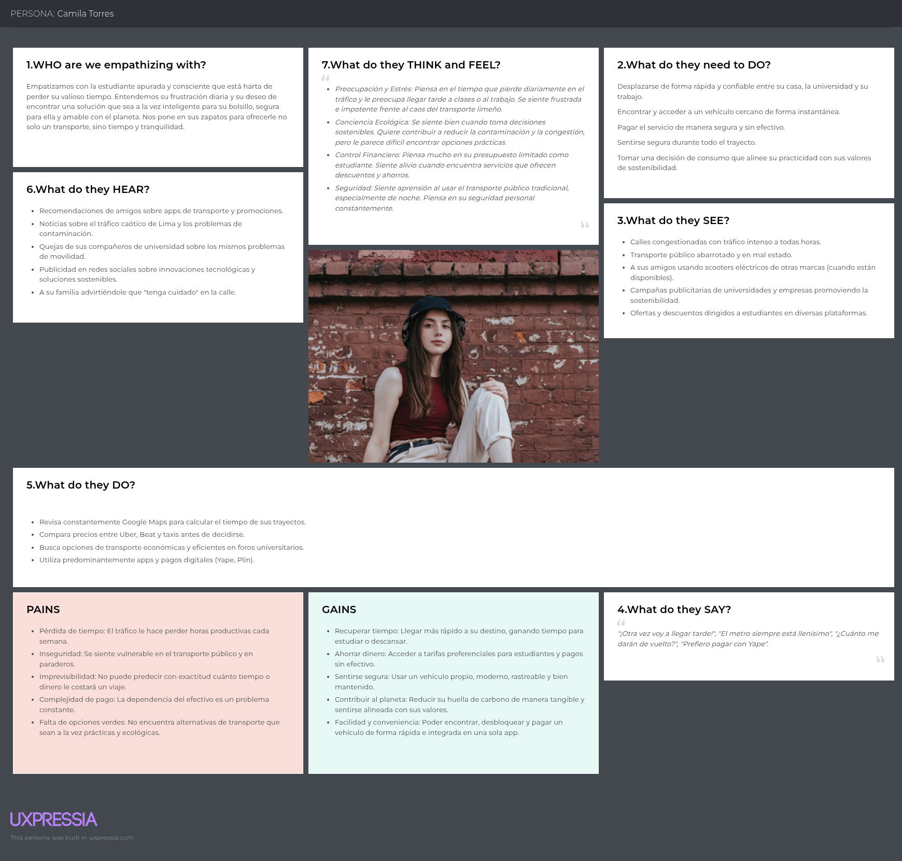  

  - Luis Salazar:  

    

## 2.4. Big Picture Event Storming.
El **Event Storming** modela de forma secuencial el ciclo completo de uso de la plataforma de micromovilidad eléctrica. Se identifican las interacciones entre usuarios, administradores, sistemas externos ***(IoT, GPS, pasarela de pagos)*** y el sistema de negocio.
  Se muestra cómo la plataforma conecta en un mismo flujo las necesidades de movilidad del usuario, los procesos de pago y seguridad, asegurando un ecosistema completo de micromovilidad urbana.

  

## 2.5. Ubiquitous Language.
| Término                 | Tipo               | Definición                                                                 |
  |--------------------------|--------------------|-----------------------------------------------------------------------------|
  | Usuario                 | Actor              | Persona registrada que utiliza la app para alquilar scooters.              |
  | Administrador           | Actor              | Responsable de gestionar flota, usuarios y soporte desde el sistema.       |
  | Scooter                 | Entidad            | Vehículo eléctrico disponible para alquiler dentro de la plataforma.       |
  | Estación Virtual        | Entidad            | Punto geográfico donde los scooters pueden ser recogidos o dejados.        |
  | Reserva                 | Evento/Entidad     | Acción de apartar un scooter disponible antes de iniciar el alquiler.      |
  | Alquiler                | Evento/Entidad     | Proceso activo en el que el usuario usa un scooter y se mide en tiempo/distancia. |
  | Pago                    | Evento             | Transacción realizada por el usuario para completar un alquiler.           |
  | Tarifa                  | Entidad            | Costo asociado al alquiler, calculado según tiempo y distancia.            |
  | Desbloqueo              | Comando/Evento     | Acción de habilitar el scooter tras confirmar la reserva y el pago inicial. |
  | Devolución              | Evento             | Acción de finalizar el uso y dejar el scooter en una estación virtual.     |
  | Mantenimiento           | Proceso            | Revisión y reparación de scooters por parte del personal técnico.          |
  | Penalización            | Evento/Entidad     | Cargo adicional aplicado por mal uso, retraso o devolución fuera de zona.  |
  | Historial de Viajes     | Vista              | Registro de reservas, alquileres y pagos asociados a cada usuario.         |
  | Soporte                 | Servicio           | Canal de ayuda en la app para resolver incidencias de los usuarios.        |
  | Flota                   | Entidad/Conjunto   | Conjunto de scooters activos disponibles en la ciudad.                     |
  | Ubicación en Tiempo Real| Información        | Datos GPS que muestran dónde se encuentra cada scooter.                     |
  | Sesión de Usuario       | Entidad            | Periodo en que el usuario está logueado y utilizando la app.               |
# Capítulo III: Requirements Specification

## 3.1.User Stories.

### Lista de Épicas

<table>
  <thead>
    <tr>
      <th>ID</th>
      <th>Título</th>
      <th>Descripción</th>
      <th>Criterios de aceptación</th>
      <th>EpicID</th>
    </tr>
  </thead>
  <tbody>
    <tr>
      <td>EP01</td>
      <td>Acceso a la aplicación</td>
      <td>
        <ul style="margin:0; padding-left:18px;">
          <li>Como usuario de la aplicación, quiero acceder con mi información para hacer uso de las características disponibles.</li>
        </ul>
      </td>
      <td>No corresponde</td>
      <td>No corresponde</td>
    </tr>
    <tr>
      <td>EP02</td>
      <td>Funcionalidades de la app</td>
      <td>
        <ul style="margin:0; padding-left:18px;">
          <li>Como usuario de la aplicación, quiero que las funcionalidades principales que me ofrece el servicio sean funcionales.</li>
        </ul>
      </td>
      <td>No corresponde</td>
      <td>No corresponde</td>
    </tr>
    <tr>
      <td>EP03</td>
      <td>Gestión de pagos y suscripciones</td>
      <td>
        <ul style="margin:0; padding-left:18px;">
          <li>Como usuario, quiero gestionar mis métodos de pago y suscripciones para acceder a los servicios y planes de la aplicación.</li>
        </ul>
      </td>
      <td>No corresponde</td>
      <td>No corresponde</td>
    </tr>
    <tr>
      <td>EP04</td>
      <td>Uso del mapa</td>
      <td>
        <ul style="margin:0; padding-left:18px;">
          <li>Como usuario de la aplicación, quiero acceder al mapa de la aplicación para realizar la reserva de vehículos y seguimiento de rutas.</li>
        </ul>
      </td>
      <td>No corresponde</td>
      <td>No corresponde</td>
    </tr>
    <tr>
      <td>EP05</td>
      <td>Gestión de viajes</td>
      <td>
        <ul style="margin:0; padding-left:18px;">
          <li>Como usuario, quiero visualizar y gestionar mis trayectos en el mapa, incluyendo detalles del vehículo, ruta y estado del viaje.</li>
        </ul>
      </td>
      <td>No corresponde</td>
      <td>No corresponde</td>
    </tr>
    <tr>
      <td>EP06</td>
      <td>Gestión de reservas</td>
      <td>
        <ul style="margin:0; padding-left:18px;">
          <li>Como usuario, quiero reservar vehículos y recibir notificaciones sobre el estado y fin de mi reserva para asegurar disponibilidad.</li>
        </ul>
      </td>
      <td>No corresponde</td>
      <td>No corresponde</td>
    </tr>
    <tr>
      <td>EP07</td>
      <td>Desbloqueo y acceso rápido a vehículos</td>
      <td>
        <ul style="margin:0; padding-left:18px;">
          <li>Como usuario, quiero desbloquear y acceder a los vehículos de forma ágil mediante tecnologías como QR para mejorar la experiencia de inicio de viaje.</li>
        </ul>
      </td>
      <td>No corresponde</td>
      <td>No corresponde</td>
    </tr>
  </tbody>
</table>


### Lista de Historias de Usuario

<table>
  <tbody>
    <tr>
      <th>ID (HU)</th>
      <th>Título</th>
      <th>Descripción</th>
      <th>Criterios de aceptación</th>
      <th>Epic-ID</th>
    </tr>
    <!-- US-01 -->
    <tr>
      <td>US-01</td>
      <td>Inicio de sesión y registro</td>
      <td>
        <ul style="margin:0; padding-left:18px;">
          <li>Como usuario quiero poder iniciar sesión o registrarme en la app para usarla diariamente.</li>
        </ul>
      </td>
      <td>
        <ul style="margin:0; padding-left:18px;">
          <li><b>Escenario 1:</b> Inicio de sesión exitoso<br><b>Given</b> que el usuario tiene una cuenta registrada<br><b>When</b> ingresa sus credenciales correctas<br><b>Then</b> el sistema permite el acceso a la app.</li>
          <li><b>Escenario 2:</b> Registro exitoso<br><b>Given</b> que el usuario no tiene una cuenta<br><b>When</b> completa el formulario de registro con sus datos válidos<br><b>Then</b> el sistema crea la cuenta y permite el acceso.</li>
          <li><b>Escenario 3:</b> Fallo de autenticación<br><b>Given</b> que el usuario ingresa credenciales incorrectas<br><b>When</b> intenta iniciar sesión<br><b>Then</b> el sistema muestra un mensaje de error.</li>
        </ul>
      </td>
      <td>EP-01</td>
    </tr>
    <!-- US-02 -->
    <tr>
      <td>US-02</td>
      <td>Introducir Número de Celular</td>
      <td>
        <ul style="margin:0; padding-left:18px;">
          <li>Como usuario, quiero introducir mi número de celular para validar mi identidad y recibir notificaciones importantes.</li>
        </ul>
      </td>
      <td>
        <ul style="margin:0; padding-left:18px;">
          <li><b>Escenario 1:</b> Introducción exitosa<br><b>Given</b> que el usuario accede al formulario de perfil<br><b>When</b> ingresa un número de celular válido y lo guarda<br><b>Then</b> el sistema valida el número y lo asocia al perfil del usuario.</li>
          <li><b>Escenario 2:</b> Número inválido<br><b>Given</b> que el usuario intenta guardar su número<br><b>When</b> el número ingresado no cumple con el formato requerido<br><b>Then</b> el sistema muestra un mensaje de error y solicita corregir el dato.</li>
          <li><b>Escenario 3:</b> Error de conexión<br><b>Given</b> que el usuario ingresa su número<br><b>When</b> hay problemas de conexión al guardar el dato<br><b>Then</b> el sistema informa el error y permite reintentar la acción.</li>
        </ul>
      </td>
      <td>EP-01</td>
    </tr>
    <!-- US-03 -->
    <tr>
      <td>US-03</td>
      <td>Introducir código de verificación</td>
      <td>
        <ul style="margin:0; padding-left:18px;">
          <li>Como usuario, quiero introducir un código de verificación para validar mi identidad en la aplicación.</li>
        </ul>
      </td>
      <td>
        <ul style="margin:0; padding-left:18px;">
          <li><b>Escenario 1:</b> Verificación exitosa<br><b>Given</b> que el usuario ha recibido un código de verificación en su celular<br><b>When</b> ingresa el código correctamente en el formulario de la app<br><b>Then</b> el sistema valida el código y confirma la verificación de identidad.</li>
          <li><b>Escenario 2:</b> Código incorrecto<br><b>Given</b> que el usuario intenta verificar su identidad<br><b>When</b> ingresa un código inválido o expirado<br><b>Then</b> el sistema muestra un mensaje de error y permite reintentar la verificación.</li>
          <li><b>Escenario 3:</b> Error de conexión<br><b>Given</b> que el usuario ingresa el código de verificación<br><b>When</b> ocurre un problema de conexión al validar el código<br><b>Then</b> el sistema informa el error y permite al usuario reintentar la acción cuando se restablezca la conexión.</li>
        </ul>
      </td>
      <td>EP-01</td>
    </tr>
    <!-- US-04 -->
    <tr>
      <td>US-04</td>
      <td>Datos de usuario</td>
      <td>
        <ul style="margin:0; padding-left:18px;">
          <li>Como usuario quiero poder crear un perfil para colocar mis datos.</li>
        </ul>
      </td>
      <td>
        <ul style="margin:0; padding-left:18px;">
          <li><b>Escenario 1:</b> Creación exitosa<br><b>Given</b> que el usuario accede a su cuenta<br><b>When</b> ingresa sus datos (nombre, correo, foto, etc.) y los guarda<br><b>Then</b> el sistema actualiza el perfil con éxito.</li>
          <li><b>Escenario 2:</b> Error en la creación<br><b>Given</b> que el usuario intenta guardar sus datos<br><b>When</b> alguno es inválido o falta completar un campo obligatorio<br><b>Then</b> el sistema muestra un mensaje indicando el error.</li>
        </ul>
      </td>
      <td>EP-01</td>
    </tr>
    <!-- US-05 -->
    <tr>
      <td>US-05</td>
      <td>Página Principal</td>
      <td>
        <ul style="margin:0; padding-left:18px;">
          <li>Como usuario quiero poder ver una pantalla principal estética que me atraiga a usar el servicio.</li>
        </ul>
      </td>
      <td>
        <ul style="margin:0; padding-left:18px;">
          <li><b>Escenario 1:</b> Visualización exitosa<br><b>Given</b> que el usuario ha iniciado sesión en la aplicación<br><b>When</b> accede a la pantalla principal<br><b>Then</b> el sistema muestra una interfaz atractiva, con acceso rápido a las funciones principales y elementos visuales bien organizados.</li>
          <li><b>Escenario 2:</b> Elementos no cargados<br><b>Given</b> que el usuario accede a la pantalla principal<br><b>When</b> algunos elementos visuales o funcionalidades no se cargan correctamente por problemas de conexión o error interno<br><b>Then</b> el sistema muestra un mensaje de error y permite reintentar la carga.</li>
          <li><b>Escenario 3:</b> Personalización<br><b>Given</b> que el usuario accede a la pantalla principal<br><b>When</b> personaliza la vista (por ejemplo, elige tema claro/oscuro o reordena accesos rápidos)<br><b>Then</b> el sistema guarda las preferencias y actualiza la interfaz según la selección del usuario.</li>
        </ul>
      </td>
      <td>EP-02</td>
    </tr>
    <!-- US-06 -->
    <tr>
      <td>US-06</td>
      <td>Gestión y personalización de perfil</td>
      <td>
        <ul style="margin:0; padding-left:18px;">
          <li>Como usuario quiero acceder a mi perfil para administrar mi cuenta.</li>
        </ul>
      </td>
      <td>
        <ul style="margin:0; padding-left:18px;">
          <li><b>Escenario 1:</b> Acceso exitoso al perfil<br><b>Given</b> que el usuario ha iniciado sesión en la aplicación<br><b>When</b> accede a la sección "Tu" desde el menú lateral<br><b>Then</b> el sistema muestra las opciones de administrar cuenta, personalizar perfil, cartera, historial, centro de seguridad, ayuda y ajustes.</li>
          <li><b>Escenario 2:</b> Personalización de perfil<br><b>Given</b> que el usuario accede a la opción de personalizar perfil<br><b>When</b> modifica su información personal (nombre, foto, etc.)<br><b>Then</b> el sistema guarda los cambios y actualiza la información mostrada.</li>
          <li><b>Escenario 3:</b> Acceso a funcionalidades adicionales<br><b>Given</b> que el usuario accede a las opciones de cartera, historial, centro de seguridad, ayuda o ajustes<br><b>When</b> selecciona alguna de estas opciones<br><b>Then</b> el sistema muestra la información o funcionalidad correspondiente (por ejemplo, ver historial de trayectos, administrar métodos de pago, acceder a soporte, modificar ajustes de la cuenta, etc.).</li>
        </ul>
      </td>
      <td>EP-02</td>
    </tr>
    <!-- US-07 -->
    <tr>
      <td>US-07</td>
      <td>Gestión y visualización de vehículos en Garaje</td>
      <td>
        <ul style="margin:0; padding-left:18px;">
          <li>Como usuario quiero acceder al Garaje para gestionar los vehículos disponibles.</li>
        </ul>
      </td>
      <td>
        <ul style="margin:0; padding-left:18px;">
          <li><b>Escenario 1:</b> Visualización exitosa de vehículos<br><b>Given</b> que el usuario accede a la sección Garaje desde el menú lateral<br><b>When</b> se muestran los vehículos disponibles con imagen, nombre, disponibilidad, marca y valoración<br><b>Then</b> el sistema permite ver todos los vehículos y sus detalles.</li>
          <li><b>Escenario 2:</b> Filtrado de vehículos<br><b>Given</b> que el usuario está en la sección Garaje<br><b>When</b> utiliza los filtros para mostrar solo e-scooters, motos o bicicletas<br><b>Then</b> el sistema actualiza la lista mostrando únicamente los vehículos del tipo seleccionado.</li>
          <li><b>Escenario 3:</b> Gestión de favoritos<br><b>Given</b> que el usuario visualiza los vehículos en el Garaje<br><b>When</b> marca un vehículo como favorito usando el ícono de corazón<br><b>Then</b> el sistema guarda la preferencia y permite acceder rápidamente a los vehículos favoritos.</li>
        </ul>
      </td>
      <td>EP-02</td>
    </tr>
    <!-- US-08 -->
    <tr>
      <td>US-08</td>
      <td>Filtrado de vehículos en Garaje</td>
      <td>
        <ul style="margin:0; padding-left:18px;">
          <li>Como usuario quiero filtrar los vehículos disponibles en el Garaje por tipo.</li>
        </ul>
      </td>
      <td>
        <ul style="margin:0; padding-left:18px;">
          <li><b>Escenario 1:</b> Filtrado exitoso<br><b>Given</b> que el usuario accede a la sección Garaje<br><b>When</b> utiliza el menú de filtros para seleccionar tipo de vehículo, precio, disponibilidad, calificación o marca<br><b>Then</b> el sistema muestra únicamente los vehículos que cumplen con los criterios seleccionados.</li>
          <li><b>Escenario 2:</b> Sin resultados<br><b>Given</b> que el usuario aplica filtros en el Garaje<br><b>When</b> no existen vehículos que cumplan con los criterios seleccionados<br><b>Then</b> el sistema muestra un mensaje indicando que no hay vehículos disponibles según el filtro.</li>
          <li><b>Escenario 3:</b> Error de conexión<br><b>Given</b> que el usuario intenta filtrar vehículos<br><b>When</b> ocurre un problema de conexión<br><b>Then</b> el sistema muestra un mensaje de error y permite reintentar la acción.</li>
        </ul>
      </td>
      <td>EP-02</td>
    </tr>
    <!-- US-09 -->
    <tr>
      <td>US-09</td>
      <td>Selección y pago de planes</td>
      <td>
        <ul style="margin:0; padding-left:18px;">
          <li>Como usuario quiero visualizar los diferentes planes disponibles.</li>
        </ul>
      </td>
      <td>
        <ul style="margin:0; padding-left:18px;">
          <li><b>Escenario 1:</b> Visualización de planes<br><b>Given</b> que el usuario accede a la sección "Planes" desde el menú lateral<br><b>When</b> se muestran los diferentes tipos de planes con sus nombres y detalles<br><b>Then</b> el sistema permite al usuario comparar y seleccionar el plan deseado.</li>
          <li><b>Escenario 2:</b> Pago exitoso de plan<br><b>Given</b> que el usuario ha seleccionado un plan<br><b>When</b> presiona el botón "Pagar" y realiza el proceso de pago<br><b>Then</b> el sistema activa el plan y lo asocia a la cuenta del usuario.</li>
          <li><b>Escenario 3:</b> Error en el pago<br><b>Given</b> que el usuario intenta pagar un plan<br><b>When</b> ocurre un problema con el método de pago o la conexión<br><b>Then</b> el sistema muestra un mensaje de error y permite reintentar la acción.</li>
        </ul>
      </td>
      <td>EP-03</td>
    </tr>
    <!-- US-10 -->
    <tr>
      <td>US-10</td>
      <td>Proceso de pago de planes</td>
      <td>
        <ul style="margin:0; padding-left:18px;">
          <li>Como usuario quiero ingresar los datos de mi tarjeta para activar el plan seleccionado.</li>
        </ul>
      </td>
      <td>
        <ul style="margin:0; padding-left:18px;">
          <li><b>Escenario 1:</b> Ingreso exitoso de datos de pago<br><b>Given</b> que el usuario ha seleccionado un plan<br><b>When</b> ingresa el número de tarjeta, fecha de vencimiento, CVV y dirección de facturación<br><b>Then</b> el sistema valida los datos y permite avanzar al resumen de pago.</li>
          <li><b>Escenario 2:</b> Confirmación y finalización de pago<br><b>Given</b> que el usuario ha ingresado correctamente todos los datos<br><b>When</b> presiona el botón "Finalizar Pago"<br><b>Then</b> el sistema procesa el pago, muestra el total y activa el plan en la cuenta del usuario.</li>
          <li><b>Escenario 3:</b> Error en el proceso de pago<br><b>Given</b> que el usuario intenta finalizar el pago<br><b>When</b> hay un error en los datos ingresados o problemas de conexión<br><b>Then</b> el sistema muestra un mensaje de error y permite corregir los datos o reintentar la acción.</li>
        </ul>
      </td>
      <td>EP-03</td>
    </tr>
    <!-- US-11 -->
    <tr>
      <td>US-11</td>
      <td>Seleccionar ubicación para ver vehículos cercanos disponibles</td>
      <td>
        <ul style="margin:0; padding-left:18px;">
          <li>Como usuario, al seleccionar una ubicación del mapa quiero ver los vehículos cercanos disponibles.</li>
        </ul>
      </td>
      <td>
        <ul style="margin:0; padding-left:18px;">
          <li><b>Escenario 1:</b> Visualización exitosa<br><b>Given</b> que el usuario accede al mapa de la aplicación<br><b>When</b> selecciona una ubicación específica en el mapa<br><b>Then</b> el sistema muestra en tiempo real los vehículos disponibles cerca de esa ubicación.</li>
          <li><b>Escenario 2:</b> Ubicación sin vehículos<br><b>Given</b> que el usuario selecciona una ubicación en el mapa<br><b>When</b> no hay vehículos disponibles cerca de esa ubicación<br><b>Then</b> el sistema informa que no hay vehículos disponibles y sugiere ubicaciones alternativas.</li>
          <li><b>Escenario 3:</b> Error de conexión<br><b>Given</b> que el usuario selecciona una ubicación en el mapa<br><b>When</b> ocurre un problema de conexión al cargar los vehículos<br><b>Then</b> el sistema muestra un mensaje de error y permite reintentar la acción.</li>
        </ul>
      </td>
      <td>EP-04</td>
    </tr>
    <!-- US-12 -->
    <tr>
      <td>US-12</td>
      <td>Visualización de viaje en mapa</td>
      <td>
        <ul style="margin:0; padding-left:18px;">
          <li>Como usuario quiero ver mi trayecto actual en el mapa, junto con información relevante del vehículo.</li>
        </ul>
      </td>
      <td>
        <ul style="margin:0; padding-left:18px;">
          <li><b>Escenario 1:</b> Visualización exitosa del viaje<br><b>Given</b> que el usuario accede a la sección "Viaje" desde el menú lateral<br><b>When</b> se muestra el mapa con la ruta actual, puntos de inicio y destino, y detalles del vehículo<br><b>Then</b> el sistema presenta la información de ubicación, batería, tiempo restante y estado del viaje en tiempo real.</li>
          <li><b>Escenario 2:</b> Actualización de información<br><b>Given</b> que el usuario está visualizando el viaje<br><b>When</b> cambia la ruta, el vehículo o el estado del trayecto<br><b>Then</b> el sistema actualiza la información mostrada en el mapa y en el panel de detalles.</li>
          <li><b>Escenario 3:</b> Error de conexión<br><b>Given</b> que el usuario intenta visualizar o actualizar el viaje<br><b>When</b> ocurre un problema de conexión<br><b>Then</b> el sistema muestra un mensaje de error y permite reintentar la acción.</li>
        </ul>
      </td>
      <td>EP-05</td>
    </tr>
    <!-- US-13 -->
    <tr>
      <td>US-13</td>
      <td>Historial de viajes</td>
      <td>
        <ul style="margin:0; padding-left:18px;">
          <li>Como usuario, quiero ver el historial de mis viajes para trackear gastos y rutas.</li>
        </ul>
      </td>
      <td>
        <ul style="margin:0; padding-left:18px;">
          <li><b>Escenario 1:</b> Visualización exitosa<br>Given que el usuario inicia sesión<br>When accede a la sección "Mis Viajes"<br>Then el sistema muestra una lista con fecha, costo y distancia de cada viaje.</li>
          <li><b>Escenario 2:</b> Error de carga<br>Given que el usuario accede al historial<br>When no hay conexión a internet<br>Then el sistema muestra un mensaje de error y opción para reintentar.</li>
        </ul>
      </td>
      <td>EP-05</td>
    </tr>
    <!-- US-14 -->
    <tr>
      <td>US-14</td>
      <td>Calificación de viaje</td>
      <td>
        <ul style="margin:0; padding-left:18px;">
          <li>Como usuario, quiero calificar mi experiencia después del viaje para feedback y mejora del servicio.</li>
        </ul>
      </td>
      <td>
        <ul style="margin:0; padding-left:18px;">
          <li><b>Escenario 1:</b> Calificación exitosa<br>Given que el usuario finaliza un viaje<br>When selecciona una puntuación (1-5 estrellas) y envía<br>Then el sistema guarda la calificación y muestra agradecimiento.</li>
          <li><b>Escenario 2:</b> Calificación fallida<br>Given que el usuario intenta calificar<br>When no hay conexión a internet<br>Then el sistema guarda la calificación localmente y la envía después.</li>
        </ul>
      </td>
      <td>EP-05</td>
    </tr>
    <!-- US-15 -->
    <tr>
      <td>US-15</td>
      <td>Reportar problema con vehículo</td>
      <td>
        <ul style="margin:0; padding-left:18px;">
          <li>Como usuario, quiero reportar un problema con el vehículo para alertar a soporte y obtener ayuda rápida.</li>
        </ul>
      </td>
      <td>
        <ul style="margin:0; padding-left:18px;">
          <li><b>Escenario 1:</b> Reporte exitoso<br>Given que el usuario está usando el vehículo<br>When selecciona "Reportar problema" y elige una categoría (ej.: falla mecánica)<br>Then el sistema envía el reporte a soporte y muestra confirmación.</li>
          <li><b>Escenario 2:</b> Reporte fallido<br>Given que el usuario intenta reportar un problema<br>When no hay conexión a internet<br>Then el sistema guarda el reporte localmente y lo envía al recuperar la conexión.</li>
        </ul>
      </td>
      <td>EP-05</td>
    </tr>
    <!-- US-16 -->
    <tr>
      <td>US-16</td>
      <td>Notificación de fin de reserva</td>
      <td>
        <ul style="margin:0; padding-left:18px;">
          <li>Como usuario, quiero recibir una notificación antes de que finalice mi reserva.</li>
        </ul>
      </td>
      <td>
        <ul style="margin:0; padding-left:18px;">
          <li><b>Escenario 1:</b> Notificación exitosa<br>Given que el usuario tiene una reserva activa<br>When faltan 5 minutos para el fin de la reserva<br>Then el sistema envía una notificación push con opción para extender el tiempo.</li>
          <li><b>Escenario 2:</b> Notificación fallida<br>Given que la reserva está por finalizar<br>When no hay conexión a internet<br>Then el sistema registra el intento y reintenta enviar la notificación al recuperar la conexión.</li>
        </ul>
      </td>
      <td>EP-06</td>
    </tr>
    <!-- US-17 -->
    <tr>
      <td>US-17</td>
      <td>Crear una reserva</td>
      <td>
        <ul style="margin:0; padding-left:18px;">
          <li>Como usuario, quiero reservar un vehículo desde la app.</li>
        </ul>
      </td>
      <td>
        <ul style="margin:0; padding-left:18px;">
          <li><b>Escenario 1:</b> Reserva exitosa<br><b>Given</b> que el usuario visualiza los vehículos disponibles<br><b>When</b> selecciona un vehículo y confirma la reserva<br><b>Then</b> el sistema bloquea el vehículo y muestra un temporizador de la reserva.</li>
          <li><b>Escenario 2:</b> Vehículo no disponible<br><b>Given</b> que el usuario intenta reservar un vehículo<br><b>When</b> otro usuario ya lo reservó antes<br><b>Then</b> el sistema muestra un mensaje de error indicando que debe seleccionar otro vehículo.</li>
          <li><b>Escenario 3:</b> Error de conexión<br><b>Given</b> que el usuario confirma una reserva<br><b>When</b> no hay conexión a internet<br><b>Then</b> el sistema informa que no se pudo completar la acción y permite reintentar cuando se restablezca la conexión.</li>
        </ul>
      </td>
      <td>EP-06</td>
    </tr>
    <!-- US-18 -->
    <tr>
      <td>US-18</td>
      <td>Notificación de inicio y vencimiento</td>
      <td>
        <ul style="margin:0; padding-left:18px;">
          <li>Como usuario, quiero recibir notificaciones cuando mi reserva esté activa y cuando esté por expirar.</li>
        </ul>
      </td>
      <td>
        <ul style="margin:0; padding-left:18px;">
          <li><b>Escenario 1:</b> Notificación de inicio<br><b>Given</b> que el usuario tiene una reserva activa<br><b>When</b> la reserva comienza<br><b>Then</b> el sistema envía una notificación push confirmando el inicio.</li>
          <li><b>Escenario 2:</b> Notificación de vencimiento<br><b>Given</b> que el usuario tiene una reserva próxima a expirar<br><b>When</b> faltan pocos minutos para que finalice<br><b>Then</b> el sistema envía una notificación recordatoria.</li>
          <li><b>Escenario 3:</b> Expiración de reserva<br><b>Given</b> que el usuario no inicia el viaje<br><b>When</b> la reserva llega a su fin<br><b>Then</b> el sistema libera automáticamente el vehículo y notifica al usuario.</li>
        </ul>
      </td>
      <td>EP-06</td>
    </tr>
    <!-- US-19 -->
    <tr>
      <td>US-19</td>
      <td>Desbloqueo de vehículo con QR</td>
      <td>
        <ul style="margin:0; padding-left:18px;">
          <li>Como usuario, quiero desbloquear el vehículo escaneando un QR.</li>
        </ul>
      </td>
      <td>
        <ul style="margin:0; padding-left:18px;">
          <li><b>Escenario 1:</b> Desbloqueo exitoso<br>Given que el usuario reserva un vehículo<br>When escanea el QR del vehículo<br>Then el sistema desbloquea el vehículo y inicia el viaje.</li>
          <li><b>Escenario 2:</b> Desbloqueo fallido<br>Given que el usuario escanea el QR<br>When el QR no es válido o el vehículo ya está en uso<br>Then el sistema muestra un mensaje de error.</li>
        </ul>
      </td>
      <td>EP-07</td>
    </tr>
    <!-- US-20 -->
    <tr>
      <td>US-20</td>
      <td>Desbloqueo de vehículo desde la app</td>
      <td>
        <ul style="margin:0; padding-left:18px;">
          <li>Como usuario, quiero desbloquear el vehículo directamente desde la aplicación.</li>
        </ul>
      </td>
      <td>
        <ul style="margin:0; padding-left:18px;">
          <li><b>Escenario 1:</b> Desbloqueo exitoso<br><b>Given</b> que el usuario tiene una reserva activa<br><b>When</b> presiona el botón "Desbloquear" en la app<br><b>Then</b> el sistema desbloquea el vehículo y muestra la información del viaje.</li>
          <li><b>Escenario 2:</b> Desbloqueo fallido<br><b>Given</b> que el usuario intenta desbloquear desde la app<br><b>When</b> hay problemas de conexión o el vehículo está ocupado<br><b>Then</b> el sistema muestra un mensaje de error y permite reintentar.</li>
        </ul>
      </td>
      <td>EP-07</td>
    </tr>
    <!-- US-21 -->
    <tr>
      <td>US-21</td>
      <td>Ver estado de desbloqueo</td>
      <td>
        <ul style="margin:0; padding-left:18px;">
          <li>Como usuario, quiero ver el estado de desbloqueo del vehículo en tiempo real.</li>
        </ul>
      </td>
      <td>
        <ul style="margin:0; padding-left:18px;">
          <li><b>Escenario 1:</b> Visualización exitosa<br><b>Given</b> que el usuario ha solicitado el desbloqueo<br><b>When</b> el sistema procesa la solicitud<br><b>Then</b> el sistema muestra el estado actualizado (desbloqueado, en proceso, error) en la app.</li>
          <li><b>Escenario 2:</b> Error de actualización<br><b>Given</b> que el usuario espera la confirmación de desbloqueo<br><b>When</b> hay problemas de conexión<br><b>Then</b> el sistema muestra un mensaje de error y permite reintentar la consulta.</li>
        </ul>
      </td>
      <td>EP-07</td>
    </tr>
    <!-- US-22 -->
    <tr>
      <td>US-22</td>
      <td>Desbloqueo programado</td>
      <td>
        <ul style="margin:0; padding-left:18px;">
          <li>Como usuario, quiero programar el desbloqueo de un vehículo para una hora específica y asegurar su disponibilidad.</li>
        </ul>
      </td>
      <td>
        <ul style="margin:0; padding-left:18px;">
          <li><b>Escenario 1:</b> Programación exitosa<br><b>Given</b> que el usuario selecciona un vehículo y una hora futura<br><b>When</b> confirma la programación de desbloqueo<br><b>Then</b> el sistema reserva el vehículo y lo desbloquea automáticamente en la hora indicada.</li>
          <li><b>Escenario 2:</b> Programación fallida<br><b>Given</b> que el usuario intenta programar el desbloqueo<br><b>When</b> el vehículo no está disponible en la hora seleccionada<br><b>Then</b> el sistema muestra un mensaje de error y sugiere otras opciones.</li>
        </ul>
      </td>
      <td>EP07</td>
    </tr>
  </tbody>
</table>

## 3.2. Impact Mapping.

Un mapa de impacto es una técnica colaborativa y visual de planificación estratégica que alinea los objetivos de un proyecto con las acciones necesarias para alcanzarlos. En esta sección , el equipo presenta los mapas de impacto realizados.


.png)


## 3.3. Product Backlog

| N° Orden | User Story ID | Título                                   | Descripción                                                                                                    | Story points |
|----------|---------------|------------------------------------------|----------------------------------------------------------------------------------------------------------------|--------------|
| 1        | US-01         | Inicio de sesión y registro              | Como usuario quiero poder iniciar sesión o registrarme en la app para usarla diariamente.                      | 5            |
| 2        | US-02         | Introducir Número de Celular             | Como usuario, quiero introducir mi número de celular para validar mi identidad y recibir notificaciones importantes. | 2            |
| 3        | US-03         | Introducir código de verificación        | Como usuario, quiero introducir un código de verificación para validar mi identidad en la aplicación.          | 2            |
| 4        | US-04         | Datos de usuario                         | Como usuario quiero poder crear un perfil para colocar mis datos.                                              | 3            |
| 5        | US-05         | Página Principal                         | Como usuario quiero poder ver una pantalla principal estética que me atraiga a usar el servicio.               | 3            |
| 6        | US-06         | Gestión y personalización de perfil      | Como usuario quiero acceder a mi perfil para administrar mi cuenta.                                            | 5            |
| 7        | US-07         | Gestión y visualización de vehículos en Garaje | Como usuario quiero acceder al Garaje para gestionar los vehículos disponibles.                          | 5            |
| 8        | US-08         | Filtrado de vehículos en Garaje          | Como usuario quiero filtrar los vehículos disponibles en el Garaje por tipo.                                   | 3            |
| 9        | US-09         | Selección y pago de planes               | Como usuario quiero visualizar los diferentes planes disponibles.                                              | 5            |
| 10       | US-10         | Proceso de pago de planes                | Como usuario quiero ingresar los datos de mi tarjeta para activar el plan seleccionado.                        | 5            |
| 11       | US-11         | Seleccionar ubicación para ver vehículos cercanos disponibles | Como usuario, al seleccionar una ubicación del mapa quiero ver los vehículos cercanos disponibles. | 5            |
| 12       | US-12         | Visualización de viaje en mapa           | Como usuario quiero ver mi trayecto actual en el mapa, junto con información relevante del vehículo.           | 5            |
| 13       | US-13         | Historial de viajes                      | Como usuario, quiero ver el historial de mis viajes para trackear gastos y rutas.                              | 3            |
| 14       | US-14         | Calificación de viaje                    | Como usuario, quiero calificar mi experiencia después del viaje para feedback y mejora del servicio.           | 2            |
| 15       | US-15         | Reportar problema con vehículo           | Como usuario, quiero reportar un problema con el vehículo para alertar a soporte y obtener ayuda rápida.       | 3            |
| 16       | US-16         | Notificación de fin de reserva           | Como usuario, quiero recibir una notificación antes de que finalice mi reserva.                                | 3            |
| 17       | US-17         | Crear una reserva                        | Como usuario, quiero reservar un vehículo desde la app.                                                        | 5            |
| 18       | US-18         | Notificación de inicio y vencimiento     | Como usuario, quiero recibir notificaciones cuando mi reserva esté activa y cuando esté por expirar.           | 3            |
| 19       | US-19         | Desbloqueo de vehículo con QR            | Como usuario, quiero desbloquear el vehículo escaneando un QR.                                                 | 3            |
| 20       | US-20         | Desbloqueo de vehículo desde la app      | Como usuario, quiero desbloquear el vehículo directamente desde la aplicación.                                 | 3            |
| 21       | US-21         | Ver estado de desbloqueo                 | Como usuario, quiero ver el estado de desbloqueo del vehículo en tiempo real.                                  | 2            |
| 22       | US-22         | Desbloqueo programado                    | Como usuario, quiero programar el desbloqueo de un vehículo para una hora específica y asegurar su disponibilidad. | 5            |
# Capítulo IV: Product Design

## 4.1. Style Guidelines

### 4.1.1.General Style Guidelines.

<h3>Branding</h3>

El logo de WR sintetiza de manera elegante y minimalista la propuesta de valor de la marca en el mundo de la micromovilidad eléctrica. El diseño en tipografía negra sobre fondo blanco comunica sobriedad, confianza y profesionalismo, asegurando legibilidad en cualquier soporte digital o físico.

En la parte superior, el scooter eléctrico estilizado simboliza movimiento, innovación y sostenibilidad, elementos centrales de la experiencia que WR ofrece. Su posición por encima de las iniciales representa la prioridad de la movilidad sobre cualquier otra función, transmitiendo dinamismo y acción inmediata.

La composición general mantiene un equilibrio entre modernidad y simplicidad, ideal para una plataforma tecnológica que busca conectar a las personas con alternativas de transporte accesibles, rápidas y ecológicas. La elección de una paleta monocromática resalta la seriedad de la propuesta, mientras que el ícono del scooter añade cercanía y un toque aspiracional.

Con este logo, WR se presenta como una marca confiable, eficiente y enfocada en transformar el desplazamiento urbano, adaptándose a las necesidades de estudiantes, profesionales y empresas.

***Variantes de logo***

***Logo original***


***Logo con iniciales light color***


***Colores invertidos***


<h3>Typography</h3>

La tipografía de nuestra app de micromovilidad eléctrica refleja dinamismo, innovación y accesibilidad, alineándose con los valores de sostenibilidad y movilidad inteligente que representamos. Hemos elegido una fuente sans-serif moderna, limpia y ligera, que transmite agilidad y simplicidad, elementos esenciales de nuestro servicio.

La fuente principal será "Kay Pho Du", que por su diseño esbelto y geométrico comunica tecnología y orden sin perder cercanía. Su alta legibilidad permite que los usuarios puedan consultar información rápida mientras se desplazan.

Para lograr una jerarquía visual clara, los títulos y subtítulos tendrán un tamaño más prominente que el cuerpo del texto. Los títulos (H1, H2) enfatizan energía y movimiento, mientras que los textos secundarios mantienen un tono amigable y sencillo.

El cuerpo del texto usará un tamaño base adaptable, que garantice lectura sin esfuerzo tanto en pantallas pequeñas (smartphones) como en tablets. Se mantendrá un interlineado aireado y márgenes equilibrados para no saturar la interfaz.

El lenguaje será directo y motivador, usando un tono casual que inspire confianza y fomente la adopción de alternativas de transporte sostenible.

<h3>Colors</h3>

La paleta de colores de nuestra app de micromovilidad eléctrica fue diseñada para reforzar el impacto visual del logo y proyectar dinamismo, sostenibilidad y confianza. El blanco se mantiene como base, representando simplicidad, limpieza y espacios abiertos, facilitando que los elementos clave destaquen sin saturar la vista.

El negro profundo del logo se utiliza en tipografía principal y elementos estructurales, comunicando seriedad y profesionalismo. Para transmitir energía y movimiento, incorporamos un verde lima brillante (#18FA3A) como color de acento, ideal para botones de acción (reservar, iniciar viaje) y mensajes de confirmación. Este tono evoca sostenibilidad y vitalidad, conectando con la misión de promover transporte limpio.

Un gris color (#EEEEEE) complementa la paleta y refuerza la percepción tecnológica de la plataforma, utilizado en íconos interactivos y estados activos. Además, tonos gris claro (#EAEAEA) y gris oscuro (#4F4F4F) equilibran la interfaz, mejorando la legibilidad y jerarquizando la información.

En conjunto, esta paleta crea una identidad moderna, ágil y ecológica, que motiva a los usuarios a adoptar la movilidad eléctrica como su primera opción dentro y fuera del campus.

---

#### Paleta de colores - WeRide

| **Color**        | **Uso**                                                                 | **Código Hex** |
|------------------|-------------------------------------------------------------------------|---------------|
| Blanco           | Fondo principal de la interfaz, espacios vacíos, sensación de limpieza y orden. | `#FFFFFF`     |
| Negro profundo   | Logo, textos principales, íconos y elementos estructurales.              | `#000000`     |
| Verde energía    | Botones de acción (reservar, iniciar viaje), confirmaciones y mensajes de éxito. | `#18FA3A`     |
| Gris claro       | Fondos secundarios, separadores, tarjetas de información.                | `#D9D9D9`     |
| Gris medio       | Texto secundario, íconos inactivos, descripciones y estados deshabilitados. | `#A6A6A6`     |

### 4.1.2. Web Style Guidelines.
Las guías de estilo web para WeRide garantizan una experiencia coherente y responsive en todos los dispositivos. La web está diseñada bajo los principios del Mobile-First y Responsive Design, asegurando que la interfaz se adapte fluidamente desde smartphones hasta pantallas de escritorio.
Layout:
Se utiliza un sistema de cuadrícula flexible (Grid System) de 12 columnas para organizar el contenido de manera estructurada y visualmente equilibrada. Los espaciados siguen una escala base de 8px para mantener la consistencia.
Navegación:
El menú de navegación principal es fijo en la parte superior (sticky header), con enlaces claros y accesibles. Se emplea el color verde energía (#18FA3A) para los estados activos y hover, reforzando la identidad de marca.
Componentes principales:
Botones:
Primarios: Fondo verde energía (#18FA3A), texto en negro (#000000).
Secundarios: Borde gris medio (#A6A6A6), texto gris oscuro (#4F4F4F).
Tarjetas:
Fondos gris claro (#D9D9D9) con sombras sutiles para profundidad, bordes redondeados de 8px.
Formularios:
Campos con borde gris medio (#A6A6A6) y focus en verde energía (#18FA3A).
Animaciones:
Transiciones suaves (300ms) en hover y cambios de estado para una experiencia fluida y moderna.

## 4.2. Information Architecture.

### 4.2.1. Organization Systems.

Para la **landing page** de WeRide, se ha optado por una estructura jerárquica para ambos segmentos de usuarios, ya que se cuenta con una barra de navegación superior que dirige a diferentes secciones, cada una encapsulando información relevante y relacionada.

Para el proceso de inicio de sesión o creación de cuenta, se utiliza una organización lineal, permitiendo que el usuario avance paso a paso a medida que completa los datos requeridos hasta finalizar el registro o acceso.

Dentro de la aplicación principal, se mantiene una organización jerárquica para separar y encapsular las distintas funcionalidades, independientemente del tipo de usuario. Esto asegura que, aunque los usuarios tengan diferentes necesidades y accesos, ****la estructura de la aplicación sea coherente y fácil de navegar.****

##### Usuario individual:
Para los **usuarios individuales** de WeRide, la funcionalidad principal es la gestión y uso de vehículos de micromovilidad (scooters, bicicletas y motos eléctricas). Por ello, la organización jerárquica permite agrupar subfuncionalidades como ***la reserva de vehículos, visualización del mapa, filtrado por tipo de vehículo, consulta de historial de viajes y notificaciones***, todas relacionadas con la experiencia de movilidad personal.

#### Empresa o Administrador:
En el caso de **empresas o administradores**, también se emplea una organización jerárquica para gestionar múltiples usuarios, vehículos y reportes. Además, se puede acceder a funcionalidades específicas como ***la supervisión del estado de la flota, generación de informes de uso, administración de usuarios corporativos y gestión de promociones***.


### 4.2.2. Labeling Systems.
Las etiquetas emplean un lenguaje claro y conciso, alineado con el tono casual y motivador de la marca:
**Inicio:** Vista principal con mapa y scooters disponibles.
**Reservar:** Flujo de reserva paso a paso.
**Mis Viajes:** Historial de viajes y reservas activas.
**Perfil:** Gestión de cuenta, método de pago y preferencias.
**Ayuda:** Centro de soporte con preguntas frecuentes y contacto.

---

### 4.2.3. SEO Tags and Meta Tags

**Titulo:**
```html
<title>WeRide</title>
```

**Codificación de carácteres:**
```html
<meta charset="utf-8">
```

**Descripción:**
```html
<meta name="description" content="WeRide is a web application focused on providing sustainable and smart urban mobility through electric scooters, bikes, and motorcycles.">
```

**Autor y Derechos de Autor:**
```html
<meta name="author" content="CultiConection">
<meta name="copyright" content="Copyright WeTech team" />
```

---

### 4.2.4.Searching Systems.

El sistema integral de micromovilidad eléctrica compartida incorporará un **módulo de búsqueda y localización en tiempo real**, que permitirá a los usuarios identificar la ubicación disponible de los vehículos más cercanos (scooters, bicicletas y motos eléctricas). Este sistema se sustenta en las siguientes características:  
Geolocalización en tiempo real:  
 Cada vehículo estará equipado con dispositivos GPS e IoT que transmitirán su ubicación de manera constante hacia la plataforma central.


**Mapa interactivo en la aplicación móvil**:  
 La app mostrará en un mapa la ubicación exacta de los vehículos disponibles, diferenciados por tipo (scooter, bicicleta o moto eléctrica).


**Filtros de búsqueda avanzada**
 Los usuarios podrán buscar vehículos según:


- Tipo de unidad preferida.


- Nivel de batería disponible.


- Distancia a pie desde su ubicación actual.


**Reserva inmediata**:
 Una vez identificado el vehículo, el usuario podrá seleccionarlo en la aplicación, reservarlo y dirigirse a recogerlo.


**Optimización para empresas**:
 En el caso de suscripciones corporativas, los sistemas de búsqueda también permitirán a los empleados visualizar vehículos disponibles en zonas cercanas a sus oficinas o campus, garantizando disponibilidad en horas de mayor demanda.


Con este enfoque, el sistema de búsqueda se convierte en un **componente esencial para la experiencia del usuario**, asegurando eficiencia en la localización y optimizando el uso de la flota.  

### 4.2.5.Navigation Systems.  

El sistema integral de micromovilidad eléctrica compartida contará con un módulo de navegación inteligente que facilitará al usuario el uso de los vehículos y la planificación de sus desplazamientos. Dicho módulo se estructura en las siguientes funciones:  
Guía hacia el vehículo seleccionado:  
 Una vez realizada la reserva, la aplicación mostrará la ruta a pie más rápida desde la ubicación del usuario hasta el vehículo disponible, mediante mapas integrados en tiempo real.  


**Navegación durante el viaje:**   
 El sistema proporcionará indicaciones de ruta para que el usuario se desplace de manera eficiente hacia su destino, evitando zonas de alto tráfico cuando sea posible. Para ello, se integrarán APIs de mapas inteligentes como Google Maps o Mapbox, adaptadas a la movilidad ligera.  


**Seguridad en la navegación:**  


- Alertas en la aplicación respecto a calles restringidas o zonas con tráfico intenso.  


- Recomendación de rutas seguras y sostenibles para bicicletas, scooters y motos eléctricas.  


- Opciones de personalización (ruta más rápida, más segura o más ecológica).  


**Gestión de estaciones y puntos de aparcamiento:**  
 La navegación también incluirá la localización de zonas de parqueo autorizadas, estaciones de carga o puntos estratégicos de la empresa asociados a la suscripción corporativa.  


**Soporte para empresas:**  
 En el caso de planes empresariales, el sistema de navegación permitirá sugerir rutas entre las sedes de trabajo, facilitando la movilidad de los colaboradores.  


En conjunto, este módulo no solo ofrece orientación geográfica en tiempo real, sino que también optimiza la experiencia de uso, mejorando la seguridad del viaje y reduciendo la incertidumbre del usuario en entornos urbanos congestionados.  

## 4.3. Landing Page UI Desing.  
### 4.3.1. Landing Page Wireframe.  
  
- Navbar  
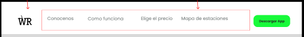
- Hero  

- Disposable Vehicles Section.  

- Application user manual section.  

- Rates Section.  

- Locations section.  

- Who we are section.  

- About section.  

- Application download section.  

- Footer Section.  
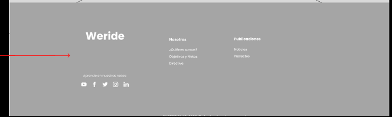
  
### 4.3.2. Landing Page Mock-up. 
   
- Navbar  

- Hero  
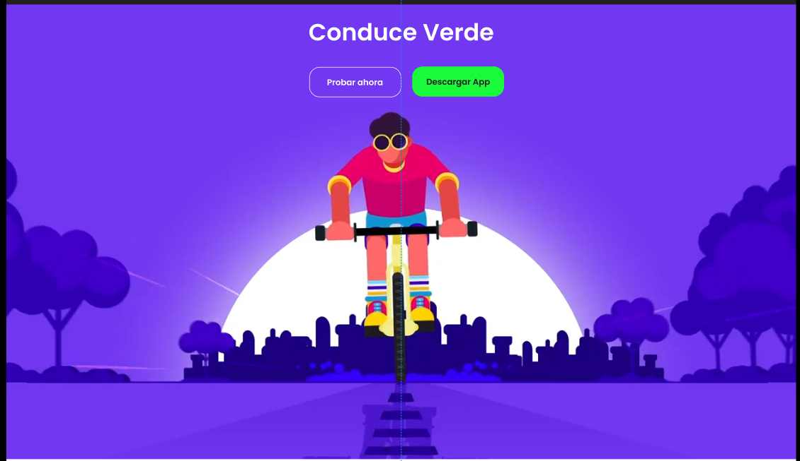
- Disposable Vehicles Section.  

- Application user manual section.  
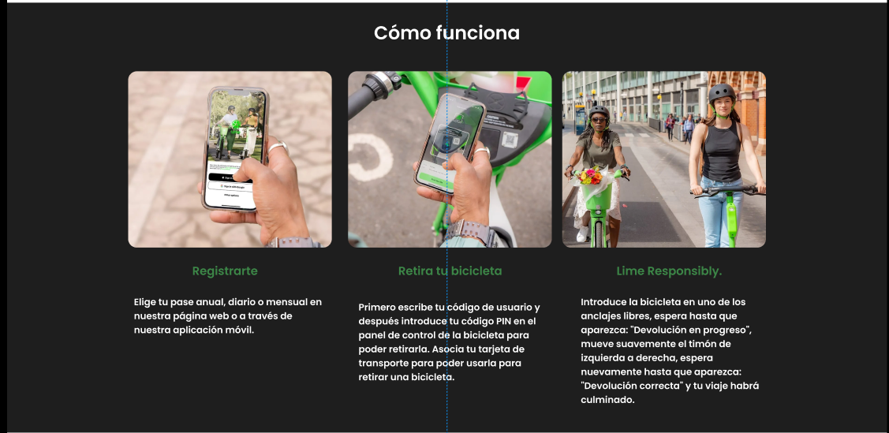
- Rates Section.  

- Locations section.  
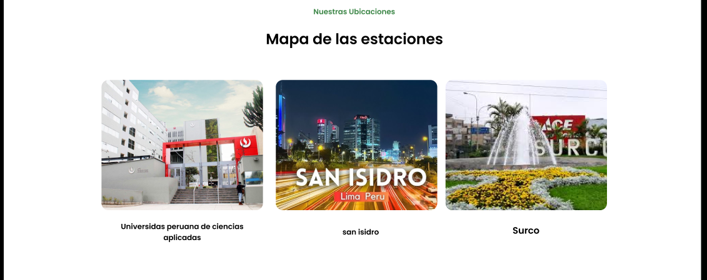
- Who we are section.  

- About section.  

- Application download section.  

- Footer Section.  


## 4.4.Web Applications UX/UI Design.

### 4.4.1.Web Applications Wireframes. 

Wireframes are simplified, low-fidelity visual guides that outline the structure, layout, and key elements of a web application’s interface. They focus on placement of content, navigation, and functionality rather than visual design details like colors or images. Wireframes help designers and developers plan page layouts, organize information, and ensure usability before moving on to higher-fidelity mock-ups or prototypes.

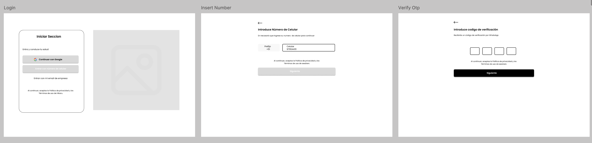

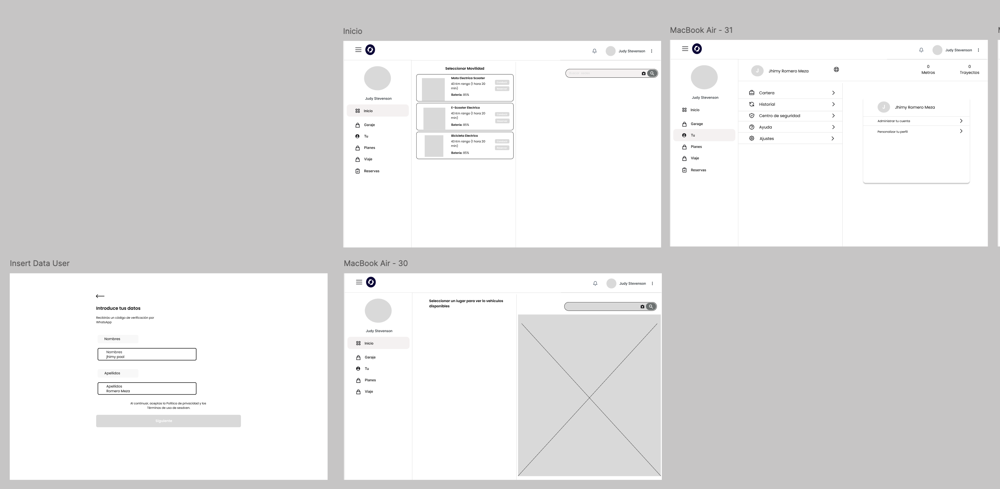


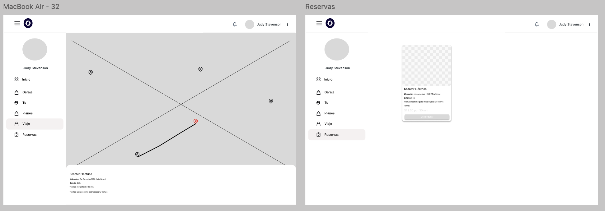

### 4.4.2.Web Applications Wireflow Diagrams.

Wireflow diagrams combine wireframes and user flow concepts to show both the layout of web pages and the paths users take through an application. They illustrate screen designs along with navigation steps, interactions, and decision points, providing a comprehensive view of how users move between pages and perform tasks. Wireflows help designers and developers plan user experience, identify potential issues, and communicate both the interface and workflow in a single visual representation.

#### Elementos clave del diseño
**Arquitectura de la información**
El contenido y las funciones están organizadas para facilitar el acceso a herramientas como el historial de servicios, monitoreo de consumo energético, o gestión de citas.
Los wireframes incluyen pantallas clave como:
Panel de control del propietario.
Dashboard del proveedor técnico.
Formulario para solicitar mantenimientos preventivos.
Historial de dispositivos y consumo energético.
Se ha priorizado una navegación simple y accesible, permitiendo que usuarios con diversas habilidades puedan moverse con facilidad por la plataforma.
Estructura de la interfaz
Los elementos interactivos (botones, menús, tarjetas de información) están ubicados estratégicamente para que el usuario pueda realizar tareas con pocos clics.
Las pantallas permiten acceso directo a secciones importantes como:
Subir o editar dispositivos eléctricos.
Contactar proveedores certificados.
Visualizar métricas de rendimiento o consumo.
Se incluye también una sección de perfil adaptable y configurable, especialmente útil para personas que requieren adaptaciones visuales, físicas o cognitivas.


### 4.4.3. Web Applications Mock-ups.  

Mock-ups are static or semi-interactive visual representations of a web application’s interface. They show the layout, design elements, content placement, and functionality of pages without fully implementing the system. Mock-ups help stakeholders, designers, and developers visualize the look and feel of the application, gather feedback, and validate design decisions before actual development begins. They are an essential step in the UI/UX design process to ensure usability, consistency, and alignment with user needs.


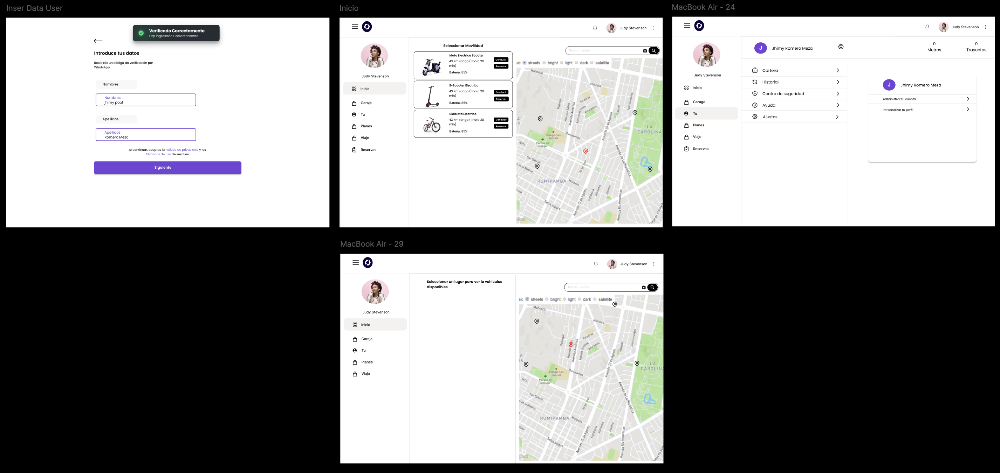


### 4.4.4. Web Applications User Flow Diagrams. 

User Flow Diagrams are visual representations that show the steps a user takes to complete specific tasks within a web application. They map the navigation paths between screens or pages, highlighting decision points, actions, and outcomes. These diagrams help designers and developers understand how users interact with the system, identify potential usability issues, and ensure smooth navigation and task completion. They are essential for planning intuitive interfaces, improving user experience, and guiding development teams in implementing consistent workflows.


.png)

## 4.5. Web Applications Prototyping.

Web Applications Prototyping es una metodología esencial en el desarrollo de aplicaciones web, que implica la creación de bocetos visuales o modelos preliminares de una aplicación antes de su implementación completa. 

## 4.6.Domain - DrivenSoftware Architecture.

Esta sección se expone la arquitectura de software del proyecto WeRide. La propuesta fue elaborada con un enfoque orientado al dominio, de manera que los elementos más relevantes de la plataforma estén correctamente representados y respondan a los requerimientos de los usuarios. Seguidamente, se incluyen diagramas esenciales que ilustran la interacción entre los distintos componentes del sistema y los actores externos.

### 4.6.1 Design-Level Event Storming.

**Command Bounded Context**


**Vehicle Managment Bounded Context**


**Level & Storm Managment Bounded Context**


**Payment Managment Bounded Context**


---

### 4.6.2. Software Architecture ContextDiagram.

El diagrama de contexto de **WeRide** ofrece una visión global de las interacciones principales entre el sistema central y los actores externos que lo rodean. La plataforma está orientada a simplificar y optimizar la movilidad urbana mediante el uso compartido de vehículos eléctricos. En este nivel, se identifican actores clave como el Usuario (quien reserva, desbloquea y utiliza los vehículos), el Administrador (encargado de la gestión de la flota y promociones), y Empresas (clientes corporativos que gestionan suscripciones para empleados). Asimismo, se muestran las integraciones externas más relevantes: la Pasarela de Pago para procesar transacciones de suscripción y uso, el Servicio de Mapas para visualizar la ubicación de los vehículos y planificar rutas, y las Redes Sociales para compartir viajes y promociones. Esta representación de alto nivel permite entender de manera clara cómo WeRide se relaciona y coopera con su ecosistema digital y humano.


### 4.6.3. Software Architecture Container Diagrams.

El diagrama de contenedores detalla la organización interna de **WeRide**, mostrando cómo los diferentes componentes de software trabajan en conjunto para brindar la funcionalidad de la plataforma. La Aplicación Web y Móvil, implementadas en React y React Native, sirven como puntos de interacción donde los usuarios pueden localizar, reservar y gestionar vehículos eléctricos. Estas interfaces se conectan con una API en Node.js, que cumple el rol de enlace entre la capa de presentación y los servicios del backend. La información esencial de usuarios, vehículos, reservas, pagos y rutas se almacena en una Base de Datos PostgreSQL. Asimismo, se integran contenedores adicionales como el Servicio de Mapas (basado en Google Maps API o Mapbox) para la visualización de ubicaciones y rutas, y la Pasarela de Pago (Stripe o similar), destinada a la gestión de transacciones. En conjunto, este nivel del modelo permite comprender cómo se estructuran y comunican las partes técnicas del sistema.


### 4.6.4. Software Architecture Components Diagrams.

El diagrama de componentes pone el foco en la arquitectura interna de la API de **WeRide**, encargada de coordinar la lógica de negocio central de la plataforma. Esta API, desarrollada en Node.js, se organiza en distintos componentes especializados, cada uno orientado a un dominio concreto. El Componente de Gestión de Usuarios administra la autenticación, perfiles y métodos de pago; Gestión de Vehículos permite realizar operaciones sobre los vehículos disponibles (ubicación, estado, batería); Reservas y Viajes abarca el ciclo completo de reserva, desbloqueo y finalización de viajes; Rutas y Mapas gestiona la localización y navegación de los vehículos; y Promociones y Notificaciones procesa tanto la gestión de descuentos como el envío de alertas a los usuarios. La interacción entre estos módulos sigue un flujo funcional definido: los usuarios gestionan reservas y viajes, los administradores supervisan la flota y las promociones, y las empresas pueden gestionar suscripciones corporativas. Esta separación de responsabilidades refleja un diseño guiado por el dominio, donde cada componente encapsula una función específica y colabora con los demás para dar soporte integral a la plataforma, junto a los Bounded Contexts desarrollados que explican de forma detallada la funcionalidad de cada componente existente en WeRide.


## 4.7.Software Object-Oriented Design.

El diagrama de clases nos ayuda a definir la funcionalidad de el producto de **WeRide** mediante los atributos y funcionalidades de las clases de nuestras entidades relacionadas al funcionamiento del producto, desde interfaces, clases y atributos.

### 4.7.1.Class Diagrams.
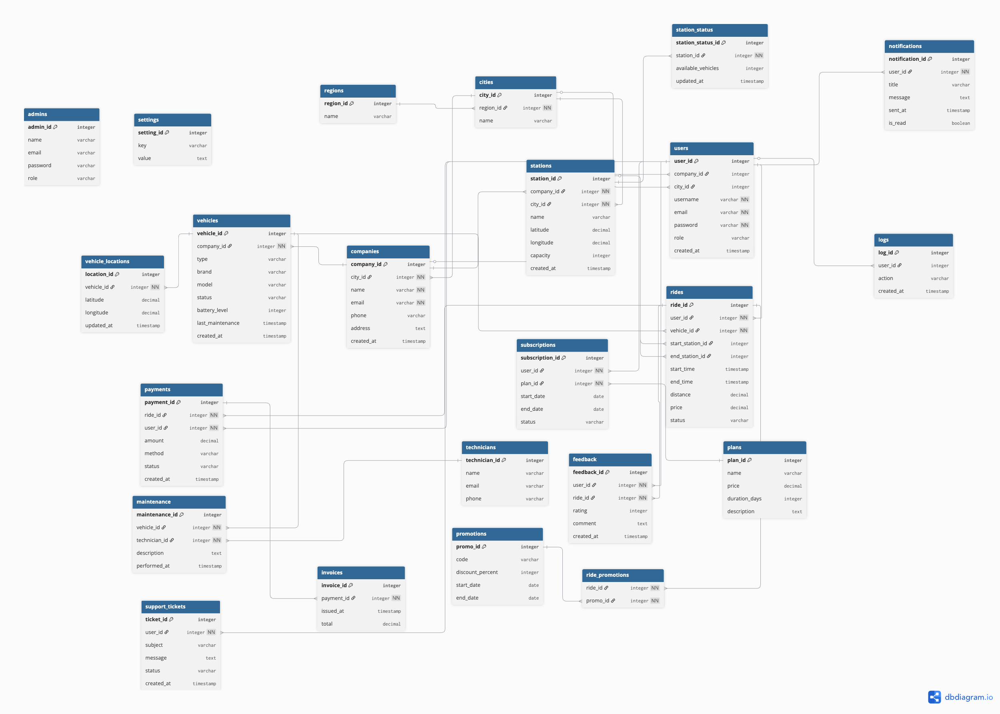

## 4.8.Database Design.

El diagrama de base de datos nos ayudara a la correcta definicion de entidades dentro de la base de datos funcional de **WeRide**, definiendo que entidades se vinculan mediante las id's principales para la correcta organizacion y manejo de informacion.

### 4.8.1.Database Diagrams.


<p align="center">

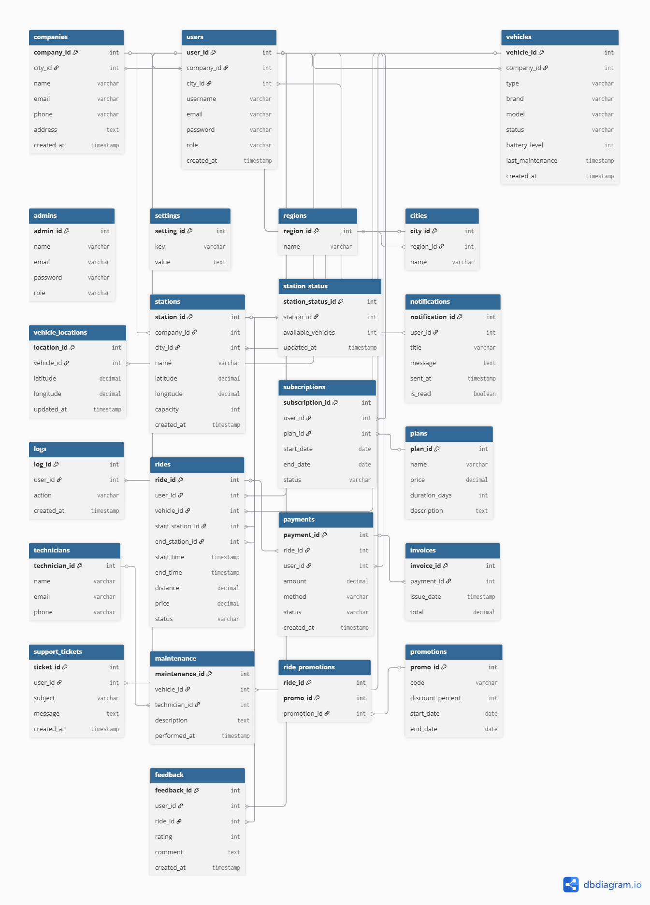
</p>


# Capítulo V: Product Implementation, Validation & Deployment.
## 5.1. Software Configuration Management.

Esta guía define las decisiones y acuerdos fundamentales para el desarrollo, mantenimiento y despliegue de la aplicación **WeRide**, que gestiona el alquiler de vehículos. El objetivo es asegurar la coherencia, eficiencia y calidad a lo largo del ciclo de vida del proyecto.

---

### 5.1.1. Software Development Environment Configuration.

<table border="1">

  <tr>
    <td>Project Management</td>
    <td><h4>Github</h4>Plataforma en línea que permite almacenar código fuente en repositorios. Gracias a la tecnología de control de versiones de Git se puede organizar el código y llevar un mejor trabajo en conjunto.</td>
  </tr>
  <tr>
    <td></td>
    <td><h4>Whatsapp</h4>Red Social destinada a la comunicación donde se realizaron acuerdos y recordatorios de las reuniones.</td>
  </tr>
  <tr>
    <td></td>
    <td><h4>Trello</h4>Software de administración y gestión de proyectos que se utilizó para establecer y designar las tareas</td>
  </tr>
  <tr>
    <td>Requirements Management</td>
    <td><h4>Miro</h4>Plataforma en línea de gestión de requisitos que permite colaborar y organizar proyectos de forma visual y representativa.
</td>
  </tr>
  <tr>
    <td>Product UX/UI Design</td>
    <td><h4>Figma</h4>Aplicación que permite el diseño libre de interfaces a través de las múltiples herramientas que ofrece. Permitiendo la creación de prototipos interactivos que simulan la experiencia de usuario.
</td>
  </tr>
  <tr>
    <td>Software Development</td>
    <td><h4>Git</h4>Es un software de control de versiones para los trabajos en equipos y confiabilidad del desarrollo.</td>
  </tr>
  <tr>
    <td></td>
    <td><h4>Node.js</h4>Node.js es un entorno de ejecución de JavaScript del lado del servidor, que permite desarrollar aplicaciones web escalables y de alto rendimiento fuera del navegador.</td>
  </tr>
  <tr>
    <td></td>
    <td><h4>HTML</h4>Lenguaje de etiquetas, utilizado para la estructuración y la presentación de contenido.</td>
  </tr>
  <tr>
    <td></td>
    <td><h4>CSS</h4>CSS es un lenguaje utilizado para estilizar y dar formato a documentos HTML.</td>
  </tr>
  <tr>
    <td></td>
    <td><h4>TypeScript</h4>TypeScript es un lenguaje de programación de alto nivel, interpretado y multi-paradigma, utilizado para crear interactividad en páginas web.</td>
  </tr>
  <tr>
    <td></td>
    <td><h4>VSCode</h4>Es un editor de código fuente con extensiones que ayudan al desarrollo.</td>
  </tr>
    <tr>
    <td></td>
    <td><h4>WebStorm</h4>Es un IDE centrado en desarrollo frontend, por su gran variedad de herramientas que agilizan el proceso de desarrollo.</td>
  </tr>
  <tr>
    <td></td>
    <td><h4>Angular</h4>Framework robusto para el desarrollo de aplicaciones web modernas y escalables, basado en el patrón de Single Page Application (SPA),  facilita la creación de interfaces dinámicas mediante TypeScript.</td>
  </tr>
  <tr>
    <td></td>
    <td><h4>IntelliJIdea</h4>Entorno de desarrollo integrado (IDE) utilizado principalmente para el desarrollo en Java, que ofrece herramientas avanzadas para la codificación, depuración y pruebas.</td>
  </tr>
  <tr>
  <td></td>
    <td><h4>Java</h4>Lenguaje de programación orientado a objetos, utilizado para desarrollar aplicaciones robustas y portables.</td>
  </tr>
  <tr>
    <td></td>
    <td><h4>Springboot</h4>Framework para el desarrollo de aplicaciones Java basadas en microservicios, que facilita la creación de aplicaciones robustas y escalables.</td>
  </tr>
  <tr>
    <td></td>
    <td><h4>Swagger</h4>Herramienta para diseñar, construir, documentar y consumir APIs RESTful.</td>
  </tr>
  <tr>
    <td></td>
    <td><h4>MySQLWorkbench</h4>Herramienta visual para el diseño, modelado, generación y administración de bases de datos MySQL.</td>
  </tr>
  <tr>
    <td>Software Deployment</td>
    <td><h4>Github Pages</h4>Plataforma que nos permite realizar el despliegue de nuestro landing page.</td>
  </tr>
</table>

---

### 5.1.2. Source Code Management.

Hemos optado por crear un repositorio en GitHub para nuestro proyecto, tanto para el informe como para la landing page. Esto facilitó la colaboración entre los miembros del equipo,aprovechando las herramientas útiles que esta plataforma ofrece para el manejo del código fuente y sus versiones.

- URL del repositorio Report en GitHub: https://github.com/OpenSource-Grupo-4/ReportTB1
- URL del repositorio Landing Page en GitHub: https://github.com/OpenSource-Grupo-4/Landing-Page
- URL del repositorio de la Web Application en GitHub:https://github.com/OpenSource-Grupo-4/Frontend-WeRide
- URL del respositorio de los Web Services en GitHub:https://github.com/OpenSource-Grupo-4/Backend-WeRide

---

### 5.1.3. Source Code Style Guide & Conventions

##### Landing Page:

Para "**WeRide**", hemos utilizado "**HTML y CSS**". Para estructurar el contenido usamos etiquetas de section y divisiones para contenido específico de cada una de las secciones. Además, hemos empleado atributos como ***HTML Style*** para personalizar el aspecto visual, definiendo propiedades como color, tamaño de fuente y tipo de letra.

Para resaltar elementos importantes, hemos aplicado ***HTML Text Formatting***, incluyendo etiquetas como b para negrita, strong para resaltado y del para mostrar cambios de precios. En cuanto a la navegación, hemos implementado una barra de navegación horizontal utilizando **CSS** para mejorar la experiencia del usuario al explorar el contenido.

Los formularios, creados con **CSS**, permiten a los usuarios ingresar información relevante, como detalles de inicio de sesión, información de pago y dirección de envío. Para añadir interactividad, hemos agregado botones con efectos hover utilizando CSS y paginación CSS para facilitar la navegación entre las diferentes páginas de productos.

Finalmente, en el **footer**, hemos incluido enlaces a las redes sociales de la organización para brindar a los usuarios una forma adicional de conectarse y seguir nuestras actualizaciones.

##### Web Application:

Para "**WeRide App**", hemos utilizado "**TypeScript, HTML y CSS**". La estructura del proyecto sigue el patrón de arquitectura de **Single Page Application (SPA)**, utilizando el framework **Angular** para organizar el código en módulos, componentes y servicios.

Los componentes estan estructurados según DDD (Domain-Driven Design), donde cada componente representa un bounded context específico, como **auth**, **booking**, **garage**, **plans** y **trip**. Cada componente tiene su propio archivo HTML para la estructura, CSS para el estilo y TypeScript para la lógica y enrutamiento así como la comunicación entre componentes y servicios.

### 5.1.4. Software Deployment Configuration.

##### Landing Page:

Utilizaremos GitHub Pages para alojar nuestra Landing Page. Para lograrlo, subiremos los archivos esenciales (HTML, CSS, etc.) a un repositorio público en GitHub. De
esta manera, nuestra página estará disponible en línea y accesible para todos los usuarios.


##### Web Application:

Utilizaremos Vercel para alojar nuestra Web Application.
Para lograrlo, configuraremos un proyecto en Vercel y conectaremos nuestro repositorio de GitHub. Vercel se encargará de la construcción y el despliegue de nuestra aplicación automáticamente cada vez que realicemos un push a la rama principal.


---

## 5.2. Landing Page, Services & Applications Implementation.

### 5.2.1. Sprint 1

#### 5.2.1.1. Sprint Planning 1.

<table>
  <tr>
    <th>Elemento</th>
    <th>Detalle</th>
  </tr>
  <tr>
    <td><strong>Sprint</strong></td>
    <td>Sprint 1 — Implementación inicial: estructura de producto, landing y autenticación (WeRide)</td>
  </tr>
  <tr>
    <td><strong>Sprint Planning Background</strong></td>
    <td>Sprint de arranque para validar funcionalidades esenciales del MVP: landing pública, registro, inicio de sesión y vista inicial de vehículos simulados. Se prioriza entregar valor temprano a usuarios universitarios y pilotos corporativos.</td>
  </tr>
  <tr>
    <td><strong>Fecha</strong></td>
    <td>2025-09-19</td>
  </tr>
  <tr>
    <td><strong>Hora</strong></td>
    <td>22:00 (GMT-5)</td>
  </tr>
  <tr>
    <td><strong>Lugar</strong></td>
    <td>Reunión virtual — Discord</td>
  </tr>
  <tr>
    <td><strong>Preparado por</strong></td>
    <td>WeTech</td>
  </tr>
  <tr>
    <td><strong>Asistentes</strong></td>
    <td>Samuel Bonifacio, Jefferson Castro, Diego Seminario, Jhimy Romero, Arnold Morales</td>
  </tr>
  <tr>
    <td><strong>Sprint n-1 Review</strong></td>
    <td>Se creó la organización WeTech en GitHub, se definieron ramas, convenciones de commits y se asignaron tareas iniciales en investigación de usuarios, wireframes y mockups.</td>
  </tr>
  <tr>
    <td><strong>Sprint n-1 Retrospective</strong></td>
    <td>Se completó la estructura base de la landing page (HTML/CSS/JS). Lecciones aprendidas: mejorar granularidad en tareas y definir criterios de aceptación más claros.</td>
  </tr>
  <tr>
    <td><strong>Sprint Goal (Statement)</strong></td>
    <td><strong>Our focus is on</strong> entregar un flujo de onboarding confiable y una landing inicial atractiva con visualización simulada de vehículos.<br><strong>We believe it delivers</strong> mayor adopción temprana y confianza de usuarios iniciales (estudiantes y pilotos corporativos).<br><strong>This will be confirmed when</strong> al menos 50 usuarios de prueba completen el registro y login; la duración media de sesión sea ≥ 2 minutos; y la vista del mapa (vehículos simulados) sea accedida en ≥ 60% de las sesiones.</td>
  </tr>
  <tr>
    <td><strong>User Stories (SP)</strong></td>
    <td>
      - <strong>US-12 (3 SP)<br>
      - <strong>US-10 (3 SP)<br>
      - <strong>US-11 (5 SP)<br>
      - <strong>US-14 (3 SP)<br>
    </td>
  </tr>
  <tr>
    <td><strong>Sprint 1 Velocity (forecast)</strong></td>
    <td>17 puntos</td>
  </tr>
  <tr>
    <td><strong>Sum of Story Points (commit)</strong></td>
    <td>17 puntos</td>
  </tr>
</table>


#### User Stories seleccionadas para el Sprint 1

| ID  | User Story                                                                                  | Puntos |
|-----|---------------------------------------------------------------------------------------------|--------|
| 12   | Como usuario quiero contactar con el soporte de la aplicación para resolver mis dudas.  |   5    |
| 10   | Como usuario quiero tener acceso a la información de la aplicación para estar informado de las actualizaciones.                  |   5    |
| 11   | Como usuario quiero saber dónde se ubican presencialmente para acudir a uno de los locales.     |   4    |
| 14  | Como usuario, quiero reportar un problema con el vehículo para alertar a soporte y obtener ayuda rápida.   |   3    |

**Total de puntos:** 17

---

#### 5.2.1.2. Aspect Leaders and Collaborators

En esta sección se presenta la matriz de liderazgo y colaboración (Leadership-and-Collaboration Matrix, LACX) para el Sprint 1 de WeRide. Esta matriz identifica, para cada aspecto clave del Sprint, quién es el líder responsable y quiénes son los colaboradores, facilitando así la comunicación y la asignación de tareas dentro del equipo. 

Los aspectos considerados en este Sprint incluyen: diseño de la landing page, desarrollo de funcionalidades de registro e inicio de sesión, implementación de la barra de navegación, y configuración del footer con enlaces de contacto y redes sociales.

| Team Member (Apellido, Nombre)         | GitHub Username      | Landing Page Design | Registro/Inicio de Sesión | Barra de Navegación | Footer y Redes Sociales |
|----------------------------------------|----------------------|---------------------|--------------------------|---------------------|------------------------|
| Bonifacio, Samuel                     | samuelbonifacio015      | L                   | L                       | L                   | L                      |
| Castro, Jefferson                      | JeffersonCastroPariona     | C                   | L                        | C                   | C                      |
| Seminario, Diego                             | DiegoSeminario            | C                   | C                        | L                   | C                      |                     |
| Romero, Jhimy                        | jhimyromeromeza       | L                   | L                        | L                   | C                      |
| Morales, Arnold                        | Arnold-TI       | C                   | C                        | C                   | L                      |

**L:** Leader (Líder)  
**C:** Collaborator (Colaborador)

Esta organización permite una asignación clara de responsabilidades y fomenta la colaboración efectiva durante el desarrollo del Sprint.

---

#### 5.2.1.3. Sprint Backlog 1.

| ID   | Title/Section                | Description                                                                                                                        | Estimation (Hours) | Assigned To                        | Status |
|------|------------------------------|------------------------------------------------------------------------------------------------------------------------------------|--------------------|-------------------------------------|--------|
| US01 | Landing Page                 | Como usuario, quiero acceder a una landing page clara y atractiva para conocer los beneficios y funcionalidades de WeRide.         | 3                  | Bonifacio Jaramillo, Samuel Jesus   | Done   |
| US02 | Registro de Usuario          | Como usuario, quiero registrar una cuenta desde la landing page para poder acceder a los servicios de WeRide.                      | 3                  | Castro Pariona, Jefferson Ernesto   | Done   |
| US03 | Inicio de Sesión             | Como usuario, quiero iniciar sesión desde la landing page para gestionar mis reservas y perfil.                                    | 3                  | Castro Pariona, Jefferson Ernesto   | Done   |
| US04 | Barra de Navegación          | Como usuario, quiero una barra de navegación intuitiva y responsive para moverme fácilmente entre las secciones de la landing page.| 2                  | Seminario Castillo, Diego Vicente            | Done   |
| US05 | Footer y Redes Sociales      | Como usuario, quiero un footer con enlaces de contacto y redes sociales para comunicarme o seguir novedades de WeRide.             | 2                  | Morales Sosa, Arnold Gabriel        | Done   |
| US06 | Página de Información        | Como usuario, quiero una sección informativa sobre WeRide y sus beneficios para entender el propósito de la plataforma.            | 2                  | Bonifacio Jaramillo, Samuel Jesus   | Done   |
| US07 | Validación de Formularios    | Como usuario, quiero que los formularios de registro e inicio de sesión validen mis datos para evitar errores y mejorar la seguridad.| 2                 | Castro Pariona, Jefferson Ernesto   | Done   |
| US08 | Estilos Generales            | Como usuario, quiero una interfaz visualmente coherente (colores, fuentes, espaciados) para una experiencia agradable y moderna.   | 1                  | Romero Meza, Jhimy Pool   | Done   |

#### 5.2.1.4. Development Evidence for Sprint Review

Durante el Sprint 1, el equipo de **WeTech** realizó múltiples commits en el repositorio de GitHub, evidenciando el avance y cumplimiento de las tareas planificadas. A continuación, se presenta una tabla con los principales commits realizados, siguiendo el formato requerido:

| Repository                                         | Branch | Commit Id | Commit Message                                 | Commit Message Body                                   | Committed on (Date)     |
|----------------------------------------------------|--------|-----------|------------------------------------------------|-------------------------------------------------------|------------------------|
| OpenSource-Grupo-4/Landing-Page                    | develop   | 9c5de9c   | Add footer styles to styles.css                | Se agregaron estilos para el footer en styles.css.    | 13/09/2025             |
| OpenSource-Grupo-4/Landing-Page                    | develop   | d0d0f0c   | Add footer section with contact and social links| Se añadió la sección de footer con enlaces de contacto y redes sociales. | 13/09/2025             |
| OpenSource-Grupo-4/Landing-Page                    | develop   | 098b740   | Merge pull request #2 from OpenSource-Grupo-4/develop | Se fusionaron cambios de la rama develop.             | 12/09/2025             |
| OpenSource-Grupo-4/Landing-Page                    | feature/responsive-navbar   | eddad5b   | feat: added navbar & hero section              | Se agregó la barra de navegación y la sección principal. | 12/09/2025             |
| OpenSource-Grupo-4/Landing-Page                    | develop   | 2a59cfe   | chore: index file refactor                     | Refactorización del archivo index.                    | 12/09/2025             |
| OpenSource-Grupo-4/Landing-Page                    | main   | 69695c3   | Merge pull request #1 from OpenSource-Grupo-4/develop | Se fusionaron cambios iniciales de la rama develop.   | 11/09/2025             |
| OpenSource-Grupo-4/Landing-Page                    | hero-ui-fix   | 90dd977   | /changes v.2 Jefferson Castro - Landing        | Cambios en la landing page por Jefferson Castro.      | 11/09/2025             |
| OpenSource-Grupo-4/Landing-Page                    | main   | 59a25be   | feat: added steps section                      | Se agregó la sección de pasos.                        | 18/09/2025             |
| OpenSource-Grupo-4/Landing-Page                    | feature/responsive   | 4317f4c   | styles: updated responsive for steps cards     | Se mejoró la responsividad de las tarjetas de pasos.  | 18/09/2025             |
| OpenSource-Grupo-4/Landing-Page                    | main   | 9deb5a8   | feat: added steps section                      | Se agregó la sección de pasos.                        | 18/09/2025             |
| OpenSource-Grupo-4/Landing-Page                    | develop   | 6802c55   | chore: added imgs & syntax updates             | Se añadieron imágenes y se actualizaron detalles de sintaxis. | 18/09/2025             |

Cada commit refleja el trabajo colaborativo y el cumplimiento de los objetivos del Sprint, asegurando la trazabilidad y transparencia en el desarrollo de **WeRide**.

**Reporte de commits:**


---

#### 5.2.1.5. Execution Evidence for Sprint Review.

En esta entrega, nos centramos en el desarrollo completo de la Landing Page para nuestra plataforma de alquiler en línea. Nuestro objetivo es desplegar una página web atractiva y efectiva que actúe como el punto de entrada para nuestros usuarios. 

Es por ello que se comparte las evidencias de ambos repositorios para corroborar el trabajo hecho por cada uno de los participantes.


#### 5.2.1.6. Services Documentation Evidence for Sprint Review.

Para esta primera entrega no hubo implementación de APIs, pues solo se realizó la Landing Page.

#### 5.2.1.7. Software Deployment Evidence for Sprint Review.

El objetivo del primer Sprint fue el desarrollo e implementación de la Landing Page. Para eso, utilizamos GitHub y GitHub Pages. El proceso del desarrollo fue el siguiente:

1. Se creó una organización en GitHub y, dentro de ella, se crearon dos repositorios. Uno para el informe del trabajo y otro para la Landing Page 
2. Luego, a través de los commits, el equipo fue editando los archivos index.html y styles.css, además de ir añadiendo imágenes a utilizar en el directorio images. 
3. Finalmente, se implementó GitHub Pages en el repositorio de GitHub y se desplegó la Landing Page, la que se puede visitar en el siguiente link: https://opensource-grupo-4.github.io/Landing-Page

#### 5.2.1.8. Team Collaboration Insights during Sprint.

A continuación, se adjuntan las capturas de evidencia de los insights de los repositorios del informe y Landing Page para evidenciar la participación de todos los miembros:

- Insight Landing Page:


- Insight Report


## 5.2.2. Sprint 2

### 5.2.2.1. Sprint Planning 2

<table>
  <tr>
    <th>Elemento</th>
    <th>Detalle</th>
  </tr>

  <tr>
    <td><strong>Sprint</strong></td>
    <td>Sprint 2 — Implementación de base de datos local (<code>db.json</code>) y primera versión desplegada del Back/Front (WeRide)</td>
  </tr>

  <tr>
    <td><strong>Sprint Planning Background</strong></td>
    <td>Sprint orientado a proveer una capa de datos simulada (db.json) que permita al frontend consumir lecturas IoT y estados de vehículos, y a la vez desarrollar los bounded contexts principales para validar flujos de negocio (auth, booking, garage, plans, trip). Se busca reducir dependencia de servicios externos y preparar la integración con el backend real en sprints posteriores.</td>
  </tr>

  <tr>
    <td><strong>Fecha</strong></td>
    <td>2025-10-08</td>
  </tr>

  <tr>
    <td><strong>Hora</strong></td>
    <td>21:00 (GMT-5)</td>
  </tr>

  <tr>
    <td><strong>Lugar</strong></td>
    <td>Reunión virtual — Google Meet</td>
  </tr>

  <tr>
    <td><strong>Preparado por</strong></td>
    <td>WeTech</td>
  </tr>

  <tr>
    <td><strong>Asistentes</strong></td>
    <td>Samuel Bonifacio, Jefferson Castro, Diego Seminario, Jhimy Romero, Arnold Morales</td>
  </tr>

  <tr>
    <td><strong>Sprint n-2 Review</strong></td>
    <td>Se completó la primera versión desplegada del Frontend Web Application de WeRide; se validaron wireframes y se obtuvo feedback inicial de usuarios de prueba.</td>
  </tr>

  <tr>
    <td><strong>Sprint n-2 Retrospective</strong></td>
    <td>Buena coordinación y avance en frontend; se identificó la necesidad de una capa de datos simulada (db.json) y de criterios de aceptación más precisos para las integraciones.</td>
  </tr>

  <tr>
    <td><strong>Sprint Goal (Statement)</strong></td>
    <td>
      <strong>Our focus is on</strong> implementar una base de datos local (<code>db.json</code>) que simule endpoints y telemetría, y desarrollar los bounded contexts <strong>auth</strong>, <strong>booking</strong>, <strong>garage</strong>, <strong>plans</strong> y <strong>trip</strong> en el frontend para validar flujos clave.<br>
      <strong>We believe it delivers</strong> mayor estabilidad del desarrollo frontend, permite pruebas deterministas y acelera la integración con el backend real para pilotos.<br>
      <strong>This will be confirmed when</strong> el frontend consume correctamente <code>db.json</code> (endpoints simulados), los flujos de autenticación, reserva y gestión de vehículos funcionan end-to-end en entorno de pruebas, y se registran ≥ 30 interacciones de prueba entre usuarios y booking/garage durante la fase de validación.
    </td>
  </tr>

  <tr>
    <td><strong>User Stories (SP)</strong></td>
    <td>
      - <strong>US-06 (3 SP):</strong> Crear <code>db.json</code> con modelos: usuarios, vehículos, estado batería, ubicaciones y trips.<br>
      - <strong>US-07 (5 SP):</strong> Implementar bounded context <strong>booking</strong>: reserva, confirmación y cancelación (frontend + lectura/sync con <code>db.json</code>).<br>
      - <strong>US-08 (4 SP):</strong> Implementar bounded context <strong>garage</strong>: vista de vehículo, estado, reportes de incidencia y lógica de disponibilidad.<br>
      - <strong>US-09 (3 SP):</strong> Implementar bounded context <strong>plans</strong>: planes/subscripciones mock (interfaz + lógica de selección).<br>
      - <strong>US-10 (5 SP):</strong> Implementar bounded context <strong>trip</strong>: inicio/final de viaje simulado, registro de evento en <code>db.json</code> y visualización de historial.
    </td>
  </tr>

  <tr>
    <td><strong>Sprint 2 Velocity (forecast)</strong></td>
    <td>20 puntos</td>
  </tr>

  <tr>
    <td><strong>Sum of Story Points (commit)</strong></td>
    <td>20 puntos</td>
  </tr>
</table>

<hr>

<h2>Objetivo del Sprint (versión SMART)</h2>

<p><strong>Objetivo:</strong> Implementar una base de datos simulada (<code>db.json</code>) y desarrollar los bounded contexts auth, booking, garage, plans y trip en el frontend para permitir pruebas end-to-end controladas.</p>

<ul>
  <li><strong>Específico:</strong> <code>db.json</code> con entidades clave y endpoints simulados; booking/garage/trip/plans/auth funcionales en entorno de pruebas.</li>
  <li><strong>Medible:</strong> 30 interacciones de prueba en booking/garage/trip; todas las historias con criterios de aceptación verificados.</li>
  <li><strong>Alcanzable:</strong> Basado en la velocity estimada (20 SP) y competencias del equipo.</li>
  <li><strong>Relevante:</strong> Permite validar integraciones sin dependencia de backend real y acelera la preparación del piloto.</li>
  <li><strong>Tiempo-bound:</strong> Entrega al cierre del Sprint 2 (1 iteración).</li>
</ul>


#### User Stories seleccionadas para el Sprint 2

| ID  | User Story | Puntos |
|-----|-------------|--------|
| 01  | Como usuario quiero poder iniciar sesión o registrarme en la app para usarla diariamente. | 5 |
| 02  | Como usuario, quiero introducir mi número de celular para validar mi identidad y recibir notificaciones importantes. | 4 |
| 03  | Como usuario, quiero introducir un código de verificación para validar mi identidad en la aplicación. | 4 |
| 04  | Como usuario quiero poder crear un perfil para colocar mis datos. | 5 |
| 05  | Como usuario quiero poder ver una pantalla principal estética que me atraiga a usar el servicio. | 2 |

**Total de puntos:** 20  

---

### 5.2.2.2. Aspect Leaders and Collaborators

| Team Member (Apellido, Nombre) | GitHub Username | Base de Datos (db.json) | Registro de Usuario | Reserva de Vehículo | Pagos | Integración y Pruebas |
|--------------------------------|------------------|-------------------------|---------------------|---------------------|-------|----------------------|
| Bonifacio, Samuel | samuelbonifacio015 | L | L | L | L | L |
| Castro, Jefferson | JeffersonCastroPariona | L | L | L | L | L |
| Seminario, Diego | DiegoSeminario | C | C | L | C | C |
| Romero, Jhimy | jhimyromeromeza | L | C | C | C | L |
| Morales, Arnold | Arnold-TI | L | L| L | L | C |

**L:** Leader (Líder)  
**C:** Collaborator (Colaborador)

---

### 5.2.2.3. Sprint Backlog 2

| ID | Title/Section | Description | Estimation (Hours) | Assigned To | Status |
|----|----------------|--------------|--------------------|--------------|--------|
| US21 | Registro de Usuario | Como usuario, quiero registrar una cuenta desde la aplicación para acceder a los servicios de WeRide. | 3 | Castro Pariona, Jefferson Ernesto | Done |
| US22 | Visualización de Vehículos | Como usuario, quiero visualizar los vehículos disponibles para elegir uno según mis necesidades. | 4 | Seminario Castillo, Diego Vicente | Done |
| US23 | Reserva de Vehículo | Como usuario, quiero poder reservar un vehículo seleccionando fecha y hora de uso. | 4 | Romero Meza, Jhimy Pool | Done |
| US24 | Pago en Línea | Como usuario, quiero realizar el pago de mi reserva de manera segura mediante una interfaz simple y funcional. | 5 | Morales Sosa, Arnold Gabriel | Done |
| US25 | Archivo db.json | Como desarrollador, quiero crear un archivo db.json con los datos de usuarios, vehículos y reservas para pruebas locales. | 2 | Bonifacio Jaramillo, Samuel Jesús | Done |
| US26 | Pruebas e Integración | Como equipo, queremos realizar pruebas de funcionamiento e integración del flujo completo del sistema. | 2 | Todos | Done |

---

### 5.2.2.4. Development Evidence for Sprint Review

Durante el Sprint 2 se implementaron los principales módulos de la aplicación web, incluyendo el componente de **garaje, mapa de viajes, historial de viajes, gestión de planes, integración de pagos y el archivo db.json.** Cada funcionalidad fue desarrollada y registrada en los siguientes commits y ramas, evidenciando la colaboración del equipo:

| Repository | Branch | Commit Id | Commit Message | Autor | Committed on (Date) |
|-------------|-----------------------------|-----------|-----------------------------------------------|--------------------------|----------------------|
| OpenSource-Grupo-4/Landing-Page | samuel-1 | caa30aa | feat: added garage component (pending features) | samuelbonifacio015 | 07/10/2025 |
| OpenSource-Grupo-4/Landing-Page | samuel-1 | 33a6fef | feat: added trip-map | samuelbonifacio015 | 07/10/2025 |
| OpenSource-Grupo-4/Landing-Page | samuel-1 | c885f8f | feat: added db.json | samuelbonifacio015 | 07/10/2025 |
| OpenSource-Grupo-4/Landing-Page | samuel-1 | 64615a8 | feat: plan component added | samuelbonifacio015 | 07/10/2025 |
| OpenSource-Grupo-4/Landing-Page | samuel-1 | f078e3d | feat: added trip-history component | samuelbonifacio015 | 07/10/2025 |
| OpenSource-Grupo-4/Landing-Page | jefferson | fbe7e9c | Implementation bounded-context booking | JeffersonCastroPariona | 06/10/2025 |
| OpenSource-Grupo-4/Landing-Page | diego | 38ba86c | us7,8 | DiegoSeminario | 07/10/2025 |
| OpenSource-Grupo-4/Landing-Page | feature/US-05-Map | 3d5995a | feat(Map): add map component whit marker and location user | jhimyromeromeza | 07/10/2025 |

Cada commit refleja el trabajo colaborativo y el cumplimiento de los objetivos del Sprint, asegurando la trazabilidad y transparencia en el desarrollo de **WeRide.**

**Reporte de commits:**


---

### 5.2.2.5. Execution Evidence for Sprint Review

En esta entrega, nos centramos en el desarrollo completo del desarrollo de la **Web Application** de WeRide.

Es por ello que se comparte las evidencias de ambos repositorios para corroborar el trabajo hecho por cada uno de los participantes.


---

### 5.2.2.6. Services Documentation Evidence for Sprint Review

El db.json fue creado para simular una base de datos local y facilitar el desarrollo y pruebas de la aplicación web. Este archivo contiene datos estructurados en formato JSON, representando las entidades principales del sistema: **usuarios, vehículos, reservas y planes.**

***json server:***


---

### 5.2.2.7. Software Deployment Evidence for Sprint Review

El objetivo del segundo Sprint fue el desarrollo e implementación de la Web Application. Para eso, utilizamos GitHub y GitHub Pages. El proceso del desarrollo fue el siguiente:

1. Se creó un repositorio para el desarrollo de la Web Application en GitHub. 
2. Se creó el entorno de desarrollo con Node.js y Angular usando WebStorm como IDE. 
3. Se desplegó el db.json con json-server para simular una base de datos local. 
4. Se desarrollaron los componentes usando el patrón de DDD (Domain-Driven Design) para estructurar el código. 
5. Se desplegó el frontend en github pages para pruebas y visualización.

---

### 5.2.2.8. Team Collaboration Insights during Sprint

A continuación, se adjuntan las capturas de evidencia de los insights del repositorio del desarrollo de la Web Application para evidenciar la participación de todos los miembros:

* Insight Web Application:
  

* Insight Report
  

## 5.2.3. Sprint 3

<h3>5.2.3.1. Sprint Planning 3</h3>

<table>
  <tr>
    <th>Elemento</th>
    <th>Detalle</th>
  </tr>

  <tr>
    <td><strong>Sprint</strong></td>
    <td>Sprint 3 — Primera versión del backend con Java (Spring Boot) y conexión a MySQL (WeRide)</td>
  </tr>

  <tr>
    <td><strong>Sprint Planning Background</strong></td>
    <td>Sprint orientado a entregar la capa mínima de backend que soporte autenticación, gestión de vehículos y reservas; establecer conexión estable con MySQL Workbench; y preparar los bounded contexts para futuras integraciones (auth, vehicle, booking). Se prioriza robustez, pruebas básicas y scripts de inicialización de esquema.</td>
  </tr>

  <tr>
    <td><strong>Fecha</strong></td>
    <td>2025-10-27</td>
  </tr>

  <tr>
    <td><strong>Hora</strong></td>
    <td>20:00 (GMT-5)</td>
  </tr>

  <tr>
    <td><strong>Lugar</strong></td>
    <td>Reunión virtual — Google Meet</td>
  </tr>

  <tr>
    <td><strong>Preparado por</strong></td>
    <td>WeTech</td>
  </tr>

  <tr>
    <td><strong>Asistentes</strong></td>
    <td>Samuel Bonifacio, Jefferson Castro, Diego Seminario, Arnold Morales</td>
  </tr>

  <tr>
    <td><strong>Sprint n-2 Review</strong></td>
    <td>Se asignaron los bounded contexts para el backend y se iniciaron las primeras contribuciones en el repositorio; frontend consumiendo <code>db.json</code> para pruebas.</td>
  </tr>

  <tr>
    <td><strong>Sprint n-2 Retrospective</strong></td>
    <td>Buena coordinación y claridad en las tareas; pendiente mejorar cobertura de pruebas unitarias y definir pipelines CI/CD para despliegues automáticos.</td>
  </tr>

  <tr>
    <td><strong>Sprint Goal (Statement)</strong></td>
    <td>
      <strong>Our focus is on</strong> entregar la primera versión operativa del backend (servicios REST) que permita autenticación, gestión de vehículos y reservas, conectada a MySQL Workbench.<br>
      <strong>We believe it delivers</strong> la capacidad de realizar pruebas end-to-end entre frontend y backend, garantizando persistencia y consistencia básica de datos.<br>
      <strong>This will be confirmed when</strong> los endpoints de autenticación, consulta de vehículos y creación de reservas responden correctamente en el entorno de pruebas y las operaciones CRUD se verifican contra la base de datos MySQL mediante consultas y pruebas automatizadas.
    </td>
  </tr>

  <tr>
    <td><strong>User Stories (seleccionadas)</strong></td>
    <td>Ver tabla abajo (IDs, descripción y puntos).</td>
  </tr>

  <tr>
    <td><strong>Sprint 3 Velocity (forecast)</strong></td>
    <td>20 puntos</td>
  </tr>

  <tr>
    <td><strong>Sum of Story Points (commit)</strong></td>
    <td>20 puntos</td>
  </tr>
</table>

<br>

<h4>Objetivo del Sprint (versión SMART)</h4>
<p><strong>Objetivo:</strong> Entregar la primera iteración del backend en Spring Boot con conexión a MySQL que permita registro/inicio de sesión, creación y consulta de perfiles, y persistencia de reservas/vehículos para pruebas end-to-end.</p>

<ul>
  <li><strong>Específico:</strong> Endpoints de auth (registro/login), persistencia de usuario/perfil, endpoints para vehículos y reservas; scripts de inicialización de esquema en MySQL.</li>
  <li><strong>Medible:</strong> Todos los endpoints listados en las user stories pasan sus criterios de aceptación y las operaciones CRUD quedan verificadas contra MySQL.</li>
  <li><strong>Alcanzable:</strong> Basado en la capacidad del equipo y velocity estimada (20 SP).</li>
  <li><strong>Relevante:</strong> Habilita integración real con frontend y pruebas de integración para pilotos.</li>
  <li><strong>Time-bound:</strong> Entrega al cierre de Sprint 3 (1 iteración).</li>
</ul>

<hr>

<h4>User Stories seleccionadas para el Sprint 3</h4>

<table>
  <tr>
    <th>ID</th>
    <th>User Story</th>
    <th>Puntos</th>
  </tr>
  <tr>
    <td>01</td>
    <td>Como usuario quiero poder iniciar sesión o registrarme en la app para usarla diariamente.</td>
    <td>5</td>
  </tr>
  <tr>
    <td>02</td>
    <td>Como usuario, quiero introducir mi número de celular para validar mi identidad y recibir notificaciones.</td>
    <td>4</td>
  </tr>
  <tr>
    <td>03</td>
    <td>Como usuario, quiero introducir un código de verificación para validar mi identidad en la aplicación.</td>
    <td>4</td>
  </tr>
  <tr>
    <td>04</td>
    <td>Como usuario quiero poder crear un perfil para colocar mis datos.</td>
    <td>5</td>
  </tr>
  <tr>
    <td>05</td>
    <td>Como usuario quiero poder ver una pantalla principal estética que me atraiga a usar el servicio.</td>
    <td>2</td>
  </tr>
  <tr>
    <td></td>
    <td><strong>Total de puntos comprometidos:</strong></td>
    <td><strong>20</strong></td>
  </tr>
</table>

<hr>

<h4>Criterios de aceptación (ejemplos rápidos)</h4>
<ul>
  <li><strong>US-01:</strong> Registro almacena usuario en MySQL, responde 201 Created y devuelve token JWT; login valida credenciales y retorna token.</li>
  <li><strong>US-02 / US-03:</strong> Número celular guardado y proceso de verificación simulado (código) implementado; endpoints de verificación devuelven estado validado.</li>
  <li><strong>US-04:</strong> Perfil editable con campos básicos (nombre, documento, foto URL) y persistencia verificada.</li>
  <li><strong>US-05:</strong> Endpoint que provee datos para la pantalla principal (promociones/estadísticas) y respuesta &lt; 500ms en entorno de pruebas.</li>
</ul>

<h4>Riesgos identificados y mitigaciones</h4>
<ul>
  <li><strong>Riesgo:</strong> Problemas de conexión o configuración con MySQL Workbench. <strong>Mitigación:</strong> scripts de bootstrap de DB y contenedores locales (Docker Compose) para entorno reproducible.</li>
  <li><strong>Riesgo:</strong> Falta de pruebas automatizadas. <strong>Mitigación:</strong> incluir pruebas unitarias básicas y pruebas de integración que validen CRUD contra una DB de prueba.</li>
  <li><strong>Riesgo:</strong> Dependencias inseguras en librerías. <strong>Mitigación:</strong> revisar versiones y políticas de seguridad (dependabot/scan).</li>
</ul>


### 5.2.3.2. Aspect Leaders and Collaborators

| Team Member (Apellido, Nombre) | GitHub Username | Deploy de Base de Datos | Historial de Viajes | Gestión de Perfiles | Reservas | Garage |
|--------------------------------|------------------|-------------------------|---------------------|---------------------|-------|----------------------|
| Bonifacio, Samuel | samuelbonifacio015 | L | L | L | L | L |
| Castro, Jefferson | JeffersonCastroPariona | L | C | L | L | C |
| Seminario, Diego | DiegoSeminario | L | C | L | C | L |
| Romero, Jhimy | jhimyromeromeza | L | C | C | C | C |
| Morales, Arnold | Arnold-TI | L | L| L | L | C |

**L:** Leader (Líder)  
**C:** Collaborator (Colaborador)

---

### 5.2.3.3. Sprint Backlog 3

| ID | Title/Section | Description | Estimation (Hours) | Assigned To | Status |
|----|----------------|--------------|--------------------|--------------|--------|
| US21 | Registro de Usuario | Como usuario, quiero registrar una cuenta desde la aplicación para acceder a los servicios de WeRide. | 3 | Castro Pariona, Jefferson Ernesto | Done |
| US22 | Visualización de Vehículos | Como usuario, quiero visualizar los vehículos disponibles para elegir uno según mis necesidades. | 4 | Seminario Castillo, Diego Vicente | Done |
| US23 | Reserva de Vehículo | Como usuario, quiero poder reservar un vehículo seleccionando fecha y hora de uso. | 4 | Romero Meza, Jhimy Pool | Done |
| US24 | Pago en Línea | Como usuario, quiero realizar el pago de mi reserva de manera segura mediante una interfaz simple y funcional. | 5 | Morales Sosa, Arnold Gabriel | Done |
| US25 | Archivo db.json | Como desarrollador, quiero crear un archivo db.json con los datos de usuarios, vehículos y reservas para pruebas locales. | 2 | Bonifacio Jaramillo, Samuel Jesús | Done |
| US26 | Pruebas e Integración | Como equipo, queremos realizar pruebas de funcionamiento e integración del flujo completo del sistema. | 2 | Todos | Done |

---

### 5.2.3.4. Development Evidence for Sprint Review

Durante el Sprint 3 se implementaron los principales módulos del backend, incluyendo el componente de **gestión de perfiles, reservas, historial de viajes y garage de autos.** A continuación se listan los commits más relevantes registrados en el repositorio del backend durante este Sprint (captura en el panel de commits):

| Repository | Branch | Commit Id | Commit Message | Autor | Committed on (Date) |
|------------|--------------------------|-----------|----------------------------------------------------------------------------------------------------------------------------------|-----------------------|----------------------|
| OpenSource-Grupo-4/Backend-WeRide | feat/travelHistory | f7222d1 | feat(travelHistory): Add news endpoints for create TravelHistory and find TravelHistory by userId | jhimyromeromeza | 09/11/2025 |
| OpenSource-Grupo-4/Backend-WeRide | feature/profile | 6e8bd4f | feat: Implement Profile Bounded Context | Arnold-TI | 08/11/2025 |
| OpenSource-Grupo-4/Backend-WeRide | main | 69c362f | feat: implement JWT auth | samuelbonifacio015 | 29/10/2025 |
| OpenSource-Grupo-4/Backend-WeRide | main | e733cf1 | feat: added rest interfaces for iam | samuelbonifacio015 | 29/10/2025 |
| OpenSource-Grupo-4/Backend-WeRide | main | 7c22d3e | feat: added iam infrastructure | samuelbonifacio015 | 29/10/2025 |
| OpenSource-Grupo-4/Backend-WeRide | feat/booking | e3c8283 | feat(booking): update classes logic validation | JeffersonCastroPariona | 29/10/2025 |
| OpenSource-Grupo-4/Backend-WeRide | feat/booking | a60ea90 | feat(booking): implement aggregate and commands queries services | JeffersonCastroPariona | 28/10/2025 |
| OpenSource-Grupo-4/Backend-WeRide | bc/garage | 5875d27 | bc/garage | DiegoSeminario | 11/11/2025 |

Cada commit refleja el trabajo colaborativo y el cumplimiento de los objetivos del Sprint, asegurando la trazabilidad y transparencia en el desarrollo de **WeRide.**

**Reporte de commits (captura):**


---

### 5.2.3.5. Execution Evidence for Sprint Review

En esta entrega, nos centramos en el desarrollo completo del desarrollo de los **Web Services** de WeRide.

Es por ello que se comparte las evidencias de ambos repositorios para corroborar el trabajo hecho por cada uno de los participantes.


---

### 5.2.3.6. Services Documentation Evidence for Sprint Review

Para el backend, hemos desarrollado nuestro API utilizando Java con el framework Spring Boot. Este backend se conecta a una base de datos MySQL Workbench para gestionar el inicio de sesión, gestión de perfiles, reservas, historial de viajes y garage de autos.

Para verificar que la optención de datos se realice correctamente, utilizamos Swagger UI, una herramienta que nos permite interactuar con nuestra API de manera visual y probar los diferentes endpoints que hemos creado.

*Schemas:*


*Swagger:*

##### Accounts

  


##### Authentication


##### SignUp:


##### SignIn:


##### Auth:


##### Reservations:


##### Profiles:


##### Bookings:


##### Vehicles:


##### Travel History:


##### Users:


--- 

### 5.2.3.7. Software Deployment Evidence for Sprint Review

El objetivo del tercer Sprint fue el desarrollo e implementación del Backend de la Web Application. Para eso, utilizamos GitHub. El proceso del desarrollo fue el siguiente:

1. Se creó un repositorio para el desarrollo del Backend en GitHub. 
2. Se creó el entorno de desarrollo con Java(Springboot) y MySQL Workbench usando IntelliJ IDEA como IDE. 
3. Se desarrollaron los bounded context usando el patrón de DDD (Domain-Driven Design) para estructurar el código. 
4. Se utilizó Swagger UI para documentar y probar los endpoints del API desarrollado.
5. Se desplegó el backend en un servidor local para pruebas y visualización.
   
---
   
### 5.2.3.8. Team Collaboration Insights during Sprint

A continuación, se adjuntan las capturas de evidencia de los insights del repositorio del desarrollo de los Web Services para evidenciar la participación de todos los miembros:

* Insight Web Service:
  

* Insight Report
  

## 5.2.3. Sprint 4
### 5.2.3.1.Sprint Planning 4.
Para el sprint 4, el equipo realizó el sprint planning meeting para la distribución de tareas y revisión de errores a corregir. El resumen se mostrará a continuación:

<table>
  <tr>
    <th>Elemento</th>
    <th>Detalle</th>
  </tr>

  <tr>
    <td><strong>Sprint</strong></td>
    <td>Sprint 4 — Integración final Frontend ↔ Backend, despliegue y mejora del informe / landing page (WeRide)</td>
  </tr>

  <tr>
    <td><strong>Sprint Planning Background</strong></td>
    <td>Sprint orientado a integrar los componentes desarrollados (frontend y backend), corregir errores críticos identificados en pruebas, completar secciones faltantes del informe y pulir la landing page para el despliegue final del piloto. Prioriza estabilidad, experiencias end-to-end y evidencia documental para entrega.</td>
  </tr>

  <tr>
    <td><strong>Fecha</strong></td>
    <td>2025-12-01</td>
  </tr>

  <tr>
    <td><strong>Hora</strong></td>
    <td>21:00 (GMT-5)</td>
  </tr>

  <tr>
    <td><strong>Lugar</strong></td>
    <td>Reunión virtual — Google Meet</td>
  </tr>

  <tr>
    <td><strong>Preparado por</strong></td>
    <td>Seminario Castillo, Diego Vicente (WeTech)</td>
  </tr>

  <tr>
    <td><strong>Asistentes (Planning Meeting)</strong></td>
    <td>Castro Pariona, Jefferson Ernesto · Bonifacio Jaramillo, Samuel Jesus · Seminario Castillo, Diego Vicente · Romero Meza, Jhimy Pool · Morales Sosa, Arnold Gabriel</td>
  </tr>

  <tr>
    <td><strong>Sprint n-3 Review (Resumen)</strong></td>
    <td>Se completó la primera versión del backend, se integró con frontend simulando <code>db.json</code> y se corrigieron la mayoría de errores reportados del frontend. Se desplegó la versión inicial en entorno de staging y se avanzó en el diseño final de la landing page.</td>
  </tr>

  <tr>
    <td><strong>Sprint n-3 Retrospective (Resumen)</strong></td>
    <td>Buena coordinación del equipo; mejora en procesos de revisión. Acciones de mejora: reforzar pruebas e2e, documentar criterios de aceptación y automatizar despliegues.</td>
  </tr>

  <tr>
    <td><strong>Sprint Goal (Statement)</strong></td>
    <td>
      <strong>Our focus is on</strong> entregar la versión integrada y estable de frontend y backend, corrigiendo errores críticos, completando las secciones faltantes del informe y refinando la landing page para el despliegue piloto.<br>
      <strong>We believe it delivers</strong> mayor confianza operativa y evidencia para presentación académica y pilotos corporativos, aumentando la probabilidad de adopción inicial.<br>
      <strong>This will be confirmed when</strong> la aplicación integrada realiza viajes simulados end-to-end, las APIs responden en staging, el informe está actualizado y validado por el equipo, y la landing page está publicada con métricas iniciales (visitas y conversiones de registro).
    </td>
  </tr>

  <tr>
    <td><strong>Sprint 4 Velocity</strong></td>
    <td>61 puntos</td>
  </tr>

  <tr>
    <td><strong>Sum of Story Points (commit)</strong></td>
    <td>61 puntos</td>
  </tr>

</table>


### 5.2.3.2. Aspect Leaders and Collaborators.

Durante este Sprint, el equipo se enfocó en el **diseño visual, maquetación y despliegue de la Landing Page** de **Smart Stay**, junto con la implementación inicial del soporte multilenguaje y la adaptación responsiva del sitio web.  
Para optimizar el trabajo colaborativo, se elaboró la **Matriz de Liderazgo y Colaboración (LACX)**, donde se asignan los roles de **Líder (L)** y **Colaborador (C)** en los principales aspectos del Sprint.

| **Team Member (Last Name, First Name)** | **GitHub Username**                                      | **Diseño visual y maquetación web (Frontend funcional)** | **Implementación técnica del cambio de idioma (Multilenguaje funcional)** | **Responsividad y pruebas en distintos dispositivos** | **Despliegue de la aplicación web** |
|-----------------------------------------|----------------------------------------------------------|----------------------------------------------------------|---------------------------------------------------------------------------|-------------------------------------------------------|-------------------------------------|
| **Bonifacio Jaramillo, Samuel Jesus**   | [@samuelbonifacio015](https://github.com/samuelbonifacio015) | L                                                        | C                                                                         | C                                                     | C                                   |
| **Romero Meza, Jhimy Pool**             | [@jhimyromeromeza](https://github.com/jhimyromeromeza)       | C                                                        | L                                                                         | C                                                     | C                                   |
| **Seminario Castillo ,Diego Vicente**   | [@DiegoSeminario](https://github.com/DiegoSeminario)     | C                                                        | C                                                                         | C                                                     | L                                   |
| **Morales Sosa, Arnold Gabriel**        | [@Arnold-TI](https://github.com/Arnold-TI)           | C                                                        | C                                                                         | C                                                     | L                                   |
| **Castro Pariona, Jefferson Ernesto**   | [@JeffersonCastroPariona](https://github.com/JeffersonCastroPariona)                              | C                                                        | L                                                                         | L                                                     |                                     |
### 5.2.3.3.Sprint Backlog 4.

### 5.2.3.3 Sprint Backlog — Sprint 4 (WeRide)

| ID   | Título (HU)                                | Descripción (resumen)                                                                 | Story Points | Est. (hrs) | Assigned To                                        | Status      |
|------|--------------------------------------------|----------------------------------------------------------------------------------------|:------------:|:----------:|----------------------------------------------------|-------------|
| US-01| Inicio de sesión y registro                 | Registro/login, persistencia en backend, token JWT                                    |      8       |    12      | Jefferson Castro (Frontend) / Backend support       | In Progress |
| US-02| Introducir número de celular + verificación | Guardar número, solicitar código y validar (flow SMS/sandbox)                         |      5       |     8      | Samuel Bonifacio (Backend/DevOps)                   | In Progress |
| US-04| Datos de usuario / Perfil                   | Crear/editar perfil (nombre, foto, correo) y persistencia                             |      3       |     6      | Jhimy Romero (Frontend) / Backend support           | To Do       |
| US-05| Página principal / Landing (pulido)         | Pulir UI/UX de la pantalla principal y landing (performance, CTA, tracking)           |      3       |     6      | Diego Seminario (Frontend)                          | In Progress |
| US-11| Seleccionar ubicación y ver vehículos       | Al seleccionar ubicación en mapa mostrar vehículos cercanos y detalles (realtime)     |      8       |    10      | Diego Seminario (Frontend) / Backend support        | In Progress |
| US-07| Gestión/Visualización en Garaje             | Vista Garaje con listados, detalles y filtros (tipo, batería, valoración)             |      5       |     8      | Jhimy Romero (Frontend) / Backend support          | To Do       |
| US-17| Crear una reserva                            | Reserva de vehículo: seleccionar, confirmar, bloquear vehículo y temporizador         |      8       |    10      | Jhimy Romero (Frontend) / Arnold Morales (Backend)  | To Do       |
| US-24| Pago en línea (sandbox)                      | Integración mock/sandbox Yape/Plin; registro de transacción en backend                |      8       |    12      | Arnold Morales (Backend) / Frontend support         | To Do       |
| US-19| Desbloqueo con QR / US-20 Desbloqueo app     | Flujo de desbloqueo (QR y botón app) + estado de desbloqueo en tiempo real            |      5       |     8      | Arnold Morales (Backend) / Jhimy (Frontend)        | To Do       |
| US-12| Visualización de viaje en mapa               | Mostrar trayecto en tiempo real con datos de vehículo (batería, tiempo restante)      |      3       |     6      | Jhimy Romero (Frontend) / Backend support          | To Do       |
| CI-1 | CI/CD pipeline & Deploy a staging            | Pipeline (build/test/deploy) automático a staging                                     |      3       |     8      | Samuel Bonifacio (DevOps)                           | To Do       |
| TST1 | Pruebas E2E (smoke)                          | Suite e2e mínima para flujo crítico: registro→login→reserva→pago                      |      2       |     6      | Equipo (coordinado)                                 | To Do       |
| US-25| Archivo db.json (verificar)                  | db.json ya creado; verificar migración / uso en staging                              |      0       |     3      | Samuel Bonifacio (DevOps)                           | Done        |

**Sum Story Points comprometidos (Sprint 4):** 61 SP  
**Nota:** US-25 aparece como *Done* (verificado) y no suma SP al comprometido arriba.


### 5.2.3.4.Development Evidence for Sprint Review.
| **Repository**  | **Branch**            | **Commit ID**                            | **Author**        | **Time ago** |
|-----------------|-----------------------|------------------------------------------|-------------------|--------------|
| Backend-WeRide | master                | d92fe801832a83b5b698f5b24639effd021daaf7 | samuelbonifacio015 | 1 days ago   |
| Backend-WeRide  | Arnold                | 6e8bd4fc9fa6ef5ad2faf2109d06f411ba538402 | Arnold-TI         | 1 days ago   |
| Backend-WeRide  | feature/garage        | 5875d271c3a5cbbdeb171e9f6cabbe8d3c95f24c | DiegoSeminario    | 1 days ago   |
| Backend-WeRide  | feature/travelhistory | f7222d1cf6576893ce94db44932de35a96058eae | jhimyromeromeza| 14 days ago  |
| Backend-WeRide | jefferson             | e3c8283af91b64fd807e18d1bfd90f27fa7fd04b | JeffersonCastroPariona   | 1 days ago   |
| Backend-WeRide  | samuel                | bfd7ddf55775bc30cdd1eb003c869e8ec897045b | samuelbonifacio   | 6 days ago   |
| Backend-WeRide  | develop               | 538a2e9a51d6fe0d2a8c95d429a24bbeb598237f | samuelbonifacio015| 1 days ago   |


<!-- ========================= -->
<!-- 5.2.3.5 Execution Evidence -->
<!-- ========================= -->
<h3 id="5-2-3-5">5.2.3.5. Execution Evidence for Sprint Review</h3>

En el Sprint 4 se completó la integración final entre Frontend y Backend, se corrigieron errores críticos identificados en pruebas de staging, se pulió la landing page y se realizó el despliegue del backend real en una máquina virtual en Azure. Las funcionalidades validadas end-to-end incluyen: registro/login con JWT, visualización de vehículos, flujo de reserva y ejecución de viajes simulados. Se generaron evidencias visuales (capturas) y un video de demostración que muestra la navegación y los flujos principales.</p>

<h4>Principales logros</h4>
<ul>
  <li>Integración Frontend ↔ Backend funcionando en entorno de staging y ambiente real en Azure VM.</li>
  <li>Corrección de errores críticos y mejoras de rendimiento en endpoints clave.</li>
  <li>Landing page actualizada y publicada con métricas iniciales de navegación.</li>
  <li>Validación de flujos: onboarding (registro/login), reserva, inicio/fin de viaje, historial de trips.</li>
</ul>

<h4>Capturas (incluir en informe)</h4>
<ul>
  <li><strong>Screenshot 1:</strong> Página de login/registro — </li>
  <li><strong>Screenshot 2:</strong> Vista de mapa con vehículos simulados — </li>
  <li><strong>Screenshot 3:</strong> Flujo de reserva (confirmación) — </li>
  <li><strong>Screenshot 4:</strong> Historial de viajes (trip history) —</li>
</ul>

<hr>

<!-- =================================== -->
<!-- 5.2.3.6 Services Documentation -->
<!-- =================================== -->
<h3 id="5-2-3-6">5.2.3.6. Services Documentation Evidence for Sprint Review</h3>

En este Sprint se completó y publicó la documentación OpenAPI (Swagger) de los endpoints incluidos en el alcance: auth, vehicles, bookings y trips. A continuación se presenta una tabla resumen con los endpoints más relevantes, acciones soportadas, ejemplos de llamada y ejemplo de respuesta. Al final se indican enlaces y commits relacionados con la documentación generada.</p>

<table border="1" cellpadding="6" cellspacing="0">
  <thead>
    <tr>
      <th>Endpoint</th>
      <th>Acciones</th>
      <th>Método</th>
      <th>Ejemplo</th>
      <th>Parámetros</th>
      <th>Ejemplo response</th>
    </tr>
  </thead>
  <tbody>
    <tr>
      <td>/api/auth/register</td>
      <td>Registro de usuario</td>
      <td>POST</td>
      <td><pre>POST /api/auth/register</pre></td>
      <td>email, phone, password</td>
      <td><pre>{
 "id": "user-uuid",
 "email": "usuario@ejemplo.com"
}</pre></td>
    </tr>
    <tr>
      <td>/api/auth/login</td>
      <td>Autenticación (JWT)</td>
      <td>POST</td>
      <td><pre>POST /api/auth/login</pre></td>
      <td>email, password</td>
      <td><pre>{
 "token": "jwt-token",
 "expiresIn": 3600
}</pre></td>
    </tr>
    <tr>
      <td>/api/vehicles</td>
      <td>Listar / Crear vehículos</td>
      <td>GET / POST</td>
      <td><pre>GET /api/vehicles</pre></td>
      <td>filtros opcionales / body</td>
      <td><pre>[{ "id":"veh-1","plate":"ABC-123" }]</pre></td>
    </tr>
    <tr>
      <td>/api/vehicles/{id}</td>
      <td>Consultar / Actualizar / Eliminar</td>
      <td>GET / PUT / DELETE</td>
      <td><pre>GET /api/vehicles/veh-1</pre></td>
      <td>path: id</td>
      <td><pre>{
 "id": "veh-1",
 "plate": "ABC-123"
}</pre></td>
    </tr>
    <tr>
      <td>/api/bookings</td>
      <td>Crear / Listar reservas</td>
      <td>POST / GET</td>
      <td><pre>POST /api/bookings</pre></td>
      <td>vehicleId, userId, start, end</td>
      <td><pre>{
 "bookingId": "book-456",
 "status": "CONFIRMED"
}</pre></td>
    </tr>
    <tr>
      <td>/api/trips</td>
      <td>Inicio / Fin de viaje</td>
      <td>POST / GET</td>
      <td><pre>POST /api/trips</pre></td>
      <td>bookingId, event, timestamp</td>
      <td><pre>{
 "tripId":"trip-789",
 "status":"COMPLETED"
}</pre></td>
    </tr>
  </tbody>
</table>

<!-- ============================== -->
<!-- 5.2.3.7 Software Deployment Evidence -->
<!-- ============================== -->
<h3 id="5-2-3-7">5.2.3.7. Software Deployment Evidence for Sprint Review</h3>

<p>Durante este Sprint se desplegó el backend en una máquina virtual en Azure (VM) para disponer de un entorno real que permita realizar pruebas de integración reales con persistencia en MySQL. A continuación se documentan los pasos clave, comandos ejecutados y evidencias (capturas) que deben incluirse en el informe.</p>

<h4>Resumen del proceso de despliegue</h4>
<ol>
  <li>Creación de recursos en Azure: Resource Group + Virtual Machine (Ubuntu 22.04) + apertura de puertos (SSH, HTTP, HTTPS)</li>
  <li>Preparación de la VM: instalación de Java, Maven, MySQL Server (o conexión a instancia RDS/managed), configuración de firewall (ufw).</li>
  <li>Clonado del repositorio y build: maven clean package → jar/war generado.</li>
  <li>Configuración de servicio systemd para ejecutar la aplicación Java como servicio.</li>
  <li>Configuración de reverse proxy (nginx) para exponer la API en puerto 80/443 y soporte HTTPS.</li>
  <li>Verificación: healthchecks, logs del servicio, smoke tests automáticos (curl a endpoints).</li>
  <li>Documentación de pasos y capturas incluida en este informe.</li>
</ol>

<h4>Comandos y pasos reproducibles</h4>
<pre><code># 1) Azure CLI: crear resource group y VM (ejemplo)
az login
az group create --name weRideRG --location eastus
az vm create --resource-group weRideRG --name WeRideVM --image UbuntuLTS --admin-username weuser --generate-ssh-keys --public-ip-address-dns-name weride-vm

# 2) Abrir puertos
az vm open-port --port 80 --resource-group weRideRG --name WeRideVM
az vm open-port --port 443 --resource-group weRideRG --name WeRideVM
az vm open-port --port 22 --resource-group weRideRG --name WeRideVM

# 3) Conectar por SSH (desde local)
ssh weuser@weride-vm.&lt;region&gt;.cloudapp.azure.com

# 4) En la VM: instalar JDK, Maven y Git
sudo apt update && sudo apt upgrade -y
sudo apt install -y openjdk-17-jdk maven git nginx certbot python3-certbot-nginx

# 5) Instalar y configurar MySQL (o conectar a instancia gestionada)
sudo apt install -y mysql-server
sudo mysql_secure_installation
sudo mysql -u root -p -e "CREATE DATABASE weride; CREATE USER 'werideuser'@'localhost' IDENTIFIED BY 'StrongPass!'; GRANT ALL ON weride.* TO 'werideuser'@'localhost'; FLUSH PRIVILEGES;"

# 6) Clonar y construir la app
git clone [INSERT_REPO_URL] weride-backend
cd weride-backend
git checkout [INSERT_DEPLOY_COMMIT_HASH]
mvn clean package -DskipTests

# 7) Configurar service systemd 
sudo tee /etc/systemd/system/weride.service > /dev/null <<EOF
[Unit]
Description=WeRide Spring Boot App
After=network.target

[Service]
User=weuser
WorkingDirectory=/home/weuser/weride-backend
ExecStart=/usr/bin/java -jar /home/weuser/weride-backend/target/weride.jar --spring.config.location=/home/weuser/weride-backend/config/application-prod.yml
SuccessExitStatus=143
Restart=always
RestartSec=10

[Install]
WantedBy=multi-user.target
EOF

sudo systemctl daemon-reload
sudo systemctl enable weride
sudo systemctl start weride
sudo journalctl -u weride -f

# 8) Configurar nginx reverse proxy
sudo tee /etc/nginx/sites-available/weride > /dev/null <<EOF
server {
    listen 80;
    server_name weride-vm.&lt;region&gt;.cloudapp.azure.com;

    location / {
        proxy_pass http://127.0.0.1:8080;
        proxy_set_header Host $host;
        proxy_set_header X-Real-IP $remote_addr;
    }
}
EOF

sudo ln -s /etc/nginx/sites-available/weride /etc/nginx/sites-enabled/
sudo nginx -t
sudo systemctl reload nginx
</code></pre>


<hr>


<!-- ================================== -->
<!-- 5.2.3.8 Team Collaboration Insights -->
<!-- ================================== -->
<h3 id="5-2-3-8">5.2.3.8. Team Collaboration Insights during Sprint</h3>

El equipo ejecutó actividades coordinadas para entregar la integración y despliegue final. Se trabajó con GitHub (issues, PRs, branches), reuniones diarias de seguimiento (standups), revisión de código y pruebas colaborativas en staging y producción. A continuación se presentan los principales insights y métricas a documentar en el informe.</p>

<h4>Prácticas y procesos aplicados</h4>
<ul>
  <li><strong>Branching:</strong> flujo git feature/ → PR → review → main → deploy (GitHub Actions).</li>
  <li><strong>Code Review:</strong> todas las PRs requerían al menos 1 revisor y checklist de QA (tests, lint, documentación de endpoints).</li>
  <li><strong>Gestión de tareas:</strong> backlog y tablero Kanban (GitHub Projects / Trello) con estados: To Do / In Progress / Code Review / QA / Done.</li>
  <li><strong>Comunicación:</strong> reuniones de planificación y retro en Google Meet; coordinación diaria en canal de Discord/Slack.</li>
  <li><strong>Testing colaborativo:</strong> sesiones de QA donde distintos miembros ejecutaron pruebas end-to-end y reportaron issues en GitHub Issues.</li>
</ul>


<h4>Evidencias</h4>
<ul>
  <li>Captura: gráfico de contributions por miembro (GitHub Insights / Contributors).</li>
  
  
  
</ul>


## 5.3 Validation Interviews

### 5.3.1 Diseño de Entrevistas

**Segmento 1: Universitarios y Jóvenes Profesionales (B2C)**

**Preguntas principales (Landing Page):**

- "¿Qué entiendes que ofrece WeRide al ver la landing page?"
  
- "¿Cuál es el elemento que más te llama la atención o te genera confianza? (ej. precios, testimonios, método de pago)"
  
- "¿Qué información te falta para sentirte seguro al registrarte?"
  
- "¿Qué cambiarías en el diseño o en el copy para que la propuesta sea más clara?"

- "¿El llamado a la acción (CTA) es claro y te invita a registrarte o saber más?"
  
- "¿Las imágenes y gráficos reflejan la experiencia real del servicio?"

- "¿Confías en las formas de pago mostradas en la landing? ¿Por qué sí/no?"
  
- "¿La landing carga rápido y se ve bien en tu dispositivo móvil?"
  
**Preguntas principales (Frontend Web Application):**

- "Si elegiste 'Continuar como invitado', ¿te quedó claro qué funcionalidades tendrías disponibles sin registrarte?"

- "Al llegar a WeRide por primera vez, ¿qué impresión te causó la página de inicio? ¿Te resultó clara la propuesta de valor?"

- "Después de acceder, ¿te resultó intuitivo entender cómo navegar por la aplicación? ¿Qué fue lo primero que intentaste hacer?"

- "Si tuvieras que buscar el historial de tus viajes anteriores, ¿dónde buscarías primero? ¿Te parece lógica esa ubicación?"
  
- "Al buscar un vehículo, ¿la información mostrada (imagen, batería, marca, disponibilidad, precio) fue suficiente para decidir?"

- "Si todos los vehículos cercanos estuvieran ocupados, ¿qué esperarías que la app te ofreciera? (notificaciones, reserva anticipada, alternativas)"
  
- "Describe el proceso de crear una reserva: ¿hubo pasos poco claros o que te generaron dudas?"
  
- "¿Qué te pareció el proceso de pago y los formularios asociados (tarjeta, selección de plan)?"
  
- "¿Hubo algún momento en que te sentiste perdido/a o no supiste qué hacer a continuación?"

**Segmento 2: Empresas y Planes Corporativos (B2B)**

**Preguntas principales (Landing Page):**
- “Al ver la landing de WeRide, ¿qué entendiste que ofrece la plataforma específicamente para empresas?”

- “¿La propuesta de valor empresarial te pareció clara o orientada más al usuario final?”

- “¿Qué elemento visual o textual te transmitió mayor confianza para un uso corporativo?”

- “¿Qué información clave te faltó para evaluar si esto es viable para tu empresa? (precios, soporte, infraestructura, contratos, SLA, mantenimiento…)”

- “¿El CTA te orientó a una solución empresarial (‘solicitar demo’, ‘agendar llamada’, etc.) o lo sentiste más de consumo público?”

- “¿Consideras que la landing diferencia bien entre los servicios B2C y B2B?”

- “¿El diseño te transmite profesionalismo suficiente para un proveedor corporativo?”

**Preguntas principales (Frontend Web Application):**
- “¿Los empleados deberían poder reservar vehículos? ¿O prefieres uso inmediato sin reserva?”

- “En una operación real, ¿cuánto antes se planifican los desplazamientos?”

- “¿Se necesitarían restricciones personalizadas (por sede, por tipo de vehículo, por horas)?”

- “Si todos los vehículos estuvieran ocupados, ¿qué solución esperas? (lista de espera, reserva prioritaria por cargo/área, flota adicional, alertas)”

- “¿Qué tipo de procesos necesitan aprobación previa?”

- “¿Qué modelo se adapta mejor a tu empresa: pago por uso, suscripción mensual, leasing de flota, tarifa fija por empleado?”

- “¿La interfaz te transmite suficiente profesionalismo para un uso corporativo?”
  
---
### 5.3.2 Registro de Entrevistas

### 5.3.2 Registro de Entrevistas

**Segmento 1: Universitarios y Jóvenes Profesionales (B2C)**

#### Entrevista 1

<div style="text-align: center; margin-bottom: 40px;">

</div>

| Campo | Valor |
|-------|-------|
| **Nombre** | Williams Avendaño |
| **Edad** | 20 años |
| **Distrito** | Surco |
| **Institución** | Estudiante ESAN |
| **Video** | [https://www.youtube.com/watch?v=vxBR4mxMcmQ](https://www.youtube.com/watch?v=vxBR4mxMcmQ) |
| **Timing** | 00:00:00 – 00:10:44 |
| **Duración** | 10:44 |
| **Resumen** | Williams comenta que usa apps como Beat y scooters públicos para moverse. Le interesa WeRide porque ahorra tiempo y es más económico. Sugiere más información sobre cobertura. Valora que la app sea fácil de usar y que permita reservar vehículos. |
| **Características Objetivas** | iPhone 12, laptop ASUS; apps: Google Maps, Beat, Yape, WhatsApp. |
| **Características Subjetivas** | Organizado, práctico; prefiere marcas confiables (Apple, Nike); influenciado por amigos y TikTok. |

---

#### Entrevista 2

<div style="text-align: center; margin-bottom: 40px;">

</div>

| Campo | Valor |
|-------|-------|
| **Nombre** | Patrick Cárdenas |
| **Edad** | 19 años |
| **Distrito** | Ate |
| **Institución** | Estudiante PUCP |
| **Video** | [https://www.youtube.com/watch?v=vxBR4mxMcmQ](https://www.youtube.com/watch?v=vxBR4mxMcmQ) |
| **Timing** | 00:10:45 – 00:19:15 |
| **Duración** | 8:30 |
| **Resumen** | Patrick se mueve entre casa, universidad y prácticas. Usa buses y motos por apps. Sugiere agregar un mapa de disponibilidad en tiempo real. La landing y la app le parecen claras y profesionales. |
| **Características Objetivas** | Samsung A52, laptop Lenovo; apps: Moovit, Google Maps, Uber Moto, Plin. |
| **Características Subjetivas** | Extrovertido, sociable; busca rapidez. Prefiere Samsung/Xiaomi; influido por YouTube. |

---

#### Entrevista 3

<div style="text-align: center; margin-bottom: 40px;">

</div>

| Campo | Valor |
|-------|-------|
| **Nombre** | Patrick Correa |
| **Edad** | 20 años |
| **Distrito** | San Miguel |
| **Institución** | Estudiante Universidad de Lima |
| **Video** | [https://www.youtube.com/watch?v=vxBR4mxMcmQ](https://www.youtube.com/watch?v=vxBR4mxMcmQ) |
| **Timing** | 00:19:16 – 00:47:42 |
| **Duración** | 28:22 |
| **Resumen** | Correa usa transporte público y bicicleta. Percibe WeRide como útil si opera cerca de su universidad. Entendió bien la landing, pero pide más información sobre seguridad. La app le parece intuitiva e incluso sugiere incluir tutoriales para nuevos usuarios. |
| **Características Objetivas** | iPhone XR, iPad 8th gen; apps: Google Maps, Cabify, Duolingo, Instagram. |
| **Características Subjetivas** | Tranquilo, analítico; prefiere diseños minimalistas; influido por TikTokers y creadores estudiantiles. |


**Segmento 2: Empresas y Planes Corporativos (B2B)**

#### Entrevista 1

<div style="text-align: center; margin-bottom: 40px;">

</div>

| Campo | Valor |
|-------|-------|
| **Nombre** | Ricardo Del Aguila |
| **Edad** | 27 años |
| **Distrito** | San Miguel |
| **Cargo** | Jefe de inmobiliaria Grupo Horc |
| **Video** | [https://www.youtube.com/watch?v=0qsQ9NOwHMc](https://www.youtube.com/watch?v=0qsQ9NOwHMc) |
| **Timing** | 00:00:00 – 00:13:14 |
| **Duración** | 13:14 |
| **Resumen** | Ricardo entiende que WeRide ofrece movilidad interna eficiente y controlable para empresas. La landing le pareció más dirigida al usuario final, pero identifica potencial corporativo. Señala que necesita información sobre SLA, costos y soporte técnico. Destaca que la interfaz del panel corporativo inspira confianza. Sugiere agregar casos de éxito y comparativas de ahorro. |
| **Características Objetivas** | Laptop Dell Latitude corporativa, iPhone 14 Pro; usa Slack, Microsoft Teams, Trello, Google Workspace; maneja dashboards a diario. |
| **Características Subjetivas** | Perfil analítico, orientado a procesos. Prefiere soluciones confiables y con respaldo técnico. Le influyen benchmarks y referencias de otras empresas del sector. |

---

#### Entrevista 2

<div style="text-align: center; margin-bottom: 40px;">

</div>

| Campo | Valor |
|-------|-------|
| **Nombre** | Matias Flores Flores |
| **Edad** | 26 años |
| **Distrito** | San Isidro |
| **Cargo** | Jefe de Recursos Humanos – empresa de servicios |
| **Video** | [https://www.youtube.com/watch?v=vxBR4mxMcmQ](https://www.youtube.com/watch?v=vxBR4mxMcmQ) |
| **Timing** | 00:13:15 – 00:22:35 |
| **Duración** | 9:20 |
| **Resumen** | Matias percibe que WeRide ofrece una alternativa sostenible de movilidad para colaboradores, reduciendo tiempos muertos. Considera que la landing transmite profesionalismo, pero falta segmentación clara B2B/B2C. Requiere información sobre modelos de pago por empleado y contratos mensuales. En el frontend destaca la necesidad de restricciones por sede y roles. También menciona que valoraría flujos de aprobación por jefatura. |
| **Características Objetivas** | iPhone 13, laptop MacBook Air M1; apps: Teams, Outlook, BambooHR, Zoom; gestión constante de personal. |
| **Características Subjetivas** | Empático, orientado a bienestar laboral. Prefiere marcas con enfoque moderno y sostenible (Apple, Notion). Influenciado por tendencias de HR Tech y recomendaciones en LinkedIn. |

---

#### Entrevista 3

<div style="text-align: center; margin-bottom: 40px;">

</div>

| Campo | Valor |
|-------|-------|
| **Nombre** | Angie Santos |
| **Edad** | 46 años |
| **Distrito** | Santiago de Surco |
| **Cargo** | Jefa de TI – empresa corporativa multisede |
| **Video** | [https://www.youtube.com/watch?v=vxBR4mxMcmQ](https://www.youtube.com/watch?v=vxBR4mxMcmQ) |
| **Timing** | 00:22:36 – 00:29:05 |
| **Duración** | 7:31 |
| **Resumen** | Angie entendió que WeRide puede integrarse como una solución tecnológica para movilidad interna, con trazabilidad y control. La landing le pareció visualmente sólida, pero requiere información técnica: API, integraciones, seguridad, infraestructura y tiempos de mantenimiento. En la app considera importante la disponibilidad en tiempo real y alertas automáticas. Prefiere modelos de suscripción con leasing de flota. |
| **Características Objetivas** | Laptop ThinkPad serie T, Pixel 7 Pro; apps: Azure AD, Jira, Confluence, Power BI, Google Admin; revisa métricas y KPIs a diario. |
| **Características Subjetivas** | Perfil estratégico y exigente en temas de ciberseguridad. Prefiere soluciones escalables y con soporte 24/7. Influenciada por estándares internacionales y casos de integración tecnológica. |


### 5.3.3 Evaluaciones según heuristicas

### Auditoria del Grupo 4:

**UX Heuristics & Principles Evaluation**

**Usability – Inclusive Design – Information Architecture**

**CARRERA:** Ingeniería de Software

**CURSO:** Desarrollo de Aplicaciones Open Source

**SECCIÓN:** 7380  

**PROFESORES:** Todos

**AUDITOR:** Apaza Bocanegra, Elizabeth Noelia

**CLIENTE(S):**
- Bonifacio Jaramillo, Samuel Jesus
- Castro Pariona, Jefferson Ernesto
- Morales Sosa, Arnold Gabriel
- Romero Meza, Jhimy Pool
- Seminario Castillo, Diego Vicente

**SITE o APP A EVALUAR:** WeRide

## TAREAS A EVALUAR:

El alcance de esta evaluación incluye la revisión de la usabilidad de las siguientes tareas:

1. Falta de Login en la Landing Page.
2. Funciones Inaccesibles en el login.
3. Interfaz demasiado limpia y sin distribucion clara, imagenes demasiado grandes.
4. Cards demasiado amplias, no funciona el boton de filtrado ni el de favoritos.
5. No hay datos para Bicicletas electricas.
6. No permite Cancelar Reservas.
7. No permite Guardar nuevas reservas desde Booking.
8. La seccion de viaje en ver detalles esta inactiva.
9. El boton Pagar de la seccion planes esta inactivo.
10. Botones de la barra principal como setings, user y demas estan inactivos.
11. No hay opciones de traduccion dificultan comprension de recibos.
12. Reservar vehiculo inactivo.
13. Boton de reservar en cards tambien Inactivo.
14. No permite usar el boton edit booking.

## ESCALA DE SEVERIDAD:

Los errores serán puntuados tomando en cuenta la siguiente escala de severidad

| Nivel | Descripción                                                                                                                                                                                    |
| :---: | :--------------------------------------------------------------------------------------------------------------------------------------------------------------------------------------------- |
| 1     | Problema superficial: puede ser fácilmente superador por el usuario ó ocurre con muy poco frecuencia. No necesita ser arreglado a no ser que exista disponibilidad de tiempo.                  |
| 2     | Problema menor: puede ocurrir un poco más frecuentemente o es un poco más difícil de superar para el usuario. Se le debería asignar una prioridad baja resolverlo de cara al siguiente reléase |
| 3     | Problema mayor: ocurre frecuentemente o los usuarios no son capaces de resolverlos. Es importante que sean corregidos y se les debe asignar una prioridad alta.                                |
| 4     | Problema muy grave: un error de gran impacto que impide al usuario continuar con el uso de la herramienta. Es imperativo que sea corregido antes del lanzamiento.                              |

## TABLA RESUMEN:

| \#    | Problema                                                    | Escala de severidad | Heurística/Principio violada(o)                 |
| :---: | :---------------------------------------------------------- | :-----------------: | :---------------------------------------------- |
| 1	    | Falta de Login en la Landing Page	                          | 2	                  | Usability: Libertad y control del usuario       |
| 2	    | Funciones inaccesibles en el Login	                        | 3	                  | Usability: Visibilidad del estado del sistema   | 
| 3	    | Interfaz sin distribución clara; imágenes demasiado grandes	| 1	                  | Usability: Diseño estético y minimalista        |
| 4	    | Cards muy amplias; filtrado y favoritos inactivos	          | 3	                  | Usability: Libertad y control del usuario       |
| 5	    | No hay datos para Bicicletas Eléctricas	                    | 2	                  | Usability: Consistencia y estándares            |
| 6	    | No permite cancelar reservas	                              | 4	                  | Usability: Libertad y control del usuario       |
| 7	    | No se guardan nuevas reservas desde Booking	                | 4	                  | Usability: Prevención y recuperación de errores |
| 8	    | Sección “Viaje” en Ver Detalles inactiva	                  | 2	                  | Usability: Visibilidad del estado del sistema   |
| 9	    | Botón “Pagar” inactivo en la sección Planes	                | 3	                  | Usability: Libertad y control del usuario       |
| 10	  | Botones del menú superior (Settings, User, etc.) inactivos	| 2	                  | Usability: Visibilidad del estado del sistema   |
| 11	  | No hay traducción; dificulta comprensión de recibos	        | 1	                  | Usability: Consistencia y estándares            |
| 12	  | Función “Reservar vehículo” inactiva	                      | 4	                  | Usability: Prevención de errores                |
| 13	  | Botón reservar en las cards inactivo	                      | 3	                  | Usability: Libertad y control del usuario       |
| 14	  | Botón “Edit Booking” no funciona	                          | 3	                  | Usability: Flexibilidad y eficiencia de uso     |

## DESCRIPCIÓN DE PROBLEMAS:

## OBSERVACIÓN 1: Falta de Login en la Landing Page

- **Severidad:** 2. Heurística violada: Usabilidad – Libertad y control del usuario
- **Problema:** La Landing Page no ofrece un acceso visible hacia la pantalla de Login. El usuario no tiene una ruta clara para ingresar al sistema, generando confusión y aumentando la tasa de abandono.
- **Recomendación:** Agregar un botón visible (“Iniciar Sesión”, “Ir al Panel”), ubicado en el header o hero principal.

<p align="center">
        
</p>

## OBSERVACIÓN 2: Funciones inaccesibles en el Login

- **Severidad:** 3. Heurística violada: Usabilidad – Visibilidad del estado del sistema
- **Problema:** Algunas funciones de la pantalla de Login no responden o no muestran retroalimentación, como recuperación de contraseña o creación de cuenta. El usuario queda sin información sobre fallas.
- **Recomendación:** Habilitar todos los botones y agregar mensajes de feedback claros (error, éxito, pasos a seguir).

<p align="center">
        
</p>


## OBSERVACIÓN 3: Interfaz demasiado limpia, sin distribución clara e imágenes muy grandes

- **Severidad:** 1. Heurística violada: Usabilidad – Diseño estético y minimalista
- **Problema:** La interfaz presenta espacios vacíos extensos y elementos demasiado grandes, lo que dificulta encontrar las funciones principales.
- **Recomendación:** Redistribuir el layout usando jerarquía visual, reducir el tamaño de imágenes y reforzar la navegación.

<p align="center">
        
</p>

## OBSERVACIÓN 4: Cards demasiado amplias; botones de filtrado y favoritos no funcionan

- **Severidad:** 3. Heurística violada: Usabilidad – Libertad y control del usuario
- **Problema:** Las cards ocupan demasiado espacio y los botones clave no funcionan, afectando directamente el flujo de selección de vehículos.
- **Recomendación:** Optimizar dimensiones, activar funcionalidad de filtros, favoritos y feedback visual.

<p align="center">
        
</p>

## OBSERVACIÓN 5: No hay datos para Bicicletas eléctricas

- **Severidad:** 2. Heurística violada: Usabilidad – Consistencia y estándares
- **Problema:** La sección aparece vacía, lo que genera una experiencia inconsistente frente a otras categorías que sí muestran información.
- **Recomendación:** Cargar datos por defecto, mostrar placeholders o indicar que “Pronto habrá disponibilidad”.

<p align="center">
        
</p>

## OBSERVACIÓN 6: No permite Cancelar Reservas

- **Severidad:** 4. Heurística violada: Usabilidad – Libertad y control del usuario
- **Problema:** Los usuarios no pueden cancelar sus reservas, bloqueando su flujo y generando frustración.
- **Recomendación:** Incorporar botón “Cancelar reserva” con confirmación de acción.

<p align="center">
        
</p>

## OBSERVACIÓN 7: No permite guardar nuevas reservas desde Booking

- **Severidad: 4**. Heurística violada: Usabilidad – Prevención y recuperación de errores
- **Problema:** El flujo de Booking falla al guardar una nueva reserva, interrumpiendo una función crítica.
- **Recomendación:** Corregir el flujo técnico y añadir mensajes que indiquen causa del error y pasos sugeridos.

<p align="center">
        
</p>

## OBSERVACIÓN 8: La sección “Viaje” en Ver Detalles está inactiva

- **Severidad:** 2. Heurística violada: Usabilidad – Visibilidad del estado del sistema
- **Problema:** El panel “Viaje” no despliega información ni responde a la interacción. El usuario no entiende si es temporal, un error o falta de permisos.
- **Recomendación:** Activar el componente o mostrar un mensaje informativo (“Función en desarrollo”, “No hay información disponible”).

<p align="center">
        
</p>

## OBSERVACIÓN 9: El botón “Pagar” de la sección Planes está inactivo

- **Severidad:** 3. Heurística violada: Usabilidad – Libertad y control del usuario
- **Problema:** El usuario no puede completar el pago de un plan, bloqueando una acción central del modelo de negocio.
- **Recomendación:** Activar el botón, conectar el flujo a la pasarela de pago y agregar validaciones previas.

<p align="center">
        
</p>

## OBSERVACIÓN 10: Botones como Settings y User en la barra principal están inactivos

- **Severidad:** 2. Heurística violada: Usabilidad – Visibilidad del estado del sistema
- **Problema:** Los accesos principales no ejecutan acción alguna, lo que genera percepción de sistema incompleto o fallido.
- **Recomendación:** Implementar navegación interna o, al menos, mensajes temporales de “módulo en construcción”.

<p align="center">
        
</p>

## OBSERVACIÓN 11: No hay opciones de traducción y dificulta la comprensión de recibos

- **Severidad:** 1. Heurística violada: Usabilidad – Consistencia y estándares
- **Problema:** El contenido de recibos y pantallas clave está solo en un idioma, dificultando la comprensión para usuarios que no lo manejan.
- **Recomendación:** Integrar sistema de internacionalización (i18n) y traducciones completas.

<p align="center">
        
</p>

## OBSERVACIÓN 12: Reservar vehículo está inactivo

- **Severidad:** 4. Heurística violada: Usabilidad – Prevención de errores
- **Problema:** Al intentar reservar un vehículo, el botón o acción no funciona. Esto afecta directamente la funcionalidad principal del sistema.
- **Recomendación:** Habilitar el botón, validar datos y mostrar confirmación de reserva exitosa.

<p align="center">
        
</p>

## OBSERVACIÓN 13: Botón de reservar dentro de las cards también está inactivo

- **Severidad:** 3. Heurística violada: Usabilidad – Libertad y control del usuario
- **Problema:** El usuario no puede reservar desde la vista de cards, obligándolo a pasos adicionales o impidiendo continuar.
- **Recomendación:** Activar interacción, añadir feedback visual y redirigir al flujo de Booking.

<p align="center">
        
</p>

## OBSERVACIÓN 14: No permite usar el botón “Edit Booking”

- **Severidad:** 3. Heurística violada: Usabilidad – Flexibilidad y eficiencia de uso
- **Problema:** El botón para editar una reserva no responde, y el usuario no puede modificar fechas, horarios o vehículo seleccionado.
- **Recomendación:** Implementar formulario editable, mensajes de validación y confirmación de cambios.

<p align="center">
        
</p>

---

## 5.4. Video About The Product


<a href="https://www.youtube.com/watch?v=UVP-NVpaT6Y" target="_blank" rel="noopener">Ver Video del Producto</a>

## Conclusiones
- El proyecto de micromovilidad eléctrica compartida responde a necesidades reales de movilidad en áreas urbanas peruanas: congestión, tiempos de traslado elevados, y demanda por alternativas más económicas y sostenibles. La combinación de scooters, bicicletas y motos eléctricas gestionadas desde una única plataforma web representa una propuesta con alto potencial de adopción, especialmente en segmentos juveniles y corporativos.
- La identificación de dos segmentos prioritarios —jóvenes universitarios y empresas con planes de suscripción— es coherente con los hallazgos cualitativos. Los primeros buscan conveniencia, bajo costo y métodos de pago locales (Yape/Plin); las empresas buscan soluciones de movilidad para colaboradores y valoran la previsibilidad de costos y la imagen de sostenibilidad. Esta segmentación favorece estrategias de adquisición y retención diferenciadas.
- La propuesta de combinar pago por uso (desbloqueo + tarifa por minuto) con pases diarios, mensuales y corporativos ofrece una mezcla adecuada para equilibrar ingresos inmediatos y recurrentes. Los precios sugeridos y el descuento universitario crean incentivos para adopción temprana y fidelización. No obstante, la rentabilidad dependerá de la tasa de utilización por vehículo (objetivo mínimo: 4–5 viajes/día) y de una gestión eficiente de costos operativos (mantenimiento, recarga, logística).
- Las funciones críticas —búsqueda en tiempo real (GPS/IoT), mapa interactivo, reservas con temporizador y desbloqueo digital (QR/PIN/IoT)— están correctamente priorizadas. Estas funcionalidades garantizan una experiencia simple y confiable desde la web, mientras que el desbloqueo digital y la gestión remota son componentes esenciales para control y seguridad de la flota.

  

<ul>
  <li>Alexander, I., & Beus-Dukic, L. (2009). <em>Discovering Requirements: How to Specify Products and Services</em>. Wiley.</li>
  <li>Cohn, M. (2004). <em>User Stories Applied: For Agile Software Development</em>. Addison-Wesley.</li>
  <li>Gamma, E., Helm, R., Johnson, R., & Vlissides, J. (1994). <em>Design Patterns: Elements of Reusable Object-Oriented Software</em>. Addison-Wesley.</li>
  <li>Kruchten, P. (2003). <em>The Rational Unified Process: An Introduction</em>. Addison-Wesley.</li>
  <li>Newman, S. (2015). <em>Building Microservices: Designing Fine-Grained Systems</em>. O’Reilly Media.</li>
  <li>Sommerville, I. (2016). <em>Software Engineering</em> (10th ed.). Pearson.</li>
  <li>W3C. (2024). <em>HTML &amp; CSS Standards</em>. Recuperado de: <a href="https://www.w3.org/" target="_blank" rel="noopener">https://www.w3.org/</a></li>
  <li>Mozilla Developer Network (MDN). (2024). <em>JavaScript Guide</em>. Recuperado de: <a href="https://developer.mozilla.org/es/docs/Web/JavaScript/Guide" target="_blank" rel="noopener">https://developer.mozilla.org/es/docs/Web/JavaScript/Guide</a></li>
  <li>GitHub Docs. (2024). <em>GitHub Pages Documentation</em>. Recuperado de: <a href="https://docs.github.com/en/pages" target="_blank" rel="noopener">https://docs.github.com/en/pages</a></li>
  <li>Stripe Docs. (2024). <em>Stripe Payments Integration Guide</em>. Recuperado de: <a href="https://stripe.com/docs" target="_blank" rel="noopener">https://stripe.com/docs</a></li>
  <li>Figma. (2024). <em>Figma Design Documentation</em>. Recuperado de: <a href="https://help.figma.com/" target="_blank" rel="noopener">https://help.figma.com/</a></li>
  <li>Google Maps Platform. (2024). <em>Maps JavaScript API Documentation</em>. Recuperado de: <a href="https://developers.google.com/maps/documentation/javascript" target="_blank" rel="noopener">https://developers.google.com/maps/documentation/javascript</a></li>
  <li>Node.js Foundation. (2024). <em>Node.js Documentation</em>. Recuperado de: <a href="https://nodejs.org/en/docs/" target="_blank" rel="noopener">https://nodejs.org/en/docs/</a></li>
  <li>Vue.js. (2024). <em>Vue.js Guide</em>. Recuperado de: <a href="https://vuejs.org/guide/introduction.html" target="_blank" rel="noopener">https://vuejs.org/guide/introduction.html</a></li>
</ul>

## Anexos.

<a href="https://www.youtube.com/watch?v=UVP-NVpaT6Y" target="_blank" rel="noopener">About The Product</a>

<a href="https://github.com/OpenSource-Grupo-4" target="_blank" rel="noopener">Organización</a>

<a href="https://github.com/OpenSource-Grupo-4/ReportTB1" target="_blank" rel="noopener">Reporte del Proyecto</a>

<a href="https://github.com/OpenSource-Grupo-4/Frontend-WeRide" target="_blank" rel="noopener">Repositorio de Frontend Web Application</a>

<a href="https://frontend-we-ride-lake.vercel.app" target="_blank" rel="noopener">Deploy de Frontend Web Application</a>

<a href="https://github.com/OpenSource-Grupo-4/Backend-WeRide" target="_blank" rel="noopener">Repositorio de Backend Web Services</a>

<a href="http://20.81.154.140:8080/swagger-ui/index.html" target="_blank" rel="noopener">Deploy de Backend Web Services</a>

<a href="https://github.com/OpenSource-Grupo-4/Landing-Page" target="_blank" rel="noopener">Repositorio de Landing Page</a>

<a href="https://opensource-grupo-4.github.io/Landing-Page" target="_blank" rel="noopener">Deploy de Landing Page</a>

<a href="https://www.canva.com/design/DAGzltc5qz0/jV9yXK8Nme4XSOk6AUhFgg/edit" target="_blank" rel="noopener">Presentación de Canvas</a>

<a href="https://www.figma.com/design/6R0aWHPQEpwX8DyWLrCHmd/Open-Source-2025-2?t=moMeoEwSHQRhgL2O-0" target="_blank" rel="noopener">Figma</a>
